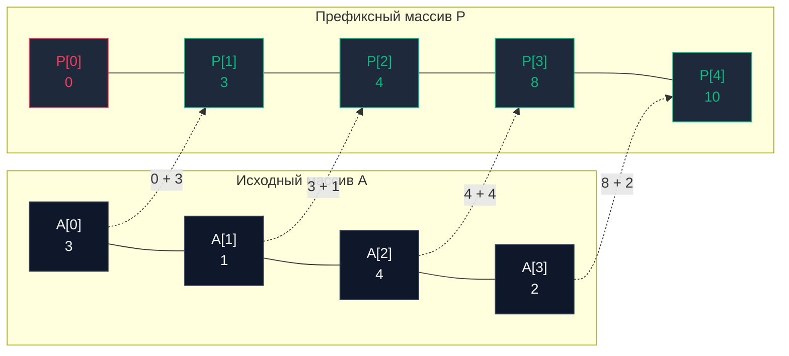

## Введение: Магия предвычислений и константный диапазон

В финале предыдущей главы [[5. Sliding window - скользящее окно]] мы столкнулись с принципиальным архитектурным ограничением: динамическое или фиксированное скользящее окно безупречно справляется с единичным потоковым проходом по массиву. Но что делать, если наш сервис однажды загружает исторический срез финансовых котировок за год, после чего получает миллионы конкурентных пользовательских запросов вида: *«Какова была суммарная прибыль за период с 14-го по 89-й день включительно?»*

Если на каждый подобный запрос запускать цикл суммирования или двигать окно, временная сложность составит $O(Q \cdot K)$, где $Q$ — поток запросов, а $K$ — средняя длина запрашиваемого интервала. При миллионах запросов в секунду процессор окажется полностью парализован.

Для мгновенного ответа на диапазонные агрегационные запросы (`Range Queries`) в компьютерных науках применяется классический паттерн упреждающих вычислений — **Префиксные суммы (Prefix Sums)**.

---

## Архитектура и математика

Концепция префиксных сумм поразительно проста и элегантна: мы создаем вспомогательный массив `P`, где каждая ячейка `P[i]` сохраняет кумулятивную сумму всех элементов исходного массива `A` от нулевого индекса до `i-1`.

Рекуррентная формула построения:
$$P[i] = P[i-1] + A[i-1]$$

Какой выигрыш это дает? Теперь сумма любого непрерывного подмассива от индекса `L` до индекса `R` (включительно) вычисляется ровно за **одно арифметическое действие** (скалярное вычитание):
$$Sum(L, R) = P[R+1] - P[L]$$

Мы берем суммарную массу элементов от начала массива до правого рубежа (`P[R+1]`) и отсекаем от нее накопленный префикс, лежащий левее целевого интервала (`P[L]`). В результате остается ровно то, что расположено между границами `L` и `R`.



> [!info] Под капотом: Трюк с размером N+1
> Обратите внимание: размерность префиксного среза `P` выбирается равной $N + 1$, а его начальный элемент `P[0]` строго инициализируется нулем (`0`).  
> Это канонический прием **программирования без ветвлений (`Branchless Programming`)**. Если бы длина массива `P` совпадала с исходной, то при вычислении суммы от самого начала (`L = 0`) мы были бы вынуждены писать условную конструкцию: `if L == 0 { return P[R] } else { return P[R] - P[L-1] }`.  
> Условные ветвления нарушают плавность конвейера CPU. Инициализация фиктивным нулем делает математическую формулу $P[R+1] - P[L]$ универсальной для любых валидных индексов. Ноль ветвлений, плотная арифметика, предельная утилизация вычислительных блоков.

---

## Mechanical Sympathy: Нагрузка на железо

Префиксные суммы — образцовая демонстрация классического инженерного компромисса **Space-Time (Память против Времени)**:
1. **Построение:** Выполняется ровно один раз за строго линейное время $O(N)$. Это чистый последовательный проход: аппаратный `Hardware Prefetcher` функционирует со 100% эффективностью, непрерывно накачивая массивы `A` и `P` в кэш-линии `L1-кэша`.
2. **Диапазонные выборки:** Выполняются за безупречно константное время $O(1)$.
3. **Память:** Расходует $O(N)$ дополнительной оперативной памяти под хранение массива `P`.

Если данные неизменяемы (`Immutable`), префиксные суммы не имеют равных по производительности.  
Однако если массив интенсивно мутирует, паттерн теряет привлекательность: изменение значения `A[0]` влечет за собой необходимость каскадного пересчета **всего** среза `P` за линейное время $O(N)$. *(Для динамически обновляемых наборов применяются более продвинутые логарифмические структуры, такие как Дерево отрезков — `Segment Tree` или дерево Фенвика, разобранные нами в седьмом разделе).*

---

## Production-Ready реализация на Go

Реализуем надежную, типобезопасную структуру для обработки префиксных сумм с защитой от целочисленных переполнений:

```go
package main

import "errors"

var ErrInvalidRange = errors.New("invalid range for prefix sum")

// PrefixSum инкапсулирует массив предвычисленных кумулятивных сумм.
type PrefixSum struct {
	p []int64 // Задействуем 64-битные целые числа для надежной защиты от Integer Overflow
}

// NewPrefixSum создает и инициализирует структуру за время O(N).
func NewPrefixSum(arr []int) *PrefixSum {
	n := len(arr)
	// Выделяем N+1 элементов с нулевым базовым элементом (Branchless trick)
	p := make([]int64, n+1)

	for i := 0; i < n; i++ {
		p[i+1] = p[i] + int64(arr[i])
	}

	return &PrefixSum{p: p}
}

// QuerySum возвращает агрегированную сумму на отрезке [left, right] включительно за O(1).
// Индексы соответствуют координатам исходного массива arr (от 0 до len-1).
func (ps *PrefixSum) QuerySum(left, right int) (int64, error) {
	if left < 0 || right >= len(ps.p)-1 || left > right {
		return 0, ErrInvalidRange
	}
	
	// Константное извлечение значения без использования циклов
	return ps.p[right+1] - ps.p[left], nil
}
```

> [!warning] Ловушка / Gotcha: Integer Overflow
> Если исходный срез заполнен миллионом 32-битных чисел `int32` (например, финансовыми балансами), их кумулятивная сумма способна быстро превысить предел в 2 миллиарда, вызвав неявное переполнение (`Integer Overflow`). В результате число уйдет в отрицательную область, исказив бизнес-логику.  
> При создании префиксных массивов тип аккумулятора (`int64`, а в исключительных случаях `math/big`) обязан выбираться с расчетом на верхнюю теоретическую границу суммы всех элементов массива.

---

## Хардкорные паттерны (Уровень Senior)

В рамках системных интервью в технологические компании префиксные суммы редко встречаются в изолированном виде. Наиболее мощный паттерн — это синергия префиксных сумм и хеш-таблиц, позволяющая решать задачи за строго линейное время $O(N)$ там, где наивный перебор требует квадратичных $O(N^2)$.

### Паттерн: Subarray Sum Equals K

**Задача (LeetCode 560):** Дан срез целых чисел (среди которых могут присутствовать отрицательные значения) и число `K`. Требуется подсчитать количество непрерывных подмассивов, сумма элементов которых в точности равна `K`.

Почему здесь неприменимо Скользящее окно? При наличии отрицательных чисел монотонность суммы разрушается: окно не способно детерминированно решить, нужно ли ему расширяться или сжиматься при встрече с очередным отрицательным значением вроде `-5`.

Здесь на помощь приходит строгая алгебра префиксных сумм:
Если сумма на непрерывном отрезке $[L, R]$ равна $K$, то:
$$P[R+1] - P[L] = K \implies P[L] = P[R+1] - K$$

**Алгоритмическое решение:** Мы обходим массив, накапливая текущую префиксную сумму (`currentSum = P[R+1]`), и на каждом шаге проверяем по хеш-таблице: встречалась ли нам ранее префиксная сумма, равная `currentSum - K`? Если да, то между теми индексами и текущей позицией сумма подмассива в точности равна `K`!

```go
// SubarraySum вычисляет количество подмассивов с суммой K за строго линейное время O(N).
func SubarraySum(nums []int, k int) int {
	count := 0
	currentSum := 0
	
	// map фиксирует частоту появления каждой вычисленной префиксной суммы
	// Ключ: значение префиксной суммы; Значение: количество вхождений
	prefixCounts := make(map[int]int)
	
	// Базовый случай: префиксная сумма 0 формально встретилась ровно 1 раз (до старта массива)
	prefixCounts[0] = 1 

	for _, num := range nums {
		currentSum += num // На лету аккумулируем префиксную сумму

		// Если разность (currentSum - k) уже встречалась в истории, добавляем ее частоту к ответу
		target := currentSum - k
		if occurrences, exists := prefixCounts[target]; exists {
			count += occurrences
		}

		// Фиксируем текущую префиксную сумму в словаре
		prefixCounts[currentSum]++
	}

	return count
}
```

*(Детали того, как оптимизировать аллокации памяти при работе с мапами, мы детально исследовали в главе [[5. Внутреннее устройство map в Go]]).*

### Расширения паттерна

Симбиоз префиксных сумм и частотных хеш-таблиц открывает решение широкого спектра задач:
* **Поиск подмассива с нулевой суммой:** Проверка равенства `currentSum == 0` либо обнаружение дубликата `currentSum` в истории `map`.
* **Максимальный подмассив с равным числом нулей и единиц:** Заменяем все нули на `-1` и ищем самый длинный сегмент с нулевой суммой.
* **Двумерные префиксные суммы (2D Prefix Sums):** Обобщение на прямоугольные матрицы, где матрица $P[i][j]$ агрегирует сумму подматрицы от угла $(0,0)$ до $(i,j)$ за $O(1)$. Техника активно применяется в компьютерной графике, GameDev и фильтрации изображений.

---

## Итог

1. **Префиксные суммы** — фундаментальный паттерн компромисса `Space-Time`: мы инвестируем $O(N)$ памяти и времени на этапе инициализации, чтобы гарантировать извлечение суммы любого интервала за строгое время $O(1)$.
2. Для полного исключения инструкций условного перехода (`Branchless Programming`) префиксный массив формируется размерностью $N+1$ со стартовым нулевым элементом.
3. Для защиты от целочисленного переполнения (`Integer Overflow`) тип аккумулятора следует выбирать с запасом (использовать `int64` вместо `int32` или `math/big` для сверхбольших чисел).
4. Симбиоз **Префиксных сумм** и **Хеш-таблицы (`map`)** — общепринятый стандарт для нахождения подмассивов с заданными свойствами в срезах с знакопеременными числами.

Мы успешно завершили масштабный девятый раздел, исследовав эволюцию алгоритмов поиска: от прямолинейного сканирования и логарифмических границ до двух указателей, скользящих окон и префиксных структур.

Теперь мы переходим на принципиально новый уровень архитектурного обобщения. В фокусе нашего внимания — фундаментальные **Алгоритмические парадигмы**: универсальные стратегии решения комплексных инженерных проблем.

И первым краеугольным камнем распределенного бэкенда станет парадигма: [[1. Divide and conquer - разделяй и властвуй]].