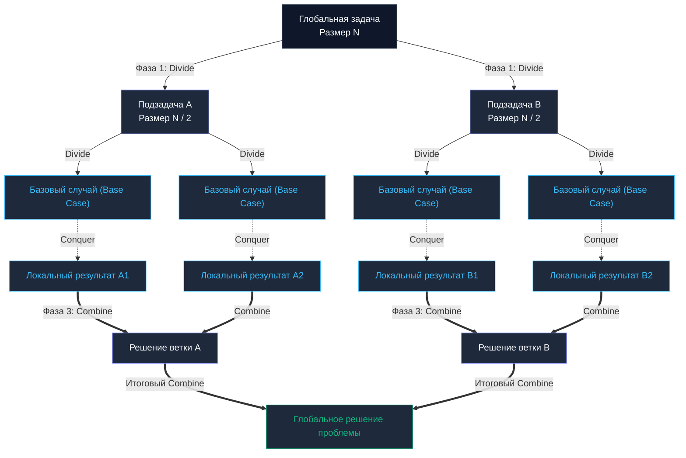

## Введение: Мета-алгоритмическое мышление

До сих пор в нашем инженерном путешествии мы исследовали конкретные структуры данных (кучи, префиксные деревья, хеш-таблицы) и специализированные алгоритмы (сортировки, бинарные границы). Начиная с этой главы, мы поднимаемся на уровень архитектурного обобщения — к **алгоритмическим парадигмам**.

Парадигма — это не готовый библиотечный код и не конкретная структура. Это высокоуровневый шаблон инженерного мышления. Это мета-алгоритм, предписывающий, *как декомпозировать сложную проблему*, а не *какой синтаксис цикла выбрать*.

Первой и наиболее влиятельной парадигмой в компьютерных науках является концепция **«Разделяй и властвуй» (Divide and Conquer, D&C)**. Для бэкенд-инженера это не просто алгоритмический прием для сортировки массивов в памяти, а основополагающий принцип проектирования отказоустойчивых распределенных систем: от шардирования баз данных и параллельной обработки логов до архитектуры MapReduce.

---

## Три кита парадигмы

В основе парадигмы лежит элегантная идея рекурсивной декомпозиции: сложная масштабная задача разбивается на несколько независимых подзадач того же типа, но меньшего масштаба, пока их размерность не сократится до элементарного базового случая (`Base Case`), решаемого тривиальным прямым кодом.

Архитектура D&C строго состоит из трех последовательных фаз:
1. **Divide (Разделяй):** Исходная задача декомпозируется на две или более независимые подзадачи уменьшенного размера.
2. **Conquer (Властвуй):** Подзадачи решаются рекурсивно. Если подзадача достигла элементарного масштаба, применяется прямое решение (`Base Case`).
3. **Combine (Сливай / Комбинируй):** Результаты локальных подзадач упорядоченно объединяются в глобальное монолитное решение.



---

## Классические примеры (Оглядываясь назад)

Мы уже неоднократно опирались на эту парадигму при анализе фундаментальных алгоритмов:
* [[3. Merge sort]]: Канонический пример чистой формы D&C. *Divide* — срез делится ровно пополам. *Conquer* — рекурсивно сортируются половины. *Combine* — выполняется упорядоченное слияние двух отсортированных последовательностей через буфер.
* [[4. Quick sort]]: Смещенный акцент. Основная вычислительная нагрузка сосредоточена в фазе *Divide* (процедура Partition с выбором Pivot). *Conquer* сортирует изолированные сегменты. Фаза *Combine* отсутствует вовсе, так как массив сортируется строго на месте (`In-Place`).
* [[2. Бинарный поиск]]: Вырожденный случай — парадигма «Уменьшай и властвуй» (`Decrease and Conquer`). Пространство делится пополам, но управление передается строго в одну релевантную половину, а вторая немедленно отбрасывается. Фаза Combine не требуется.

---

## Mechanical Sympathy: Тайная сила D&C

С точки зрения математического анализа парадигма D&C позволяет с легкостью преодолеть квадратичный барьер $O(N^2)$, выводя алгоритмы в класс квазилинейной сложности $O(N \log N)$. Но почему алгоритмы декомпозиции демонстрируют столь исключительную физическую скорость на реальном процессоре?

Ответ кроется в концепции **Cache-Oblivious Algorithms (Алгоритмы, не знающие о кэше)**.

Разработчику нет необходимости вручную выяснять точный объем кэш-памяти процессора (32 КБ в `L1`, 512 КБ в `L2` и т.д.), чтобы адаптировать под него код.  
Когда рекурсивный D&C делит гигантский массив размером в 1 ГБ на все более мелкие половины, на определенной глубине рекурсии размер обрабатываемого подмассива неизбежно станет меньше 32 КБ.

В этот момент **весь подмассив целиком укладывается в быстрейший аппаратный L1-кэш микропроцессора**! Все последующие операции фазы *Conquer* для данного фрагмента исполняются на регистровой скорости кремния, без единого промаха в медленную оперативную память (`RAM`). Алгоритм естественным образом самостоятельно подстраивается под любую многоуровневую иерархию памяти без необходимости ручного подбора параметров.

### Темная сторона: Цена рекурсии в Go

Поскольку парадигма D&C преимущественно реализуется через рекурсивные вызовы, Go-инженер обязан трезво оценивать низкоуровневую цену вызовов:

> [!info] Под капотом
> При создании новой горутины рантайм Go выделяет для нее сверхлегковесный начальный стек — всего **2 КБ** (в отличие от 2–8 МБ системного потока в ОС или JVM).  
> Если глубина рекурсии начнет стремительно нарастать, стек исчерпает лимит. В Go отсутствует классический аппаратный сбой `Stack Overflow` — рантайм перехватывает нехватку памяти и вызывает системную процедуру `runtime.morestack`.  
> Аллокатор Go выделяет в памяти новый стек удвоенного объема и копирует туда **абсолютно все** существующие стековые фреймы. Это тяжелая блокирующая операция. Кроме того, оптимизация хвостовой рекурсии (`Tail Call Optimization - TCO`) в официальном компиляторе Go **принципиально отсутствует**.

> [!warning] Ловушка / Gotcha
> Несбалансированный Quick Sort при наивном выборе пивота в худшем случае порождает глубину стека $O(N)$. Для среза в 1 миллион элементов это вызовет каскад тяжелейших реаллокаций стека через `runtime.morestack`, снижая пропускную способность сервиса в десятки раз.  
> **Инженерный выход (Гибридизация):** Все промышленные реализации (включая `pdqsort` в стандартном пакете `slices`) останавливают рекурсивный спуск, когда размер подзадачи опускается ниже порогового значения (например, 12–24 элемента). В этой точке (`Base Case`) вызывается нерекурсивный [[2. Insertion sort]], идеально утилизирующий L1-кэш без малейшей нагрузки на стек.

---

## Разделяй и властвуй в Архитектуре Бэкенда

Масштаб парадигмы D&C не исчерпывается оперативной памятью одного сервера. В распределенных сервисах на Go этот алгоритмический паттерн воплощается в архитектуре **Scatter-Gather (Разброс и Сбор)** или модели **MapReduce**.

Представьте сервис, обязанный вычислить аналитическую агрегацию по миллиону пользователей:
* **Divide:** Список идентификаторов нарезается на независимые батчи (порции) по 10 000 элементов.
* **Conquer:** Каждый батч передается в отдельную горутину (или на независимый рабочий узел кластера) для параллельной обработки.
* **Combine:** Результаты конкурентных расчетов синхронизируются и объединяются в монолитный ответ.

### Идиоматичный Scatter-Gather на Go (через `errgroup`)

Ниже представлена чистая и надежная реализация паттерна с использованием пакета `golang.org/x/sync/errgroup`:

```go
package main

import (
	"context"
	"fmt"
	"sync"

	"golang.org/x/sync/errgroup"
)

// processBatch симулирует тяжелые вычислительные операции над изолированным батчем
func processBatch(batch []int) int {
	sum := 0
	for _, v := range batch {
		sum += v
	}
	return sum
}

func main() {
	// Исходная масштабная задача (N = 100 000)
	data := make([]int, 100_000)
	for i := range data {
		data[i] = 1
	}

	batchSize := 10_000
	var totalSum int
	var mu sync.Mutex // Мьютекс для защиты разделяемого аккумулятора на фазе Combine

	// Используем errgroup для безопасного управления горутинами и контекстом
	g, _ := errgroup.WithContext(context.Background())

	// 1. DIVIDE (Разделение массива на независимые батчи)
	for i := 0; i < len(data); i += batchSize {
		end := i + batchSize
		if end > len(data) {
			end = len(data)
		}
		
		// Локальный срез без аллокаций
		batch := data[i:end]

		// 2. CONQUER (Конкурентная параллельная обработка)
		g.Go(func() error {
			partialSum := processBatch(batch)
			
			// 3. COMBINE (Синхронизированное объединение результатов)
			mu.Lock()
			totalSum += partialSum
			mu.Unlock()
			
			return nil
		})
	}

	// Ожидаем завершения всех параллельных вычислителей
	if err := g.Wait(); err != nil {
		fmt.Println("Ошибка распределенной обработки:", err)
		return
	}

	fmt.Printf("Глобальный результат аггрегации: %d\n", totalSum)
}
```

> [!tip] Собеседование
> **Вопрос:** Если мы разбиваем задачу на параллельные горутины в паттерне Scatter-Gather, не приведет ли это к падению производительности из-за переключения контекста планировщика (`Context Switch`)?  
> **Ответ:** Все зависит от гранулярности декомпозиции. Если разбить миллион записей на 1 000 000 горутин, каждая из которых производит элементарное сложение, планировщик Go (`G-M-P`) будет парализован инфраструктурным оверхедом. Фаза «Divide» в практическом инжиниринге никогда не должна дробить задачу до атомарного элемента: деление обязано останавливаться на **рациональном Base Case** (например, батче в 5 000–10 000 элементов), при котором полезная работа многократно окупает стоимость запуска горутины.

---

## Итог

1. **Суть:** Проблема рекурсивно разбивается на независимые подзадачи (`Divide`), локально решается на элементарном уровне (`Conquer`) и собирается в финальный результат (`Combine`).
2. **Преимущества:** Естественная оптимизация под процессорный кэш (`Cache-Oblivious`) и исключительная параллелизуемость вычислений как на многоядерном CPU, так и в распределенном кластере.
3. **Ограничения:** Нагрузка на стек горутин в Go и риск каскадных реаллокаций через `runtime.morestack` при неконтролируемой глубине рекурсии.
4. **Практика в Go:** Внутренности библиотечных сортировок (`pdqsort`), конкурентный паттерн Scatter-Gather, распределенные пайплайны `MapReduce` и параллельный потоковый ввод-вывод.

Парадигма D&C незаменима, когда подзадачи **строго независимы** друг от друга. Но что делать, если перед нами стоит задача последовательного принятия решений, где каждый шаг кажется локально привлекательным прямо сейчас? Всегда ли нужно рекурсивно дробить задачу, или порой достаточно жадно выбрать лучшее мгновенное состояние?

Об этом пойдет речь в следующей главе: [[2. Greedy алгоритмы]].