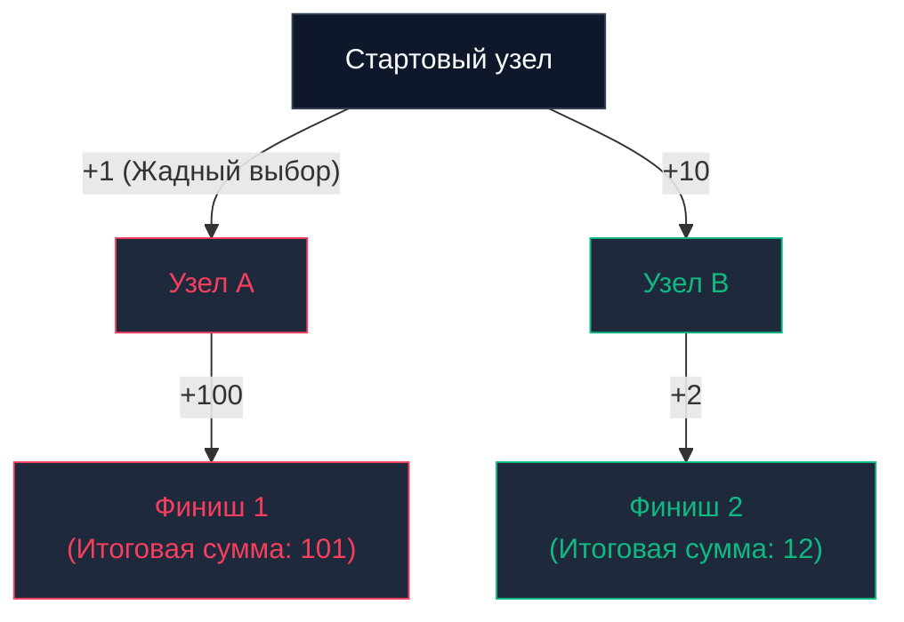

## Введение: Искусство локального выбора

В предыдущей главе [[1. Divide and conquer - разделяй и властвуй]] мы исследовали парадигму, при которой сложная задача рекурсивно декомпозируется на независимые половины до достижения элементарного базового уровня. Парадигма D&C великолепно подходит для отыскания исчерпывающего множества решений или сортировки данных. Однако когда перед бэкенд-инженером возникает задача глобальной **оптимизации** (найти кратчайший сетевой маршрут, упаковать максимальное число задач в пул воркеров или сжать поток телеметрии с наивысшим коэффициентом), на сцену выходит принципиально иная алгоритмическая философия.

**Жадные алгоритмы (Greedy Algorithms)** — это парадигма решения оптимизационных задач, суть которой заключается в принятии **наиболее выгодного локального решения на каждом элементарном шаге** в твердой уверенности, что цепочка локальных выигрышей гарантированно приведет к глобальному оптимуму всей системы.

Девиз истинного жадного алгоритма лаконичен: *«Забирай максимальную выгоду прямо здесь и сейчас и никогда не оглядывайся назад»*.

---

## Анатомия жадности

В отличие от динамического программирования, которое методично просчитывает и кэширует все альтернативные сценарии развития событий, жадный алгоритм совершает выбор однократно, необратимо и бескомпромиссно. Он не хранит историю предыдущих развилок и никогда не производит откат (backtracking) назад.

Чтобы жадная стратегия привела к строго математически верному результату, исследуемая задача обязана удовлетворять двум фундаментальным критериям:

1. **Свойство жадного выбора (Greedy Choice Property):** Глобальный оптимум задачи может быть сконструирован посредством последовательности локально оптимальных выборов. Решение, принятое на текущем шаге, не закрывает доступ к оптимальному исходу в будущем.
2. **Оптимальная подструктура (Optimal Substructure):** Оптимальное глобальное решение исходной задачи целиком составлено из оптимальных решений ее дочерних подзадач.



> [!warning] Ловушка / Gotcha (Ограниченность обзора)
> Взгляните на топологию графа на схеме выше. Если целью является нахождение пути с минимальной суммой весов, жадный алгоритм, находясь в узле `Стартовый узел`, сопоставит переходы `+1` и `+10`. Как классический близорукий оптимизатор, он мгновенно выберет ребро `+1` (Узел A), поскольку в данный момент это сулит минимальную прибавку. В итоге он угодит в вычислительный капкан со стоимостью `101`. Глобально оптимальный маршрут со стоимостью `12` будет безвозвратно утерян, поскольку жадный подход принципиально не заглядывает на два шага вперед.

---

## Mechanical Sympathy: Почему процессоры обожают жадность?

Если математические свойства задачи строго допускают применение жадной парадигмы, инженер обязан предпочесть именно ее. В высоконагруженных бэкенд-системах жадные алгоритмы являются абсолютными лидерами по аппаратной эффективности.

> [!info] Под капотом
> С точки зрения кремниевой архитектуры центрального процессора жадный алгоритм, как правило, разделен на две сверхбыстрые фазы:
> 1. **Предварительная сортировка коллекции** (по весу, доходности, дедлайну или отношению ценности к размеру). Как мы убедились при анализе [[4. Quick sort]], промышленная сортировка `pdqsort` в Go — это высокооптимизированный процесс со сложностью $O(N \log N)$ и безупречной пространственной локальностью (`Cache Locality`).
> 2. **Линейный скан ($O(N)$)**. Процессор последовательно проходит по массиву слева направо в плоском цикле `for`, совершая фиксацию решений.
> 
> Здесь отсутствуют глубокие стековые кадры рекурсии (в отличие от D&C). Здесь не требуются гигантские таблицы мемоизации (как в динамическом программировании), вымывающие ценные строки из кэшей `L2/L3`. Аппаратный `Prefetcher` процессора мгновенно фиксирует линейный шаг обхода и доставляет данные в `L1-кэш` со стопроцентным попаданием. Потребление дополнительной памяти алгоритма почти всегда строго равно $O(1)$.

---

## Практика в бэкенде: Задача планирования процессов (Interval Scheduling)

Классический вызов из реальной бэкенд-инженерии: имеется пул из одного рабочего воркера (или одиночный процессорный тред, или переговорная комната), а также очередь входящих задач (`Jobs`). Каждая задача обладает фиксированным временем старта и временем завершения. Задачи являются монопольными и не могут выполняться параллельно.

**Цель:** Сформировать расписание, включающее максимальное количество выполненных задач.

Интуиция часто подсказывает ошибочные жадные эвристики:
1. Выбирать наиболее короткие задачи? *Неверно: пара коротких задач может перекрыть одну длинную, заблокировав при этом три средние.*
2. Выбирать задачи, стартующие раньше всех? *Неверно: задача, стартовавшая в 00:01, может выполняться 23 часа, заблокировав всю дневную работу.*

**Математически доказанный жадный выбор:** Всегда выбирать задачу, которая **завершается раньше всех остальных** и не конфликтует по времени с уже зафиксированными. Освобождая вычислительный ресурс как можно раньше, мы резервируем максимальный временной горизонт для размещения последующих задач.

### Идиоматичный Go код

```go
package greedy

import (
	"cmp"
	"slices"
)

// Job представляет задачу с временем старта и окончания
type Job struct {
	ID    string
	Start int
	End   int
}

// MaxJobs планирует максимальное количество непересекающихся задач
func MaxJobs(jobs []Job) []Job {
	if len(jobs) == 0 {
		return nil
	}

	// 1. Сортируем задачи по времени ЗАВЕРШЕНИЯ по возрастанию.
	// Это ядро нашего жадного выбора. O-N log N-
	slices.SortFunc(jobs, func(a, b Job) int {
		return cmp.Compare(a.End, b.End)
	})

	var scheduled []Job
	
	// Берем первую задачу (она заканчивается раньше всех)
	scheduled = append(scheduled, jobs[0])
	lastEndTime := jobs[0].End

	// 2. Линейный проход O-N-
	for i := 1; i < len(jobs); i++ {
		// Если задача начинается после или в момент завершения последней выбранной,
		// смело берем её. Жадный выбор гарантирует оптимальность.
		if jobs[i].Start >= lastEndTime {
			scheduled = append(scheduled, jobs[i])
			lastEndTime = jobs[i].End
		}
	}

	return scheduled
}
```

**Асимптотическая сложность:** $O(N \log N)$ на фазу упорядочивания массива `slices.SortFunc` плюс линейное время $O(N)$ на проход отбора $\implies$ Результирующая сложность строго $O(N \log N)$.

---

## Собеседование: Когда жадность ломается

Наиболее популярный проверочный вопрос на архитектурных интервью — это классическая **Задача о размене монет (Coin Change)**.

Представьте платежный сервис, рассчитывающий выдачу сдачи клиенту минимально возможным числом физических монет.

**Жадная стратегия:** на каждом шаге выдавать максимально крупный номинал, не превосходящий оставшуюся сумму.

*Сценарий 1: Номиналы 1, 5, 10 рублей. Требуется выдать 16 рублей.*  
Жадный алгоритм берет 10 (остаток 6) $\to$ берет 5 (остаток 1) $\to$ берет 1 (остаток 0).  
Итог: 3 монеты. **Это математически безупречный оптимальный ответ**, поскольку каноническая монетная система гарантирует выполнение свойства жадного выбора.

*Сценарий 2: Номиналы 1, 3, 4 рубля. Требуется выдать 6 рублей.*  
Жадный алгоритм берет 4 (остаток 2) $\to$ берет 1 (остаток 1) $\to$ берет 1 (остаток 0).  
Итог: 3 монеты (набор `4 + 1 + 1`).  
**Однако глобальный оптимум — ровно 2 монеты (`3 + 3`)!** Жадность потерпела сокрушительное фиаско.

> [!tip] Собеседование
> **Вопрос:** Как строго доказать неприменимость жадной стратегии к конкретной бизнес-задаче, если жадный подход кажется естественным и интуитивным?  
> **Ответ:** Построением контрпримера через метод взаимной замены (`Exchange argument`). Проверьте, не существует ли сценария, при котором локально худший или промежуточный выбор (взять монету `3` вместо `4`) открывает путь к глобально превосходящей комбинации. Если обнаружен хотя бы один контрпример, жадная стратегия ложна, и задача требует перехода к полному перебору или динамическому программированию.

---

## Где жадные алгоритмы работают в реальных системах?

1. **Сжатие данных (Алгоритм Хаффмана):** Сердце алгоритмов Deflate в архиваторах `GZIP` и протоколе `HTTP/2 HPACK` (сжатие HTTP-заголовков). Жадное объединение наименее частотных символов формирует оптимальное префиксное дерево кодирования.
2. **Маршрутизация в сетях (Алгоритм Дейкстры):** Расчет кратчайших путей в сетевых протоколах (OSPF). Алгоритм на каждом шаге жадно фиксирует дистанцию до ближайшей непосещенной вершины графа (детально исследуется нами в главе [[5. Кратчайшие пути. Алгоритм Дейкстры]]).
3. **Оркестрация контейнеров в Kubernetes:** Фазы планировщика kube-scheduler применяют жадные эвристики размещения подов (`Best Fit / First Fit`), осознанно жертвуя абсолютным глобальным оптимумом ради миллисекундной скорости реакции.

---

## Итог

1. **Жадные алгоритмы** — мощный инструмент высоконагруженного бэкенда, обеспечивающий максимальную скорость вычислений за счет сочетания сортировки и линейного сканирования.
2. Стратегия математически корректна строго при наличии двух условий: **свойства жадного выбора** (`Greedy Choice Property`) и **оптимальной подструктуры** (`Optimal Substructure`).
3. Применение жадности к задачам, не обладающим данными свойствами, порождает трудноуловимые логические баги, при которых сервис работает без ошибок, но возвращает неоптимальные данные.

Но что делать, если задача требует глобальной оптимизации, а жадный алгоритм дает сбой (как в размене монет `1, 3, 4`)? Как исследовать все альтернативные ветви вычислений, не скатываясь в катастрофическую экспоненциальную сложность $O(2^N)$?

Ответом служит самая фундаментальная и интеллектуально глубокая парадигма компьютерных наук, обменивающая оперативную память на время процессора: [[3. Dynamic programming - динамическое программирование]].