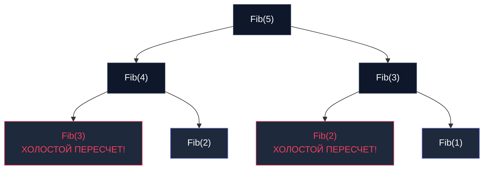

## Введение: Память в обмен на скорость

В предыдущей главе [[2. Greedy алгоритмы]] мы выяснили, что жадный подход — это превосходный скоростной метод нахождения локального оптимума. Однако мы также столкнулись с его роковой уязвимостью: если задача лишена «свойства жадного выбора», локально привлекательный шаг (взять монету наибольшего номинала) может навсегда отрезать систему от глобально оптимального результата.

Когда жадность заводит в тупик, а наивный исчерпывающий перебор всех возможных комбинаций требует астрономического экспоненциального времени $O(2^N)$, на авансцену выходит одна из наиболее глубоких концепций компьютерных наук — **Динамическое программирование (Dynamic Programming, DP)**.

Классический афоризм DP гласит: *«Те, кто не помнят своего прошлого, обречены повторять его снова и снова»*.  
Фундаментальная суть парадигмы — осознанный обмен оперативной памяти на процессорное время. Мы декомпозируем задачу на подзадачи, вычисляем решение каждой элементарной подзадачи **ровно один раз** и надежно сохраняем его в кэширующей таблице.

---

## Анатомия Динамического программирования

Динамическое программирование математически применимо тогда и только тогда, когда моделируемая система удовлетворяет двум строгим условиям:

1. **Оптимальная подструктура (Optimal Substructure):** Глобальное оптимальное решение проблемы строится из оптимальных решений составляющих ее подзадач. Этим свойством обладает и парадигма [[1. Divide and conquer - разделяй и властвуй]].
2. **Перекрывающиеся подзадачи (Overlapping Subproblems):** Фундаментальный водораздел между DP и классическим D&C. В алгоритме `Merge Sort` левая и правая половины массива абсолютно независимы и не пересекаются. В задачах же DP одинаковые подзадачи возникают на разных ветвях рекурсивного дерева сотни и тысячи раз.

Продемонстрируем эту проблему на графе наивного рекурсивного вычисления чисел Фибоначчи (`Fib(5)`):



Вместо линейного времени $O(N)$ наивная рекурсия порождает взрывное экспоненциальное время $O(2^N)$. DP полностью устраняет этот экспоненциальный тупик за счет мемоизации уже вычисленных узлов.

---

## Два пути DP: Top-Down vs Bottom-Up

В инженерной практике существуют две диаметрально противоположные стратегии реализации динамического программирования. Выбор между ними фундаментально влияет на поведение процессора и кэш-линий (Mechanical Sympathy).

### 1. Нисходящее DP (Top-Down / Memoization)

Логика оформляется в виде классической рекурсии (от глобальной задачи к базовым условиям), однако перед вызовом тела функции проверяется кэш: *«Вычислялся ли данный узел ранее?»*. Для сохранения промежуточных результатов задействуется хеш-таблица `map` или вспомогательный срез (`slice`).

* **Преимущество:** Максимально интуитивная реализация; вычисляются исключительно те подсостояния, которые непосредственно требуются для ответа.
* **Недостаток (Hardware):** Накладные расходы на постоянные стековые вызовы (рост стека горутин в Go) и хаотичные скачки по памяти при обращении к хеш-таблице (каскады Cache Misses).

### 2. Восходящее DP (Bottom-Up / Tabulation)

Алгоритм полностью отказывается от рекурсивных вызовов. В оперативной памяти выделяется плоский массив (таблица), который последовательно заполняется в итеративном цикле `for` — строго от базовых случаев (индекс `0`) к целевому результату (индекс `N`). Каждая следующая ячейка опирается на уже гарантированно рассчитанные значения предыдущих элементов.

* **Преимущество (Hardware):** Идеальная кэш-локальность (`Cache Locality`). Чтение и запись в непрерывный срез производятся строго последовательно. Аппаратный `Hardware Prefetcher` CPU функционирует со 100% точностью. Нулевой оверхед на стек.
* **Недостаток:** Алгоритм обязан рассчитать абсолютно все промежуточные ячейки от `0` до `N`, даже если отдельные состояния останутся невостребованными.

> [!info] Под капотом
> В 95% высоконагруженных бэкенд-сервисов на Go инженеры выбирают **Bottom-Up (Tabulation)** подход на базе плоских срезов (`slice`). Высокоскоростной последовательный проход по срезу внутри `L1` кэша процессора настолько опережает случайные обращения к `map` и вызовы функций, что с избытком окупает расчет формально избыточных промежуточных состояний.

---

## Практика: Решение "нерешаемой" задачи размена монет

В главе о жадных алгоритмах мы показали, что для набора монет `[1, 3, 4]` и целевой суммы сдачи `6` жадная стратегия выдает неверный ответ: 3 монеты (`4 + 1 + 1`), тогда как истинный оптимум составляет ровно 2 монеты (`3 + 3`).

Решим данную проблему математически безупречно с помощью восходящего DP (Tabulation):

**Архитектурная идея:** Для формирования суммы `S` алгоритм исследует каждый доступный номинал монеты `C`. Оптимальный ответ для суммы `S` — это ровно `1` (сама монета `C`) плюс наилучшее решение для остаточной суммы `S - C`.  
Мы заполняем массив `dp`, где ячейка `dp[i]` сохраняет строго минимальное количество монет для выплаты суммы `i`.

```go
package dp

import "math"

// CoinChange возвращает минимальное количество монет для сбора суммы amount.
// Если сумму собрать невозможно, возвращает -1.
func CoinChange(coins []int, amount int) int {
	// Создаем таблицу DP размером amount + 1.
	// Инициализируем её заведомо недостижимо большим значением (amount + 1),
	// так как максимальное количество монет не может превышать саму сумму (если все монеты по 1).
	dp := make([]int, amount+1)
	for i := range dp {
		dp[i] = amount + 1
	}
	
	// Базовый случай: для сбора суммы 0 нужно 0 монет
	dp[0] = 0

	// Bottom-Up заполнение таблицы. Идеальный кэш-паттерн.
	for i := 1; i <= amount; i++ {
		// Проверяем каждую монету
		for _, coin := range coins {
			// Если монета помещается в текущую подсумму
			if i-coin >= 0 {
				// Выбираем минимум: либо то, что уже было вычислено для этой суммы,
				// либо 1 -мы взяли эту монету- + оптимальное решение для остатка -i - coin-
				if dp[i-coin]+1 < dp[i] {
					dp[i] = dp[i-coin] + 1
				}
			}
		}
	}

	// Если значение в ячейке не изменилось, значит сумму собрать невозможно
	if dp[amount] > amount {
		return -1
	}

	return dp[amount]
}
```

> [!tip] Собеседование
> **Паттерн идентификации задачи:** Как на техническом интервью безошибочно распознать DP? Обращайте внимание на следующие маркеры:
> 1. Задача требует найти **максимум или минимум** (наименьшее число монет, максимальный профит портфеля).
> 2. Задача требует подсчитать **количество способов** (сколькими уникальными путями робот может пройти сетку).
> 3. Текущее оптимальное состояние системы функционально выводится из предшествующих состояний.  
> *Если же условие требует вывести абсолютно **все валидные комбинации** (сгенерировать сами наборы монет или все маршруты), задача относится к сфере поиска с возвратом — `Backtracking`.*

---

## Оптимизация памяти (State Space Reduction)

Классический проверочный вопрос уровня Senior после успешной реализации DP: *«Каким образом можно кардинально сократить пространственную сложность (Memory Footprint)?»*.

Во многих двухмерных задачах (классическая задача о рюкзаке `Knapsack Problem`, поиск наибольшей общей подпоследовательности `LCS`) таблица переходов `dp[i][j]` устроена так, что расчет строки `i` опирается **исключительно на данные предшествующей строки** `i-1`. Данные строк `i-2`, `i-3` становятся мертвым грузом.

**Mechanical Sympathy оптимизация:**  
Вместо того чтобы аллоцировать двумерную матрицу `N x M` (что в Go означает слайс слайсов, разбросанный по куче и убивающий GC), мы аллоцируем **всего два одномерных плоских среза** длиной $M$: рабочий `curr` и предыдущий `prev`.  
После вычисления строки `curr`, мы просто делаем быстрый обмен указателей: `prev, curr = curr, prev`.

Этот прием сокращает пространственную сложность с $O(N \cdot M)$ до компактного $O(M)$ и позволяет всему рабочему набору данных целиком вращаться в быстрейшем `L1-кэше` процессора.

> [!warning] Ловушка / Gotcha (Многомерные слайсы в Go)
> Создание двумерного среза конструкцией `make([][]int, N)` с последующим циклом `make([]int, M)` — тяжелый антипаттерн в Go. Он создает $N$ разрозненных аллокаций в куче, порождая указательную паутину и колоссальную нагрузку на GC.  
> **Идиоматичный подход для DP:** Если для восстановления полного пути действительно требуется вся матрица, аллоцируйте **один непрерывный одномерный срез** `make([]int, N*M)` и адресуйте ячейки формулой плоского смещения: `dp[i*M + j]`. Это обеспечивает единую монолитную аллокацию и строго последовательный доступ к физической памяти (`Sequential Access`).

---

## Резюме

1. **Динамическое программирование** — мощная математическая парадигма оптимизации, исключающая холостые расчеты благодаря сохранению решений перекрывающихся подзадач (`Overlapping Subproblems`).
2. **Гарантия оптимальности:** В отличие от эвристик жадных алгоритмов, DP математически строго находит истинный глобальный оптимум.
3. **Плата за скорость:** Парадигма требует выделения дополнительной памяти под таблицу состояний ($O(N)$ или $O(N \cdot M)$).
4. **Промышленный стандарт в Go:** В высокопроизводительных сервисах предпочтение отдается восходящему подходу (`Bottom-Up / Tabulation`) на плоских непрерывных срезах для предельной утилизации аппаратного кэша CPU.

DP идеально отвечает на вопросы «Каков числовой оптимум?» или «Сколько существует вариантов?». Но что делать, если перед сервисом встает задача: *«Сгенерируй все валидные конфигурации распределения нагрузки, найди все допустимые расстановки или выведи все пути в лабиринте»*?

Для генерации комбинаторных пространств и умного перебора с ранним отсечением тупиковых ветвей применяется парадигма поиска с возвратом: [[4. Backtracking]].