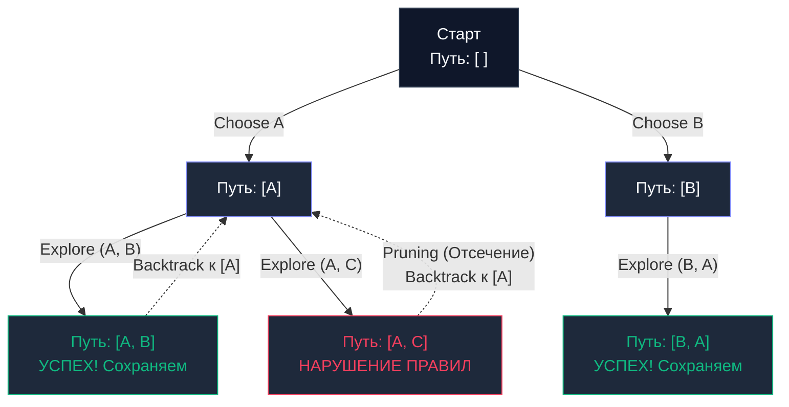

## Введение: Умный брутфорс и генерация конфигураций

В предшествующих главах мы исследовали [[2. Greedy алгоритмы]], стремительно несущиеся к локально выгодной цели, и [[3. Dynamic programming - динамическое программирование]], методично аккумулирующее промежуточные состояния, чтобы за полиномиальное время ($O(N^2)$ или $O(N \cdot M)$) вычислить глобальный оптимум.

Обе эти парадигмы превосходно отвечают на оптимизационные вопросы: *«Какова максимальная пропускная способность?»* или *«Каково минимальное количество монет для выплаты сдачи?»*.

Но как поступить, если бизнес-требования звучат иначе: *«Сгенерируй все валидные расписания дежурств инженеров»*, *«Найди все возможные маршруты доставки пакетов через сеть шлюзов»* или *«Выведи все комбинации прав доступа RBAC»*?  
Здесь динамическое программирование оказывается бессильно, поскольку системе требуются сами комбинаторные траектории, а не скалярное число вариантов.

Когда архитектуре необходим **полный перебор**, но мы стремимся выполнить его максимально рационально — мгновенно отсекая заведомо бесперспективные ветви, — в игру вступает парадигма **Backtracking (Поиск с возвратом)**.

---

## Концепция: Брутфорс с мозгами

Backtracking представляет собой систематическое исследование **Дерева пространств состояний (State Space Tree)** с использованием поиска в глубину (`DFS`).

Алгоритм циклически опирается на три фундаментальных рекурсивных шага:
1. **Choose (Выбор):** Сделать элементарный шаг вперед (добавить кандидата в текущий путь или накапливаемую комбинацию).
2. **Explore (Исследование):** Рекурсивно углубиться в поддерево состояний для дальнейшего расширения траектории.
3. **Unchoose / Backtrack (Откат):** Удалить добавленного кандидата, восстановить исходное состояние и попробовать следующую альтернативу.

Главная созидательная мощь алгоритма — **Отсечение (Pruning)**. Если в некоторой точке рекурсивного спуска предикат обнаруживает, что текущий частичный путь гарантированно нарушает инварианты задачи, алгоритм немедленно обрывает дальнейший спуск по этой ветке, экономя миллиарды инструкций центрального процессора.



---

## Идиоматичный Go: Каркас алгоритма и ловушка слайсов

Рассмотрим классическую задачу: генерацию всех возможных подмножеств (Subsets / Powerset) из набора уникальных целых чисел.

В языке Go реализация поиска с возвратом таит в себе классическую ловушку, обусловленную низкоуровневым устройством срезов (`slice`).

> [!warning] Ловушка / Gotcha (Утечка Backing Array)
> Срез в рантайме Go — это легковесный заголовок из трех полей: указатель на базовый массив (`Backing Array`), текущая длина (`len`) и предельная вместимость (`cap`).  
> Когда вы передаете срез `path` вглубь рекурсии и вызываете `path = append(path, val)`, вы мутируете **один и тот же базовый массив** в памяти.  
> Если при фиксации ответа наивно написать `result = append(result, path)`, в результирующий срез добавится не копия данных, а указатель на непрерывно изменяющийся базовый массив. К моменту завершения работы все элементы `result` будут указывать на финальное состояние буфера, превратив ответ в массив одинаковых дубликатов!

### Правильная реализация (Zero-Allocation Blueprint)

Чтобы избежать непрерывных аллокаций на каждом шаге рекурсивного спуска, мы передаем единственный срез `path` как рабочий черновик (scratch space) и производим физическое глубокое копирование (`copy`) **строго в момент нахождения валидного ответа**:

```go
package backtracking

// Subsets возвращает все возможные подмножества массива.
func Subsets(nums []int) [][]int {
	var result [][]int
	
	// Предварительно выделяем память под черновик, чтобы избежать
	// реаллокаций внутри рекурсии. cap = len(nums), так как 
	// максимальная длина пути не превысит длину исходного массива.
	path := make([]int, 0, len(nums))

	// Запускаем рекурсию
	backtrack(&result, path, nums, 0)

	return result
}

func backtrack(result *[][]int, path []int, nums []int, start int) {
	// БАЗОВЫЙ СЛУЧАЙ (Goal)
	// В задаче о подмножествах каждый промежуточный путь является валидным ответом.
	
	// КРИТИЧЕСКИ ВАЖНО: Создаем глубокую копию текущего пути!
	temp := make([]int, len(path))
	copy(temp, path)
	*result = append(*result, temp)

	// ИССЛЕДОВАНИЕ (Explore)
	for i := start; i < len(nums); i++ {
		// 1. CHOOSE (Выбор)
		// Добавляем элемент в наш черновик
		path = append(path, nums[i])

		// 2. EXPLORE (Рекурсия)
		// Уходим вглубь, передавая обновленный путь и следующий стартовый индекс
		backtrack(result, path, nums, i+1)

		// 3. BACKTRACK (Отмена выбора)
		// "Срезаем" последний добавленный элемент.
		// Базовый массив остается тем же, мы просто уменьшаем len.
		path = path[:len(path)-1]
	}
}
```

---

## Mechanical Sympathy: Нагрузка на стек и GC

Алгоритмы поиска с возвратом обладают экспоненциальной или факториальной теоретической сложностью: $O(2^N)$ для подмножеств, $O(N!)$ для перестановок (Permutations). Для аппаратного обеспечения это влечет два критических следствия:

1. **Глубина стека вызовов:** Предельная глубина рекурсии определяется длиной генерируемой последовательности (в нашей задаче это $N$). Для $N = 64$ глубина стека в 64 кадра абсолютно безопасна для горутины Go. Однако если задача требует глубины в $100\,000$ вызовов, сервис столкнется с ощутимым падением производительности из-за непрерывных копирований стека рантаймом.
2. **Давление на сборщик мусора (`GC Pressure`):** Даже при безупречной реализации с аллокацией только финальных срезов (`temp`), алгоритм генерирует огромное количество объектов в управляемой куче. При $N = 20$ генерируется $1\,048\,576$ отдельных срезов! Это вызывает мощный спайк активности GC. В сверхнагруженных бэкендах найденные комбинации транслируют потоком напрямую в интерфейс `io.Writer` (сетевой сокет или файл), избегая накопления монструозного массива `result` в оперативной памяти.

---

## Реальный Бэкенд: Катастрофический Backtracking (ReDoS)

Зачем инженеру распределенных систем глубоко понимать механику поиска с возвратом, если он не пишет генераторы перестановок в повседневном коде?

Потому что Backtracking лежит в фундаменте классических движков **Регулярных выражений (`Regular Expressions`)**. И незнание принципов работы алгоритма способно обрушить всю инфраструктуру сервиса.

> [!info] Под капотом
> Классические движки регулярных выражений (`PCRE`, применяемые в PHP, Python, Java, JavaScript) построены на базе недетерминированных конечных автоматов (`NFA (Nondeterministic Finite Automaton)`), реализующих сопоставление через рекурсивный Backtracking.
> 
> Представьте уязвимое регулярное выражение вида `(a+)+$`.  
> Если отправить на валидацию строку `aaaaaaaaaaaaaaaaaaaaX`, движок жадно захватит все символы `a`, после чего натолкнется на несовпадение с символом `X` перед концом строки `$`.  
> Автомат начнет процедуру **Backtracking**: откатит захват одной буквы `a`, перегруппирует вложенные скобки и попробует сопоставление заново. Снова неудача. Он откатит следующую букву.  
> Количество вариантов группировок для последовательности из $N$ символов составляет $2^N$. Процессор погружается в экспоненциальный цикл перебора, потребляя 100% мощности ядра на один HTTP-запрос. Это явление носит название **Catastrophic Backtracking** и лежит в основе атак отказа в обслуживании через регулярные выражения (**ReDoS - Regular Expression Denial of Service**).

> [!tip] Собеседование
> **Вопрос:** Уязвим ли стандартный пакет `regexp` в языке Go к атакам класса ReDoS?  
> **Ответ:** **Категорически нет.**  
> Создатель языка Go, Роб Пайк, спроектировал библиотеку `regexp` на базе алгоритма детерминированных конечных автоматов (`DFA (Deterministic Finite Automaton)`) и автомата Томпсона (Thompson's NFA). Данный алгоритм **принципиально не использует Backtracking**. Он сканирует входящую строку со строгой гарантией линейного времени $O(N)$, полностью исключая возможность ReDoS-атаки.  
> Инженерной платой за эту абсолютную безопасность стало то, что пакет `regexp` в Go намеренно не поддерживает возможности, требующие поиска с возвратом: опережающие и ретроспективные проверки (`Lookahead` и `Lookbehind`), а также обратные ссылки (`Backreferences \1`).

---

## Итог

1. **Суть парадигмы:** Систематический исчерпывающий перебор пространства состояний (`DFS`) с отсечением тупиковых ветвей (`Pruning`).
2. **Архитектурный шаблон:** Триада `Choose -> Explore -> Unchoose`.
3. **Специфика языка Go:** Обязательное глубокое копирование среза-пути в момент сохранения результата, предотвращающее мутацию разделяемого базового массива (`Backing Array`).
4. **Риски:** Экспоненциальный рост времени вычислений ($O(2^N)$, $O(N!)$) и угроза исчерпания памяти (`OOM`) при накоплении результатов в памяти вместо потоковой передачи через `io.Writer`.

Классический Backtracking отсекает ветви строго по факту нарушения логических правил. Но что, если мы научимся оценивать математическую перспективность ветви еще до того, как спустимся по ней? Что если мы сможем отсекать гигантские поддеревья просто потому, что доказали: *ни одно решение в этой ветке гарантированно не превзойдет уже найденный нами рекорд*?

Эта эволюция переводит нас от простого перебора к элитному методу дискретной оптимизации: [[5. Branch and bound]].