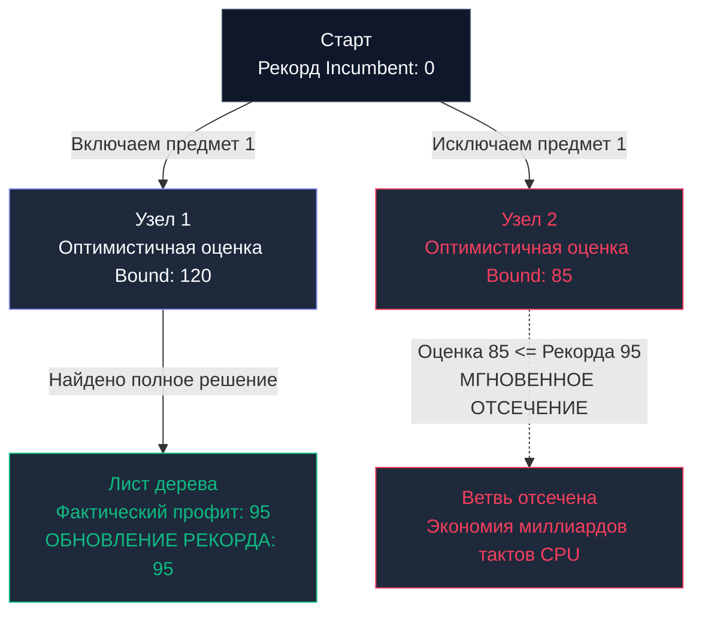

## Введение: Элита дискретной оптимизации

В предыдущей главе [[4. Backtracking]] мы детально исследовали процедуру исчерпывающего перебора вариантов с отсечением тупиковых ветвей, явно нарушающих граничные правила. Поиск с возвратом безупречно решает задачи генерации комбинаций, поиска всех допустимых путей или расстановки фигур.

Однако перед бэкенд-инженером регулярно возникает задача совершенно иного уровня сложности: найти не просто *какое-либо* допустимое решение, а строго **наилучшее** (глобально оптимальное) распределение ресурсов.  
Мы могли бы обратиться к динамическому программированию (DP, см. [[3. Dynamic programming - динамическое программирование]]), однако DP требует огромного пространства памяти. Если вместимость задачи масштабна (например, ограничение рюкзака составляет $W = 10^9$), динамическое программирование вызовет мгновенное исчерпание RAM, попытавшись аллоцировать колоссальную матрицу состояний.

Когда динамическое программирование парализовано нехваткой оперативной памяти, а классический Backtracking работает недопустимо медленно из-за монотонного перебора всех допустимых, но неоптимальных конфигураций, в бой вступает высшая лига дискретной оптимизации — **Метод ветвей и границ (Branch and Bound, B&B)**.

---

## Концепция: Умный поиск с предсказанием

Метод ветвей и границ — это интеллектуальная математическая эволюция поиска с возвратом. Вместо прямолинейного блуждания по дереву решений с отсечением по факту нарушения правил, B&B опирается на строгую математическую релаксацию, позволяющую **предсказывать верхний предел выгоды в поддереве**.

Алгоритм непрерывно удерживает в памяти **Текущий рекорд (Incumbent)** — наилучшее валидное решение, найденное на текущий момент работы.  
Для каждого рассматриваемого узла дерева алгоритм рассчитывает **Оптимистичную границу (Bound)** — строгую верхнюю математическую оценку качества решения, которое в принципе достижимо, если продолжить движение вглубь данной ветви.

**Золотое правило метода Branch and Bound:**
> Если расчетная оптимистичная оценка (`Bound`) текущей ветви оказывается **хуже или равна** нашему зафиксированному Рекорду (`Incumbent`), эта ветвь немедленно уничтожается (`Pruning`).  
> Нам незачем тратить такты процессора на ее исследование: математически доказано, что в этом поддереве физически не может существовать результат, превосходящий уже найденный нами оптимум.



---

## Механика: Ветвление, Оценка, Отсечение

Классическим полигоном для метода выступает **Дискретная задача о рюкзаке (0/1 Knapsack Problem)**: имеется набор предметов с заданным весом и стоимостью; вместимость рюкзака ограничена; требуется максимизировать суммарную ценность. Динамическое программирование требует $O(N \cdot W)$ памяти и времени. Если $W$ велико, DP бессильно.

Архитектура Branch and Bound решает задачу в три приема:

1. **Ветвление (Branching):** На каждом шаге рекурсивного спуска принимается бинарное альтернативное решение: «Взять предмет в рюкзак» либо «Пропустить предмет». Дерево состояний ветвится вглубь.
2. **Оценка (Bounding):** Ключевой интеллектуальный этап. Для получения оптимистичной оценки мы применяем математическую релаксацию (**Relaxation**). В дискретной задаче предметы неделимы. Ослабим это ограничение: *представим, что предметы разрешено дробить на произвольные непрерывные доли*.  
   В условиях дробного рюкзака начинает работать молниеносный жадный алгоритм ([[2. Greedy алгоритмы]]): мы жадно набираем предметы с максимальным удельным отношением `Ценность / Вес` (или `Value / Weight`), а последний невместившийся предмет отсекаем ровно по остатку свободной емкости. Это дает абсолютный теоретический потолок ценности — **Верхнюю границу (Upper Bound)**. Поскольку в дискретной реальности ломать предметы запрещено, реальный профит этой ветви гарантированно не превысит вычисленный Bound.
3. **Отсечение (Pruning):** Если вычисленный `Upper Bound` $\le$ `maxProfit`, ветвь мгновенно аннулируется.

---

## Mechanical Sympathy: Память vs Процессор

В отличие от динамического программирования, поглощающего сотни мегабайт оперативной памяти ($O(N \cdot W)$), реализация B&B на базе поиска в глубину (`DFS`) функционирует strictly **In-Place**.

Расход оперативной памяти строго лимитирован предельной высотой стека вызовов, равной общему количеству предметов ($O(N)$). Весь процесс расчета границы `Bound` сводится к плотной скалярной арифметике, циркулирующей в ультрабыстром `L1-кэше` процессора. Метод ветвей и границ выгодно разменивает нехватку памяти на вычислительную мощность процессорных ядер.

> [!info] Под капотом
> В академических пособиях B&B нередко формулируют через **Best-First Search (Поиск по наилучшему совпадению)**.  
> В такой схеме задействуется очередь с приоритетом (`Max-Heap`, см. [[1. Куча как структура данных]]): алгоритм сохраняет все сгенерированные ветви в кучу и на каждом шаге извлекает узел с наибольшим значением `Bound`.  
> Это позволяет локализовать оптимум за минимальное число шагов, однако требует колоссальной памяти под кучу (в худшем случае $O(2^N)$), вызывая фатальные проблемы с `Garbage Collector`. В высоконагруженном бэкенде отдают предпочтение DFS-реализации (**Depth-First Branch and Bound**), гарантирующей нулевые аллокации в куче.

---

## Идиоматичная реализация на Go (DFS B&B)

Ниже представлен высокопроизводительный production-каркас решения дискретной задачи о рюкзаке с алгоритмом DFS Branch and Bound:

```go
package branchandbound

import (
	"cmp"
	"slices"
)

// Item представляет предмет для рюкзака
type Item struct {
	Weight int
	Value  int
	Ratio  float64 // Удельная ценность Value / Weight
}

// KnapsackBB решает задачу о рюкзаке методом Ветвей и Границ
func KnapsackBB(capacity int, weights, values []int) int {
	n := len(weights)
	items := make([]Item, n)
	for i := 0; i < n; i++ {
		items[i] = Item{
			Weight: weights[i],
			Value:  values[i],
			Ratio:  float64(values[i]) / float64(weights[i]),
		}
	}

	// 1. ЖАДНЫЙ ВЫБОР для Оценки. Сортируем предметы по убыванию удельной ценности.
	// Это критически важно для эффективного отсечения.
	slices.SortFunc(items, func(a, b Item) int {
		return cmp.Compare(b.Ratio, a.Ratio) // По убыванию
	})

	maxProfit := 0

	// 2. Вспомогательная функция для вычисления оптимистичной оценки (Bound)
	bound := func(level, currentWeight, currentValue int) float64 {
		if currentWeight >= capacity {
			return 0
		}

		profitBound := float64(currentValue)
		totalWeight := currentWeight
		j := level

		// Жадный набор целых предметов
		for j < n && totalWeight+items[j].Weight <= capacity {
			totalWeight += items[j].Weight
			profitBound += float64(items[j].Value)
			j++
		}

		// Добираем "кусочек" последнего предмета (дробный рюкзак)
		if j < n {
			remainingCapacity := capacity - totalWeight
			profitBound += float64(remainingCapacity) * items[j].Ratio
		}

		return profitBound
	}

	// 3. DFS функция (Бэктрекинг с отсечением)
	var dfs func(level, currentWeight, currentValue int)
	dfs = func(level, currentWeight, currentValue int) {
		// Обновляем рекорд
		if currentWeight <= capacity && currentValue > maxProfit {
			maxProfit = currentValue
		}

		// Базовый случай: дошли до конца
		if level == n {
			return
		}

		// Вычисляем Bound для случая "БЕРЕМ предмет"
		if currentWeight+items[level].Weight <= capacity {
			// Мы даже не заходим в ветку, если оценка хуже текущего рекорда
			if bound(level+1, currentWeight+items[level].Weight, currentValue+items[level].Value) > float64(maxProfit) {
				dfs(level+1, currentWeight+items[level].Weight, currentValue+items[level].Value)
			}
		}

		// Вычисляем Bound для случая "НЕ БЕРЕМ предмет"
		// Если даже мы пропустим этот предмет, сможем ли мы побить рекорд?
		if bound(level+1, currentWeight, currentValue) > float64(maxProfit) {
			dfs(level+1, currentWeight, currentValue)
		}
	}

	// Запускаем DFS с нулевого уровня
	dfs(0, 0, 0)

	return maxProfit
}
```

> [!tip] Собеседование
> **Вопрос:** Если Branch and Bound настолько математически совершенен, означает ли это, что его временная сложность строго превосходит экспоненциальные $O(2^N)$?  
> **Ответ:** **В наихудшем теоретическом случае — нет.** Задача о рюкзаке принадлежит к классу `NP-трудная задача`. Если злоумышленник сформирует профиль весов и стоимостей так, что функция `bound` будет постоянно завышать оценки, отсечений не произойдет, и B&B выродится в полный перебор $O(2^N)$.  
> Однако **в среднем сценарии на реальных данных** метод отсекает более 99.9% поддеревьев, отыскивая строгий оптимум в тысячи раз быстрее классического Backtracking и требуя на порядки меньше памяти, чем DP.

---

## Где применяется Branch and Bound в Бэкенде?

Парадигма ветвей и границ лежит в сердце специализированных движков дискретной оптимизации (Solvers):
1. **Маршрутизация и логистика (VRP - Vehicle Routing Problem):** Построение кратчайших маршрутов доставки флота курьеров (Яндекс Доставка, логистические распределители). Классическая задача коммивояжера (`TSP`) решается через вариации B&B.
2. **Кластерные планировщики задач (Schedulers):** Распределение подов в кластерах `Kubernetes` с учетом квот (`Resource Quotas`) и топологий размещения (`Node Affinities`), где требуется решить задачу оптимальной упаковки контейнеров (`Bin Packing`).
3. **Финансовые матчинговые движки (Matching Engines):** В высокочастотном трейдинге (`HFT`) для расчета оптимального ребалансирования портфелей и сведения сложных составных ордеров.

---

## Итог раздела Детерминированных Алгоритмов

Мы завершили фундаментальное исследование классических детерминированных парадигм точного решения задач:
* **Divide and Conquer** — делит массив на независимые изолированные половины и сливает решения.
* **Greedy** — жадно выбирает сиюминутный локальный оптимум, игнорируя историю.
* **Dynamic Programming** — систематически аккумулирует решения перекрывающихся подзадач в таблице.
* **Backtracking** — исчерпывающе обходит пространство состояний, отсекая логические тупики.
* **Branch and Bound** — умно перебирает варианты, отсекая поддеревья на базе предиктивных математических оценок.

Все эти алгоритмы объединяет фундаментальный принцип: они **абсолютно детерминированы**. При идентичных входных данных они гарантированно повторяют одну и ту же траекторию и выдают 100% точный результат.

Но что делать, если пространство поиска колоссально настолько, что даже B&B потребует тысячелетий вычислений? Что, если бизнес устраивает результат с вероятностью успеха 99.999%, но рассчитанный ровно за 2 миллисекунды?

В таких сценариях инженеры отбрасывают строгий детерминизм и впускают в систему управляемую случайность: [[6. Randomized алгоритмы]].