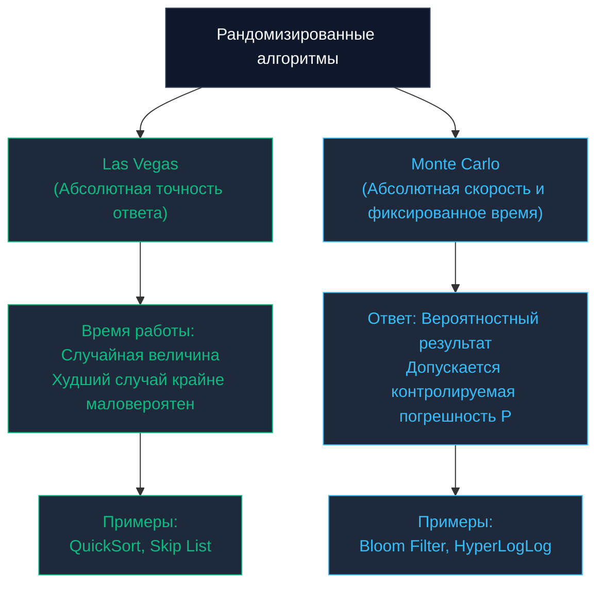

## Введение: Управляемый хаос против детерминизма

В предшествующих главах мы подробно исследовали классические детерминированные парадигмы. Будь то [[1. Divide and conquer - разделяй и властвуй]] или [[5. Branch and bound]], алгоритм всегда следовал по строго предопределенной траектории при одинаковых входных данных, гарантируя стопроцентно точный математический результат.

Однако в реальном мире распределенных систем, Big Data и криптографических протоколов строгий детерминизм нередко превращается в серьезную уязвимость:
1. **Детерминизм абсолютно предсказуем.** Злоумышленник может целенаправленно сформировать специфический профиль данных, чтобы обрушить сложность системы до худшего случая (вспомним уязвимости коллизий `Hash DoS` в веб-серверах или худший случай $O(N^2)$ для наивного [[4. Quick sort]]).
2. **Детерминизм вычислительно дорог.** Чтобы получить абсолютно безупречный 100% ответ, порой требуется перебрать факториальное или экспоненциальное пространство состояний.

В этот критический момент инженеры впускают в систему управляемый хаос. **Рандомизированные алгоритмы (Randomized Algorithms)** используют аппаратные или псевдослучайные генераторы для принятия решений непосредственно в процессе работы. Это позволяет радикально срезать алгоритмические углы, исключать худшие сценарии и получать результат с гарантированной вероятностью $99.999\%$ в тысячи раз быстрее.

---

## Две философские школы рандома

В компьютерных науках рандомизированные алгоритмы традиционно разделяются на две великие школы, названные в честь мировых столиц игорного бизнеса. Различие между ними отражает фундаментальный компромисс между временем вычислений и вероятностью ошибки.

### 1. Алгоритмы Лас-Вегаса (Las Vegas)

* **Фундаментальный принцип:** Алгоритм **всегда** возвращает математически безупречный, 100% точный ответ. Однако физическое время его работы является вероятностной случайной величиной.
* **Канонический пример:** Рандомизированный `QuickSort`. Мы выбираем опорный элемент (`Pivot`) случайным образом. Алгоритм в любом случае безупречно упорядочит срез. В невероятно редком сценарии фатального невезения (когда рандом раз за разом выбирает худший экстремум) время составит $O(N^2)$. Однако в математическом среднем мы строго гарантируем квазилинейное время $O(N \log N)$. В этот же класс входит вероятностный связный список `Skip List`.
* **Сфера применения:** Сценарии, где малейшая ошибка в результате категорически недопустима, но архитектуре требуется надежная защита от деградации на специфических входных наборах данных.

### 2. Алгоритмы Монте-Карло (Monte Carlo)

* **Фундаментальный принцип:** Алгоритм гарантирует **строго детерминированное время работы** (например, всегда строгое $O(N)$ или $O(1)$), однако возвращаемый результат с определенной малой, математически контролируемой вероятностью $P$ может содержать ошибку.
* **Канонический пример:** Вероятностный фильтр Блума ([[6. Bloom filter - вероятностная структура данных]] или `Bloom Filter`). Он проверяет присутствие ключа за субмикросекундное время $O(1)$, но допускает контролируемую вероятность ложноположительного срабатывания (`False Positive`). Сюда же относятся вероятностные счетчики уникальных сущностей (`HyperLogLog`).
* **Сфера применения:** Сверхнагруженные распределенные платформы, где скорость и пропускная способность важнее абсолютной академической точности (отсечение вредоносного сетевого трафика, аналитика сотен миллиардов кликов).



---

## Mechanical Sympathy: Источники хаоса в Go

Алгоритмическому контуру требуется источник энтропии. Однако полупроводниковый процессор — это строго детерминированный кристалл: он не умеет подбрасывать монетку. Для инженера на Go критически важно понимать физическую разницу между двумя источниками случайности в стандартной библиотеке:

### 1. TRNG (True Random) — Пакет `crypto/rand`

Этот пакет аккумулирует физическую энтропию операционной системы: аппаратные прерывания таймеров, тепловой шум кулеров, флуктуации сетевых карт (в ядре Linux — системный вызов к файлу `/dev/urandom` или процессорная инструкция `RDRAND`).
* **Цена для железа:** Чрезвычайно дорогая операция. Каждый вызов требует переключения контекста ядра (`Syscall`), блокировок на системном пуле энтропии и потенциального засыпания горутины.
* **Область применения:** Строго генерация криптографических секретов, солей, токенов аутентификации (`JWT`, `OAuth`). **Категорически запрещено** использовать его в узких циклах алгоритмической обработки данных.

### 2. PRNG (Pseudo-Random) — Пакет `math/rand/v2`

Это чистая математическая формула. Вы передаете ей начальное число (**Seed**), и алгоритм с головокружительной скоростью генерирует плотный поток псевдослучайных чисел, детерминированных этим начальным состоянием.

> [!warning] Ловушка / Gotcha (Эволюция рандома в Go)
> **В устаревших версиях Go (до 1.20)** разработчики повсеместно вызывали глобальную функцию `math/rand.Intn()`. Под капотом она скрывала глобальный разделяемый мьютекс `sync.Mutex`. Если тысячи горутин одновременно запрашивали случайное число (например, для алгоритмов распределения трафика), они выстраивались в многомиллисекундную очередь ожидания блокировки (`Lock Contention`), катастрофически роняя throughput сервиса. Приходилось вручную создавать локальные генераторы через `rand.New(rand.NewSource(...))`.
> 
> **В Go 1.22+** архитектура стандартного генератора была полностью переосмыслена с выходом пакета `math/rand/v2`. Глобальный рандом больше не использует мьютексов (он изолирован в локальных состояниях планировщика per-M). В качестве математического ядра внедрен молниеносный генератор **PCG** (Permuted Congruential Generator) или **ChaCha8**, что сделало получение псевдослучайного числа практически бесплатным для процессора без малейших конфликтов за память.

---

## Практика в Бэкенде: Reservoir Sampling (Выборка из резервуара)

Классическая архитектурная задача со сложнейших технических интервью уровня Staff / Principal:

**Постановка задачи:** Сервис аналитики принимает непрерывный потоковый стрим событий (или обрабатывает гигантский CSV-файл на 100 ГБ, не помещающийся в оперативную память). Общее количество входящих записей $N$ заранее неизвестно (поток может быть условно бесконечным).  
Требуется отобрать ровно $K$ случайных событий для репрезентативного аудита таким образом, чтобы **каждый элемент бесконечного потока имел абсолютно равную вероятность оказаться в финальной выборке**.

**Почему стандартные подходы терпят крах?**  
Мы не можем вызвать `rand.IntN(N)`, поскольку $N$ неизвестно. Мы не можем накапливать поток в срезе памяти, поскольку сервис мгновенно упадет с исчерпанием памяти (`OOM`).

Задачу решает классический вероятностный алгоритм **Reservoir Sampling** (метод Монте-Карло).

### Логика работы

1. Создается вспомогательный массив-резервуар фиксированной вместимостью $K$.
2. Первые $K$ элементов входящего стрима безусловно записываются в резервуар.
3. Для каждого следующего $i$-го элемента потока ($i \ge K$) алгоритм генерирует случайное целое число `R` в диапазоне от `0` до `i` включительно.
4. Если сгенерированное значение `R < K`, мы **замещаем** элемент резервуара под индексом `R` текущим входящим событием. В противном случае текущий элемент безвозвратно отбрасывается.

Метод математической индукции строго доказывает: в любой момент времени при текущем объеме потока $N$ каждый когда-либо поступивший элемент имеет строго равную вероятность $K/N$ находиться внутри резервуара.

### Идиоматичная реализация на Go 1.22+

```go
package randomalgo

import (
	"math/rand/v2" // Задействуем современный lock-free генератор
)

// StreamEvent имитирует структуру входящего потокового события
type StreamEvent struct {
	ID      int
	Payload string
}

// ReservoirSampling отбирает k случайных элементов из потока неизвестной длины
func ReservoirSampling(stream <-chan StreamEvent, k int) []StreamEvent {
	// Резервуар расходует строго константную память O(K)
	reservoir := make([]StreamEvent, 0, k)
	
	i := 0 // Счетчик суммарно полученных событий

	for event := range stream {
		if i < k {
			// Безусловно наполняем стартовый резервуар
			reservoir = append(reservoir, event)
		} else {
			// Генерируем случайное число от 0 до i включительно через math/rand/v2
			r := rand.IntN(i + 1)
			
			// С вероятностью k / (i+1) перезаписываем элемент
			if r < k {
				reservoir[r] = event
			}
		}
		i++
	}

	return reservoir
}
```

* **Пространственная сложность:** Строго $O(K)$. Даже если через канал `stream` прокачиваются терабайты событий, аллокатор Go удерживает в памяти строго $K$ структур.
* **Временная сложность:** Строго линейное время $O(N)$ (один проход по каналу с генерацией числа за несколько тактов процессора).

---

## Рандомизация в распределенных системах: Power of Two Random Choices

В современном распределенном бэкенде рандомизированные алгоритмы лежат в фундаменте архитектурных решений балансировки нагрузки.

Представьте API Gateway, распределяющий входящий трафик по пулу из 100 бэкенд-инстансов. Какую стратегию выбрать?
1. **Round Robin (По кругу):** Примитивный перебор, слепой к тому, что один сервер может обрабатывать тяжелый SQL-запрос и находиться под 100% утилизацией CPU.
2. **Least Connections (Минимум соединений):** Балансировщик обязан централизованно агрегировать счетчики соединений со всех 100 нод. В кластере с несколькими балансировщиками возникает эффект стадного поведения (**Herd Behavior**): все балансировщики одновременно фиксируют наименее загруженную ноду и лавинообразно направляют весь трафик туда, мгновенно выводя ее из строя.
3. **Pure Random (Чистая случайность):** Без блокировок, но по закону больших чисел случайный разброс гарантирует сценарий, при котором одна нода получает избыточный пик запросов, а соседние простаивают.

**Элегантное математическое решение:** Рандомизированный алгоритм **«Сила двух случайных выборов» (Power of Two Random Choices)**.  
Вместо опроса всех 100 серверов балансировщик выбирает **ровно 2 случайных сервера**. Затем он сравнивает текущую загрузку только этих двух кандидатов и направляет запрос на менее загруженный из них.

> [!tip] Собеседование
> **Вопрос:** Действительно ли сравнение всего двух случайных вариантов дает качественный выигрыш по сравнению с одним случайным выбором? Не стоит ли опрашивать 3 или 4 ноды?  
> **Ответ:** В теории вероятностей строго доказано, что переход от 1 случайного выбора к 2-м **экспоненциально** снижает максимальную нагрузку на самый загруженный узел кластера ($\approx \frac{\ln \ln N}{\ln 2}$). При этом переход от 2 нод к 3 нодам дает лишь микроскопическое улучшение, увеличивая служебный опросный трафик на 50%. Алгоритм `Power of Two Random Choices` лежит в основе балансировщиков мирового уровня: `NGINX`, `HAProxy` и планировщиков задач в `Apache Spark`.

---

## Итог раздела Алгоритмических парадигм

Мы проследили эволюцию алгоритмического мышления от классического детерминизма к управляемому хаосу:
1. **Divide and Conquer:** Рекурсивная декомпозиция на независимые подзадачи с идеальной аппаратной локальностью (`Cache-Oblivious`).
2. **Greedy:** Максимальная производительность через сортировку и линейный выбор локальных оптимумов.
3. **Dynamic Programming:** Исключение холостых вычислений через сохранение состояний перекрывающихся подзадач в таблице.
4. **Backtracking / Branch and Bound:** Интеллектуальный обход комбинаторного дерева состояний с отсечением тупиков и предиктивной оценкой рекордов.
5. **Randomized:** Преодоление теоретических барьеров детерминизма, защита от атак вырождения (`Hash DoS`) и потоковая обработка бесконечных данных в ограниченной памяти.

Вооружившись этим универсальным арсеналом парадигм, мы переходим к исследованию топологических структур, моделирующих взаимосвязи современного цифрового мира: от сетевой маршрутизации и графов микросервисов до алгоритмов рекомендаций.

Мы открываем фундаментальный раздел теории графов: [[1. Представление графов]].