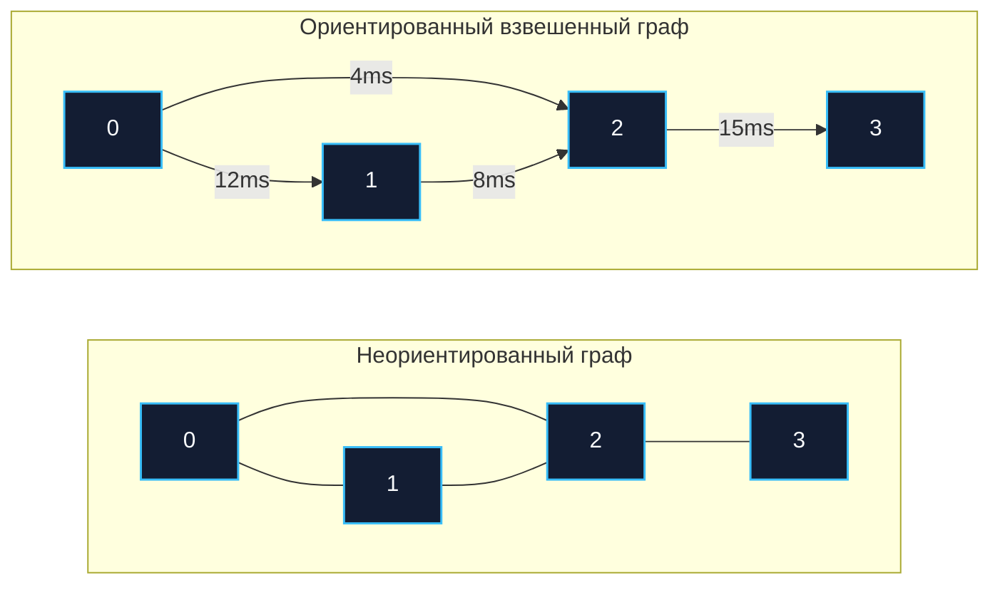
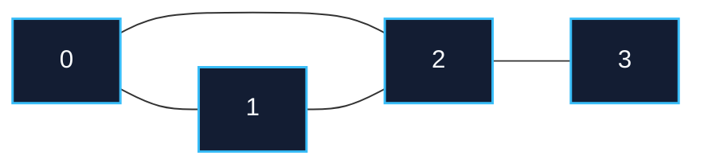
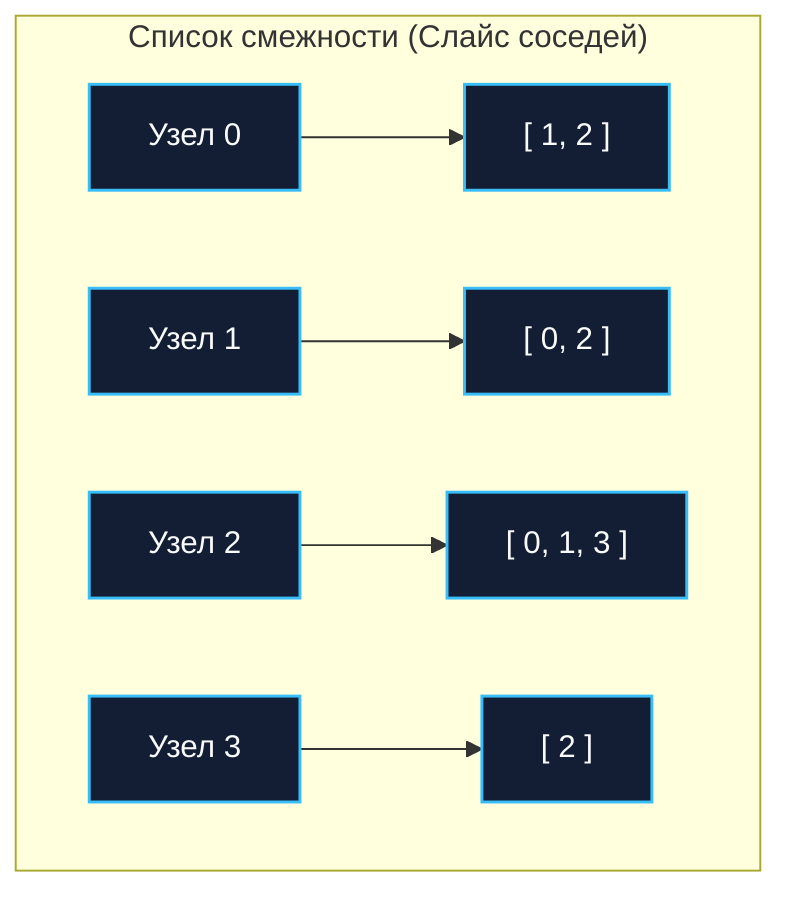
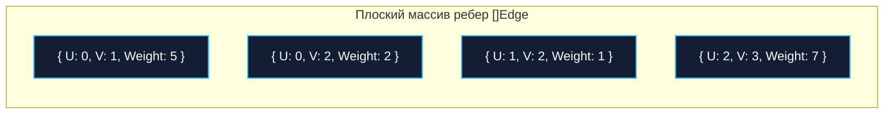

Мы начинаем один из самых масштабных, красивых и практически важных разделов в компьютерных науках — **Графы**.

Если деревья (см. раздел 04) помогают нам строить строгие и предсказуемые иерархии (файловые системы, синтаксические деревья компиляторов, B-деревья в СУБД), то графы описывают реальный мир. А в реальном мире связи между объектами хаотичны, цикличны, многонаправленны и порой запутаны. Компьютерные сети, топология микросервисных архитектур (Service Mesh), вычисление зависимостей пакетов в Go modules, обнаружение взаимных блокировок (deadlock detection), социальные графы и графы объектов в Garbage Collector — всё это дышит графовыми алгоритмами.

Прежде чем разворачивать обходы в ширину, искать циклы или прокладывать кратчайшие маршруты, инженер обязан ответить на фундаментальный вопрос: **как компактно и производительно разместить граф в оперативной памяти?** Выбор структуры данных определяет всё: превратится ли обход ваших микросервисов в миллисекундный полет по L1-кэшу или в часы мучительного ожидания с бесконечными `Cache Miss` и метаниями сборщика мусора.

---

## Анатомия графа: вершины, ребра и их природа

Формально любой граф $G = (V, E)$ состоит из двух фундаментальных множеств:
* **$V$ (Vertices / Узлы / Вершины):** Дискретные объекты предметной области (серверы, пользователи, функции в стеке вызовов, перекрестки дорог).
* **$E$ (Edges / Ребра / Дуги):** Отношения и связи между узлами.

Ребра бывают:
1. **Неориентированными (Undirected):** Связь взаимна (двустороннее шоссе, друзья в социальной сети). Если есть ребро $(u, v)$, то существует и $(v, u)$.
2. **Направленными (Directed / Digraph):** Односторонняя связь (подписка в Twitter/X, HTTP-запрос от сервиса A к сервису B, вызов функции).
3. **Взвешенными (Weighted):** Ребру сопоставлено числовое значение — задержка (RTT) в миллисекундах, пропускная способность канала, стоимость проезда или физическое расстояние.



Рассмотрим три классических способа представления графа в памяти на языке Go. У каждого из них своя ниша, свои алгоритмические компромиссы и свои отношения с иерархией процессорного кэша.

---

## 1. Матрица смежности (Adjacency Matrix)

Матрица смежности — это концептуально простейший подход: двумерная таблица размером $V \times V$, где ячейка `[i][j]` содержит флаг наличия ребра (или его числовой вес) между вершиной $i$ и вершиной $j$.



Для неориентированного графа выше матрица смежности симметрична относительно главной диагонали:

| Вершина | 0 | 1 | 2 | 3 |
|:---:|:---:|:---:|:---:|:---:|
| **0** | 0 | 1 | 1 | 0 |
| **1** | 1 | 0 | 1 | 0 |
| **2** | 1 | 1 | 0 | 1 |
| **3** | 0 | 0 | 1 | 0 |

### Наивная реализация на Go

Частая ошибка инженеров, пришедших из языков с динамическими списками — создавать матрицу смежности как «слайс слайсов» `[][]int` или `[][]bool`:

```go
matrix := make([][]int, V)
for i := range matrix {
    matrix[i] = make([]int, V)
}
// Проверка наличия ребра за O(1)
hasEdge := matrix[u][v] == 1 
```

> [!warning] Ловушка / Gotcha: Слайс слайсов — убийца производительности
> В Go тип `[][]int` — это не непрерывная двумерная матрица в памяти (в отличие от `int[N][M]` в C или `int[,]` в C#). Это внешний слайс, элементами которого являются структуры заголовков слайсов (`SliceHeader`, 24 байта на 64-битной платформе: указатель на данные, `len`, `cap`). Каждый внутренний слайс независимо аллоцируется в куче runtime-аллокатором.
> 
> **Последствия для железа:**
> - Для графа на $V = 10\,000$ вершин вы совершите $10\,001$ аллокацию памяти.
> - Строки матрицы окажутся разбросаны по разным аренам кучи.
> - Доступ к элементу `matrix[u][v]` требует разыменования указателя на строку, а затем сдвига внутри строки (Pointer Chasing). Аппаратный Prefetcher процессора бессилен, что гарантирует тяжелые промахи L1/L2/L3-кэша (`Cache Misses`).

```
Слайс слайсов [][]bool (Фрагментированная память, Pointer Chasing):
[ &row0 | &row1 | &row2 ] (Внешний слайс в куче)
    │       │       │
    │       │       └───> [ 0 | 1 | 0 ] (Память по адресу 0x1040) -> Cache Miss
    │       └───────────> [ 1 | 0 | 1 ] (Память по адресу 0x2080) -> Cache Miss
    └───────────────────> [ 0 | 1 | 1 ] (Память по адресу 0x08a0) -> Cache Miss

Плоский массив []bool (Непрерывный буфер, Spatial Locality):
[ 0, 1, 1,   1, 0, 1,   0, 1, 0 ] (Единый кусок памяти, загрузка в L1-кэш линиями по 64 байта)
```

### Idiomatic & Mechanical Sympathy реализация (Плоский массив)

Правильный инженерный путь — «расплющить» (flatten) 2D-матрицу в единый непрерывный одномерный слайс размером $V \times V$. Индекс элемента вычисляется элементарной арифметикой: `row * width + col`.

```go
package main

// DenseGraph представляет граф в виде плоской матрицы смежности.
type DenseGraph struct {
	vertices int
	matrix   []bool // Используем bool для экономии памяти (или int для веса)
}

// NewDenseGraph создает граф с единой непрерывной аллокацией памяти.
func NewDenseGraph(v int) *DenseGraph {
	return &DenseGraph{
		vertices: v,
		// ОДНА аллокация памяти. Идеальная пространственная локальность.
		matrix:   make([]bool, v*v), 
	}
}

// AddEdge добавляет неориентированное ребро
func (g *DenseGraph) AddEdge(u, v int) {
	// Формула вычисления индекса: строка * ширина + столбец
	g.matrix[u*g.vertices+v] = true
	g.matrix[v*g.vertices+u] = true
}

// HasEdge проверяет связь за константное O(1) время
func (g *DenseGraph) HasEdge(u, v int) bool {
	return g.matrix[u*g.vertices+v]
}
```

**Плюсы матрицы смежности:**
- Проверка наличия ребра `(u, v)` занимает гарантированное $O(1)$.
- Добавление и удаление ребер — строго $O(1)$.
- Идеально для **плотных графов (Dense Graphs)**, где количество ребер стремится к максимуму: $E \approx V^2$.

**Минусы матрицы смежности:**
- Потребление памяти строго $O(V^2)$. Если у вас 1 миллион пользователей в базе, матрица смежности потребует $1\,000\,000^2 \text{ байт} \approx 1 \text{ ТБ}$ оперативной памяти, даже если у каждого пользователя всего по два друга!
- Итерация по всем соседям конкретной вершины занимает $O(V)$, так как нужно просканировать всю строку матрицы, даже если она почти целиком заполнена нулями.

---

## 2. Список смежности (Adjacency List)

В реальных бэкенд-системах подавляющее большинство графов являются **разреженными (Sparse Graphs)**: количество ребер несоизмеримо меньше теоретического максимума ($E \ll V^2$). Каждая веб-страница ссылается на десятки других, а не на весь Интернет; у пользователя сотни контактов, а не миллиарды.

Список смежности решает проблему памяти радикально: для каждой вершины мы храним только коллекцию ее реальных непосредственных соседей.



### Реализация через Map (Хеш-таблицу)

Когда вершины графа представлены произвольными бизнес-ключами (строки, UUID, доменные имена), разработчики инстинктивно тянутся к `map`:

```go
type StringGraph struct {
	adj map[string][]string
}

func (g *StringGraph) AddEdge(u, v string) {
	g.adj[u] = append(g.adj[u], v)
}
```

> [!info] Под капотом: Overhead встроенной map
> Использование `map` делает код чистым и читаемым на ранних стадиях разработки, но скрывает огромный системный оверхед. Внутри рантайма Go структура `hmap` использует массивы бакетов (buckets). 
> 
> Поиск соседей `g.adj["user-123"]` требует:
> 1. Вычисления хеш-функции от строки (AES-NI инструкции процессора).
> 2. Поиска нужного бакета.
> 3. Обхода связного списка бакетов в случае коллизий (Pointer Chasing).
> 
> В высоконагруженных алгоритмах (например, при BFS/DFS обходе графа на миллионы узлов) непрерывный расчет хеш-сумм и случайные прыжки по указателям съедят драгоценные такты CPU и разогреют сборщик мусора.

### Production-Ready реализация (Трансляция ID в Слайсы)

Золотой стандарт высокопроизводительных систем: на входном рубеже сервиса (Ingress/API) мы транслируем строковые или UUID-идентификаторы во внутренние плотные целочисленные индексы от $0$ до $V-1$ (интернирование / ID mapping). Внутри ядра алгоритма граф хранится как **слайс слайсов**, где внешний индекс массива — это внутренний компактный ID вершины.

```go
package main

// SparseGraph реализует список смежности на слайсах.
// Индекс во внешнем слайсе - это ID вершины (от 0 до V-1).
type SparseGraph struct {
	adj [][]int
}

// NewSparseGraph выделяет внешний слайс фиксированной длины.
func NewSparseGraph(vertices int) *SparseGraph {
	return &SparseGraph{
		// Предварительная аллокация для внешнего слайса
		adj: make([][]int, vertices), 
	}
}

// AddEdge добавляет направленное ребро
func (g *SparseGraph) AddEdge(u, v int) {
	// append может вызвать реаллокацию внутреннего слайса,
	// но доступ к списку соседей по индексу g.adj[u] - это мгновенное O(1).
	g.adj[u] = append(g.adj[u], v)
}

// GetNeighbors возвращает всех соседей узла u
func (g *SparseGraph) GetNeighbors(u int) []int {
	return g.adj[u]
}
```

**Плюсы списка смежности:**
- Расход памяти строго пропорционален объему данных: $O(V + E)$.
- Итерация по всем соседям конкретной вершины занимает $O(\text{deg}(u))$ — мы читаем только существующие ребра.
- Внутренний слайс `[]int` читается последовательно, эффективно укладываясь в 64-байтные строки L1-кэша процессора (Spatial Locality).

**Минусы списка смежности:**
- Проверка существования ребра `(u, v)` требует времени $O(K)$, где $K$ — степень вершины (количество соседей), поскольку нам необходимо выполнить линейный поиск (см. [[1. Линейный поиск]]) по внутреннему слайсу.

> [!tip] Собеседование
> **Вопрос:** Как хранить веса ребер в списке смежности на слайсах без потери производительности?  
> **Ответ:** Вместо внутреннего `[]int` использовать слайс пользовательской структуры: `[]Edge`, где `type Edge struct { To int; Weight float64 }`. Структуры в слайсе лежат непрерывно в едином блоке памяти, поэтому на дружелюбие к кэшу процессора это не повлияет, добавится лишь фиксированный шаг (stride) при чтении полей.

---

## 3. Список ребер (Edge List)

Список ребер — это самое минималистичное, предельно простое, но весьма специфичное представление графа. В нем мы вообще не выделяем вершины как отдельные узлы-хранилища, а содержим глобальный плоский массив кортежей «откуда — куда — вес».

```go
type Edge struct {
	U      int
	V      int
	Weight int
}

type EdgeListGraph struct {
	Edges []Edge
}
```



**Плюсы:**
- Структура данных представляет собой идеально непрерывный плоский массив в оперативной памяти.
- Превосходно подходит для сортировки всех ребер графа (например, по весу).

**Минусы:**
- Невозможно быстро узнать соседей заданной вершины: чтобы найти все ребра из вершины $u$, требуется полный просмотр всего массива ребер за $O(E)$.
- Проверка наличия связи между $u$ и $v$ также занимает время $O(E)$.

**Где применяется:**
Список ребер практически непригоден для локальной навигации и обходов (BFS, DFS). Его стихия — глобальные алгоритмы, обрабатывающие все ребра целиком:
- Алгоритм Крускала для построения минимального остовного дерева (Minimum Spanning Tree, MST).
- Алгоритм Беллмана-Форда (см. [[6. Алгоритм Беллмана Форда]]) для релаксации путей в сетях с отрицательными весами.

---

## Сравнительный анализ представлений графов

| Характеристика | Матрица смежности (Dense) | Список смежности (Sparse) | Список ребер (Edge List) |
|---|:---:|:---:|:---:|
| **Память** | $O(V^2)$ | $O(V + E)$ | $O(E)$ |
| **Добавление ребра** | $O(1)$ | $O(1)$ | $O(1)$ |
| **Проверка ребра $(u, v)$** | $O(1)$ | $O(\text{deg}(u))$ | $O(E)$ |
| **Перебор всех соседей $u$** | $O(V)$ | $O(\text{deg}(u))$ | $O(E)$ |
| **Кэш-локальность** | Отличная (при плоском `[]bool`) | Отличная внутри вершин | Идеальная |
| **Оптимален для** | Плотных сетей ($E \approx V^2$) | Разреженных сетей ($E \ll V^2$) | Сортировки ребер (MST) |

---

## Итог: Что выбрать бэкенд-разработчику?

1. **Матрица смежности (одномерный плоский массив):** Выбираем, если граф плотный ($E \approx V^2$), $V$ невелико (до нескольких тысяч) и нам критически важны частые проверки $O(1)$ на существование конкретного ребра.
2. **Список смежности (слайс слайсов):** **Стандарт по умолчанию (Default Choice)**. Идеален для разреженных графов. Дает быстрый перебор соседей, что необходимо для 99% графовых алгоритмов.
3. **Список смежности (`map`):** Выбираем только для быстрой прототипизации или если граф настолько динамичен и разрежен, что мы даже не знаем примерного количества вершин заранее. Остерегайтесь оверхеда `hmap` и работы Garbage Collector-а.
4. **Список ребер:** Только для специфических алгоритмов (Крускал, Беллман-Форд).

Теперь, когда наш граф надежно и оптимально размещен в оперативной памяти, мы можем начать по нему передвигаться. В следующей статье мы разберем самый важный алгоритм обхода, который лежит в основе поиска кратчайших путей в невзвешенных сетях (например, поиск друзей через одно рукопожатие): [[2. Поиск в ширину BFS]].