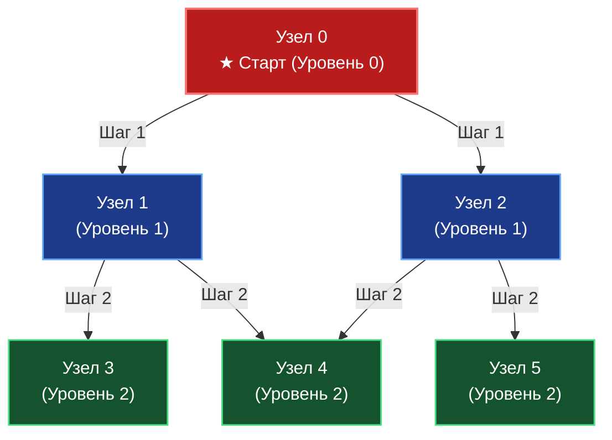
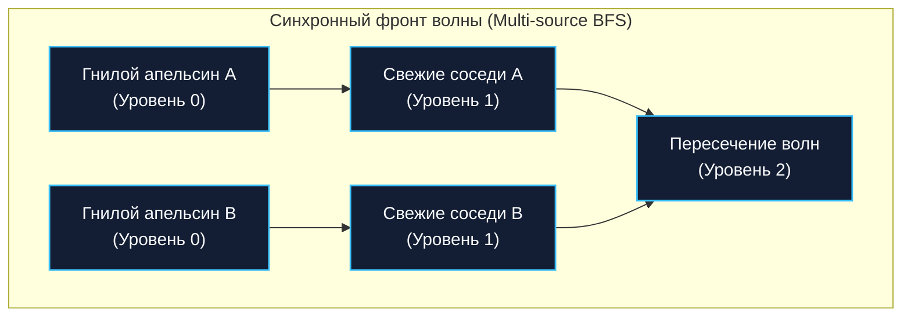

В статье [[1. Представление графов]] мы определились, что для подавляющего большинства инженерных задач оптимальным выбором хранения графа в Go является список смежности (слайс слайсов). Теперь, когда данные компактно и бережно размещены в оперативной памяти, нам нужны надежные алгоритмы для их исследования.

Первый и самый фундаментальный из них — **Поиск в ширину (Breadth-First Search, BFS)**.

---

## Механика алгоритма: Круги на воде

Представьте, что в безветренный день вы бросили камень в гладкое лесное озеро. От места падения (стартовой вершины) во все стороны начинают синхронно расходиться концентрические волны:
- Первая волна накрывает непосредственных соседей (вершины на расстоянии 1 ребра).
- Вторая волна настигает соседей соседей (расстояние 2 ребра).
- Третья волна уходит дальше, и так далее.

Именно так работает BFS. Он исследует граф строго **послойно (по уровням)**. Алгоритм никогда не отправится вглубь к вершинам третьего уровня, пока полностью не обойдет все вершины первого и второго уровней.



Чтобы реализовать эту послойную экспансию, нам критически необходима структура данных **Очередь (FIFO — First In, First Out)**. Узлы, обнаруженные первыми, обязаны быть обработаны первыми.

---

## Mechanical Sympathy: Битва за кэш и память

Прежде чем написать первую строчку кода, давайте оценим алгоритм с позиции системного программиста, знающего устройство процессора и сборщика мусора Go.

Для выполнения BFS необходимы две вспомогательные структуры:
1. **Очередь (Queue):** Для хранения узлов, ожидающих своей очереди на раскрытие соседей.
2. **Множество посещенных (Visited Set):** Для предотвращения бесконечного зацикливания при наличии циклов и исключения повторной обработки одних и тех же узлов.

### Проблема 1: Выбор структуры для Visited

Типичная ошибка начинающего Go-разработчика — создание множества через хеш-таблицу: `visited := make(map[int]bool)`.

**Почему это катастрофа для производительности?**
Поиск и вставка в хеш-таблицу в Go требует вычисления 64-битного хеша (пусть и аппаратно через AES-NI), поиска бакета и разрешения возможных коллизий. В графе на 10 миллионов вершин мапа разорвет кэш процессора в клочья:
- Анализ побега компилятора (`Escape Analysis`) гарантированно отправит разрастающиеся бакеты в общую кучу (Heap).
- Память под бакеты разбросана хаотично — аппаратный prefetcher бессилен.
- Миллионы мелких аллокаций создадут колоссальное давление на Garbage Collector при сборке мусора.

**Решение архитектора:** Если вершины пронумерованы непрерывными целыми числами от $0$ до $V-1$, мы **обязаны** использовать плоский срез: `visited := make([]bool, V)`.
- Срез `[]bool` на $10\,000\,000$ элементов занимает всего $\approx 10 \text{ МБ}$ непрерывной памяти.
- Обращение по индексу `visited[node]` — это мгновенное $O(1)$ сложение базового адреса со смещением (ровно 1 такт процессора). 
- Пространственная локальность (Spatial Locality) идеальна: чтение смежных ячеек попадает в одну 64-байтную строку L1-кэша.

### Проблема 2: Аллокации и сдвиг в Очереди

Если мы будем использовать классический наивный слайс как очередь через усечение: `queue = queue[1:]` (как обсуждалось в [[5. Очередь]]), то базовый массив будет бесконечно ползти вперед по памяти или требовать постоянных повторных аллокаций, оставляя брошенные куски сборщику мусора.

Для образцового высоконагруженного BFS мы можем предварительно выделить срез размером $V$ (ведь каждая вершина попадает в очередь максимум один раз) и управлять позициями через два целочисленных указателя `head` и `tail`, имитируя концепцию [[7. Кольцевой буфер]] без необходимости заворачивать индексы по модулю.

---

## Production-Ready реализация на Go

Ниже представлена высокопроизводительная реализация BFS без единой паразитной аллокации в цикле (Zero-Allocation Loop).

```go
package main

import "fmt"

// SparseGraph - список смежности из предыдущей статьи.
type SparseGraph struct {
	adj [][]int
}

// BFS выполняет послойный обход графа, вызывая action для каждой вершины.
func BFS(graph *SparseGraph, startNode int, action func(node int)) {
	V := len(graph.adj)
	if V == 0 || startNode < 0 || startNode >= V {
		return
	}

	// 1. Плоский массив для отслеживания посещенных узлов
	visited := make([]bool, V)

	// 2. Оптимизированная очередь на базе предварительно выделенного слайса
	// Емкость V гарантирует, что append никогда не вызовет реаллокацию в куче.
	queue := make([]int, 0, V)
	head := 0 // Указатель на голову очереди (индекс чтения)

	// Начальное состояние
	queue = append(queue, startNode)
	visited[startNode] = true

	// Пока очередь не пуста (пока указатель чтения не догнал длину слайса)
	for head < len(queue) {
		// Извлекаем элемент из головы (Dequeue) за O(1)
		current := queue[head]
		head++

		// Выполняем полезную работу
		action(current)

		// Сканируем всех смежных соседей
		for _, neighbor := range graph.adj[current] {
			if !visited[neighbor] {
				// ВАЖНО: Помечаем узел посещенным СРАЗУ в момент добавления в очередь!
				visited[neighbor] = true        // Помечаем КАК ПОСЕЩЕННЫЙ СРАЗУ ЖЕ
				queue = append(queue, neighbor) // Добавляем в конец очереди (Enqueue)
			}
		}
	}
}
```

> [!warning] Ловушка / Gotcha: Экспоненциальный взрыв очереди
> Обратите пристальное внимание на строку `visited[neighbor] = true`. Мы помечаем узел как посещенный **в момент постановки в очередь**, а не в момент его извлечения из нее.
> 
> Если вы перенесете пометку внутрь цикла обработки (после `current := queue[head]`), то одна и та же вершина будет добавлена в очередь десятки и сотни раз всеми своими соседями, пока очередь не дойдет до нее физически. Для плотных графов емкость очереди мгновенно взорвется, память исчерпается (OOM), а временная сложность деградирует в экспоненту. Это классическая ловушка на техническом интервью!

---

## Паттерны задач с собеседований (Middle+ / Senior)

BFS — это не просто инструмент для обхода всех узлов. Это математически безупречный метод нахождения **Кратчайшего пути в невзвешенном графе**. Если все ребра имеют одинаковую единичную стоимость ($1$), то первый момент, когда фронт волны BFS достигает целевой вершины, гарантирует, что найденный путь минимален по количеству шагов.

### Паттерн 1: Восстановление кратчайшего пути

Чтобы не просто узнать длину пути, а реконструировать весь маршрут от источника до цели, заменим массив `visited []bool` на массив предков `parent []int`.

```go
// Инициализируем массив родителей значением -1 (не посещен)
parent := make([]int, V)
for i := range parent {
	parent[i] = -1
}

// При обходе соседей:
if parent[neighbor] == -1 {
	parent[neighbor] = current // current становится "отцом" для neighbor
	queue = append(queue, neighbor)
}

// Восстановление пути от целевого узла (targetNode) к стартовому:
path := []int{}
curr := targetNode
for curr != -1 {
	path = append(path, curr)
	curr = parent[curr]
}
// Разворачиваем path, чтобы получить маршрут от старта к финишу
for i, j := 0, len(path)-1; i < j; i, j = i+1, j-1 {
	path[i], path[j] = path[j], path[i]
}
```

### Паттерн 2: Мульти-стартовый BFS (Multi-source BFS)

**Классическая задача (LeetCode 994 - Rotting Oranges):**  
Дана двумерная сетка, где лежат свежие и уже гнилые апельсины. Каждую минуту гнилой апельсин заражает всех четырех своих соседей (сверху, снизу, слева, справа). Требуется определить минимальное количество минут, за которое сгниют все апельсины, либо вернуть $-1$, если изоляция делает это невозможным.

**Решение:**  
Ошибочно запускать отдельный BFS от каждого изначально испорченного плода. Правильный подход — **Multi-source BFS**:
1. На предварительном этапе сканируем матрицу и заносим координаты **всех** гнилых апельсинов в очередь одновременно (формируя Уровень 0).
2. Запускаем стандартный цикл BFS.
3. Волна заражения расходится синхронно из десятков источников, подобно одновременному падению нескольких камней в воду. Время работы — строго линейное $O(R \times C)$.



> [!tip] Собеседование: Двунаправленный BFS (Bidirectional BFS)
> **Вопрос:** Как эффективно найти кратчайший путь между двумя людьми в социальной сети на сотни миллионов пользователей (теория шести рукопожатий)? Обычный BFS исчерпает терабайты памяти.
> 
> **Ответ:** Применить **Двунаправленный BFS (Bidirectional BFS)**.  
> Мы запускаем две встречные волны одновременно:
> - Первая стартует от пользователя $A$;
> - Вторая — навстречу от пользователя $B$.
> 
> Если средний коэффициент ветвления дерева поиска равен $B$ (например, $100$ друзей у человека), а расстояние между ними $D = 6$ шагов:
> - Классический BFS вынужден просканировать до $O(B^D) = 100^6 = 1\,000\,000\,000\,000$ (один триллион!) узлов.
> - Двунаправленный BFS встретится посередине на глубине $D/2 = 3$, исследовав всего $O(B^{D/2} + B^{D/2}) = 100^3 + 100^3 = 2\,000\,000$ (два миллиона) узлов. Это выигрыш в $500\,000$ раз по памяти и времени!

---

## Сложность алгоритма

* **Временная сложность:** $O(V + E)$, где $V$ — число вершин, $E$ — число ребер. Каждая вершина попадает в очередь ровно один раз, и список смежности каждой вершины сканируется ровно один раз при ее обработке.
* **Пространственная сложность:** $O(V)$. В худшем случае (например, граф-звезда, где центральный узел напрямую связан со всеми остальными $V-1$ узлами) очередь и буфер `visited` вмещают все вершины графа одновременно.

---

## Итог

1. **BFS (Поиск в ширину)** — послойный волновой обход графа. Архитектурно базируется на структуре **Очередь (FIFO)**.
2. Является математическим стандартом для нахождения **кратчайших путей в невзвешенных сетях**.
3. **Mechanical Sympathy:** В высокопроизводительном коде Go используйте плоский срез `[]bool` для трекинга посещений вместо медленных `map[int]bool` и предварительно аллоцированный слайс с указателем `head` для очереди.
4. Всегда маркируйте вершину как посещенную **до** добавления в очередь, чтобы не допустить дублирования и лавинообразного взрыва памяти.

BFS непревзойденно ищет кратчайшие маршруты, но требует значительного объема оперативной памяти под хранение расширяющегося фронта волны. Если же наша задача — не искать кратчайший путь, а обойти лабиринт до упора, найти компоненты связности, выявить циклы или топологически отсортировать зависимости в проекте, на сцену выходит другой великий алгоритм — **Поиск в глубину (DFS)**. О нем читайте в следующей статье: [[3. Поиск в глубину DFS]].