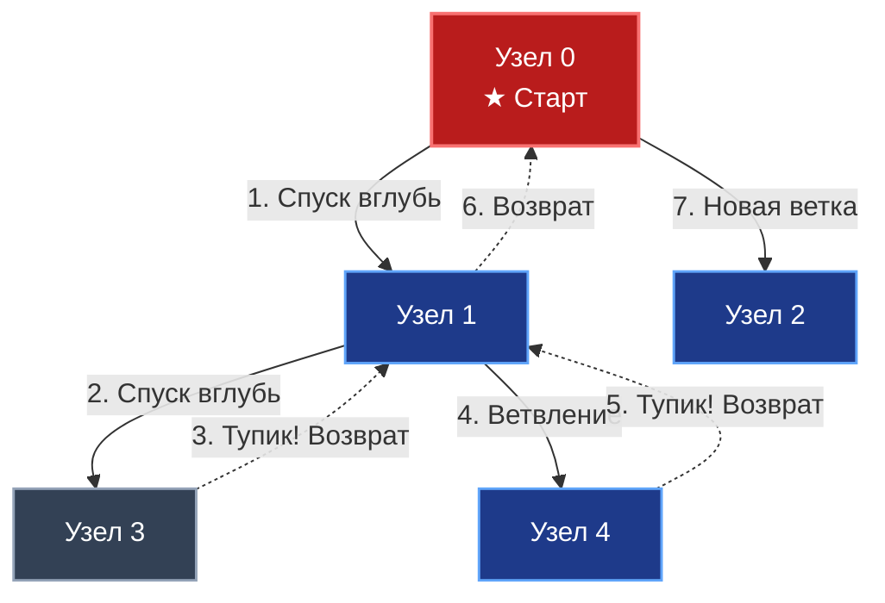
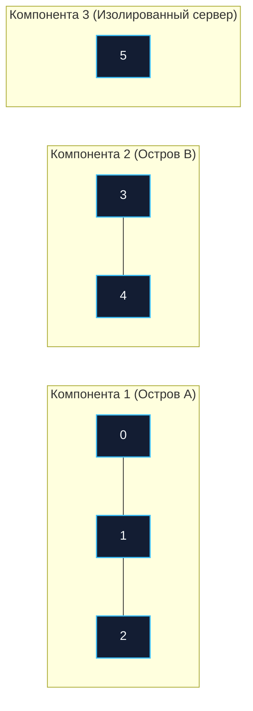
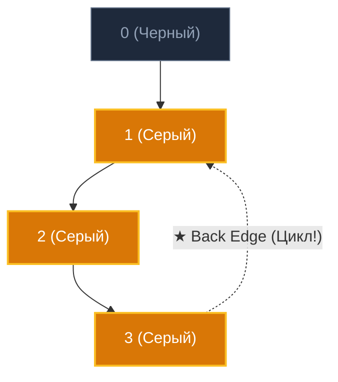

В статье [[2. Поиск в ширину BFS]] мы подробно исследовали волновой алгоритм, который расходится концентрическими кругами вширь. Он идеален для нахождения кратчайших путей в невзвешенных графах. Но что делать, если перед инженером стоит иная задача: не найти самый быстрый маршрут, а исследовать всю структуру графа до самых глубин, выявить скрытые циклы, разбить систему на изолированные компоненты связности или распутать сложнейший клубок зависимостей между пакетами?

Для этих фундаментальных задач применяется **Поиск в глубину (Depth-First Search, DFS)**.

---

## Механика алгоритма: Исследователь лабиринта

Если BFS опирается на Очередь (FIFO), то в фундаменте DFS всегда лежит **Стек (LIFO — Last In, First Out)**.

Механика DFS повторяет античный миф о Тесее в лабиринте Минотавра или поведение спелеолога с клубком нити:
1. Вы выбираете первый попавшийся коридор и стремительно идете вперед так глубоко, как только возможно, разматывая за собой путеводную нить.
2. Когда вы упираетесь в тупик (или натыкаетесь на вершину, где уже побывали), вы делаете шаг назад (Backtracking), сматывая часть нити, и пробуете свернуть в следующее неисследованное ответвление.



---

## Mechanical Sympathy: Стек вызовов против Кучи

Реализовать DFS можно двумя принципиально разными путями: **рекурсивно** и **итеративно**. Для разработчика на Go выбор между ними — это не вопрос личного вкуса, а строгий архитектурный компромисс между простотой кода и поведением рантайма на больших объемах данных.

### 1. Рекурсивный подход (Call Stack)

Самый лаконичный и выразительный способ. Роль стека выполняет собственный стек вызовов программы (Call Stack), а возврат назад (Backtracking) осуществляется естественным возвратом из функции.

> [!info] Под капотом: Рекурсия в Go и расширение стека
> Каждая горутина в Go стартует с крошечным непрерывным стеком размером всего **2 КБ** (для сравнения: в Java/C++ системный стек потока ОС обычно выделяется фиксированным объемом от 1 до 8 МБ).
> 
> Если ваш граф представляет собой вырожденную цепочку из 1 миллиона узлов, рекурсивный спуск создаст миллион вложенных стековых фреймов. 
> - В языках с фиксированным стеком это немедленно приведет к фатальной ошибке `StackOverflow` и краху процесса.
> - В Go рантайм перехватывает приближение к границе стека через пролог функции и вызывает служебную процедуру `runtime.morestack`. Рантайм выделяет в памяти кусок в 2 раза больше, копирует туда весь текущий стек горутины и аккуратно корректирует все внутренние указатели. Приложение выживет!
> 
> **Однако цена высока:** постоянное копирование стека в цикле (`stack growth`) сожрет огромное количество процессорных тактов и создаст паузы. Для графов с неконтролируемой глубиной неконтролируемая рекурсия в Go — это скрытая бомба замедленного действия.

### 2. Итеративный подход (Heap Stack)

При итеративном подходе мы создаем собственный стек на базе обычного слайса в куче (Heap), как мы делали в статье [[4. Стек]]. Слайс размещается в непрерывном блоке оперативной памяти, обладает превосходной пространственной локальностью (Spatial Locality) и избавляет runtime Go от необходимости непрерывно растягивать системные стеки горутин.

---

## Реализация на Go (Idiomatic & Production-Ready)

Используем представление `SparseGraph` (Список смежности на слайсах) из статьи [[1. Представление графов]].

### Классический Рекурсивный DFS

```go
package main

// SparseGraph - список смежности на слайсах.
type SparseGraph struct {
	adj [][]int
}

// DFSRecursive запускает рекурсивный обход графа в глубину.
// Используем плоский массив visited для O(1) доступа и Cache Locality.
func DFSRecursive(graph *SparseGraph, start int, action func(int)) {
	V := len(graph.adj)
	if V == 0 || start < 0 || start >= V {
		return
	}

	visited := make([]bool, V)

	// Объявляем анонимную функцию для рекурсии (Closure)
	var dfs func(node int)
	dfs = func(node int) {
		visited[node] = true
		action(node) // Выполняем бизнес-логику

		// Идем вглубь по каждому соседу
		for _, neighbor := range graph.adj[node] {
			if !visited[neighbor] {
				dfs(neighbor)
			}
		}
	}

	dfs(start)
}
```

### Итеративный DFS (Highload)

Этот вариант гарантированно стабилен при любой экстремальной глубине графа и не создает паразитной нагрузки на механизм перемещения стека горутин:

```go
// DFSIterative выполняет обход в глубину без использования рекурсии.
func DFSIterative(graph *SparseGraph, start int, action func(int)) {
	V := len(graph.adj)
	if V == 0 || start < 0 || start >= V {
		return
	}

	visited := make([]bool, V)

	// Преаллоцируем стек (например, на 1024 элемента, 
	// слайс сам вырастет при необходимости через runtime.growslice)
	stack := make([]int, 0, 1024)
	stack = append(stack, start)

	for len(stack) > 0 {
		// Pop из стека (берем последний элемент)
		lastIdx := len(stack) - 1
		current := stack[lastIdx]
		stack = stack[:lastIdx]

		// В итеративном DFS узел может попасть в стек несколько раз, 
		// поэтому мы ПРОВЕРЯЕМ visited после извлечения.
		if visited[current] {
			continue
		}

		visited[current] = true
		action(current)

		// Добавляем соседей в стек.
		// ВНИМАНИЕ: Чтобы обход полностью совпадал с рекурсивным (слева направо),
		// соседей нужно добавлять в стек в ОБРАТНОМ порядке.
		neighbors := graph.adj[current]
		for i := len(neighbors) - 1; i >= 0; i-- {
			neighbor := neighbors[i]
			if !visited[neighbor] {
				stack = append(stack, neighbor)
			}
		}
	}
}
```

---

## Паттерны с собеседований (Алгоритмические задачи)

DFS — безусловный фаворит алгоритмических секций на собеседованиях. Большинство сложных графовых задач элегантно сводятся к модификации обхода в глубину.

### Паттерн 1: Подсчет компонент связности (Connected Components)

**Классическая задача (LeetCode 200 - Number of Islands):**  
Дан граф (или двумерная матрица с землей и водой), который разбит на изолированные, не связанные друг с другом кластеры. Требуется определить их количество.

**Решение:**  
Итерируемся по всем вершинам цикла `for i := 0; i < V; i++`. Если вершина `i` еще не помечена в массиве `visited`:
1. Увеличиваем счетчик компонент на $1$.
2. Запускаем от нее DFS.
3. DFS обойдет и закрасит в `visited` весь остров целиком.
4. Внешний цикл продолжится, пропуская уже посещенные вершины, и споткнется только о следующий изолированный кластер.



### Паттерн 2: Поиск циклов в ориентированном графе (Three-Color Marking)

**Инженерная задача:**  
Как убедиться, что граф микросервисных вызовов или граф пакетов в проекте на Go не содержит циклических зависимостей (`Import Cycle`)?

Для ориентированных графов простого двоичного флага `visited` (были / не были) недостаточно. Нам необходима раскраска в **три цвета (состояния)**:
- **0 (Белый / White):** Узел еще не обнаружен.
- **1 (Серый / Gray):** Мы вошли в узел, он прямо сейчас находится в активной цепочке вызовов (исследуются его потомки).
- **2 (Черный / Black):** Мы полностью закончили обход узла и всех его поддеревьев, узел снят со стека.

Если в процессе спуска DFS мы пытаемся шагнуть в вершину, которая уже помечена **Серым цветом (Gray)** — обнаружено **Обратное ребро (Back edge)**, ведущее к нашему собственному предку. Это математически строго доказывает наличие цикла!



```go
// HasCycle проверяет наличие циклов в ориентированном графе через трехцветную раскраску.
func HasCycle(graph *SparseGraph) bool {
	V := len(graph.adj)
	colors := make([]uint8, V) // 0 - White, 1 - Gray, 2 - Black

	var dfs func(node int) bool
	dfs = func(node int) bool {
		colors[node] = 1 // Помечаем как "в процессе" (Gray)

		for _, neighbor := range graph.adj[node] {
			if colors[neighbor] == 1 {
				// Встретили Gray узел - нашли цикл!
				return true
			}
			if colors[neighbor] == 0 {
				if dfs(neighbor) {
					return true
				}
			}
		}

		colors[node] = 2 // Полностью обработали (Black)
		return false
	}

	// Проходим по всем узлам (на случай, если граф не связный)
	for i := 0; i < V; i++ {
		if colors[i] == 0 {
			if dfs(i) {
				return true
			}
		}
	}
	return false
}
```

> [!warning] Ловушка / Gotcha: Неориентированные графы
> Алгоритм с тремя цветами предназначен исключительно для **Ориентированных графов**. В неориентированном графе вы мгновенно обнаружите ложный «цикл» длиной в 2 ребра, просто шагнув обратно к своему непосредственному родителю по тому же ребру. 
> 
> Для проверки циклов в неориентированном графе в функцию `dfs` обязательно передается идентификатор вершины-родителя `parentID`, чтобы проигнорировать шаг назад: `if neighbor == parentID { continue }`.

---

## Временная и пространственная сложность

- **Временная сложность:** $O(V + E)$ — алгоритм посетит каждую вершину ровно один раз и рассмотрит каждое исходящее ребро ровно один раз.
- **Пространственная сложность:** $O(V)$ — массив посещенных узлов и Стек вызовов (или явный слайс-буфер). В худшем случае (вырожденный граф-цепочка) глубина стека достигнет $V$.

---

## Итог

1. **DFS (Поиск в глубину)** — идеален для исследования топологии графа: поиска всех путей, циклов и компонент связности.
2. В основе DFS лежит **Стек (LIFO)**.
3. В Go рекурсивный DFS прост в написании, но опасен для CPU при огромной глубине из-за механизма динамического расширения стека горутин (`runtime.morestack`).
4. Метод "Трех цветов" (White/Gray/Black) — индустриальный стандарт для обнаружения циклических зависимостей (Import Cycles) в направленных графах.

Если DFS позволяет нам находить циклы, то что делать с ориентированным графом, в котором циклов гарантированно нет (DAG — Directed Acyclic Graph)? Такие графы используются для описания пайплайнов (CI/CD), систем сборки (Make/Task) и зависимостей модулей. И чтобы выполнить все задачи в правильном порядке, нам понадобится алгоритм, который базируется на самом DFS. В следующей статье мы разберем: [[4. Топологическая сортировка]].