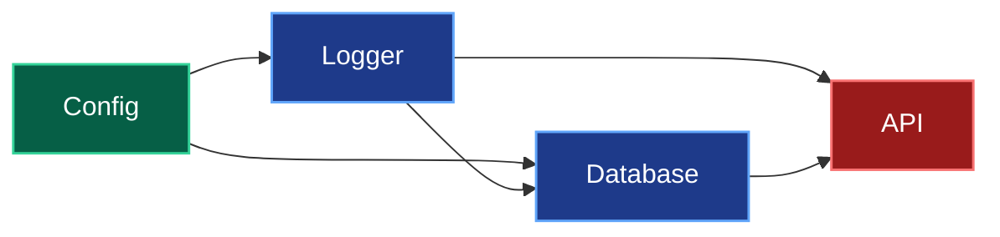
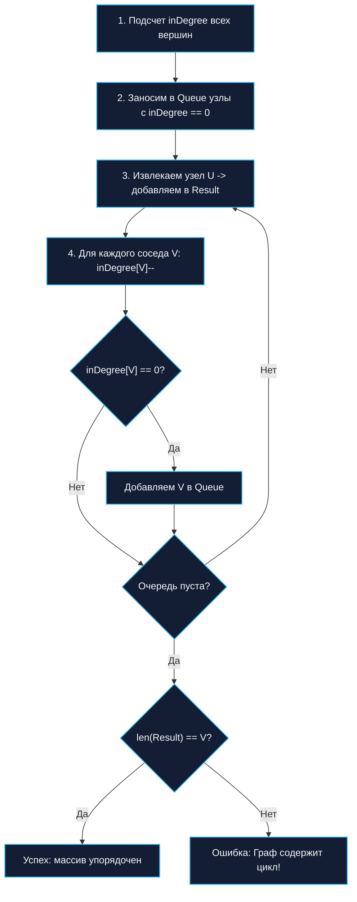

В предыдущих статьях мы детально разобрали фундаментальные алгоритмы исследования графов: послойный поиск в ширину ([[2. Поиск в ширину BFS]]) и глубокий поиск по ветвям ([[3. Поиск в глубину DFS]]). Эти алгоритмы универсальны, но в реальной инженерной практике мы постоянно сталкиваемся с особенным классом структур — **Направленными ациклическими графами (DAG — Directed Acyclic Graph)**.

Представьте, что вы разрабатываете собственный аналог утилиты `make`, движок распределенных CI/CD пайплайнов, планировщик задач Kubernetes или систему разрешения зависимостей в пакетном менеджере (как `go mod`). Перед вами сотни артефактов, микросервисов или пакетов, жестко связанных отношениями предшествования:
- Нельзя скомпилировать бинарник `API`, пока не собраны библиотеки `DB` и `Logger`.
- Нельзя стартовать миграции базы данных, пока не прочитан файл конфигурации `Config`.
- Нельзя развернуть приложение в облаке, пока не пройдены модульные тесты и не собран Docker-образ.

Как упорядочить все эти разнородные задачи в плоский, строго последовательный конвейер выполнения, не нарушив ни одной зависимости? 

Эту задачу решает **Топологическая сортировка**.

---

## Что такое топологическая сортировка?

**Топологическая сортировка** — это линейное упорядочивание вершин ориентированного графа, при котором для каждого направленного ребра из узла $U$ в узел $V$ ($U \to V$), узел $U$ всегда строго предшествует узлу $V$ в результирующем массиве.

> [!IMPORTANT]
> **Железное правило топологии:** Топологическая сортировка математически возможна **только** для графов без ориентированных циклов (DAG). Если модуль `A` зависит от `B`, а модуль `B` прямо или косвенно зависит от `A` — линейный порядок построить невозможно: наступает взаимная блокировка (**Deadlock / Import Cycle**).



Для графа зависимостей выше правильный (и единственный) порядок сборки: `Config -> Logger -> Database -> API`.

В Computer Science существует два классических алгоритмических подхода к топологической сортировке. Бэкенд-инженер должен владеть обоими, так как они имеют разный профиль нагрузки на железо.

---

## Способ 1: Алгоритм Кана (Kahn's Algorithm) — Выбор Архитектора

Алгоритм Кана (1962 год) базируется на элегантной концепции **Входящей степени (In-degree)**.  
Входящая степень узла — это количество входящих в нее ребер (то есть число неразрешенных входящих зависимостей, которые должны быть завершены *до* начала работы над $V$).

Если $\text{In-degree}(V) = 0$, это означает, что у задачи $V$ нет никаких предварительных условий. Ее можно запускать прямо сейчас!

### Механика (Пошагово):
1. Вычисляем плоский массив входящих степеней `inDegree` для всех вершин графа за $O(V + E)$.
2. Находим все узлы с `inDegree == 0` и помещаем их в Очередь (Queue).
3. Пока очередь не пуста:
   - Извлекаем узел $U$ из очереди и добавляем его в итоговый массив `result`.
   - Для каждого исходящего соседа $V$ (ребро $U \to V$) «удаляем» зависимость: декрементируем `inDegree[V]--`.
   - Если счетчик `inDegree[V]` обнулился — все зависимости узла $V$ успешно удовлетворены! Отправляем $V$ в очередь.
4. **Валидация циклов:** Если длина массива `result` меньше общего количества вершин $V$ — **в графе присутствует цикл!**



### Mechanical Sympathy: Реализация без аллокаций в цикле

Алгоритм Кана идеально ложится на аппаратную архитектуру. Мы используем один плоский срез `[]int` для хранения степеней и один срез под очередь. Никакой рекурсии, безупречная локальность кэша процессора и нулевые паразитные аллокации в цикле обработки.

```go
package main

import (
	"errors"
)

var ErrCycleDetected = errors.New("граф содержит цикл топологическая сортировка невозможна")

// SparseGraph - список смежности на слайсах
type SparseGraph struct {
	adj [][]int
}

// KahnTopologicalSort выполняет сортировку за линейное время O(V + E).
func KahnTopologicalSort(graph *SparseGraph) ([]int, error) {
	V := len(graph.adj)
	inDegree := make([]int, V) // Плоский массив входящих степеней

	// 1. Подсчитываем входящие степени для всех узлов. O(V + E)
	for u := 0; u < V; u++ {
		for _, v := range graph.adj[u] {
			inDegree[v]++
		}
	}

	// 2. Инициализируем очередь узлами без зависимостей
	queue := make([]int, 0, V) // Преаллокация, чтобы избежать сдвигов
	for i := 0; i < V; i++ {
		if inDegree[i] == 0 {
			queue = append(queue, i)
		}
	}

	result := make([]int, 0, V)
	head := 0 // Указатель для чтения из очереди (Zero-allocation Queue)

	// 3. Основной цикл (подобно BFS)
	for head < len(queue) {
		current := queue[head]
		head++
		
		result = append(result, current)

		// Уменьшаем степень соседей
		for _, neighbor := range graph.adj[current] {
			inDegree[neighbor]--
			
			// Зависимостей не осталось — в очередь!
			if inDegree[neighbor] == 0 {
				queue = append(queue, neighbor)
			}
		}
	}

	// 4. Валидация на наличие циклов
	if len(result) != V {
		return nil, ErrCycleDetected
	}

	return result, nil
}
```

> [!tip] Собеседование: Параллельное исполнение задач
> **Вопрос:** Если вы пишете движок CI/CD пайплайнов, как алгоритм Кана поможет вам выполнять сборку пакетов **параллельно** в нескольких горутинах?  
> **Ответ:** В классическом DFS вы получаете просто линейный массив. А вот в алгоритме Кана все узлы, которые **одновременно** находятся в очереди на одной итерации, могут быть безопасно выполнены параллельно! Они не зависят друг от друга. Вы можете вычитывать всю очередь в Worker Pool горутин, ждать их завершения через `sync.WaitGroup`, а затем переходить к добавлению следующих разблокированных узлов.

---

## Способ 2: На базе DFS (Глубинный обход)

Второй подход опирается на модификацию Поиска в глубину. Мы спускаемся по цепочке зависимостей до самого «дна» — до узла, у которого больше нет исходящих ребер. Как только мы полностью исследовали узел и всё его поддерево (Post-order обход), мы помещаем его в стек или слайс результата.

Так как узлы на «дне» графа (листья, не требующие дальнейших шагов) выходят первыми, итоговую последовательность нужно **перевернуть (reverse)**, чтобы получить правильный прямой порядок выполнения.

### Механика и обнаружение циклов

Для гарантированной защиты от зацикливания мы применяем концепцию **трех цветов** из статьи [[3. Поиск в глубину DFS]]:
* `0` (White) — узел еще не исследован.
* `1` (Gray) — узел находится в текущем стеке вызовов (в процессе обхода потомков).
* `2` (Black) — узел и все его зависимости полностью обработаны.

Если при спуске мы натыкаемся на вершину цвета `1` (Gray) — перед нами обратное ребро (Back edge), свидетельствующее о фатальном цикле.

```go
// DFSTopologicalSort выполняет топологическую сортировку через обход в глубину.
func DFSTopologicalSort(graph *SparseGraph) ([]int, error) {
	V := len(graph.adj)
	colors := make([]uint8, V) // 0: White, 1: Gray, 2: Black
	result := make([]int, 0, V)

	var dfs func(node int) error
	dfs = func(node int) error {
		colors[node] = 1 // Отмечаем как "в работе" (Gray)

		for _, neighbor := range graph.adj[node] {
			if colors[neighbor] == 1 {
				return ErrCycleDetected // Цикл найден
			}
			if colors[neighbor] == 0 {
				if err := dfs(neighbor); err != nil {
					return err
				}
			}
		}

		colors[node] = 2 // Отмечаем как "завершенный" (Black)
		
		// ДОБАВЛЯЕМ В РЕЗУЛЬТАТ ТОЛЬКО НА ВЫХОДЕ ИЗ РЕКУРСИИ
		result = append(result, node)
		return nil
	}

	for i := 0; i < V; i++ {
		if colors[i] == 0 {
			if err := dfs(i); err != nil {
				return nil, err
			}
		}
	}

	// Переворачиваем массив (Reverse), так как зависимости 
	// добавлялись с конца (снизу вверх)
	for i, j := 0, len(result)-1; i < j; i, j = i+1, j-1 {
		result[i], result[j] = result[j], result[i]
	}

	return result, nil
}
```

> [!warning] Ловушка / Gotcha: Производительность рекурсии
> Хотя подход через DFS выглядит лаконично, в Highload-системах на Go (например, графы вычислений с миллионами нод) глубокая рекурсия вызовет аллокации для расширения стека горутины (`runtime.morestack`). Кроме того, алгоритм требует пост-обработки (переворота массива). Алгоритм Кана (через In-degree) в реальных бенчмарках работает стабильнее и безопаснее для кэша.

---

## Временная и пространственная сложность

Оба алгоритма (Кана и на базе DFS) демонстрируют идентичную теоретическую асимптотику:
* **Временная сложность:** $O(V + E)$ — инициализация массива степеней `inDegree` (или массива `colors`) требует одного прохода по вершинам и ребрам, и каждое ребро релаксируется ровно один раз.
* **Пространственная сложность:** $O(V)$ — память под хранение служебных массивов состояний (`inDegree`, `queue`, `colors`, `result`).

---

## Итог

1. **Топологическая сортировка** выстраивает узлы направленного ациклического графа (DAG) в строгую линию, не нарушая зависимостей "родитель -> ребенок".
2. **Алгоритм Кана (BFS-based):** Считает входящие ребра (In-degree) и обрабатывает "свободные" узлы через очередь. Идеален для распараллеливания пулов задач. Работает in-place на плоских массивах.
3. **DFS-based:** Спускается на "дно" зависимостей и собирает стек с конца. Требует защиты от циклов методом "Трех цветов" и переворота итогового массива.
4. Если алгоритм не может выдать массив длиной $V$ (или встречает "серый" узел), значит в графе **Deadlock (Цикл)**.

До сих пор мы рассматривали графы, где все ребра равнозначны (расстояние или вес ребра равны единице). Но в реальном мире сетевой пакет до Нью-Йорка идет 100 мс, а до соседнего стойки в дата-центре — 0.1 мс. Чтобы находить оптимальные маршруты в графах с разными весами ребер, мы переходим к тяжелой артиллерии. Следующая статья: [[5. Кратчайшие пути. Алгоритм Дейкстры]].