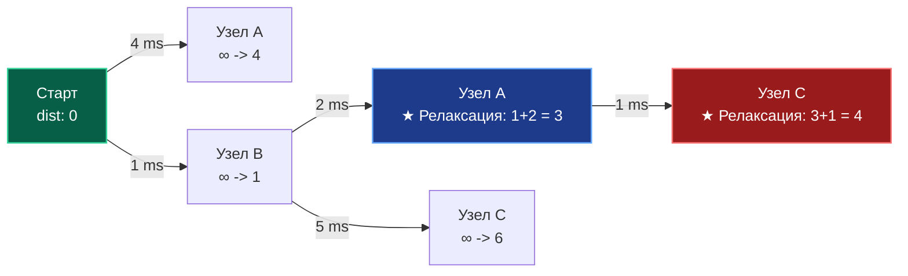

В статье [[2. Поиск в ширину BFS]] мы научились находить кратчайший путь в графе, опираясь на фундаментальное допущение: каждое ребро равнозначно, а его длина или стоимость условно принята за единицу ($1$).

Но в реальном инженерном мире и распределенных системах ребра никогда не бывают равноценны:
- Сетевой пакет до соседнего сервера в той же стойке дата-центра долетает за $0.1$ мс.
- Пакет до сервера на другом континенте через трансатлантический оптоволоконный кабель идет $150$ мс.

Если в такой топологии запустить классический BFS, он доверчиво выберет маршрут из одного прямого ребра с задержкой $150$ мс, проигнорировав обходной маршрут из трех локальных узлов по $0.1$ мс (в сумме $0.3$ мс). По количеству хопов путь длиннее, но по времени — в $500$ раз быстрее!

Для поиска оптимального маршрута в сетях, где ребра имеют **вес (стоимость, задержку, дистанцию)**, применяется один из величайших алгоритмов в истории Computer Science — **Алгоритм Дейкстры (Dijkstra's Algorithm)**, созданный Эдсгером Дейкстрой в 1956 году.

---

## Механика алгоритма: Жадная стратегия и Релаксация

Алгоритм Дейкстры относится к классическому семейству **жадных алгоритмов (Greedy)**. На каждом шаге он принимает локально оптимальное решение: выбирает среди всех еще не обработанных окончательно вершин ту, текущее расстояние до которой от старта минимально, и пытается через нее улучшить путь до всех ее смежных соседей.

Процесс «улучшения» оценки расстояния до вершины называется **Релаксацией (Relaxation)**.

### Как это работает:

1. Создаем массив расстояний `dist` от стартовой вершины до всех остальных. Изначально `dist[start] = 0`, а для всех остальных — бесконечность `+∞`.
2. Помещаем стартовую вершину в **Очередь с приоритетом (Min-Heap)**.
3. Пока очередь не пуста:
    - Извлекаем вершину $U$ с минимальным текущим расстоянием.
    - Если мы уже нашли для нее путь короче (устаревшая запись в очереди), пропускаем.
    - Проходим по всем соседям $V$ вершины $U$.
    - **Релаксация:** Если расстояние до $U$ плюс вес ребра $(U \to V)$ меньше, чем известное расстояние до $V$, то мы обновляем `dist[V]` и кладем $V$ в очередь.



_На диаграмме:_ Жадный выбор сначала идет в узел `B` (вес $1$). Оттуда алгоритм релаксирует путь в `A` (новый вес $1 + 2 = 3$, что меньше прежнего прямого пути $4$). Затем через `A` релаксируется узел `C` (вес $3 + 1 = 4$, что лучше прямого перехода из `B` с весом $6$).

---

## Mechanical Sympathy: Очередь с приоритетом

Почему мы не можем использовать простую очередь FIFO, как в BFS?

Если использовать обычный срез или список, то для поиска вершины с минимальным текущим расстоянием нам придется на каждой итерации сканировать все оставшиеся вершины за линейное время $O(V)$. Итоговая сложность алгоритма составит неприемлемые для highload $O(V^2)$ — на графе в миллион узлов сервер просто зависнет.

Нам необходима структура данных, способная извлекать минимум за логарифмическое время $O(\log V)$. Это **Бинарная куча (Min-Heap)**, которую мы детально разбираем в статье [[3. Очередь с приоритетом]].

> [!info] Под капотом: Fibonacci Heap vs Binary Heap
> В академических учебниках пишут, что Дейкстру нужно реализовывать на Фибоначчиевой куче, что дает теоретическую сложность $O(E + V \log V)$.
> 
> **В реальном Highload это миф.** Фибоначчиева куча — это сложная структура на указателях. Она страдает от промахов кэша (Cache Misses) и аллокаций.
> 
> На практике обычная Бинарная куча (реализованная поверх плоского слайса) работает в разы быстрее благодаря идеальной **пространственной локальности (Spatial Locality)**. Аппаратный Prefetcher процессора легко "проглатывает" слайс, обеспечивая сложность $O(E \log V)$ при минимальных реальных наносекундах.

---

## Реализация на Go (Production-Ready)

В стандартной библиотеке Go доступен пакет `container/heap`. Чтобы задействовать встроенную кучу, необходимо реализовать интерфейс `heap.Interface`.

```go
package main

import (
	"container/heap"
	"math"
)

// Edge представляет направленное взвешенное ребро
type Edge struct {
	To     int
	Weight int // Для реальных задач лучше int64 или float64
}

// Graph - список смежности
type Graph struct {
	Adj [][]Edge
}

// Item - элемент для очереди с приоритетом
type Item struct {
	Node int
	Dist int
}

// Обертка для реализации container/heap
type MinHeap []Item

func (h MinHeap) Len() int           { return len(h) }
func (h MinHeap) Less(i, j int) bool { return h[i].Dist < h[j].Dist } // Min-Heap
func (h MinHeap) Swap(i, j int)      { h[i], h[j] = h[j], h[i] }

// Push и Pop используют пустой интерфейс (any), что вызывает Boxing.
func (h *MinHeap) Push(x any) {
	*h = append(*h, x.(Item))
}

func (h *MinHeap) Pop() any {
	old := *h
	n := len(old)
	item := old[n-1]
	*h = old[0 : n-1]
	return item
}

// Dijkstra возвращает массив кратчайших расстояний от start до всех узлов
func Dijkstra(g *Graph, start int) []int {
	V := len(g.Adj)
	dist := make([]int, V)
	
	// Инициализируем расстояния "бесконечностью"
	for i := range dist {
		dist[i] = math.MaxInt32 
	}
	dist[start] = 0

	pq := &MinHeap{}
	heap.Init(pq)
	heap.Push(pq, Item{Node: start, Dist: 0})

	for pq.Len() > 0 {
		// Извлекаем ближайшую вершину
		current := heap.Pop(pq).(Item)
		u := current.Node

		// Важнейшая оптимизация: ленивое удаление (Lazy Deletion).
		// Поскольку мы можем добавить одну вершину в очередь несколько раз
		// (с улучшенным расстоянием), мы игнорируем "устаревшие" записи.
		if current.Dist > dist[u] {
			continue
		}

		// Релаксация соседей
		for _, edge := range g.Adj[u] {
			v := edge.To
			weight := edge.Weight

			if dist[u]+weight < dist[v] {
				dist[v] = dist[u] + weight
				// Добавляем обновленный путь в очередь
				heap.Push(pq, Item{Node: v, Dist: dist[v]})
			}
		}
	}

	return dist
}
```

> [!warning] Ловушка / Gotcha: Интерфейсы и Boxing в Go
> Стандартный `container/heap` в Go принимает `any` (`interface{}`). При каждом вызове `Push/Pop` наша структура `Item` оборачивается в интерфейс (**Boxing**) и аллоцируется в куче (Escape Analysis). Для графов с миллионами ребер это создаст гигантский GC Churn.
> 
> **Решение уровня Senior:** В Go 1.18+ для хардкорных оптимизаций пишут свою кастомную дженерик-кучу (Generic Heap), которая работает строго со слайсом структур `[]Item`, минуя интерфейсы и полностью избавляясь от аллокаций в цикле.

---

## Паттерны с собеседований

### Восстановление пути

Как и в BFS, чтобы не просто узнать итоговую дистанцию в $150$ мс, но и восстановить точную цепочку хопов (какие шлюзы и маршрутизаторы обошел пакет), нам необходим вспомогательный массив предков: `parent []int`.  
При каждой успешной релаксации (`dist[u] + weight < dist[v]`) мы перезаписываем:
```go
parent[v] = u
```
После завершения алгоритма путь от источника к цели раскручивается с конца в обратном направлении.

### Несколько конечных точек (Multiple Targets)

Классический алгоритм Дейкстры решает задачу **Single-Source Shortest Path** — поиск кратчайших расстояний от одной заданной вершины ко всем остальным вершинам графа.

Если же вам требуется найти путь строго до одной определенной целевой вершины `target`, вы можете безопасно завершить работу функции (`return dist[target]`) ровно в тот момент, когда узел `target` был **извлечен из очереди** с помощью `heap.Pop`.

> [!NOTE]
> Извлечение вершины из Min-Heap строго математически гарантирует, что более короткого пути к ней уже не существует. Добавление вершины в кучу такой гарантии не дает!

---

## Ахиллесова пята Дейкстры: Отрицательные веса

Алгоритм Дейкстры опирается на фундаментальную аксиому: **добавление нового ребра к пути может только увеличить (или не изменить) его суммарный вес**. В физическом мире это безусловно верно: невозможно проехать по шоссе и уменьшить пробег на одометре автомобиля.

Однако в распределенных абстрактных системах (финансовые транзакции, кешбэк, арбитраж курсов криптовалют, алгоритмы сжатия данных) веса ребер могут быть отрицательными.

Если в графе присутствует **отрицательное ребро**, жадная стратегия Дейкстры бесповоротно разрушается: вершина, извлеченная из кучи и объявленная «финально вычисленной», может позже получить еще более дешевый путь «из прошлого», если мы пройдем через ветку с отрицательным весом. Алгоритм либо выдаст неверный результат, либо, при наличии **отрицательного цикла**, зациклится бесконечно в попытке бесконечно уменьшать дистанцию.

---

## Итог

1. **Алгоритм Дейкстры** — индустриальный стандарт для поиска кратчайших путей во взвешенных графах без отрицательных ребер.
2. Основан на принципе **жадного выбора** и постоянной **релаксации** соседей.
3. **Механическая симпатия (Mechanical Sympathy):** Использование плоской бинарной кучи (слайса) дает лучшую производительность благодаря попаданию в кэш процессора.
4. В Go стандартный `container/heap` вызывает аллокации из-за интерфейсов. В Highload-проектах используйте дженерики для кастомной кучи.

Что делать, если в нашей системе могут возникать "отрицательные стоимости" (например, скидки на маршрут или энергетически выгодные переходы)? Нам нужен алгоритм, который откажется от жадности и проверит все возможные варианты. Об этом — в следующей статье: [[6. Алгоритм Беллмана Форда]].