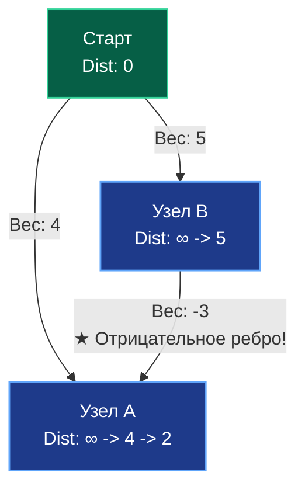
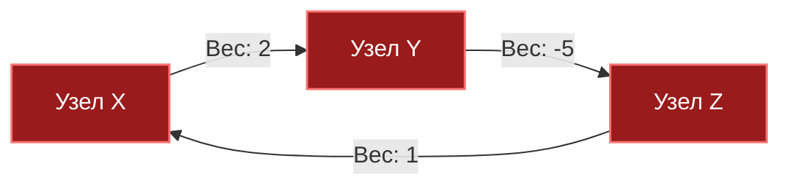

В статье [[5. Кратчайшие пути. Алгоритм Дейкстры]] мы разобрали эталонный способ навигации по взвешенным графам. Алгоритм Дейкстры быстр, элегантен и прекрасно ложится в процессорный кэш благодаря бинарной куче. 

Но у Дейкстры есть фундаментальная «Ахиллесова пята»: он математически опирается на жадную стратегию и **бесповоротно ломается при наличии ребер с отрицательными весами**. 

В реальной бэкенд-разработке (особенно в финтехе, логистике, маршрутизации телекоммуникаций и игровых движках) отрицательные веса — это не аномалия, а естественная модель бизнес-логики:
- Программа лояльности банка начисляет кэшбэк за оплату через определенный платежный шлюз (стоимость транзакции становится отрицательной).
- Электромобиль в симуляторе логистики спускается с перевала и заряжает батарею благодаря рекуперативному торможению (расход энергии отрицательный).
- Арбитражный робот на криптобирже ищет цепочки конвертации валют с выходом в плюс.

Чтобы надежно находить кратчайшие пути в таких условиях, нам приходится отказаться от жадности и обратиться к парадигме динамического программирования. Встречайте **Алгоритм Беллмана-Форда (Bellman-Ford Algorithm)**, разработанный Ричардом Беллманом и Лестером Фордом в конце 1950-х годов.

---

## Механика алгоритма: Тотальная Релаксация

Если Дейкстра осторожно выбирает одну ближайшую вершину и релаксирует только ее непосредственных соседей, то Беллман-Форд действует прямолинейно и бескомпромиссно (Brute-Force подход): он берет **абсолютно все ребра графа** и пытается выполнить операцию релаксации для каждого из них.

И он повторяет этот глобальный проход не один раз, а ровно **$V - 1$ раз**, где $V$ — общее число вершин графа.

### Почему именно $V - 1$?

Это фундаментальное топологическое свойство графов. Любой простой кратчайший путь между двумя вершинами (путь без циклов) может содержать **максимум $V - 1$ ребер** (по принципу Дирихле: путь из $V$ вершин содержит ровно $V - 1$ соединяющее звено).

На первой итерации алгоритм гарантированно находит корректные кратчайшие пути длиной в 1 ребро. На второй — длиной в 2 ребра, и так далее. Прогнав релаксацию по всем ребрам $V - 1$ раз, мы математически гарантируем, что минимальные расстояния «растекутся» от стартовой вершины ко всем остальным узлам графа, даже если оптимальный маршрут замысловато петляет через всю сеть.



*В Дейкстре узел A был бы извлечен с весом 4 и "закрыт". Беллман-Форд пройдется по ребрам снова, увидит путь `Старт -> B -> A` (вес 5 - 3 = 2) и корректно обновит узел A.*

---

## Отрицательные циклы (Negative Cycles)

Самая опасная угроза в графах с отрицательными весами — это **отрицательный цикл (Negative Cycle)**: замкнутый контур, сумма весов ребер которого строго меньше нуля ($< 0$).

Если в графе существует такой цикл, само понятие «кратчайшего пути» физически теряет смысл: пакет или транзакция могут бесконечно нарезать круги по этой петле, уменьшая суммарную стоимость маршрута до $-\infty$.


*Сумма весов цикла: $2 + (-5) + 1 = -2$. С каждым витком расстояние уменьшается на $2$. Путь уходит в $-\infty$.*

Беллман-Форд — единственный из классических алгоритмов, способный **найти и сообщить об отрицательном цикле**. 

Для этого после обязательных $V - 1$ раундов релаксации выполняется контрольный **$V$-й проход**. Если на $V$-м проходе хоть одно расстояние между вершинами всё ещё удается уменьшить — значит, в графе гарантированно присутствует отрицательная бесконечная петля!

---

## Mechanical Sympathy: Триумф Списка Ребер

В статье [[1. Представление графов]] мы отмечали, что Список ребер (Edge List) практически непригоден для локальной навигации. Алгоритм Беллмана-Форда — это то самое триумфальное исключение, где список ребер раскрывается во всей мощи.

Для работы Беллмана-Форда не нужно знать локальных соседей конкретной вершины. На каждом шаге нам требуется лишь последовательно просканировать **абсолютно все ребра**.
- Если хранить граф как список смежности (слайс слайсов), процессор будет вынужден непрерывно прыгать по разрозненным кускам памяти (Pointer Chasing).
- Если хранить граф как плоский массив структур `[]Edge`, мы получаем непрерывный поток данных. Это праздник для аппаратного Prefetcher-а процессора x86-64 / ARM64: ребра загружаются в L1-кэш целыми линиями по 64 байта без единого промаха!

**Парадокс производительности:**  
Теоретическая сложность Беллмана-Форда равна $O(V \times E)$. Для графа на $10\,000$ вершин и $50\,000$ ребер это $\approx 500$ миллионов элементарных операций. Звучит пугающе. Однако на практике, поскольку внутреннее тело цикла представляет собой линейный проход по компактному срезу `[]Edge` с безупречной кэш-локальностью, оптимизирующий компилятор Go и процессорный конвейер выполняют этот расчет за считанные миллисекунды.

---

## Production-Ready реализация на Go

```go
package main

import (
	"errors"
	"math"
)

// ErrNegativeCycle возвращается, если граф не имеет решения
var ErrNegativeCycle = errors.New("граф содержит цикл с отрицательным весом")

// Edge представляет направленное взвешенное ребро для плоского списка
type Edge struct {
	From   int
	To     int
	Weight int64 // Используем int64 для избежания переполнений сумм
}

// BellmanFord возвращает массив кратчайших расстояний от startNode
func BellmanFord(edges []Edge, V int, startNode int) ([]int64, error) {
	if V == 0 || startNode < 0 || startNode >= V {
		return nil, nil // Или другая обработка ошибок
	}

	dist := make([]int64, V)
	for i := range dist {
		// Используем MaxInt64, но оставляем запас, 
		// чтобы сложение с весом не вызвало переполнение (overflow).
		// Надежнее использовать флаг/bool, но для скорости берут константу.
		dist[i] = math.MaxInt64 / 2 
	}
	dist[startNode] = 0

	// 1. Основная фаза: V-1 итераций релаксации
	for i := 0; i < V-1; i++ {
		updated := false // Оптимизация: если за проход ничего не обновилось, мы закончили!
		
		// Идеальный линейный скан памяти (Cache Friendly)
		for _, edge := range edges {
			u, v, w := edge.From, edge.To, edge.Weight
			
			// Если до узла u мы еще не дошли, не пытаемся от него релаксировать
			if dist[u] != math.MaxInt64/2 && dist[u]+w < dist[v] {
				dist[v] = dist[u] + w
				updated = true
			}
		}
		
		// Если массив стабилизировался досрочно, экономим такты CPU
		if !updated {
			break
		}
	}

	// 2. Фаза детекции: контрольный V-ый проход
	for _, edge := range edges {
		u, v, w := edge.From, edge.To, edge.Weight
		if dist[u] != math.MaxInt64/2 && dist[u]+w < dist[v] {
			return nil, ErrNegativeCycle
		}
	}

	return dist, nil
}
```

> [!warning] Ловушка / Gotcha: Арифметика с бесконечностью
> Если вы инициализируете массив расстояний значением `math.MaxInt64`, а затем прибавите к нему отрицательный вес `w`, произойдет Integer Overflow, и `dist[v]` внезапно станет гигантским отрицательным числом (например, `-9223372036854775800`). Алгоритм решит, что нашел невероятно короткий путь! 
> Именно поэтому мы:
> 1. Инициализируем `dist` константой с запасом (`math.MaxInt64 / 2`).
> 2. Строго проверяем, была ли вообще достигнута вершина `From`: `if dist[u] != math.MaxInt64/2`.

---

## Паттерны с собеседований: Арбитраж валют (FAANG)

Если вы проходите собеседование в финтех или FAANG, вам почти гарантированно дадут задачу на **Поиск валютного арбитража**.

**Суть задачи:**  
Дана таблица обменных курсов между валютами (например, USD $\to$ EUR $\to$ JPY $\to$ USD). Возможно ли обменять $100$ долларов так, чтобы, пройдя по цепочке обменников, получить на выходе $102$ доллара?

**Как это элегантно сводится к алгоритму Беллмана-Форда:**
1. Цепочка обменов — это мультипликативная последовательность: $V_1 \times V_2 \times V_3 > 1$.
2. Однако все графовые алгоритмы поиска путей умеют только *складывать* веса ребер, а не перемножать их.
3. Вспоминаем школьную математику: логарифм произведения равен сумме логарифмов!  
   $$\log(a \times b) = \log(a) + \log(b)$$
4. Поскольку мы ищем максимальную прибыль (то есть максимальное произведение), а алгоритмы ищут минимум, мы инвертируем знак логарифма: $-\log(a)$.
5. **Итог:** Арбитраж существует тогда и только тогда, когда в графе, где веса ребер равны $-\log(exchange\_rate)$, существует **отрицательный цикл**. Мы сводим сложную экономическую задачу к стандартному вызову функции `BellmanFord` и проверке возвращенной ошибки `ErrNegativeCycle`!

---

## Итог

1. **Алгоритм Беллмана-Форда** — это динамическое программирование для поиска кратчайших путей (Single-Source Shortest Path) в графах с **отрицательными весами**.
2. Его архитектурная суперсила — способность находить **Отрицательные циклы**.
3. Сложность составляет $O(V \times E)$, что хуже Дейкстры. Но благодаря использованию плоского массива ребер (Edge List), алгоритм имеет превосходную кэш-локальность и на средних графах работает молниеносно.
4. Оптимизация с флагом `updated` позволяет алгоритму досрочно завершиться за $O(E)$, если граф оказался простым.

И Дейкстра, и Беллман-Форд решают задачу поиска путей **от одной точки** до всех остальных. Но что, если вы пишете распределенный роутер, и вам нужно заранее рассчитать матрицу расстояний **от каждого узла до каждого**? Запускать Беллмана-Форда $V$ раз — это $O(V^2 E)$, слишком долго. 

Для этой задачи существует шедевр динамического программирования, состоящий всего из пяти строк кода, но заставляющий процессоры потеть на $100\%$. Разберем его в следующей статье: [[7. Алгоритм Флойда Уоршелла]].