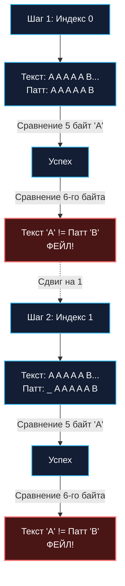

Поиск подстроки в тексте — это одна из самых частых и ресурсоемких операций в бэкенд-разработке. Мы непрерывно парсим URL-адреса и заголовки HTTP, ищем токены авторизации, фильтруем терабайты логов в Elasticsearch/Loki, отслеживаем маркеры в сетевых пакетах и парсим JSON-пейлоады. В стандартной библиотеке Go для этого есть вездесущие функции `strings.Index()` и `strings.Contains()`. 

Но как они устроены под капотом? Почему на одних данных стандартный поиск отрабатывает за доли наносекунды, а на других — заставляет процессор лихорадочно сбрасывать конвейер и греть воздух? Прежде чем перейти к алгоритмическим шедеврам с предвычислением таблиц сдвигов, нам необходимо досконально понять физику строк в Go и базовый (наивный) алгоритм поиска.

---

## Строки в Go и свойство UTF-8

Для начала вспомним, как строка представлена в рантайме Go (структура `StringHeader` из пакета `reflect`, которая в новейших версиях компилятора заменена внутренним типом `internal/abi.StringHeader`, но физическое представление в памяти осталось неизменным):

```go
type StringHeader struct {
	Data uintptr // Указатель на underlying массив байт
	Len  int     // Длина в БАЙТАХ (не в символах!)
}
```

Строка в Go — это строго неизменяемый (read-only) слайс байтов. 

По умолчанию исходный код и строковые литералы в Go кодируются в **UTF-8**. Это означает, что один видимый пользователю символ (в терминологии Go — руна, `rune`) имеет переменную длину и может занимать от 1 до 4 байтов.

> [!tip] Собеседование
> **Вопрос:** Если мы ищем подстроку `"мир"` в строке `"привет мир"`, нужно ли нам предварительно конвертировать обе строки в слайс рун `[]rune`, чтобы случайно не «разрезать» многобайтовый UTF-8 символ посередине?  
> **Ответ:** **Категорически нет, это грубейшая ошибка и колоссальная паразитная аллокация памяти!**  
> Кодировка UTF-8 обладает гениальным математическим свойством: **Самосинхронизация (Self-synchronization)** и **Префиксность**. Никакая последовательность байтов валидного UTF-8 символа не может оказаться частью другого символа или совпасть на стыке двух соседних рун (старшие биты каждого байта строго регламентируют его статус: ведущий байт или байт продолжения). Поэтому мы можем абсолютно безопасно и предельно быстро искать подстроку **побайтово**, полностью игнорируя границы рун!

---

## Наивный поиск (Brute Force)

Наивный алгоритм (Naive String Matching) предельно прямолинеен: мы прикладываем Паттерн к Тексту, начиная с нулевой позиции. Если текущий байт совпадает, мы сравниваем следующий байт Паттерна. Если же обнаружено несовпадение — мы сдвигаем Паттерн относительно Текста ровно на **1 позицию вправо** и начинаем сравнение Паттерна с самого первого символа.



### Идиоматичная реализация на Go

```go
package stringsearch

// NaiveSearch ищет первое вхождение паттерна в текст и возвращает индекс.
// Возвращает -1, если подстрока не найдена.
func NaiveSearch(text, pattern string) int {
	n := len(text)
	m := len(pattern)

	// Если паттерн пустой, по конвенции Go - возвращаем 0
	if m == 0 {
		return 0
	}
	
	// Если паттерн длиннее текста, он точно не поместится
	if m > n {
		return -1
	}

	// Идем по тексту. Нам нет смысла идти дальше, чем n - m
	for i := 0; i <= n-m; i++ {
		match := true
		
		// Внутренний цикл проверки совпадения
		for j := 0; j < m; j++ {
			if text[i+j] != pattern[j] {
				match = false
				break // Обнаружено несовпадение, прерываем внутренний цикл
			}
		}
		
		if match {
			return i // Полное совпадение найдено
		}
	}

	return -1
}
```

---

## Mechanical Sympathy: Худший случай и Branch Prediction

Асимптотическая сложность наивного поиска:
* **Лучший случай:** $O(N)$ (когда совпадение найдено в самом начале, либо первый же байт паттерна не совпадает с большинством символов текста, вызывая мгновенный сдвиг за 1 шаг).
* **Худший случай:** $O(N \cdot M)$.

Давайте посмотрим на Худший случай глазами кремниевого конвейера процессора. Представьте обработку цепочек ДНК, бинарных протоколов или специально сгенерированных строк:

`Текст = "AAAAAAAAAAAAAAAAAAAAAB"`  
`Паттерн = "AAAAAB"`

В этой конфигурации на каждом шаге процессор успешно выполняет 5 сравнений подряд и спотыкается на 6-м.

Что в этот момент происходит внутри **Branch Predictor (Предсказателя ветвлений)** CPU?  
В строке `if text[i+j] != pattern[j]` блок предсказания фиксирует, что условие выхода 5 раз подряд ложно (символы совпадают). Процессорный конвейер спекулятивно заполняется инструкциями следующих итераций. Но на 6-м байте ветвление внезапно срабатывает: происходит **Branch Misprediction**! Процессор вынужден аннулировать спекулятивно декодированные инструкции, сбросить конвейер (потеряв от 15 до 20 тактов), откатиться назад, сдвинуться всего на 1 байт и начать ту же самую мучительную процедуру заново.

---

## Как устроен `strings.Index` в Go?

Если наивный поиск демонстрирует катастрофическую деградацию $O(N \cdot M)$ в худшем сценарии, означает ли это, что стандартный `strings.Index` в Go реализован через продвинутые алгоритмы вроде Кнута-Морриса-Пратта (KMP)?

**Парадокс: В 90% реальных вызовов Go использует именно Наивный поиск!** Но делает это на уровне специализированных векторных инструкций микропроцессора.

> [!info] Под капотом
> Если вы посмотрите исходный код пакета `strings` и низкоуровневого пакета `internal/bytealg`, вы увидите, что функция `Index` вызывает платформозависимые ассемблерные функции.
> 
> На современных процессорах x86-64/ARM64 Go использует **SIMD-инструкции (Single Instruction, Multiple Data)**, такие как AVX2 и NEON.
> Вместо того чтобы сравнивать по 1 байту в цикле `for`, процессор может загрузить сразу **16 или 32 байта** текста в один широкий регистр и за **один такт (1 инструкцию PCMPEQB)** сравнить их с паттерном. 
> 
> Из-за этого "тупой" алгоритм $O(N \cdot M)$ на коротких и средних строках физически отрабатывает в десятки раз быстрее, чем сложные алгоритмы с их предвычислениями, хешами и таблицами сдвигов. Кеш L1 обожает последовательное чтение без прыжков по структурам памяти.

### Переключение на Rabin-Karp

Однако авторы рантайма Go прекрасно осведомлены об опасности алгоритмической уязвимости (Algorithmic Complexity Attack), когда злоумышленник шлет строки, вызывающие худший сценарий $O(N \cdot M)$, чтобы парализовать CPU вашего HTTP-сервера.

Поэтому внутри `strings.Index` встроен интеллектуальный предохранитель: если длина искомого паттерна превышает критический порог, или если наивный SIMD-поиск регистрирует слишком много неудачных откатов, **Go динамически на лету переключается на алгоритм Рабина-Карпа**.

(О том, как работает алгоритм Рабина-Карпа на скользящих хешах, мы подробно поговорим в статье [[3. Алгоритм Рабина Карпа]]).

---

## Итог и переход к умным алгоритмам

Наивный алгоритм (и его векторные SIMD-версии) — абсолютный чемпион для коротких и средних строк благодаря нулевому оверхеду на инициализацию структур данных и совершенной пространственной кэш-локальности (Spatial Locality).

Но инженерная зрелость требует понимания того, как победить худший случай чисто алгоритмически — без надежды на SIMD-расширения процессора.

Главный концептуальный порок наивного алгоритма состоит в том, что после обнаружения ошибки он **начисто забывает всё, что только что узнал о тексте**: он сдвигается всего на 1 байт и заново перепроверяет те же самые символы.

Можно ли, споткнувшись на несовпадении, мгновенно сдвинуть паттерн сразу на 5, 10 или 50 символов вперед, никогда не возвращая указатель по тексту назад?  
Да, можно! Именно этот прорыв совершили в 1970-х годах три выдающихся ученых. В следующей статье мы разберем первый строго линейный алгоритм поиска подстроки: [[2. Алгоритм Кнута Морриса Пратта]].