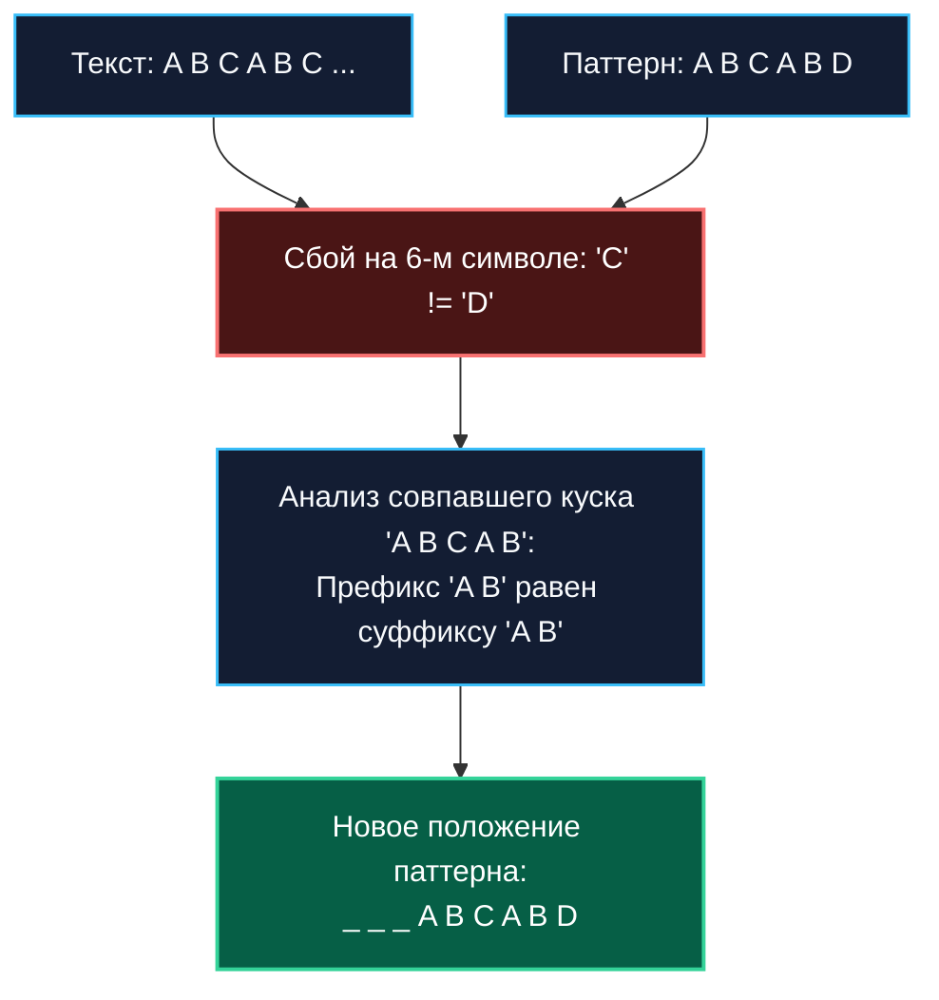

В прошлой статье [[1. Поиск подстроки]] мы детально разобрали наивный алгоритм поиска подстроки. Его фундаментальная инженерная проблема заключается в **алгоритмической амнезии**: наткнувшись на несовпадение в тексте, наивный цикл начисто забывает всё, что только что успешно прочитал, сдвигает паттерн всего на один символ вправо и покорно начинает проверку с нуля. Из-за этого в худшем случае (например, при поиске в ДНК-последовательностях или бинарных потоках) временная сложность деградирует до катастрофических $O(N \cdot M)$.

В 1970-х годах Дональд Кнут, Джеймс Моррис и Воан Пратт независимо друг от друга нашли математическое лекарство от этой амнезии. Они создали строгий алгоритм, который гарантированно находит все вхождения за линейное время **$O(N + M)$** в абсолютно любых, даже самых неблагоприятных условиях.

---

## Концепция: Использование уже известного

Главная идея алгоритма Кнута-Морриса-Пратта (KMP) формулируется предельно просто:  
**«Когда происходит несовпадение, мы точно знаем, какие символы паттерна успешно совпали с текстом до этой точки».**

Если мы заранее проанализируем внутреннюю симметрию паттерна, то в момент сбоя сможем безопасно сдвинуть паттерн сразу на несколько позиций вперед, не возвращая указатель по тексту назад и ни при каких условиях не рискуя пропустить искомое совпадение.

### Пример амнезии vs KMP

Представьте, что мы ищем паттерн `ABCABD` в тексте:

```
Текст:   A B C A B C ...
Паттерн: A B C A B D
```

Мы успешно совпали на подстроке `A B C A B`, но на 6-м символе произошел сбой (`C != D`):
* **Наивный алгоритм** сдвинет паттерн на 1 шаг вправо и начнет сравнивать символ `B` с `A`. Он выбросит в мусорную корзину ценнейшую информацию о совпадении первых пяти символов.
* **KMP** мгновенно анализирует совпавший фрагмент `A B C A B`. Он видит, что эта строка начинается на `A B` (префикс) и заканчивается на `A B` (суффикс). Значит, мы можем мгновенно совместить начальный префикс `A B` паттерна с уже проверенным суффиксом `A B` в тексте! Мы сдвигаем паттерн сразу на 3 позиции вперед и продолжаем проверку *без единого шага назад по тексту*.



---

## Магия KMP: Массив LPS ($\pi$-функция)

Чтобы в процессе сканирования текста алгоритм мгновенно определял, на сколько позиций сдвигать паттерн, ему необходима таблица переходов. Эта таблица вычисляется **предварительно (на этапе препроцессинга)** исключительно на основе самого паттерна — исходный текст для этого не требуется.

Эта шпаргалка называется **Массив LPS** (Longest Proper Prefix which is also Suffix) или **Префикс-функция** ($\pi$-функция).

Ячейка `LPS[i]` хранит длину самого длинного *собственного* префикса подстроки `pattern[0...i]`, который одновременно является её суффиксом.

> [!NOTE]
> **Собственный префикс** — это префикс, длина которого строго меньше длины самой подстроки. Для строки `A B A` префиксами являются `A` и `A B`, а суффиксами — `A` и `B A`. Их наибольшее совпадение — подстрока `A` длиной 1.

Давайте построим массив LPS для паттерна `A B A B A C A`:
* `A` $\to$ 0 (нет собственных префиксов)
* `A B` $\to$ 0
* `A B A` $\to$ 1 (префикс `A` равен суффиксу `A`)
* `A B A B` $\to$ 2 (префикс `A B` равен суффиксу `A B`)
* `A B A B A` $\to$ 3 (префикс `A B A` равен суффиксу `A B A`)
* `A B A B A C` $\to$ 0 (символ `C` ломает все накопленные симметрии)
* `A B A B A C A` $\to$ 1 (совпадает только символ `A`)

Итоговый массив LPS: `[0, 0, 1, 2, 3, 0, 1]`.  
Построение этой таблицы занимает строго $O(M)$ времени и требует $O(M)$ памяти.

---

## Идиоматичная реализация на Go

Реализация делится на две независимые фазы: препроцессинг паттерна (`buildLPS`) и сам линейный поиск (`KMP`). Поскольку UTF-8 допускает побайтовое сопоставление (см. [[1. Поиск подстроки]]), мы работаем со срезом байтов напрямую.

```go
package stringsearch

// buildLPS предварительно вычисляет массив LPS для паттерна
func buildLPS(pattern string) []int {
	m := len(pattern)
	lps := make([]int, m) // O-M- дополнительной памяти
	
	length := 0 // длина предыдущего самого длинного префикс-суффикса
	i := 1
	
	for i < m {
		if pattern[i] == pattern[length] {
			length++
			lps[i] = length
			i++
		} else {
			if length != 0 {
				// Если нет совпадения, но мы уже совпали частично,
				// мы не сбрасываем length в 0, а откатываемся по таблице LPS
				length = lps[length-1]
			} else {
				// Если совпадений нет вообще
				lps[i] = 0
				i++
			}
		}
	}
	return lps
}

// KMP возвращает все начальные индексы вхождений паттерна в текст
func KMP(text, pattern string) []int {
	var res []int
	n := len(text)
	m := len(pattern)

	if m == 0 {
		return res
	}
	if m > n {
		return res
	}

	// 1. Препроцессинг
	lps := buildLPS(pattern)

	// 2. Фаза поиска
	i := 0 // индекс для текста
	j := 0 // индекс для паттерна

	for i < n {
		if text[i] == pattern[j] {
			i++
			j++
		}

		if j == m {
			// Паттерн найден!
			res = append(res, i-j)
			// Сдвигаем j, опираясь на таблицу, чтобы найти следующие вхождения
			j = lps[j-1]
		} else if i < n && text[i] != pattern[j] {
			// Случился сбой
			if j != 0 {
				// Умный сдвиг паттерна: мы НЕ трогаем индекс i в тексте!
				j = lps[j-1]
			} else {
				// Если сбой на самом первом символе паттерна, просто идем дальше по тексту
				i++
			}
		}
	}

	return res
}
```

---

## Mechanical Sympathy: Время против Железа

> [!tip] Собеседование
> **Вопрос:** В фазе поиска у нас есть цикл `while` (или `for` без инкремента `i`), внутри которого индекс `j` может откатываться назад (строка `j = lps[j-1]`). Почему общая временная сложность поиска строго $O(N)$, а не $O(N^2)$?  
> **Ответ:** Это доказывается с помощью **Амортизированного анализа**. Индекс `j` может быть уменьшен *только* в том случае, если он ранее был увеличен. Увеличивается он строго синхронно с индексом текста `i` (`i++; j++`). Поскольку индекс `i` движется строго вперед и никогда не возвращается назад (ровно $N$ инкрементов), индекс `j` суммарно не может быть уменьшен больше чем $N$ раз за весь алгоритм. Суммарное количество элементарных операций ограничено $2N$, что асимптотически строго равно $O(N)$.

С математической точки зрения KMP безупречен. Но почему тогда он **не используется** в стандартной функции `strings.Index()` внутри runtime Go?

### Налог на KMP в реальном мире

1. **Аллокация памяти:** Наивный поиск работает за $O(1)$ памяти. KMP требует динамического выделения слайса: `lps := make([]int, m)`. В высоконагруженном сервисе вызовы поиска в цикле будут постоянно дергать `malloc` и нагружать Garbage Collector (GC Pressure).
2. **Промахи кэша (Cache Misses):** При несовпадении KMP читает ячейки по смещениям `j = lps[j-1]`. Это непредсказуемый для процессора паттерн памяти (Pointer Chasing), который сбивает аппаратный Prefetcher.
3. **Отсутствие SIMD-векторизации:** Современный микропроцессор x86-64 за 1 такт сравнивает 32 байта текста с помощью AVX2-инструкций. В KMP из-за пошаговой логики переходов мы вынуждены сравнивать байты по одному. На коротких и средних строках тупой векторный `Brute Force` физически рвет KMP в клочья.

---

## Где KMP абсолютно незаменим в Бэкенде?

Суперсила KMP раскрывается там, где у нас **физически нет возможности откатить указатель `i` назад**.

В наивном поиске при сбое мы возвращаемся по тексту на несколько байтов назад. Это требует, чтобы весь входной текст целиком лежал в оперативной памяти (в виде среза `[]byte` или строки).

Но что делать, если текст — это **бесконечный сетевой поток (`io.Reader`)**, входящий TCP-сокет или терабайтный лог-файл? Вы не можете «отмотать» TCP-сокет назад: прочитанные байты уже покинули буфер сетевой карты.

KMP идеален для потоковой обработки (**Streaming Data**):
- Указатель `i` в KMP **никогда не идет назад**. Он движется строго в одном направлении вместе со входящим потоком байтов.
- Вы можете сканировать входящий трафик на лету по одному байту (или чанками), скармливая их в автомат состояний KMP.
- Алгоритм мгновенно обнаружит маркер завершения заголовков (например, последовательность `\r\n\r\n` в HTTP/1.1) за константное $O(1)$ время на каждый байт, удерживая в памяти лишь крошечный массив `lps` и пару целочисленных регистров!

---

## Итог

1. **Сложность:** Гарантированное $O(N + M)$ по времени, $O(M)$ по памяти.
2. **Суть:** Предвычисление симметрии в паттерне для умных сдвигов при несовпадении.
3. **Hardware:** Проигрывает векторному наивному поиску на коротких строках из-за аллокаций и отсутствия SIMD-оптимизаций.
4. **Суперсила:** Указатель по тексту никогда не возвращается назад, что делает KMP идеальным алгоритмом для сканирования бесконечных потоков (`io.Reader`).

KMP полагается на глубокий структурный анализ строки. Но что, если мы не хотим анализировать каждый символ? Что, если мы превратим поиск строк в математику чисел, используя парадигму скользящего окна? Этот подход используется для поиска плагиата и дедупликации, и он встроен как "запасной парашют" прямо в стандартную библиотеку Go. Переходим к нему в следующей статье: [[3. Алгоритм Рабина Карпа]].