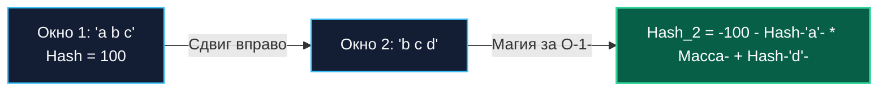

В предыдущих статьях мы подробно рассмотрели две противоположные концепции поиска подстроки: наивный алгоритм ([[1. Поиск подстроки]]), который сравнивает данные в лоб и страдает от амнезии, и алгоритм Кнута-Морриса-Пратта ([[2. Алгоритм Кнута Морриса Пратта]]), опирающийся на глубокий структурный анализ симметрии префиксов и суффиксов.

Алгоритм Рабина-Карпа, придуманный в 1987 году Ричардом Карпом и Майклом Рабином, предлагает совершенно иной, математически элегантный взгляд на задачу.

Что, если мы перестанем воспринимать строку как массив отдельных символов и превратим её в **одно большое число**? Если мы научимся вычислять это число для любого скользящего окна текста ровно за $O(1)$, поиск подстроки превратится в банальное и мгновенное сравнение двух целочисленных регистров в ALU процессора!

Этот подход открыл дорогу целому классу высокопроизводительных структур и алгоритмов, объединенных концепцией **Скользящего хеша (Rolling Hash)**.

---

## Концепция: Окно, которое катится

Основа алгоритма — хеш-функция. Сначала мы вычисляем числовой хеш от искомого паттерна (например, `"ABC"` $\to$ `123`).

Затем мы прикладываем окно длиной $M$ к самому началу текста и вычисляем хеш от первого среза текста.
- Если хеши не совпали — совпадения гарантированно нет! Мы сдвигаем окно вправо на 1 позицию.
- Но если мы будем вычислять классический хеш (например, SHA-256 или даже быстрый FNV) для каждого нового окна заново «с нуля», это займет $O(M)$ на каждый сдвиг, и суммарная сложность алгоритма останется равной $O(N \cdot M)$.

**Гениальность Рабина-Карпа заключается в Полиномиальном скользящем хеше.**  
Когда окно сдвигается на 1 символ вправо, состав окна меняется минимально: ровно один старый символ «выпадает» слева, а один новый символ «заходит» справа. Все остальные $M-1$ символов остаются на своих местах, лишь меняя свой весовой разряд!

Алгоритм берет хеш предыдущего окна, математически «отнимает» из него влияние ушедшего символа и «прибавляет» влияние нового. Это выполняется всего за **2-3 элементарные арифметические операции ($O(1)$)**, независимо от того, какова длина паттерна: 10 символов или 10 миллионов символов!



---

## Математика полиномиального хеша

Представим строку как позиционное число в системе счисления с основанием $P$ (где $P$ — простое число, большее размера обрабатываемого алфавита, например 31, 257 или 16777619).

Хеш для строки $S$ длины $M$ выражается классическим полиномом:

$$H = S[0] \cdot P^{M-1} + S[1] \cdot P^{M-2} + ... + S[M-1] \cdot P^0$$

Чтобы получить хеш следующего окна при сдвиге вправо на 1 позицию, нам требуется:
1. Умножить старый хеш на $P$ (это эквивалентно сдвигу всех разрядов влево на 1 позицию).
2. Вычесть величину $S_{old} \cdot P^M$ (удалить вклад самого левого символа, который теперь вывалился за границу окна).
3. Прибавить $S_{new}$ (добавить значение нового крайнего правого символа).

Каноническая формула пересчета:

$$H_{next} = H_{prev} \cdot P - S_{old} \cdot P^M + S_{new}$$

---

## Mechanical Sympathy: Как это оптимизировано в Go

В академических учебниках пишут, что все промежуточные полиномиальные вычисления обязаны производиться по модулю некоторого большого простого числа $Q$, чтобы избежать арифметического переполнения типов данных (Integer Overflow): $H \pmod Q$.

> [!info] Под капотом
> 
> Операция взятия остатка от деления (`%`) — одна из самых тяжелых для ALU процессора.
> 
> Если вы откроете исходники рантайма Go (файл `internal/bytealg/rabinkarp.go`), вы увидите, что там **нет никакого модуля**.
> 
> Go использует тип `uint32`. При переполнении этого типа процессор автоматически, аппаратно и совершенно бесплатно "обрезает" лишние старшие биты. Это математически эквивалентно операции по модулю $2^{32}$. Процессор делает это за **0 дополнительных тактов**.
> 
> В качестве множителя $P$ используется простое число `16777619` (FNV Prime).

---

## Идиоматичная реализация на Go

Ниже представлена production-ready реализация алгоритма Рабина-Карпа, в точности повторяющая архитектурную логику внутренней функции `strings.Index` при фоллбэке на длинных строках.

```go
package stringsearch

const primeRK = 16777619

// RabinKarp возвращает индекс первого вхождения паттерна в текст.
func RabinKarp(text, pattern string) int {
	n := len(text)
	m := len(pattern)

	if m == 0 {
		return 0
	}
	if m > n {
		return -1
	}

	// 1. Вычисляем P^m -множитель для удаления старого символа-
	// В Go это делается через uint32 для бесплатного модульного переполнения
	pow := uint32(1)
	for i := 0; i < m; i++ {
		pow *= primeRK
	}

	// 2. Вычисляем хеш паттерна и хеш первого окна текста
	var hashPat, hashText uint32 = 0, 0
	for i := 0; i < m; i++ {
		hashPat = hashPat*primeRK + uint32(pattern[i])
		hashText = hashText*primeRK + uint32(text[i])
	}

	// 3. Проверяем первое окно
	// ВАЖНО: Равенство хешей не гарантирует равенство строк -Коллизия-!
	if hashPat == hashText && text[:m] == pattern {
		return 0
	}

	// 4. Скользим окном по тексту
	for i := m; i < n; i++ {
		// Сдвигаем хеш:
		// Умножаем на P, добавляем новый символ, вычитаем старый
		hashText = hashText*primeRK + uint32(text[i]) - uint32(text[i-m])*pow

		// Проверяем совпадение
		if hashPat == hashText {
			// Обязательная проверка посимвольно из-за возможных коллизий
			if text[i-m+1:i+1] == pattern {
				return i - m + 1
			}
		}
	}

	return -1
}
```

> [!warning] Ловушка / Gotcha (Парадокс коллизий)
> 
> Поскольку мы работаем в пространстве $2^{32}$ (или даже $2^{64}$), разные строки могут дать одинаковый хеш.
> 
> Если злоумышленник знает, что вы используете Рабина-Карпа с множителем 16777619, он может специально сгенерировать такой текст, где **каждое окно будет давать коллизию** с вашим паттерном.
> 
> В таком случае алгоритму придется каждый раз вызывать медленную посимвольную проверку `text[...] == pattern`, и производительность деградирует до $O(N \cdot M)$.
> 
> Именно поэтому Рабин-Карп относится к рандомизированным алгоритмам типа **Лас-Вегас** (см. [[6. Randomized алгоритмы]]): он всегда дает точный ответ, но его время работы может зависеть от "везения" с коллизиями.

---

## Где Рабин-Карп абсолютно незаменим в Бэкенде?

Казалось бы, если существует теоретический риск коллизий, зачем вообще использовать этот алгоритм? Почему не предпочесть детерминированный KMP из предыдущей статьи?

Ответ кроется в **поиске множества паттернов одновременно (Multi-pattern Matching)**.

Представьте, что вы проектируете систему антиплагиата, парсер логов безопасности или Web Application Firewall (WAF). На вход поступает сырой HTTP-запрос, и вам необходимо проверить, не содержит ли он **одну из 10 000 запрещенных сигнатур** (известных векторов SQL-инъекций или XSS-атак).
- Если использовать KMP, вам придется запустить сканирование 10 000 раз подряд. Сложность составит неподъемные $O(10000 \cdot N)$.
- Рабин-Карп решает эту задачу с ошеломляющей элегантностью: вы предварительно считаете хеши для всех 10 000 сигнатур фиксированной длины и помещаете их в хеш-таблицу (или фильтр Блума, см. [[6. Bloom filter - вероятностная структура данных]]).
- Затем вы совершаете **всего один проход** скользящим окном по тексту. На каждом шаге вы за константное $O(1)$ проверяете наличие текущего `hashText` в множестве запрещенных хешей! Сложность одновременного поиска тысяч шаблонов становится **практически такой же, как поиск одного-единственного паттерна**!

> [!tip] Собеседование
> **Вопрос:** Почему в стандартной библиотеке `strings.Index` Go использует Рабина-Карпа как "запасной" алгоритм для длинных строк, а не KMP?  
> **Ответ:** Из-за аллокаций. KMP требует создания массива `lps` размером с паттерн. Для паттерна в 1 МБ потребуется выделить мегабайт памяти в куче. Рабин-Карп использует только две переменные `uint32` для своих математических вычислений, что означает строгие **Zero Allocations**. Для рантайма языка (который должен быть максимально легким и не дергать GC без повода) предсказуемая работа с кэшем CPU без выделения памяти важнее, чем защита от теоретической атаки коллизиями, которая в реальной жизни почти не встречается на длинных строках.

---

## Итог

1. **Сложность:** $O(N + M)$ в среднем случае, $O(N \cdot M)$ в худшем (при коллизиях).
2. **Суть:** Представление окна текста как полиномиального хеша и его пересчет за $O(1)$ при сдвиге (Rolling Hash).
3. **Mechanical Sympathy:** Использование переполнения `uint32` в Go позволяет избежать дорогих операций по модулю (`%`). Отсутствие аллокаций делает его любимчиком рантайма Go.
4. **Суперсила:** Мультипаттерновый поиск (Plagiarism Detection).

Рабин-Карп показывает, как превратить работу со строками в математику. Но существует еще один алгоритм, который объединяет геометрический подход к префиксам (как в KMP) с невероятной простотой реализации. Он строится на вычислении всего одного массива, который описывает "взгляд вперед". Переходим к нему в следующей статье: [[4. Z алгоритм]].