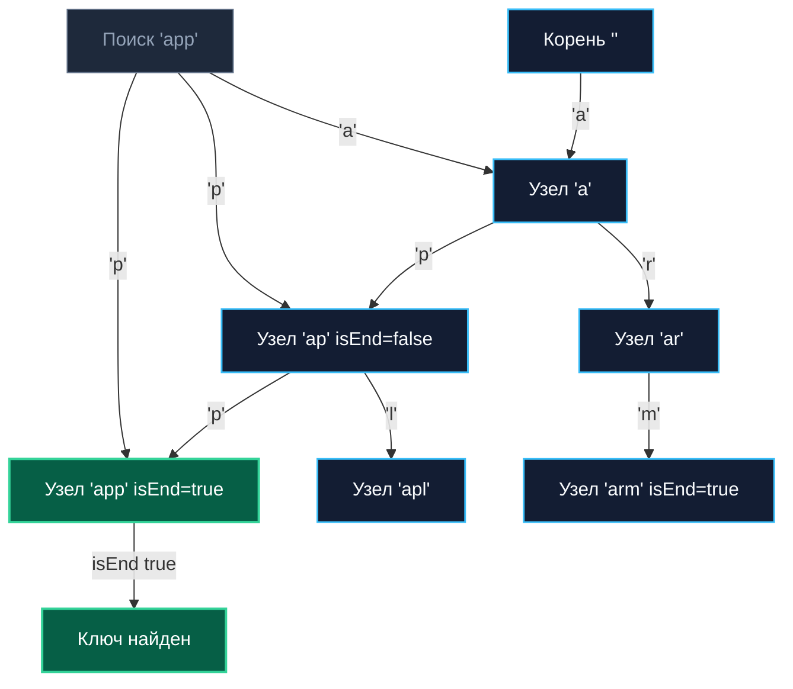

## Введение: Префиксная индексация без хеширования

Trie (префиксное дерево, от слова re**trie**val — извлечение) — это специализированная древовидная структура данных, спроектированная для эффективной работы со строковыми ключами. 

В отличие от стандартных хеш-таблиц (`map`) или сбалансированных деревьев поиска (AVL, Red-Black), вычислительная сложность базовых операций в Trie зависит **исключительно от длины запрашиваемой строки $L$**, а не от общего количества сохраненных в системе ключей $N$. Это гарантирует строгое $O(L)$ время на поиск, добавление и удаление, начисто исключая коллизии хеширования и внезапную деградацию производительности до $O(N)$ при неудачном распределении бакетов.

В высоконагруженном бэкенде Trie применяется там, где критически важна предсказуемая латентность (low p99 latency) и поддержка префиксных запросов:
* **Маршрутизация HTTP/API-гейтвеи**: матчинг путей `/api/v1/users`, `/api/v1/orders` за один проход по байтам запроса.
* **ACL и конфигурации**: мгновенная проверка прав доступа по префиксам ресурсов, матчинг сетевых CIDR-диапазонов в файрволах.
* **Автодополнение и поиск**: возврат всех возможных кандидатов продолжения при частичном вводе поисковой строки.
* **Валидация форматов**: проверка принадлежности токенов или доменов к известным доверенным префиксам без ReDoS-уязвимостей регулярных выражений.

> [!tip] Собеседование
> **Вопрос:** «Почему для префиксного поиска нельзя просто использовать `map[string]any` и перебор ключей?»  
> **Ответ:** `map` не поддерживает префиксные запросы. Чтобы найти все ключи, начинающиеся с `prefix`, придётся обойти все `N` элементов за `O(N*L)`, что неприемлемо при росте словаря. Trie хранит префиксы явно: общий путь разделяется между ключами, что позволяет найти все совпадения за `O(L + K)`, где `K` — число результатов, независимо от `N`.

---

## Архитектурное ядро: Узлы, переходы и детерминированность

Классический Trie состоит из пустого корневого узла (`Root`) и дочерних указателей, соответствующих отдельным символам алфавита. Каждый узел содержит контейнер переходов `children`, флаг `isEnd` (маркирующий завершение валидного слова) и опциональную полезную нагрузку `value` (например, указатель на HTTP-хэндлер).

Путь от корня до узла с установленным флагом `isEnd = true` формирует сохраненную строку. Поиск сводится к последовательному спуску по символам строки. Если на очередном шаге переход отсутствует — ключа в дереве гарантированно нет.



Главное архитектурное свойство Trie: **дедупликация и группировка общих префиксов**. Строки `apple` и `application` физически разделяют общий путь `a-p-p-l`, экономя память и время сопоставления. В бэкенд-роутинге это позволяет маршрутизировать тысячи путей за единицы наносекунд.

---

## Production-реализация на Go 1.21+

Выбор типа контейнера для дочерних переходов `children` определяет производительность и объем используемой оперативной памяти (footprint):
1. `map[byte]*Node` или `map[rune]*Node` — максимальная гибкость, поддержка полного Unicode, но колоссальный оверхед на хеширование бакетов и аллокации указателей.
2. `[256]*Node` — мгновенный $O(1)$ доступ по индексу байта, отличная локальность, но расход $\approx 2 \text{ КБ}$ на каждый узел даже при наличии всего одного потомка.
3. `[]child` (сортированный срез) — ультракомпактный контейнер, высокая плотность в L1-кэше, поиск перехода через бинарный поиск за `O(log K)`.

Ниже представлена эффективная и безопасная реализация Trie с сортированным срезом дочерних переходов:

```go
package trie

import (
	"sort"
	"strings"
)

// child представляет переход по одному байту
type child struct {
	char byte
	node *Node
}

// Node — узел префиксного дерева.
// children сортируется по char для бинарного поиска и кэш-локальности.
type Node struct {
	children []child
	isEnd    bool
	value    any // полезная нагрузка (например, хендлер роута)
}

// New создаёт пустой корневой узел
func New() *Node {
	return &Node{}
}

// Insert добавляет строку в Trie. Если ключ уже есть, обновляет value.
func (n *Node) Insert(s string, val any) {
	node := n
	for i := 0; i < len(s); i++ {
		c := s[i]
		// Бинарный поиск в отсортированном слайсе
		idx := sort.Search(len(node.children), func(j int) bool {
			return node.children[j].char >= c
		})

		if idx < len(node.children) && node.children[idx].char == c {
			node = node.children[idx].node
		} else {
			newNode := &Node{}
			// Вставка в отсортированную позицию
			childEntry := child{char: c, node: newNode}
			node.children = append(node.children, childEntry)
			copy(node.children[idx+1:], node.children[idx:])
			node.children[idx] = childEntry
			node = newNode
		}
	}
	node.isEnd = true
	node.value = val
}

// Search ищет точное совпадение. Возвращает значение и флаг найденности.
func (n *Node) Search(s string) (any, bool) {
	node := n.findNode(s)
	if node != nil && node.isEnd {
		return node.value, true
	}
	return nil, false
}

// PrefixSearch возвращает все значения для ключей с заданным префиксом.
func (n *Node) PrefixSearch(prefix string) []any {
	node := n.findNode(prefix)
	if node == nil {
		return nil
	}
	
	var results []any
	collectValues(node, &results)
	return results
}

// findNode находит узел, соответствующий строке
func (n *Node) findNode(s string) *Node {
	node := n
	for i := 0; i < len(s); i++ {
		idx := sort.Search(len(node.children), func(j int) bool {
			return node.children[j].char >= s[i]
		})
		if idx >= len(node.children) || node.children[idx].char != s[i] {
			return nil
		}
		node = node.children[idx].node
	}
	return node
}

// collectValues рекурсивно собирает все isEnd узлы
func collectValues(node *Node, results *[]any) {
	if node.isEnd {
		*results = append(*results, node.value)
	}
	for i := range node.children {
		collectValues(node.children[i].node, results)
	}
}
```

Инженерные особенности:
* **Сортированный слайс `[]child`**: Вместо `map` данные лежат в непрерывном срезе. `sort.Search` компилируется в компактный бинарный поиск. Вставка через `append` + `copy` молниеносна при небольшом ветвлении (`K ≤ 10`), что характерно для реальных URL-структур.
* **Прямая работа с `byte`**: Строки в Go кодируются в UTF-8. Побайтовый проход полностью корректен для ASCII и валидных префиксов.
* **Рекурсия в `collectValues`**: Для деревьев с миллионами элементов рекурсию можно заменить на явный стек обхода `[]*Node`.

> [!info] Под капотом
> В стандартном роутере `httprouter` используется Radix Tree (сжатый Trie), где узлы хранят целые подстроки, а не по одному байту. Это сокращает высоту дерева в десятки раз и устраняет накладные расходы на одиночные символы. Реализация выше демонстрирует классический Trie; для продакшена с тысячами роутов предпочтительнее сжатые варианты.

---

## Mechanical Sympathy: Память, кэш-линии и выбор контейнера

| Контейнер | Доступ к ребёнку | Память на узел | Cache Locality | Когда использовать |
|---|:---:|:---:|:---:|---|
| `map[byte]*Node` | $O(1)$ амортиз | $\approx 64-128$ байт + бакеты | Низкая (разрозненные указатели) | Разреженные деревья, динамические конфиги |
| `[256]*Node` | $O(1)$ строго | $\approx 2048$ байт (amd64) | Отличная (массив в L1/L2) | Плотные ASCII-алфавиты, hot-path гейтвеи |
| `[]child` | $O(\log K)$ бинарный | `2*8*K` байт + оверхед слайса | Высокая (непрерывный блок) | Умеренное ветвление $K \le 20$, баланс память/скорость |
| Radix сжатие | $O(\log N)$ | Зависит от подстрок | Высокая | Продакшен роутеры, DNS, большие словари |

### Проблема Pointer Chasing
Каждый переход `node.children[idx].node` — это разыменование указателя в куче. Для дерева глубиной 10 это до 10 потенциальных промахов кэша (`Cache Misses`). Если дерево хранит миллионы узлов, разбросанных аллокатором по разным аренам памяти, процессор будет постоянно простаивать в ожидании оперативной памяти.

**Решение архитектора: Арена памяти (Arena Allocator)**  
Вместо сотен тысяч мелких вызовов `new(Node)` память выделяется крупными непрерывными чанками (например, по 4 КБ или блоками по 1024 узла). Соседние узлы укладываются в одну линию кэша (Spatial Locality), а нагрузка на фазу разметки GC (`mark phase`) снижается на порядки:

```go
// Пример паттерна Arena для Trie
type Arena struct {
	blocks [][]Node
	idx    int
}

func (a *Arena) Alloc() *Node {
	if a.blocks == nil || a.idx >= len(a.blocks[len(a.blocks)-1]) {
		a.blocks = append(a.blocks, make([]Node, 1024))
		a.idx = 0
	}
	n := &a.blocks[len(a.blocks)-1][a.idx]
	a.idx++
	return n
}
```

---

## Конкурентность и паттерны обновления в микросервисах

Trie **не потокобезопасен**. Параллельные вызовы `Insert` и `Search` приводят к состоянию гонки данных (`data race`) и панике рантайма при реаллокации среза `children`.

В Go-бэкенде применяют следующие архитектурные стратегии:
1. **Read-Many, Write-Rarely (Конфиги/Роуты)**: Строим новое дерево оффлайн в фоновой горутине. Завершенное дерево атомарно заменяется в глобальной переменной через `atomic.Pointer[Node]`. Читающие горутины продолжают работать со старой версией без единой блокировки. Это дает честный lock-free доступ и идеальную предсказуемость p99-латентности.
2. **Fine-Grained Locking**: `sync.RWMutex` на каждый узел. Редко оправдано из-за высокого оверхеда на захват мьютексов при спуске по дереву.
3. **Persistent Trie (Copy-on-Write)**: При вставке создаются новые узлы только на пути модификации. Старая версия дерева остается неизменной. Чтение полностью lock-free.

> [!warning] Ловушка / Gotcha
> **Race Condition при PrefixSearch**  
> Если `PrefixSearch` читает `children` без блокировки, а другая горутина в это время выполняет `Insert` с реаллокацией слайса (`append`), `PrefixSearch` может получить указатель на освобождённую память или частично обновлённый слайс → `index out of range` или corrupted data. Всегда используйте атомарную замену корня или RWMutex на время обхода.

---

## Ловушки и вопросы с собеседований

> [!tip] Собеседование
> **Вопрос 1:** «Как обрабатывать UTF-8 строки в Trie? Проход по байтам сломается на многобайтных символах.»  
> **Ответ:** Два подхода. 1) Использовать `[]rune` вместо `byte`. Каждый узел хранит переход по Unicode code point. Точно, но увеличивает footprint. 2) Сохранять сырые UTF-8 байты, но при поиске декодировать `utf8.DecodeRune(s[i:])`. Это экономит память, но усложняет логику вставки/поиска. В продакшене роутерах часто ограничивают алфавит ASCII и валидируют UTF-8 на входе, работая с байтами напрямую для скорости.
> 
> **Вопрос 2:** «Почему не использовать `strings.HasPrefix` и сортированный слайс ключей вместо Trie?»  
> **Ответ:** Бинарный поиск по слайсу даёт `O(L * log N)` на поиск префикса. Trie даёт `O(L)`. При N=1 000 000 разница между 20 сравнениями строк и 5 переходами по указателям существенна для p99 latency. Кроме того, обход Trie для сбора всех префиксных ключей эффективнее сканирования диапазона в слайсе из-за явной древовидной структуры.
> 
> **Вопрос 3:** «Что такое Radix Tree и когда его использовать вместо классического Trie?»  
> **Ответ:** Radix (Patricia) Trie сжимает цепочки узлов с одним ребёнком в один узел, хранящий подстроку. Если Trie для `api/v1/users` и `api/v1/orders` создаст 8 узлов с одним переходом, Radix сохранит их в 1-2 узлах. Это сокращает память, высоту дерева и число pointer chasing. Используйте Radix, когда префиксы длинные и разветвление редкое (URL, IP, домены). Классический Trie проще и быстрее при коротких ключах с высокой плотностью алфавита (например, автодополнение слов).
> 
> **Вопрос 4:** «Как реализовать удаление ключа из Trie без фрагментации памяти?»  
> **Ответ:** Находим узел, ставим `isEnd = false`, `value = nil`. Если у узла нет детей, рекурсивно поднимаемся вверх и удаляем родительские узлы, пока у них не останется >1 ребёнка или они сами не являются `isEnd`. Важно: в Go удаление элементов из слайса `children` требует `copy` и уменьшения длины, что сдвигает память. Для high-load систем удаление часто заменяют на логическое (флаг `deleted`), а физическую чистку выносят в фоновый batch-процесс.

---

## Итог

* **Trie** — детерминированная структура для строковых ключей с гарантированным `O(L)` на операции, независимым от числа хранимых записей `N`.
* В Go выбор контейнера `children` (`map`, массив, сортированный слайс) диктуется балансом между разреженностью дерева, объёмом RAM и требованиями к cache locality.
* **Сортированный слайс** часто оптимален для бэкенда: компактность, предсказуемость, хорошая работа бинарного поиска при малом ветвлении.
* **Mechanical Sympathy**: pointer chasing убивает производительность на глубоких деревьях. Используйте Arenas, `sync.Pool` или Radix-сжатие для упаковки узлов в кэш-линии.
* **Конкурентность**: `atomic.Pointer` + COW паттерн (построить → заменить) — стандарт для роутеров и конфигов. Избегайте тонкозернистых мьютексов внутри Trie.
* **UTF-8 vs Byte**: Проход по байтам быстр, но требует валидации. Для полного Unicode используйте `rune` или кастомные декодеры на границах узлов.

Trie закрывает задачи точного префиксного матчинга и быстрого автодополнения. Однако когда требуется находить все вхождения подстроки в произвольном месте текста, анализировать повторяющиеся суффиксы или сжимать геномные данные, префиксные переходы от корня становятся бесполезны. Нам нужна структура, которая индексирует окончания, а не начала. В следующей статье мы разберём массив, хранящий все суффиксы строки в лексикографическом порядке, позволяющий отвечать на сложнейшие запросы подстрок за логарифмическое время.

[[6. Suffix array]]