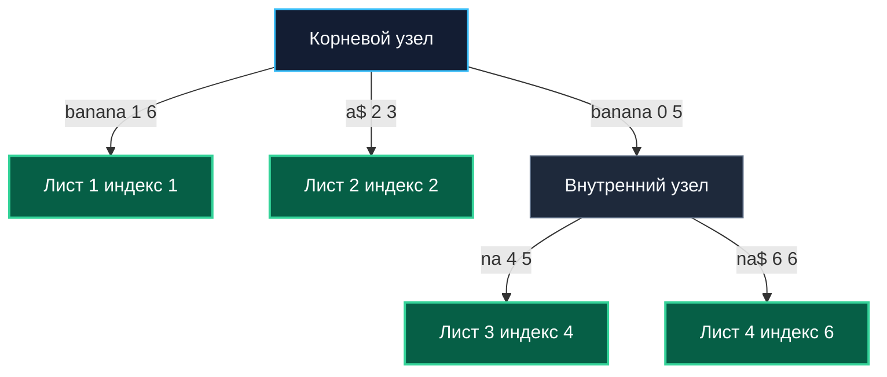

## Введение: Линейная мощь и архитектурный вес

Suffix Tree (Суффиксное дерево) — это сжатое префиксное дерево (Radix/Trie), содержащее все суффиксы заданной строки. 

В теоретической информатике суффиксное дерево по праву считается абсолютным золотым стандартом для строковых вычислений:
- Построение за строгое линейное время `O(N)`.
- Поиск любого паттерна за время `O(M)` (зависящее только от длины паттерна, но не от размера исходного текста!).
- Нахождение длиннейшей общей подстроки нескольких текстов, выявление периодов строки и подсчет количества уникальных подстрок — всё это выполняется за один линейный проход.
- Алгоритм Эско Укконена (1995 год), позволяющий строить суффиксное дерево онлайн (посимвольно, по мере поступления потока данных), является одним из самых впечатляющих интеллектуальных триумфов в истории строковых алгоритмов.

Однако в реальном высоконагруженном бэкенде на Go суффиксное дерево встречается крайне редко. Причина кроется не в математических изъянах, а в суровых инженерных реалиях железа: чудовищный оверхед оперативной памяти, тотальная фрагментация кучи миллионами указателей и катастрофическое давление на [[7. Глубокий Go (Внутреннее устройство)|сборщик мусора]]. 

В этой статье мы разберём, почему академический оптимум проигрывает прагматичным массивным структурам, и когда суффиксное дерево всё же может найти применение в высоконагруженных системах.

> [!tip] Собеседование
> **Вопрос:** «Суффиксное дерево строится за O N, а Suffix Array за O N log N. Почему в Go-продакшене почти всегда выбирают массив, а не дерево?»  
> **Ответ:** Асимптотика скрывает константы и footprint. Суффиксное дерево требует `O N` узлов и рёбер, каждое из которых содержит указатели, метки срезов и служебные флаги. На amd64 это 10-20x оверхед памяти относительно исходной строки. Массив суффиксов — это чистый `[]int`, занимающий ровно `8N` байт. Для строки 10 МБ дерево съест 100-200 МБ RAM и создаст миллионы аллокаций в куче, убивая cache locality и вызывая долгие паузы GC. Массив остаётся в L3 кэше, работает предсказуемо и сериализуется за один вызов. В бэкенде память и стабильность p99 важнее теоретического `O N`.

---

## Математическое ядро: Сжатые рёбра и неявные узлы

В отличие от стандартного Trie, где каждое ребро кодирует ровно один символ, рёбра суффиксного дерева маркируются целыми подстроками (задаваемыми парой индексов `[start, end]` в исходном тексте). Это позволяет схлопывать неразветвленные цепочки узлов с одним потомком в одно ребро, жестко ограничивая общее число вершин величиной `O(N)`.

Структура суффиксного дерева оперирует двумя типами узлов:
1. **Явные узлы**: имеют как минимум двух потомков или являются листьями дерева.
2. **Неявные узлы**: лежат внутри сжатых ребер, возникают временно в процессе онлайн-построения (алгоритм Укконена) и материализуются в явные только при необходимости ветвления.



Алгоритм Укконена обрабатывает входную строку посимвольно слева направо, поддерживая инвариант неявного суффиксного дерева для текущего префикса. Ключевая концептуальная оптимизация алгоритма — **Suffix Links (Суффиксные ссылки)**: указатель из внутреннего узла, представляющего подстроку `αx`, в узел, представляющий подстроку `x`. Это позволяет алгоритму за константное `O 1` переходить к следующему суффиксу без мучительного повторного спуска от корня, гарантируя общую линейную сложность построения всего дерева.

---

## Production-реальность в Go: Почему мы почти не используем Suffix Tree

В стандартной библиотеке Go суффиксного дерева нет, а сторонние библиотеки (`github.com/.../suffixtree`) крайне редко доходят до промышленной эксплуатации. Причина — физическая структура памяти и законы runtime Go.

```go
// Типичная структура узла суффиксного дерева в Go
type Edge struct {
	Start, End int       // Индексы начала и конца подстроки в исходной строке
	Target     *Node     // Указатель на следующий узел
}

type Node struct {
	Edges       map[rune]*Edge // Хеш-таблица переходов
	SuffixLink  *Node          // Ссылка для Укконена
	IsLeaf      bool
}

type SuffixTree struct {
	Root   *Node
	Text   []rune // или []byte
}
```

> [!info] Под капотом
> **Реальный footprint на amd64:**
> * `Node`: 64 байт заголовок + `map` (24 байта дескриптор + внутренняя `hmap` ~128 байт минимум) + `SuffixLink` (8 байт). Итого ~250 байт на узел без учёта записей мапы.
> * `Edge`: 16 байт индексы + 8 байт указатель = 32 байта + выравнивание.
> * Для строки 1 МБ символов требуется ~1-2 М узлов и рёбер. Память улетает в 300-500 МБ.
> * Каждая вставка рёбра вызывает `runtime.mallocgc`. При 1 МБ строки это сотни тысяч мелких аллокаций, фрагментирующих span'ы аллокатора. Сборщик мусора вынужден обходить миллионы указателей в фазе `mark`, что удлиняет STW паузы на десятки миллисекунд.

В Go-бэкенде такая архитектура грубо нарушает фундаментальный принцип **Mechanical Sympathy**: мы заставляем процессор охотиться за случайными указателями по всей виртуальной памяти (Pointer Chasing), начисто уничтожая hit rate процессорного кэша и перегружая буфер TLB.

---

### Эмуляция дерева через Suffix Array + LCP

На практике системные инженеры заменяют тяжеловесное суффиксное дерево связкой из массива суффиксов (`SA`) и массива `LCP`. С помощью **LCP-интервалов** можно математически строго симулировать навигацию по виртуальному дереву без единого физического указателя:
* Корень дерева $\leftrightarrow$ весь массив `SA`.
* Внутренний узел $\leftrightarrow$ подотрезок `[i, j]` в `SA`, где `min(LCP[i+1..j]) = depth`.
* Лист дерева $\leftrightarrow$ один индекс в `SA`.

Поиск паттерна превращается в бинарный поиск по `SA` с использованием `LCP` для пропуска уже проверенных символов. Сложность остаётся `O M log N`, а на практике с эвристикой LCP приближается к `O M`. Память: `24N` байт (SA + LCP + инвертированный ранг), что в 20-50 раз экономнее дерева.

---

## Mechanical Sympathy: Память, кэши и давление на GC

| Параметр | Suffix Tree | Suffix Array + LCP |
|---|:---:|:---:|
| **Память на 1 МБ строки** | 200–500 МБ | $\approx 24$ МБ |
| **Аллокации** | 1–2 млн мелких объектов | 3 крупных слайса `[]int` |
| **Cache Locality** | Ужасная (random pointer chasing) | Отличная (последовательные чтения) |
| **GC Pressure** | Высокая (миллионы указателей) | Нулевая (только примитивы int) |
| **Построение** | `O(N)` онлайн | `O(N log² N)` оффлайн |
| **Сериализация** | Сложная (обход графа) | Мгновенная (`binary.Write`) |

### Ветвления и предсказатель переходов
В структуре `map[rune]*Edge` каждый шаг спуска требует вычисления хеша, поиска бакета и разыменования указателя. В `SA` сравнение выполняется строго линейно по непрерывным индексам, и компилятор Go векторизует цикл `for i := 0; i < m; i++ { if pat[i] != text[idx+i] }` с задействованием SIMD-инструкций (SSE4.2/AVX2). Разница в реальном физическом времени исполнения (wall-clock time) достигает 5–10 раз в пользу плоского массива.

### Escape Analysis
В суффиксном дереве поля `Edge.Target` и `SuffixLink` гарантированно сбегают в общую кучу (escape to heap). Компилятор не может разместить их на стеке. В свою очередь массив `[]int` живет в куче как единый непрерывный span памяти без внутренних указателей, поэтому Garbage Collector сканирует его за `O N/8` машинных инструкций, полностью пропуская фазу `scan pointer` для блоков примитивов.

---

## Suffix Automaton: Более практичная альтернатива

Если конкретная архитектурная задача требует именно графовой навигации по суффиксам строки, но бюджет памяти жестко ограничен, зрелые инженеры выбирают **Суффиксный автомат (Suffix Automaton / DAWG — Directed Acyclic Word Graph)**:
* Строится за строгое `O N` (алгоритм онлайн, концептуально проще Укконена).
* Содержит не более `2N-1` состояний и `3N-4` переходов.
* Сжимает все эквивалентные позиции окончания подстрок (end-positions) в единые классы состояний.
* Память: $\approx 3-5x$ от размера исходной строки (все еще ощутимо, но несравнимо меньше монструозного суффиксного дерева).
* В Go реализуется через срез структур `[]state` с фиксированными массивами переходов, что позволяет эффективно использовать арены памяти и `sync.Pool`.

Автомат идеален для поиска любых подстрок, быстрого подсчета уникальных вхождений и нахождения лексикографически $K$-й подстроки. Но для подавляющего большинства типовых бэкенд-задач (анализ логов, поиск паттернов, проверка токенов) Suffix Array остается безоговорочным выбором №1.

> [!warning] Ловушка / Gotcha
> **Рекурсия и переполнение стека при построении**  
> Классические реализации Укконена используют рекурсивный спуск или обход Suffix Links. В Go лимит стека начинается с 2 КБ и растёт динамически, но при строке >500 КБ глубокие переходы могут вызвать `stack overflow` или дорогостоящие `morestack`-вызовы. В production всегда переписывайте алгоритм в итеративную форму с явным стеком `[]*Node` или переходите к Suffix Array, где вся логика линейна и не требует стека вызовов.

---

## Ловушки и вопросы с собеседований

> [!tip] Собеседование
> **Вопрос 1:** «Можно ли построить Suffix Tree без явного выделения памяти для каждого узла?»  
> **Ответ:** Да, использовать Implicit Suffix Tree на базе массива индексов и Suffix Links, хранящихся в `[]int`. Рёбра представляются как пары `(start, end)`. Это уменьшает оверхед, но не решает проблему pointer chasing при обходе. Для полного избавления от указателей применяют **FM-index** на основе Burrows-Wheeler Transform, который работает в сжатом виде, но требует декомпрессии на лету.
> 
> **Вопрос 2:** «Почему алгоритм Укконена сложен в отладке?»  
> **Ответ:** Из-за неявных узлов, динамического разбиения рёбер и поддержки Suffix Links. Одно нарушение инварианта на шаге `k` приводит к некорректному дереву, которое молча даёт ложные результаты поиска. В отличие от Suffix Array, где сортировку легко проверить бинарным поиском. В production сложные алгоритмы требуют property-based тестов и фаззинга, что увеличивает time-to-market.
> 
> **Вопрос 3:** «В каких реальных системах Suffix Tree до сих пор используется?»  
> **Ответ:** В биоинформатике (выравнивание генома, где алфавит мал `ACGT`, а строки огромны), в специализированных поисковых движках для юридических документов, в системах компрессии данных. В типичном микросервисном бэкенде (API, очереди, БД) он избыточен и уступает Suffix Array или [[3. Хеширование/1. Хеш функции и равномерность распределения|rolling hash]] подходам.
> 
> **Вопрос 4:** «Как обеспечить конкурентность в Suffix Tree?»  
> **Ответ:** Практически невозможно без полной блокировки или COW-копирования. Дерево изменяется на каждом шаге построения. Если нужно искать в готовом дереве параллельно, можно использовать `sync.RWMutex`, но указательная структура всё равно создаст contention на чтение кэш-линий. Шардинг неприменим из-за глобальной связности суффиксов. В Go для конкурентного поиска используют immutable Suffix Array, к которому несколько горутин обращаются через `atomic.Pointer` без блокировок.

---

## Итог

* **Suffix Tree** — теоретически оптимальная структура `O N` для индексации строк, но архитектурно несовместима с высоконагруженным бэкендом из-за указательного оверхода и давления на GC.
* Алгоритм Укконена обеспечивает онлайн-построение, но сложен в реализации, отладке и поддержке конкурентности.
* В Go-продакшене **Suffix Array + LCP** выигрывает за счёт компактного представления, предсказуемой работы кэшей CPU, нулевых указателей в данных и простоты сериализации.
* Если требуется графовая навигация по суффиксам с ограниченной памятью, рассматривайте **Suffix Automaton** или **FM-index**.
* **Выбор в бэкенде**: Suffix Tree оставьте для академических задач и биоинформатики. Для лог-анализа, поиска подстрок в API, матчинга конфигов используйте массивы суффиксов или rolling hash. Память и стабильность p99 важнее теоретической линейности построения.

Мы завершили раздел по строковым алгоритмам, охватив точный поиск, префиксные деревья, суффиксные массивы и их производные. Эти инструменты покрывают 95% задач валидации, парсинга и индексации текста в бэкенде. Теперь мы переходим к низкоуровневым операциям, которые лежат в основе криптографии, сжатия, сетевых протоколов и оптимизации флаговых состояний. В следующей статье мы детально разберём, как побитовые операции транслируются в машинные инструкции, почему они быстрее арифметики, и как использовать их для создания lock-free структур и компактных хранилищ состояний без единой аллокации.

[[1. Битовые операции]]