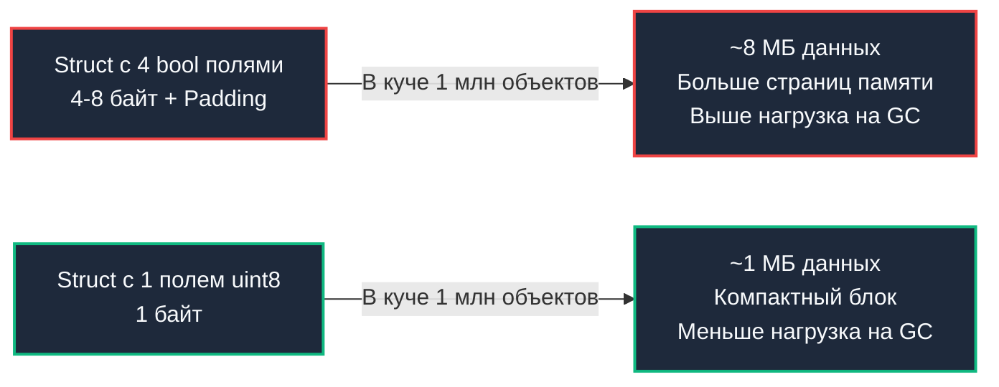

## Введение: Набор свойств как одно целое

В предыдущей главе мы разобрали примитивные побитовые операции — кирпичики двоичной арифметики. Теперь объединим их в мощный архитектурный паттерн — **Bitmasking** (битовые маски). Если отдельный бит — это атом, то маска — молекула, описывающая целостное состояние сложной системы.

В бэкенде маски окружают нас повсюду: от прав доступа в POSIX-файловых системах (`rwx`) и флаговых полей TCP-заголовков до статусов распределенных транзакций, флагов планировщика Go и конфигурационных битов в индексах баз данных. Ключевая идея маскирования предельно проста и изящна: упаковать множество независимых булевых свойств (флагов, пермиссий, маркеров состояния) в один целочисленный машинный регистр и манипулировать ими одновременно за один такт процессора.

Такой подход не только устраняет ветвления в коде, но и сводит на нет накладные расходы на выравнивание структур, снижает нагрузку на сборщик мусора и открывает прямую дорогу к бескомпромиссно быстрым lock-free алгоритмам.

> [!tip] Собеседование
> **Вопрос:** «Как эффективно проверить, обладает ли пользователь одновременно правами A и B, но НЕ имеет права C, используя один вызов процессора?»
> 
> **Ответ:** Используя битовую маску. Если права A, B и C соответствуют битам 0, 1 и 2:
> `if (userMask & 0b011) == 0b011 && (userMask & 0b100) == 0`.
> Это одна инструкция AND, одна проверка на равенство, без переходов и вызовов функций.

---

## Маска как структура данных для множеств

Битовая маска длины `N` естественным образом представляет любое подмножество универсума из `N` элементов. Если `i`-й бит равен `1`, соответствующий `i`-й элемент включен в подмножество; если `0` — отсутствует.

В Go выбор целочисленного контейнера диктуется мощностью моделируемого множества:
* `uint8` — до 8 свойств (компактные флаги легковесных структур).
* `uint32` — до 32 свойств (классический стандарт для прав доступа и системных дескрипторов).
* `uint64` — до 64 свойств (покрывает 99% задач конфигурирования сервисов и флаговых таблиц).

### Базовые операции

В идиоматичном Go для объявления битовых флагов принято использовать блок `const` со счетчиком `iota` и оператором побитового сдвига `<<`. Это исключает «магические числа» и делает код самодокументируемым.

```go
package main

import "fmt"

type Permissions uint8

const (
	Read  Permissions = 1 << iota // 0000 0001 (1)
	Write                         // 0000 0010 (2)
	Delete                        // 0000 0100 (4)
	Admin                         // 0000 1000 (8)
)

// Add: включение права в маску (побитовое OR)
func (p *Permissions) Add(right Permissions) {
	*p |= right
}

// Remove: сброс конкретного права (оператор AND NOT)
func (p *Permissions) Remove(right Permissions) {
	*p &^= right // Идиоматичный Go-оператор bit-clear
}

// Has: проверка наличия конкретного флага (побитовое AND)
func (p Permissions) Has(right Permissions) bool {
	return p&right != 0
}

func main() {
	var perms Permissions = Read
	perms.Add(Write) // Read | Write: 0000 0011
	
	fmt.Printf("Has Write: %v\n", perms.Has(Write))   // true
	fmt.Printf("Has Delete: %v\n", perms.Has(Delete)) // false
}
```

Обратите внимание на оператор `&^` (AND NOT). Это фирменная черта Go: выражение `a &^ b` сбрасывает в числе `a` все биты, которые установлены в `b`, без необходимости явно писать `^right` (или `a & (^b)`). В других языках программисту приходится городить сложные конструкции.

---

## Mechanical Sympathy: Lock-free атомики и кэш

Битовое маскирование — первоклассный инструмент для высококонкурентных систем. Если состояние компонента представлено разрозненными булевыми полями (`isRunning bool`, `isPaused bool`), их невозможно обновить согласованно без блокировки мьютексом. Но когда все флаги сжаты в единое целое число, их можно модифицировать атомарно за одну инструкцию шины CPU.

### Атомарное изменение состояния

Представьте высоконагруженный сетевой воркер, которому необходимо переключать состояния жизненного цикла: `StateRunning`, `StateDraining` и `StatePaused`. Захват мьютекса при каждом событии создает contention и заставляет потоки засыпать в ядре. Применение `sync/atomic` поверх маски полностью решает эту задачу в user-space.

```go
package main

import "sync/atomic"

type ServerState uint32

const (
	StateRunning uint32 = 1 << iota
	StateDraining
	StatePaused
)

type Server struct {
	// state хранит все флаги жизненного цикла в едином 32-битном регистре
	state atomic.Uint32 
}

func (s *Server) EnterDraining() bool {
	// CAS-петля (Compare-And-Swap): оптимистичное обновление без мьютексов
	for {
		current := s.state.Load()
		// Если сервер уже на паузе или в процессе дренажа — повторный переход запрещен
		if current&(StateDraining|StatePaused) != 0 {
			return false
		}
		// Пытаемся атомарно поднять бит StateDraining
		if s.state.CompareAndSwap(current, current|StateDraining) {
			return true
		}
		// При неудаче CAS кто-то успел изменить state параллельно: повторяем попытку
	}
}
```

Здесь маска позволяет модифицировать *один* целевой бит, сохраняя значения остальных флагов интактными, причем совершенно **lock-free**. Горутины не уходят в сон ядра через системный вызов `futex`, а совершают несколько быстрых циклов в spin-петле процессора, что на порядок снижает латентность P99.

### Влияние на память и сборщик мусора

Использование маски вместо разрозненных полей `bool` кардинально сокращает размер структур:
* Структура `struct { A, B, C, D bool }` в силу правил выравнивания (struct alignment) занимает минимум 4 байта, а если рядом соседствуют указатели или 64-битные поля — разрастается до 8 байт из-за паддинга (padding).
* Структура `struct { Flags uint8 }` укладывается ровно в 1 байт полезных данных.

В сервисах, генерирующих миллионы короткоживущих объектов (например, транзитный `RequestContext` на каждый входящий HTTP/gRPC запрос), экономия даже 4–7 байт на объект предотвращает выделение сотен мегабайт оперативной памяти. Меньше выделенной памяти — меньше работы для [[7. Глубокий Go (Внутреннее устройство)|сборщика мусора]] и нулевые паузы STW.



---

## Production-паттерны: RBAC и Подмножества

### 1. Маски прав доступа (ACL/RBAC)

Вместо тяжеловесных `map[string]bool` для проверки ролей пользователя применяйте битовые маски. Это превращает валидацию сложнейших бизнес-правил в единичные логические операции с временной сложностью $O(1)$ и нулевыми аллокациями:

```go
// Проверка: "Есть ли право на запись, ИЛИ (на чтение И администрирование)"
if mask.Has(Write) || (mask.Has(Read) && mask.Has(Admin)) {
    // Доступ разрешен
}

// Или чистая битовая арифметика:
// (mask & Write) != 0 || (mask & (Read | Admin)) == (Read | Admin)
```

Такое выражение вычисляется в считанные наносекунды без единого обращения к динамической памяти.

### 2. Итерация по подмножествам (Subsets)

В задачах дискретной оптимизации (подбор оптимального набора реплик, распределение квот, задача коммивояжера для малых $N$) битовые маски позволяют обходить все подмножества множества без тяжеловесной рекурсии и аллокаций срезов.

Классический алгоритм `(i - 1) & mask` выполняет переход к следующему лексикографически меньшему подмножеству:

```go
package main

import "fmt"

func main() {
	// Перебор всех подмножеств маски mask
	// Например, mask = 0b101 (5), подмножества: 101 (5), 100 (4), 001 (1), 000 (0)
	mask := uint(5)
	for i := mask; i > 0; i = (i - 1) & mask {
		fmt.Printf("%03b\n", i)
	}
	fmt.Println("000") // Пустое множество
}
```

Этот трюк элегантно изолирует только установленные в родительской маске биты, пропуская пустые промежутки.

---

## Ловушки и вопросы с собеседований

> [!tip] Собеседование
> **Вопрос 1:** «Как посчитать количество установленных битов в маске за O(1)?»  
> **Ответ:** Использовать функцию `bits.OnesCount64()` из стандартной библиотеки `math/bits`. Она распознается компилятором Go как intrinsics и компилируется напрямую в процессорную инструкцию `POPCNT` (Population Count) на x86-64 и ARM64. Ручная реализация через цикл работает за $O(k)$, где $k$ — число бит, что неизмеримо медленнее.
>
> **Вопрос 2:** «Что такое Little Endian и Big Endian в контексте битовых масок при сетевом взаимодействии?»  
> **Ответ:** Порядок байт критичен при сериализации маски в срез `[]byte` для передачи по сети или записи на диск. Go использует порядок байт хостовой архитектуры (Little Endian на большинстве серверов x86-64 и arm64). При передаче `uint32` в сокет его необходимо явно преобразовать в Network Byte Order (Big Endian) с помощью `binary.BigEndian.PutUint32`, иначе сервер другой архитектуры истолкует битовые позиции зеркально.
>
> **Вопрос 3:** «Можно ли использовать маски для дробных чисел?»  
> **Ответ:** Категорически нет. Побитовые операторы в Go применимы только к целочисленным типам. Представление чисел с плавающей запятой подчиняется стандарту IEEE 754 (знаковый бит, экспонента, мантисса). Попытка интерпретировать float как битовую маску разрушит математический смысл значения.

> [!warning] Ловушка / Gotcha
> **Выход за границы диапазона**  
> При использовании `iota` со сдвигом всегда контролируйте разрядность базового типа:
> ```go
> type Flags uint8
> const (
>     A Flags = 1 << iota
>     // ...
>     Z
> )
> ```
> Если число элементов превысит 8 для `uint8` (или 32 для `uint32`), произойдет скрытое циклическое переполнение, и старшие флаги обнулятся.
>
> **Приоритет операторов**  
> В Go операторы сравнения (`==`, `!=`, `<`, `>`) имеют более высокий приоритет, чем побитовые операторы (`&`, `|`, `^`).
> Выражение `mask & 1 == 0` компилятор поймет как `mask & (1 == 0)` — сначала вычислится `1 == 0` (false), а затем `mask & false` (ошибка типов).
> Скобки здесь обязательны: всегда пишите `(mask & 1) == 0`.

---

## Итог

* **Bitmasking** — канонический паттерн компактного хранения булевых множеств в границах одного машинного слова.
* Операции `|`, `&`, `^`, `&^` позволяют манипулировать множествами флагов за доли наносекунды.
* В Go маски идеальны для построения **lock-free** структур данных через CAS-примитивы пакета `sync/atomic`.
* Маски сокращают размер структур в оперативной памяти, улучшают кэш-локальность и кардинально облегчают работу сборщика мусора.
* **Аппаратное ускорение**: библиотечные функции `math/bits` транслируются в специализированные инструкции процессора (`POPCNT`, `LZCNT`).
* **Сетевая сериализация**: помните о различиях Little/Big Endian и всегда используйте `binary.BigEndian` для битовых полей в сетевых протоколах.

Битовые маски виртуозно решают задачи хранения состояний. Но как быть, если алгоритму требуется вычислить огромное число, возведенное в колоссальную степень, не упираясь в экспоненциальное время и переполнение разрядной сетки? В следующей статье мы разберем классический алгоритм бинарного возведения в степень (Binary Exponentiation), лежащий в фундаменте криптографии и современных алгоритмов хеширования.

[[3. Быстрое возведение в степень]]