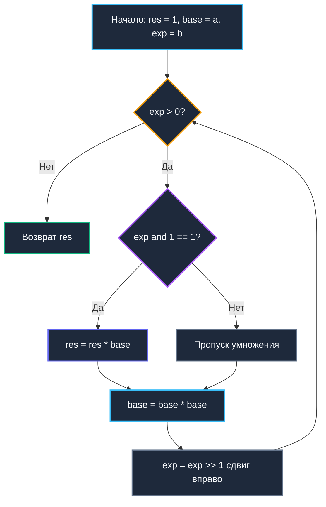

## Введение: Почему линейный подход убивает производительность

Вычисление $a^b$ наивным циклом умножения `res *= a`, повторяющимся `b` раз, обладает линейной временной сложностью `O(b)`. Для крошечных степеней вроде $2^8$ или $3^4$ этот подход незаметен. Однако в серверном бэкенде, алгоритмической криптографии и телеметрии экспоненты регулярно достигают значений порядка $10^{18}$ или разрастаются до 2048-битных ключей. При $b = 10^9$ наивный цикл выполнит один миллиард последовательных скалярных умножений, наглухо заблокировав поток операционной системы на сотни миллисекунд.

Алгоритм быстрого возведения в степень (известный в классической литературе как Binary Exponentiation или Exponentiation by Squaring) сокращает вычислительную сложность с `O(b)` до `O(log b)`. Вместо миллиарда однотипных шагов нам потребуется всего около 30–60 операций. Это фундаментальный строительный блок криптографических протоколов (RSA, Diffie-Hellman), алгоритмов хеширования, полиномиальных генераторов псевдослучайных последовательностей и систем вычисления контрольных сумм.

> [!tip] Собеседование
> **Вопрос:** «Как вычислить $a^b \pmod m$ за `O(log b)`, если $a, b, m$ помещаются в `uint64`, но промежуточное $a^2$ вызывает переполнение?»
> 
> **Ответ:** На каждом шаге возведения в квадрат и умножения необходимо брать остаток от деления на $m$. Поскольку $(x \cdot y) \pmod m = ((x \pmod m) \cdot (y \pmod m)) \pmod m$, мы поддерживаем результат в диапазоне `[0, m-1]`. Для $m$ близкого к $2^{64}$ требуется использовать 128-битную арифметику (`math/big` или ассемблерную инструкцию `MULX`), чтобы избежать overflow до применения `% m`.

---

## Математическое ядро: Разложение по степеням двойки

Любое положительное целое число $b$ однозначно разлагается в двоичной системе счисления: $b = \sum_{i=0}^{k} b_i \cdot 2^i$, где каждый коэффициент $b_i \in \{0, 1\}$.
Следовательно, степень $a^b$ факторизуется в произведение:
$$a^b = a^{\sum b_i 2^i} = \prod_{b_i=1} a^{2^i}$$

Мы можем последовательно получать значения $a^{2^0}, a^{2^1}, a^{2^2}, \dots$ тривиальным возведением текущего основания в квадрат на каждом шаге. Если $i$-й бит экспоненты равен 1, мы просто умножаем накапливаемый результат на уже подготовленное число $a^{2^i}$.

**Пример:** Вычислим $a^{13}$. В двоичном представлении $13 = 1101_2 = 8 + 4 + 1$:
1. $i=0$, бит = 1: $res = a^1$, $base = a^2$
2. $i=1$, бит = 0: $res$ остается неизменным, $base = (a^2)^2 = a^4$
3. $i=2$, бит = 1: $res = a^1 \cdot a^4 = a^5$, $base = (a^4)^2 = a^8$
4. $i=3$, бит = 1: $res = a^5 \cdot a^8 = a^{13}$, $base = a^{16}$

Итого: ровно 4 итерации цикла вместо 12 последовательных умножений.



---

## Production-реализация на Go 1.21+

В промышленном бэкенде редко требуется «чистое» неограниченное возведение в степень — целые числа мгновенно переполняют машинные регистры. Почти всегда задача сводится к **модульной арифметике**. Ниже представлена компактная, эффективная и безопасная реализация для `uint64`.

```go
package mathalgo

// PowMod вычисляет (base^exp) % mod за O(log exp).
// Работает корректно только если mod != 0 и base*base не переполняет uint64 до взятия mod.
func PowMod(base, exp, mod uint64) uint64 {
	if mod == 0 {
		panic("powmod: mod cannot be zero")
	}
	if mod == 1 {
		return 0 // Любой остаток от деления на 1 равен 0
	}

	base %= mod
	res := uint64(1)

	for exp > 0 {
		if exp&1 == 1 { // Если младший бит установлен
			res = (res * base) % mod
		}
		base = (base * base) % mod
		exp >>= 1
	}

	return res
}
```

Ключевые инженерные решения:
* **Итеративный цикл**: Никакой рекурсии. Рекурсивный вызов расходует кадры стека и создает оверхед на пролог/эпилог функций. Итеративный цикл выполняется исключительно в регистрах CPU.
* **Предварительное `base %= mod`**: Гарантирует, что первое же промежуточное умножение не вызовет переполнения, если исходный `base` превышал `mod`.
* **Защита от `mod == 1`**: Немедленный возврат нуля предотвращает паразитное деление на единицу, которое компилятор не всегда способен устранить.

Для работы с криптографическими числами произвольной разрядности используйте стандартный метод `math/big.Int.Exp`. Однако помните: каждый вызов `big.Int` аллоцирует память в куче. В горячих путях микросервисов структуры `big.Int` обязательно переиспользуют через `sync.Pool`.

---

## Mechanical Sympathy: Регистры, предсказание ветвлений и аллокации

Поведение `PowMod` на физическом кремнии отражает гармонию математической логики и микроархитектуры современных CPU.

### Регистровое давление и отсутствие аллокаций

Тело цикла `for exp > 0` задействует ровно 3 локальные переменные: `base`, `exp`, `res`. Компилятор Go безупречно аллоцирует их в регистрах общего назначения (`RAX, RBX, RCX` на архитектуре x86-64). Здесь нет ни единого обращения к оперативной памяти, ни байта в куче и нулевое воздействие на [[7. Глубокий Go (Внутреннее устройство)|сборщик мусора]]. Временная и пространственная сложность идеальны: $O(1)$ по памяти.

### Ветвления и `CMOV`

Проверка `if exp&1 == 1` компилируется в условный переход `JZ` (Jump if Zero). Если биты показателя степени случайны (как в криптографических ключах), предсказатель ветвлений процессора (Branch Predictor) ошибается с вероятностью до ~50%, вызывая сброс конвейера инструкций (pipeline stall). Компилятор Go 1.21+ в ряде ситуаций заменяет такие ветвления на инструкцию бескликного условного перемещения `CMOV`. Однако при 64-битном умножении это затруднено влиянием на флаги процессора.

### 128-битная арифметика на amd64

Операция `base = (base * base) % mod` на платформе x86-64 превращается в элегантную аппаратную последовательность инструкций:
1. `MULQ base` — перемножает 64-битные регистры, сохраняя полный 128-битный результат в регистровую пару `RDX:RAX` (старшие и младшие 64 бита соответственно).
2. `DIVQ mod` — выполняет 128-битное деление пары `RDX:RAX` на делитель `mod`, возвращая частное в `RAX`, а искомый остаток — в регистр `RDX`.

Эти микроинструкции выполняются процессором за 20–40 тактов. Без аппаратной поддержки деления паре пришлось бы выполнять программную эмуляцию длинной арифметики, что работало бы в 5–10 раз медленнее.

> [!info] Под капотом
> **Почему не `math.Pow`?**
> Функция `math.Pow(a, b float64)` работает с плавающей точкой IEEE-754. Она использует таблицы логарифмов и экспонент, даёт `O(1)` асимптотику, но:
> * Теряет точность при больших числах (округление мантиссы).
> * Не поддерживает модульную арифметику.
> * Выполняет преобразование типов `int -> float -> int`, что дороже целочисленных умножений для малых экспонент.
> `math.Pow` оптимизирован для научных вычислений и графики. Для дискретной математики и криптографии всегда используйте целочисленный `PowMod`.

---

## Криптография и атаки по времени (Timing Attacks)

Базовый алгоритм `PowMod` выполняется за переменное время в зависимости от количества единичных бит в числе `exp`. Если показатель содержит 32 установленных бита, цикл выполнит 32 модульных умножения. Если единиц всего 4 — алгоритм отработает значительно быстрее.

В криптографии с открытым ключом (RSA, Diffie-Hellman, ECDSA) сетевой злоумышленник может с наносекундной точностью измерять время ответа сервиса и по задержкам побитово реконструировать закрытый ключ. Это хрестоматийный пример сторонней атаки по времени (**side-channel attack**).

Для защиты в криптографических ядрах реализуется **Constant-Time** логика, где вычисления происходят за фиксированное число тактов без каких-либо ветвлений:

```go
func PowModCT(base, exp, mod uint64) uint64 {
	base %= mod
	res := uint64(1)
	for exp > 0 {
		// Маска равна 18446744073709551615 если exp&1==1, иначе 0
		mask := -(exp & 1) 
		// Умножаем res на base только если маска полная
		// В production используют ассемблер или crypto/subtle для гарантированной константности
		res = res ^ (mask & (res ^ ((res * base) % mod)))
		base = (base * base) % mod
		exp >>= 1
	}
	return res
}
```

В реальном промышленном коде на Go никогда не изобретайте самодельные криптографические примитивы. Всегда опирайтесь на пакеты стандартной библиотеки `crypto/rsa`, `crypto/elliptic` и вспомогательный пакет `crypto/subtle`, где константное время исполнения верифицировано и защищено на уровне ассемблерных вставок.

---

## Ловушки и вопросы с собеседований

> [!tip] Собеседование
> **Вопрос 1:** «Как вычислить $a^{-1} \pmod p$ (обратный элемент по модулю)?»  
> **Ответ:** Используя малую теорему Ферма: $a^{p-2} \equiv a^{-1} \pmod p$ (если $p$ простое). Вычисляем `PowMod(a, p-2, p)` за `O(log p)`. Для составного модуля используем расширенный алгоритм Евклида.
> 
> **Вопрос 2:** «Почему нельзя просто написать `res *= base` без `% mod` на каждом шаге?»  
> **Ответ:** Переполнение `uint64`. Даже если $a < 2^{32}$, $a^2$ займёт 64 бита, а следующее возведение в квадрат потребует 128 бит. Целочисленное переполнение в Go происходит по модулю $2^{64}$, что ломает математический инвариант и даёт абсолютно неверный результат.
> 
> **Вопрос 3:** «Сложность алгоритма по памяти?»  
> **Ответ:** `O(1)` дополнительной памяти. Все вычисления ведутся в регистрах. Никаких рекурсивных стеков или временных массивов.
> 
> **Вопрос 4:** «Как адаптировать алгоритм для матричного возведения в степень $M^k$?»  
> **Ответ:** Заменяем скалярные операции `res * base` на умножение матриц, а `base * base` на возведение матрицы в квадрат. Логика цикла остаётся идентичной. Используется для вычисления $k$-го числа Фибоначчи за `O(log k)` вместо `O(k)`.

> [!warning] Ловушка / Gotcha
> **Экспонента 0 и основание 0**  
> Математически значение $0^0$ строго не определено, однако в теории чисел и компьютерной алгебре условились считать его равным $1$. В нашей реализации при значении `exp=0` тело цикла не выполняется вовсе и возвращается начальное `res=1`. Это корректно для большинства алгоритмических задач (сохранение нейтрального элемента умножения). Но если бизнес-требования диктуют ошибку при входе `0^0`, необходимо добавить явную граничную проверку.
> 
> **Составной модуль и обратный элемент**  
> Если попытаться вычислить обратный элемент через `PowMod(a, m-2, m)` для составного числа $m$, алгоритм вернет математический мусор. Малая теорема Ферма применима **строго** для простых модулей $p$. Для произвольных составных чисел применяется расширенный алгоритм Евклида.

---

## Итог

* **Быстрое возведение в степень** радикально снижает вычислительную сложность операции $a^b$ с `O(b)` до `O(log b)` путем разложения показателя по степеням двойки.
* В бэкенд-разработке алгоритм практически всегда работает в форме **модульной арифметики** (`PowMod`), предотвращая переполнение регистров взятием остатка на каждой итерации.
* Реализация на Go выполняется исключительно в **CPU-регистрах**, свободна от аллокаций в куче и требует `O(1)` по памяти. Компилятор задействует аппаратные 128-битные инструкции `MULQ/DIVQ`.
* **Криптографическая безопасность**: проверка младшего бита `if exp&1 == 1` уязвима к тайминг-атакам. В промышленной криптографии применяются constant-time алгоритмы пакетов `crypto/` и `math/big`.
* **Интервью-фокус**: знание связи с малой теоремой Ферма, механизмы предотвращения overflow, обобщение на умножение матриц и четкое понимание границ применимости `math.Pow`.
* **Связь с теорией чисел**: быстрый алгоритм возведения в степень идет рука об руку с алгоритмами нахождения наибольшего общего делителя для проверки взаимной простоты и вычисления модульных мультипликативных инверсий.

В следующей статье мы исследуем один из древнейших и самых элегантных алгоритмов человечества — алгоритм Евклида, разберем его бинарную вариацию и покажем, как расширенный алгоритм Евклида находит обратные элементы для любых составных модулей.

[[4. Алгоритм Евклида и GCD]]