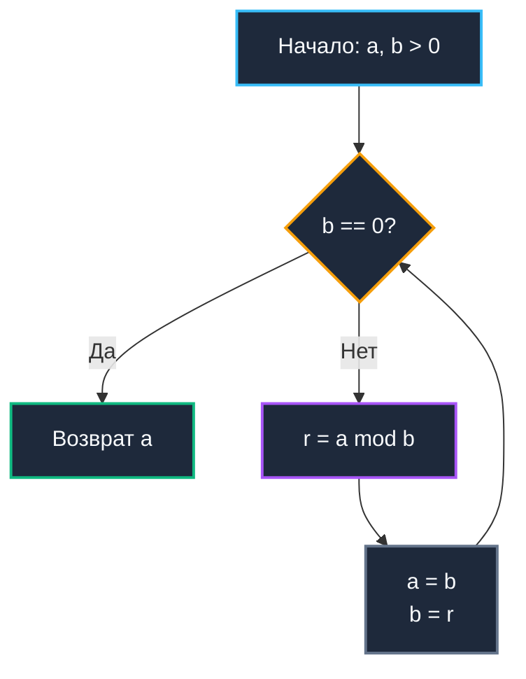

## Введение: От античной математики к криптографии и системному дизайну

Наибольший общий делитель (GCD, Greatest Common Divisor) — это далеко не академическая абстракция из школьных учебников. В архитектуре высоконагруженного бэкенда алгоритмы вычисления GCD служат скрытым, но незаменимым несущим каркасом: от проверки взаимной простоты в асимметричной криптографии (RSA, протоколы Диффи-Хеллмана) и синхронизации распределенных cron-планировщиков через наименьшее общее кратное (LCM) до шага зондирования в открытой адресации хеш-таблиц и выравнивания гранулярности аллокаторов памяти под размер кэш-линий CPU.

Наивный поиск общего делителя методом прямого перебора обладает недопустимой временной сложностью `O(min(a, b))`, что для 64-битных чисел означает миллиарды лет процессорного времени. Алгоритм Евклида редуцирует вычислительную сложность до элегантных `O(log min(a, b))`, превращая потенциальный архитектурный затык в молниеносную операцию на несколько десятков машинных тактов. Понимание тонкостей его аппаратной реализации, поведения конвейера при выполнении инструкций целочисленного деления и защиты от атак по сторонним каналам отличает зрелого Senior-инженера от разработчика, вызывающего стандартные библиотеки наугад.

> [!tip] Собеседование
> **Вопрос:** «Какой худший случай для алгоритма Евклида и почему он важен для тестирования криптографических библиотек?»
> 
> **Ответ:** Худший случай наступает, когда входные числа являются последовательными числами Фибоначчи: `gcd(F_n, F_{n-1})`. В этом случае остаток от деления уменьшается минимально, и алгоритм выполняет максимальное число шагов. Теорема Ламе доказывает, что количество шагов не превышает `5 * log10(min(a, b))`. В криптографии это гарантирует, что генерация ключей или вычисление модульной инверсии всегда укладывается в предсказуемое время, предотвращая DoS через алгоритмическую сложность.

---

## 1. Математическое ядро и инвариант сокращения

В основе алгоритма лежит строгий математический инвариант:
`gcd(a, b) = gcd(b, a % b)` при условии `b ≠ 0`.

Доказательство базируется на фундаментальном свойстве линейных комбинаций целых чисел: любой общий делитель чисел `a` и `b` непременно делит их разность `a - k*b` для любого целого $k$. Поскольку остаток от деления задается выражением `a % b = a - floor(a/b)*b`, совокупность общих делителей пар `(a, b)` и `(b, a % b)` абсолютно идентична.

Процесс повторяется итеративно до тех пор, пока второй аргумент не обратится в ноль. В этот момент первый аргумент и представляет собой искомый наибольший общий делитель.



Логарифмическая сложность `O(log min(a, b))` математически гарантируется тем, что на каждых двух последовательных шагах хотя бы один из операндов уменьшается более чем в два раза: $a \pmod b < a / 2$.

---

## 2. Production-реализация на Go: Итерация против рекурсии

В стандартной библиотеке и низкоуровневых сервисах на Go рекурсивная запись математических алгоритмов считается антипаттерном. Каждый рекурсивный вызов формирует новый кадр стека. При работе с произвольной точностью (`big.Int`) или в глубоко вложенных горутинах это провоцирует динамическое расширение стека с вызовом функции рантайма `morestack`, ухудшает пространственную локальность и блокирует возможность компиляторного инлайнинга.

Итеративная версия полностью удерживает переменные в машинных регистрах, компилятор Go делает её кандидатом на автоматический инлайн, а аппаратный блок предсказания ветвлений безупречно отрабатывает цикл.

```go
package mathalgo

import (
	"fmt"
	"math"
)

// GCD вычисляет наибольший общий делитель для неотрицательных чисел.
// Использует итеративный алгоритм Евклида. O log min a b
// Возвращает 0, если оба аргумента равны 0.
func GCD(a, b uint64) uint64 {
	for b != 0 {
		a, b = b, a%b
	}
	return a
}

// LCM вычисляет наименьшее общее кратное через GCD.
// Избегает переполнения путём деления перед умножением.
func LCM(a, b uint64) (uint64, error) {
	if a == 0 || b == 0 {
		return 0, nil
	}
	// Проверка на потенциальное переполнение: a * (b / gcd) > maxUint64
	g := GCD(a, b)
	div := b / g
	if a > math.MaxUint64/div {
		return 0, fmt.Errorf("lcm: overflow for %d and %d", a, b)
	}
	return a * div, nil
}
```

Ключевые инженерные решения:
* **Итеративный цикл**: Исключает оверхед на вызовы функций, дает компилятору возможность применить оптимальное распределение регистров (register allocation) и устраняет риск `stack growth`.
* **Безопасный LCM**: Наивная формула `a * b / GCD` гарантированно приводит к тихому переполнению `uint64` даже при умеренных значениях аргументов. Порядок вычислений `a * (b / GCD)` сначала уменьшает второй сомножитель, однако все равно требует явной проверки на переполнение перед финальным умножением.
* **Поведение при нуле**: `GCD(0, 0)` детерминированно возвращает `0`, а `GCD(x, 0) = x`. Это согласуется со строгими соглашениями теории колец и логикой пакета `math/big`.

---

## 3. Расширенный алгоритм Евклида: Поиск модульной инверсии

В алгоритмах с открытым ключом и полиномиальном хешировании фундаментальное значение имеет нахождение мультипликативного обратного элемента по модулю `m`: `a * x ≡ 1 (mod m)` ($a \cdot x \equiv 1 \pmod m$).

Такой элемент `x` существует тогда и только тогда, когда $a$ и $m$ взаимно просты: `gcd(a, m) == 1`. Расширенный алгоритм Евклида (Extended Euclidean Algorithm) находит не только наибольший общий делитель, но и целые коэффициенты Безу $x$ и $y$, удовлетворяющие диофантову уравнению `a*x + b*y = gcd(a, b)`:
$$a \cdot x + b \cdot y = \gcd(a, b)$$

```go
package mathalgo

import "fmt"

// ExtendedGCD возвращает (g, x, y) такие, что a*x + b*y = g = gcd(a, b).
// Работает с int64 для корректной обработки отрицательных коэффициентов.
func ExtendedGCD(a, b int64) (int64, int64, int64) {
	if a == 0 {
		return b, 0, 1
	}
	g, x1, y1 := ExtendedGCD(b%a, a)
	x := y1 - (b/a)*x1
	y := x1
	return g, x, y
}
```

В промышленном продакшене рекурсивная запись допустима только при доказанной малости входных данных. Для произвольных 64-битных чисел или структур `math/big` предпочтительна итеративная табличная форма, исключающая риск исчерпания стека.

---

## 4. Mechanical Sympathy: Стоимость деления, регистры и CPU

Несмотря на визуальную простоту двух строк кода `GCD`, реальная производительность алгоритма всецело определяется микроархитектурой процессора.

### Дороговизна инструкции `DIV`

Операция взятия остатка `%` в Go компилируется в машинную инструкцию целочисленного деления. На современной архитектуре x86-64:
* Инструкция `DIV` (64-битное беззнаковое деление) исполняется за **20-80 тактов** ядра в зависимости от микроархитектуры и диапазона чисел.
* В отличие от команд сложения (`ADD`), умножения (`MUL`) и побитовых масок (`AND`), блок деления не поддается глубокой конвейеризации. Процессор вынужден удерживать исполнение зависимых микроопераций до получения результата остатка.
* Это делает вычисление GCD вычислительно плотной задачей в сравнении с побитовыми операциями, но все же несопоставимо более быстрой, чем любые наивные схемы.

### Регистровое давление и инлайнинг

Итеративная реализация требует всего 2-3 регистра общего назначения (`RAX`, `RBX`, `RDX` под делимое, делитель и остаток соответственно). Начиная с Go 1.21+, компилятор легко инлайнит тело `GCD` непосредственно в место вызова. Все вычисления замыкаются в регистрах ядра, исключая обращение к оперативной памяти. Анализ побегов (Escape Analysis) помечает значения как скалярные (`scalar`), не выделяя ни байта в куче, благодаря чему нагрузка на [[7. Глубокий Go (Внутреннее устройство)|сборщик мусора]] равна строго нулю.

### Сравнение с другими языками

| Язык | Реализация | Особенности |
|------|------------|-------------|
| Go | Ручная итерация или `math/big.GCD` | Явный контроль, инлайнинг, строгая типизация, нет скрытых аллокаций |
| C++ `std::gcd` | Рекурсия/итерация, `constexpr` | Оптимизирована под шаблоны, часто использует бинарный GCD для избежания `DIV` |
| Python `math.gcd` | C-реализация, arbitrary precision | Поддержка больших чисел из коробки, но overhead на динамическую типизацию |
| PHP `gmp_gcd` | Библиотека GMP | Только для расширений, нативного `gcd` нет, медленная конвертация типов |

> [!info] Под капотом
> **Бинарный алгоритм (Stein's algorithm) vs Евклид**
> Бинарный GCD заменяет дорогое деление на сдвиги и вычитание: `if a,b even: 2*gcd(a/2,b/2)`, `if a even: gcd(a/2,b)`, `else gcd((a-b)/2, b)`. На CPU без аппаратного деления (микроконтроллеры) он быстрее. На современных серверных CPU с быстрым `DIV` и глубоким конвейером классический Евклид часто выигрывает из-за предсказуемого ветвления и лучшего использования `DIV`-юнитов. Go выбирает классический подход для `uint64`, но `math/big` переключается на бинарный для больших чисел.

---

## 5. Криптографическая безопасность и Constant-Time

Канонический алгоритм `GCD` принципиально уязвим к **timing-атакам**. Число итераций цикла напрямую коррелирует со значениями операндов `a` и `b`. В криптографических сервисах злоумышленник, фиксирующий время ответа при проверке цифровых сертификатов или рукопожатиях, может восстановить приватные параметры закрытого ключа.

Для криптографических вычислений в Go следует опираться на пакеты `crypto/rsa`, `crypto/subtle` или специализированные методы `math/big.Int.GCD`, в которых критические ветвления маскируются битовыми операциями постоянного времени. В инфраструктурных задачах общего назначения (валидация конфигураций, вычисление периодов таймеров, HMAC) использование стандартного `GCD` полностью безопасно и высокопроизводительно.

```go
// Пример безопасного получения модульной инверсии для не-секретных задач
func ModInverse(a, m int64) (int64, error) {
	g, x, _ := ExtendedGCD(a, m)
	if g != 1 {
		return 0, fmt.Errorf("mod inverse does not exist, gcd %d != 1", g)
	}
	// Приводим к положительному диапазону [0, m-1]
	return (x%m + m) % m, nil
}
```

---

## 6. Ловушки и вопросы с собеседований

> [!tip] Собеседование
> **Вопрос 1:** «Что вернёт `GCD(0, 0)` и почему это важно для аллокаторов?»  
> **Ответ:** Вернёт `0`. В аллокаторах памяти GCD используется для вычисления выравнивания пулов. Если `gcd(pageSize, objectSize) == 0`, деление на ноль вызовет panic. Всегда валидируйте вход или используйте safe-wrapper.
> 
> **Вопрос 2:** «Почему в формуле LCM вы делите перед умножением, а не после?»  
> **Ответ:** `a * b` для 64-битных чисел почти всегда переполняет `uint64` (max ~1.8e19). Деление `b / gcd(a,b)` сначала уменьшает множитель, сохраняя математическую корректность. Но требует проверки `a > MaxUint64 / (b/gcd)` перед финальным умножением.
> 
> **Вопрос 3:** «Можно ли вычислить GCD без оператора `%`?»  
> **Ответ:** Да, алгоритм Штейна (бинарный GCD) использует только сдвиги, вычитания и проверку чётности (`x & 1`). Он избегает дорогих `DIV`, но на современных CPU с быстрым аппаратным делением часто проигрывает из-за большего числа ветвлений и итераций.
> 
> **Вопрос 4:** «Как GCD влияет на производительность распределённых хеш-таблиц?»  
> **Ответ:** При построении consistent hashing или выборе размера bucket array используется степень двойки или простое число. Если выбрать размер, имеющий общий делитель с хеш-шагом, возникнет кластеризация и неравномерное распределение. Проверка `gcd(step, size) == 1` гарантирует равномерное покрытие.

> [!warning] Ловушка / Gotcha
> **Отрицательные числа и `%` в Go**  
> В спецификации языка Go оператор `%` возвращает остаток с тем же знаком, что и делимое: `-7 % 3 = -1`. Это ломает классические инварианты деления с остатком. Для знаковых чисел всегда приводите аргументы к положительным значениям через `+ m` или работайте со строгим беззнаковым типом `uint64`.
> 
> **Рекурсия и stack overflow**  
> Хотя алгоритм Евклида сходится чрезвычайно быстро, для структур `math/big` рекурсивный Extended GCD может инициировать цепочку вызовов `morestack`. В высоконагруженных циклах это приводит к фрагментации памяти и снижению пропускной способности сервиса. Итеративная реализация гарантирует предсказуемость.

---

## Итог

* **Алгоритм Евклида** обеспечивает логарифмическую сложность `O(log min(a, b))` для нахождения GCD, обеспечивая детерминированное выполнение за считанные десятки тактов для 64-битных целых чисел.
* В Go предпочтительна **итеративная реализация**: она исполняется исключительно в регистрах CPU, инлайнится компилятором, свободна от аллокаций в куче и не расходует стек вызовов.
* **Механическая симпатия**: машинная инструкция `DIV` относительно дорога (20–80 тактов) и не конвейеризируется, однако на серверных процессорах классический алгоритм превосходит бинарные альтернативы благодаря предсказуемости переходов.
* **Расширенный алгоритм Евклида (Extended GCD)** позволяет вычислять коэффициенты Безу и находить мультипликативную модульную инверсию, требуя бережного контроля отрицательных остатков.
* **Безопасность**: Базовый GCD не является constant-time алгоритмом. Для работы с секретными криптографическими ключами необходимо применять криптографически стойкие примитивы из пакетов `crypto/`.
* **Production-паттерн**: При расчете LCM всегда делите перед умножением: `(a / GCD) * b` (или `a * (b / GCD)`) с валидацией переполнения разрядной сетки `uint64`.

Алгоритм Евклида закрывает задачи работы с делителями, кратными и модульной инверсией. Однако многие криптографические протоколы, хеш-функции и алгоритмы сжатия опираются на фундаментальное свойство чисел: их делимость только на единицу и на самих себя. В следующей статье мы детально разберём, как эффективно генерировать и проверять такие числа, почему наивный перебор делителей уступает решётам, и как эти алгоритмы применяются в современных системах защиты данных и распределённых идентификаторах.

[[5. Простые числа и решето Эратосфена]]