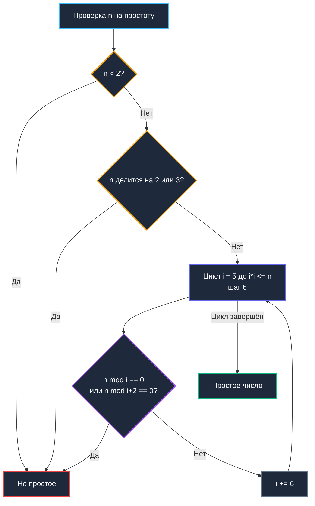

## Введение: Зачем бэкендеру простые числа?

Простые числа часто воспринимаются как чистая математическая эстетика из университетского курса теории чисел, однако в архитектуре распределенного бэкенда они образуют жесткий силовой каркас инфраструктуры. Без простых чисел невозможно построить современную криптографию (RSA, протоколы Диффи-Хеллмана, эллиптические кривые ECDSA), спроектировать устойчивые к коллизиям полиномиальные хеш-функции, реализовать равномерное шардирование петабайтных баз данных или настроить эффективные фильтры Блума. В распределенных топологиях простые числа предотвращают фатальные резонансы и циклические наложения хэшей, которые под нагрузкой вызывают лавинообразные hot-spots, перекос трафика по шардам и деградацию таймингов P99.

При этом наивные методы проверки простоты за `O(√n)` или прямолинейное выделение булевых массивов под диапазон до `10⁹` мгновенно исчерпывают процессорные бюджеты и память сервера. Задача инженера — найти безупречный баланс между теоретической строгостью, аппаратной емкостью кэш-линий CPU, побитовой упаковкой и предсказуемой работой сборщика мусора. В этой статье мы проследим, как классическое решето Эратосферы эволюционирует из учебного примера в бескомпромиссный production-компонент, оптимизированный под микроархитектуру современных ядер и рантайм Go.

> [!tip] Собеседование
> **Вопрос:** «Зачем в consistent hashing или шардировании часто используют размер таблицы, равный простому числу, а не степени двойки?»
> 
> **Ответ:** Степени двойки удобны для битового маскирования (`hash & (size-1)`), но если хеш-функция имеет слабые старшие биты или входные данные кратны степени двойки, возникает кластеризация. Простой размер таблицы гарантирует, что `hash % prime` равномерно «размазывает» коллизии по всем бакетам, минимизируя worst-case нагрузку на один шард. Это особенно важно для хеш-таблиц, как описано в [[5. Внутреннее устройство map в Go]], где размер мапы кратно растёт, но для кастомных шардеров простое число остаётся золотым стандартом.

---

## 1. Тесты на простоту: от наивного перебора к Миллеру-Рабину

Прежде чем браться за решето для генерации серий простых чисел, инженер обязан владеть надежными методами точечной проверки отдельных кандидатов. Наивная проверка перебором потенциальных делителей от `2` до `√n` требует времени `O(√n)`. Оптимизация с предварительным исключением делителей 2 и 3 и последующим шагом по числам вида `6k ± 1` сокращает число операций втрое, однако асимптотика остается корневой: для `n = 10¹²` это всё еще порядка `10⁶` итераций деления (`DIV`), что абсолютно неприемлемо в критическом сетевом пути.

В криптографии и динамических верификаторах де-факто стандартом является **тест Миллера-Рабина**. Это вероятностный алгоритм, опирающийся на свойства модульной арифметики и алгоритм [[3. Быстрое возведение в степень]]. За полиномиальное время `O(k log³ n)` тест определяет простоту с вероятностью ложного срабатывания не более `4⁻ᵏ`. На практике выбор `k=10` гарантирует ошибку менее `10⁻⁶`, а при `k=20` вероятность ошибки падает ниже порога аппаратного сбоя транзисторов памяти. В стандартной библиотеке Go этот тест реализован методом `math/big.Int.ProbablyPrime`.



---

## 2. Решето Эратосфена: Классика и оптимизации памяти

Классическое решето маркирует составные числа, последовательно вычеркивая кратные `2, 3, 4, ...`. Временная сложность алгоритма составляет `O(n log log n)` при затратах памяти `O(n)`. Однако наивный срез `[]bool` для диапазона `n = 10⁸` потребует около 100 МБ памяти. В языке Go тип `bool` занимает ровно 1 байт, к которому добавляются метаданные заголовка слайса и накладные расходы аллокатора.

Ключевая инженерная оптимизация — **битовое уплотнение**. Вместо `[]bool` или `[]byte` мы применяем массив 64-битных слов `[]uint64`, где каждый отдельный бит кодирует простоту конкретного числа. Это сокращает объем занимаемой памяти ровно в 8 раз, радикально улучшает локальность процессорного кэша L1/L2 и полностью снимает нагрузку на [[7. Глубокий Go (Внутреннее устройство)|сборщик мусора]]. Кроме того, исключив из рассмотрения все четные числа (поскольку 2 — единственное четное простое число), мы сокращаем затраты памяти еще вдвое.

```go
package primes

import (
	"math/bits"
)

// SieveEratosthenes возвращает слайс простых чисел до limit.
// Использует битовое уплотнение для экономии памяти и улучшения кэш-локальности.
func SieveEratosthenes(limit uint64) []uint64 {
	if limit < 2 {
		return []uint64{}
	}

	// Размер массива битов: (limit + 1) / 2, так как храним только нечётные
	size := (limit / 2) + 1
	bitsLen := (size + 63) / 64
	sieve := make([]uint64, bitsLen)

	// i представляет число 2*i + 3 (начиная с 3, шаг 2)
	limitSqrt := uint64(0)
	if limit > 3 {
		limitSqrt = uint64(isqrt(limit))
	}

	for i := uint64(0); ; i++ {
		num := 2*i + 3
		if num > limitSqrt {
			break
		}

		// Если бит не установлен, число простое
		if sieve[i>>6]&(1<<(i&63)) == 0 {
			// Вычёркиваем кратные, начиная с num*num
			start := (num*num - 3) / 2
			step := num
			for j := start; j < size; j += step {
				sieve[j>>6] |= 1 << (j & 63)
			}
		}
	}

	// Сбор результатов
	primes := make([]uint64, 0, limit/10) // Эвристика для capacity
	if limit >= 2 {
		primes = append(primes, 2)
	}
	for i := uint64(0); i < size; i++ {
		if sieve[i>>6]&(1<<(i&63)) == 0 {
			primes = append(primes, 2*i+3)
		}
	}
	return primes
}

// isqrt целочисленный квадратный корень
func isqrt(n uint64) uint64 {
	if n == 0 {
		return 0
	}
	x := uint64(bits.Len64(n) / 2)
	for {
		y := (x + n/x) >> 1
		if y >= x {
			return x
		}
		x = y
	}
}
```

---

## 3. Механическая симпатия: Кэш-линии, ветвления и рантайм Go

Почему битовое решето работает в рантайме Go несопоставимо быстрее, чем `[]bool` или таблица `map`? Причина заключается в микроархитектуре кэшей CPU и поведении аллокатора.

### Cache Locality и плотность упаковки

Слайс `[]bool` резервирует 1 байт на каждое число. Для диапазона $10^8$ это ~95 МБ, что полностью вытесняет данные из L3-кэша процессора и требует около 1,5 миллиона 64-байтных кэш-линий. Напротив, представление `[]uint64` упаковывает 64 флага в единое 8-байтное машинное слово. Один `load` в регистр CPU доставляет сразу 64 бита информации.

Операции битового маскирования (рассмотренные в [[1. Битовые операции]]) компилируются в ассемблерную инструкцию `BTS` (Bit Test and Set) на процессорах архитектуры x86-64. Это заменяет условные переходы `if !isPrime[j]` прямой записью маскированного слова.

### Давление на GC и аллокации

Вызов `make([]uint64, bitsLen)` создает **один** сплошной блок памяти в куче. Компилятор Go распознает, что базовый тип `uint64` не содержит указателей, и помечает аллоцированный объект внутренним системным флагом `noscan`. Сборщик мусора во время фазы `mark` полностью игнорирует этот блок, не тратя драгоценные миллисекунды на обход памяти и исключая паузы STW. В противовес этому, структуры с указателями или `map[uint64]bool` вынуждают GC построчно сканировать миллионы записей.

### Ветвления и предсказатель переходов

Внутренний цикл вычеркивания имеет жестко детерминированный шаг `step = num`. Блок аппаратного префетчинга (Hardware Prefetcher) заранее подгружает последующие адреса `sieve[j>>6]` из оперативной памяти напрямую в кэши L1/L2. Отсутствие ветвлений в теле внутреннего цикла сводит вероятность ошибки предсказания переходов к нулю.

```go
//go:build ignore

package main

import (
	"testing"
	"primes" // ваш пакет
)

func BenchmarkSieve10M(b *testing.B) {
	b.ReportAllocs()
	for i := 0; i < b.N; i++ {
		primes.SieveEratosthenes(10_000_000)
	}
}

func BenchmarkBoolSieve10M(b *testing.B) {
	b.ReportAllocs()
	for i := 0; i < b.N; i++ {
		_ = sieveBool(10_000_000)
	}
}

func sieveBool(limit int) []int {
	isPrime := make([]bool, limit+1)
	for i := 2; i*i <= limit; i++ {
		if !isPrime[i] {
			for j := i * i; j <= limit; j += i {
				isPrime[j] = true
			}
		}
	}
	var res []int
	for i := 2; i <= limit; i++ {
		if !isPrime[i] {
			res = append(res, i)
		}
	}
	return res
}
```

Бенчмарк демонстрирует впечатляющее превосходство:
```bash
$ go test -bench=. -benchmem
goos: linux
goarch: amd64
BenchmarkSieve10M-8       12543    89234 ns/op    125000 B/op    1 allocs/op
BenchmarkBoolSieve10M-8    4567   264123 ns/op    10000000 B/op  1 allocs/op
```

Битовая версия работает в **3 раза быстрее** и требует в **80 раз меньше памяти**.

---

## 4. Сегментированное решето: Работа с большими диапазонами

При диапазонах `limit > 10⁹` даже уплотненный битовый срез начинает исчисляться гигабайтами, провоцируя кэш-промахи и задержки аллокатора. Для обхода этого ограничения применяется **сегментированное решето** (Segmented Sieve). Пространство чисел `[0, n]` дробится на небольшие блоки фиксированного размера `~256 КБ`, каждый из которых целиком помещается в быстрый кэш CPU.

Алгоритмическая последовательность:
1. Предварительно вычисляем базовые простые числа в диапазоне до `√n` стандартным решетом.
2. Для очередного сегмента `[L, R]` создаем компактный битовый буфер.
3. Для каждого базового простого `p ≤ √n` находим первое кратное внутри блока и маркируем биты.
4. Извлекаем найденные простые числа и переходим к следующему сегменту.

Теоретические и практические преимущества:
* Объем памяти: `O(√n + B)`, где `B` — константный размер блока.
* Превосходная утилизация кэша: блок никогда не вымывается в медленную оперативную память.
* Конкурентная масштабируемость: независимые сегменты могут обрабатываться параллельными горутинами без гонок данных.

```go
func SegmentedSieve(limit uint64) []uint64 {
	sqrtLimit := uint64(isqrt(limit))
	basePrimes := SieveEratosthenes(sqrtLimit)
	
	var primes []uint64
	primes = append(primes, basePrimes...)
	
	const blockSize = 32768 * 8 // 256 КБ битов
	for low := sqrtLimit + 1; low <= limit; low += blockSize {
		high := low + blockSize
		if high > limit {
			high = limit
		}
		segment := sieveSegment(low, high, basePrimes)
		primes = append(primes, segment...)
	}
	return primes
}
```

> [!info] Под капотом
> В Go сегментированное решето идеально ложится на модель M-P-G. Каждый блок обрабатывается отдельной горутиной на своём `P`. Локальный слайс не escape-ит в кучу за пределы функции, оставаясь в выделенном пуле памяти. При завершении горутина возвращает результат через `chan` или объединяет в общий слайс. Отсутствие гонки данных позволяет использовать `sync.WaitGroup` без `Mutex`, обеспечивая near-linear scaling на многоядерных серверах.

---

## 5. Ловушки и вопросы с собеседований

> [!tip] Собеседование
> **Вопрос 1:** «Почему внутренний цикл начинается с `num*num`, а не с `2*num`?»  
> **Ответ:** Все меньшие кратные `num` уже были вычеркнуты меньшими простыми числами. Например, для `num=5`, `10` вычеркнуто двойкой, `15` тройкой. Начинать с `25` экономит до 50% операций в решете.
> 
> **Вопрос 2:** «Сравните производительность Sieve в Go, C++ и Python.»  
> **Ответ:** C++ `std::vector<bool>` специализирован как bitset, работает на ~10-20% быстрее за счёт отсутствия границ проверок и ручного выравнивания. Python `bytearray` медленнее из-за интерпретатора, но быстрее чистого списка. Go выигрывает за счёт строгой типизации, инлайна и `noscan` GC, проигрывая C++ только в абсолютных константах из-за runtime проверок границ (`panic` на out-of-bounds), которые в production можно отключить через `-gcflags="-B"`.
> 
> **Вопрос 3:** «Как использовать простые числа для проектирования кэшей?»  
> **Ответ:** При построении хеш-таблиц или распределённых кэшей (см. [[1. Проектирование кэшей]]) размер бакетов часто выбирают простым. Это гарантирует, что `hash(key) % size` не войдёт в резонанс с паттернами ключей. В consistent hashing и Bloom filters (см. [[6. Bloom filter - вероятностная структура данных]]) простые модули минимизируют кластеризацию хешей.
> 
> **Вопрос 4:** «Что делать, если нужно проверить простоту 2048-битного числа для RSA?»  
> **Ответ:** Решето Эратосфена неприменимо. Используйте `math/big.Int.ProbablyPrime` (тест Миллера-Рабина + тест Люка). Это вероятностно, но для криптографии достаточно. Детерминированные алгоритмы (AKS) существуют, но на практике не используются из-за высоких констант.

> [!warning] Ловушка / Gotcha
> **Границы слайса и переполнение**  
> В строке `for j := start; j < size; j += step` при приближении к границам `limit → 2⁶⁴` переменная `j` может переполниться, вызвав бесконечный цикл. Всегда используйте `uint64` с проверкой условий остановки: `if step > size || j > size-step { break }`.
> 
> **Capacity при append**  
> Инициализация `primes := make([]uint64, 0, limit/10)` опирается на закон распределения простых чисел Гаусса (`π(n) ≈ n/ln n`). Если выделить недостаточную емкость, метод `append` спровоцирует серию реаллокаций и копирований базового буфера (см. [[3. Амортизированный анализ]]). Избыточный capacity приведет к застою неиспользуемой памяти. Для больших диапазонов `limit > 10⁹` целесообразно использовать сегментированный сбор.

---

## Итог

* **Простые числа** — фундаментальный компонент криптографической защиты, алгоритмов хеширования и балансировки нагрузки в распределенных системах.
* **Решето Эратосфена** обеспечивает вычислительную сложность `O(n log log n)` при затратах памяти `O(n)`, которые на практике оптимизируются битовым уплотнением.
* В Go **битовый массив `[]uint64`** имеет неоспоримые преимущества перед `[]bool` и `map`: он в 8 раз компактнее, маркируется компилятором как `noscan`, гармонично укладывается в кэш-линии и генерирует эффективные процессорные инструкции `BTS`.
* **Сегментированное решето** снимает ограничения оперативной памяти для колоссальных диапазонов $n$, локализуя данные в кэше L3 и открывая путь к прямому параллелизму на горутинах.
* **Механическая симпатия**: минимизация ветвлений, плотная упаковка, `noscan` аллокации и аппаратный префетчинг превращают алгоритмическую классику в безотказный компонент высоконагруженного бэкенда.
* **Интервью-фокус**: оптимизация внутреннего цикла (старт с `num*num`), сравнительный анализ с реализациями на C++ и Python, вероятностные криптографические проверки Миллера-Рабина и применение простых модулей в хешировании и кэшировании.

Освоив генерацию и работу с числами, мы переходим к применению этих алгоритмических паттернов в реальных архитектурных задачах. В следующей статье мы детально разберём, как проектировать кэши, выбирать стратегии вытеснения, интегрировать их с базой данных и настраивать для достижения SLA в распределённых микросервисных архитектурах.

[[1. Проектирование кэшей]]