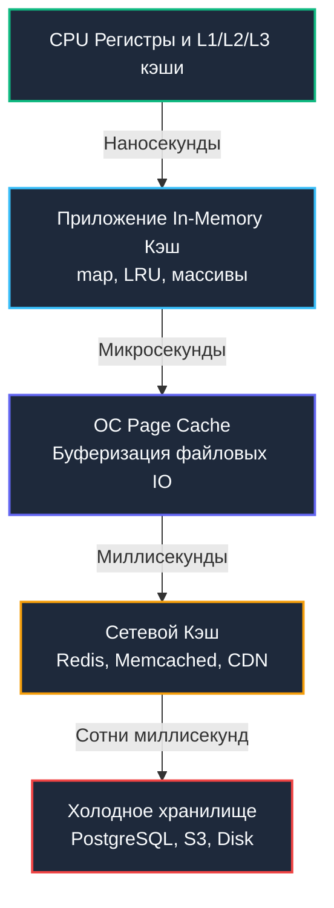
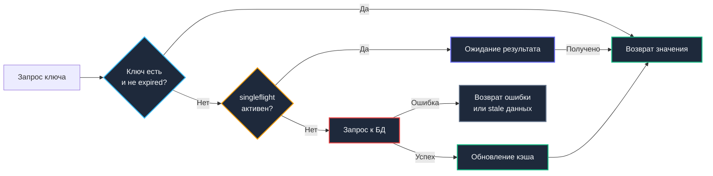

## Введение: Кэш как архитектурный компромисс

В инженерной практике проектирования высоконагруженного бэкенда кэш — это не просто тривиальная быстрая `map` в оперативной памяти. Это глубокий, многофакторный компромисс между строгой или слабой согласованностью данных, потреблением RAM, сетевыми задержками дискового и межнодового IO, а также выживаемостью кластера в момент пиковых нагрузок и аварий. Ошибка в выборе алгоритма инвалидации или игнорирование паттернов конкурентного доступа превращают кэширующий слой из спасительного ускорителя в первопричину лавинообразных отказов (`cache avalanche`), деградации таймингов P99 и падения баз данных.

Эта статья систематизирует фундаментальные инженерные паттерны проектирования кэширующих систем на Go. Мы исследуем, как объединять специализированные структуры данных из [[7. LRU кэш]], [[8. LFU кэш]] и [[6. Bloom filter - вероятностная структура данных]] с примитивами синхронизации рантайма, строя отказоустойчивые, линейно масштабируемые и предсказуемые по потреблению памяти решения.

> [!tip] Собеседование
> **Вопрос:** «Почему 90% микросервисов используют паттерн Cache-Aside, а не Read-Through или Write-Through?»
> 
> **Ответ:** Cache-Aside (Lazy Loading) даёт разработчику полный контроль над жизненным циклом данных. Сервис сам решает, когда кэшировать, когда инвалидировать и как обрабатывать ошибки БД. Read/Write-Through требует сложной абстракции провайдера кэша, который становится единой точкой отказа. В микросервисной архитектуре, где данные распределены и схемы чтения/записи различаются, явное управление в коде надёжнее скрытой логики фреймворка.

---

## 1. Паттерны взаимодействия с источником данных

Выбор архитектурного паттерна определяет границы ответственности: кто управляет согласованностью и как система реагирует на мутации данных.

| Паттерн | Механика | Гарантии согласованности | Сложность реализации в Go |
|---|---|---|---|
| **Cache-Aside** | Приложение читает кэш → при промахе читает БД → пишет в кэш | Eventual, риск stale данных до TTL или ручной инвалидации | Низкая |
| **Read-Through** | Кэш сам запрашивает БД при промахе через коллбек | Зависит от реализации callback провайдера | Средняя |
| **Write-Through** | Запись идёт в кэш и синхронно фиксируется в БД | Сильная, но задержка равна sum(kэш + БД) | Высокая |
| **Write-Behind** | Запись в кэш, асинхронный батчинг изменений в БД | Высокий риск потери данных при crash сервиса | Очень высокая |

В Go паттерн Cache-Aside реализуется наиболее естественно и прозрачно. Кэш остается компактной структурой данных, а бизнес-логика оркестрирует потоки:

```go
package cache

import (
	"context"
	"time"
)

func GetUser(ctx context.Context, id string) (*User, error) {
	if u, ok := localCache.Get(id); ok {
		return u, nil
	}
	
	u, err := db.FetchUser(ctx, id)
	if err != nil {
		return nil, err
	}
	
	localCache.Set(id, u, time.Minute*5)
	return u, nil
}
```

> [!warning] Ловушка / Gotcha
> **Гонка инвалидации в Cache-Aside**  
> При конкурентном обновлении и параллельном чтении возможен классический рассинхрон: Горутина A читает БД (v1) → Горутина B пишет БД (v2) и инвалидирует кэш → Горутина A сохраняет v1 в кэш. В результате кэш навечно фиксирует устаревшую версию данных v2. Решение: версионирование записей (versioning), атомарный compare-and-swap при вызове `Set`, либо укороченный `TTL` с фоновым обновлением.

---

## 2. Иерархия локальности и границы ответственности

Эффективная архитектура кэширования в Go проектируется с оглядкой на физическую пирамиду задержек. Данные мигрируют от сверхбыстрых, но минимальных объемов памяти ядра к емким, но инерционным сетевым хранилищам.



**Фундаментальный принцип:** Кэш обязан располагаться как можно ближе к потребителю, не дублируя функционал нижележащих ступеней.
* Если частота чтения доминирует над записью и рабочий набор (working set) целиком помещается в память хоста — выбирайте **локальный in-memory кэш**. Сетевой RTT в Redis (0.5–2 мс) на 4–5 порядков медленнее прямого локального разыменования указателя (10–100 нс).
* Если данные должны оставаться строго консистентными между десятками реплик пода или их объем превосходит емкость RAM отдельного узла — незаменим **распределённый кэш**.
* Двухуровневый гибрид (L1 Local In-Memory + L2 Remote Redis) сочетает достоинства обоих подходов: горячие ключи обслуживаются мгновенно, а промахи первого уровня поглощаются общим кэш-кластером.

---

## 3. Конкурентность в Go-кэшах

Одиночный глобальный мьютекс `sync.RWMutex` отлично держит нагрузку до 10 000–20 000 RPS. Однако при дальнейшем росте трафика система упирается в lock contention: горутины массово засыпают в системном вызове `futex`, планировщик Go тратит драгоценное время на переключение тредов ОС, а латентность P99 стремительно уходит в небеса. Промышленным стандартом решения этой проблемы является **шардирование кэша** (Cache Sharding).

Архитектура шардированного кэша:
1. Хранилище разбивается на $N$ независимых сегментов (обычно $N = 16, 32, 64$ или вычисляется как `nextPow2(runtime.NumCPU() * 2)`).
2. Каждый сегмент изолирован собственным `sync.RWMutex` и персональной хеш-таблицей/LRU-очередью.
3. Входящий ключ направляется в сегмент по формуле `hash(key) % N`.

Такой шардинг снижает конкуренцию за блокировку ровно в $N$ раз:

```go
package cache

type shard[K comparable, V any] struct {
	// локальный мьютекс и хранилище
}

type ShardedCache[K comparable, V any] struct {
	shards []*shard[K, V]
	mask   uint32 // N-1 для быстрого hash % N через AND
	hash   func(K) uint32
}

func (c *ShardedCache[K, V]) Get(key K) (V, bool) {
	idx := c.hash(key) & c.mask
	return c.shards[idx].Get(key)
}
```

Для защиты от явления **Cache Stampede** (или Thundering Herd, когда тысячи параллельных горутин при промахе по популярному ключу одновременно бросаются в базу данных) применяется пакет `golang.org/x/sync/singleflight`. Он объединяет однотипные конкурентные вызовы в единую операцию, возвращая общий результат всем ожидающим горутинам.

> [!info] Под капотом
> Внутренности `singleflight`: пакет использует `sync.Map` для отслеживания активных вызовов по ключу и `sync.Cond` для ожидания. Когда первый вызов завершается, он вызывает `cond.Broadcast()`, разблокируя всех ожидающих. Это эффективнее `chan`, так как не требует создания канала на каждый ключ и работает с пулом структур ожидания.

---

## 4. Механическая симпатия и управление памятью

Проектирование кэша без оглядки на [[7. Глубокий Go (Внутреннее устройство)|сборщика мусора]] и архитектуру кэшей процессора приводит к деградации сервиса при длительном аптайме.

### Давление на GC и аллокации

Каждый вызов `cache.Set` аллоцирует запись. При высоком темпе обновления (churn rate) сборщик мусора тратит колоссальные ресурсы на фазу mark-and-sweep.  
**Оптимизация:** Применяйте `[[16. Профилирование, отладка и производительность|sync.Pool]]` для повторного использования контейнеров и буферов. При операциях вытеснения (`Evict`) или устаревания (`Expire`) не бросайте объект на растерзание GC, а возвращайте его в пул: `cache.pool.Put(item)`. Это минимизирует системные вызовы `mallocgc` и удерживает паузы STW около нуля.

### False Sharing в шардированных кэшах

Если массив структур шардов размещен в непрерывном блоке памяти, а ядра процессора параллельно модифицируют смежные шарды, попадающие в одну 64-байтную кэш-линию, возникает губительный эффект **False Sharing**. Протокол аппаратной когерентности кэшей (MESI) будет непрерывно сбрасывать кэш-линию на всех ядрах, разрушая параллелизм.  
**Решение:** Выравнивать структуры шардов по границе 64 байт с помощью паддинга: `_ [56]byte` между критическими полями структуры. На Go 1.21+ это часто нивелируется размером `sync.Mutex`, но для кастомных и lock-free структур padding остаётся обязательным.

### Escape Analysis и упаковка значений

Использование нетипизированного интерфейса `any` (или `interface{}`) влечет за собой создание 16-байтового интерфейсного дескриптора и принудительную аллокацию полезной нагрузки в куче. В современном Go опирайтесь на дженерики: `Cache[K comparable, V any]`. Если тип `V` представляет собой компактную структуру без указателей, компилятор разместит ее плоско, улучшая пространственную локальность и кэширование CPU.

---

## 5. Защита от каскадных отказов

Надежный кэш спроектирован так, чтобы защищать базу данных от перегрузок, а не усугублять кризис при сбоях.

1. **Circuit Breaker**: При каскадном росте ошибок соединения к распределенному кэшу или основной БД цепь размыкается, предотвращая напрасный расход потоков на заведомо провальные попытки.
2. **Probabilistic Early Expiration (Jitter)**: Вместо жестко фиксированного времени жизни (`TTL`), приводящего к лавинообразному одновременному протуханию миллионов ключей, добавляется стохастический разброс: `TTL + rand(-10%, +10%)`. Это равномерно размазывает нагрузку на инвалидацию по временной шкале, предотвращая `cache avalanche`.
3. **Background Refresh**: При достижении 80% от времени `TTL` асинхронная горутина инициирует фоновый прогрев ключа. Читающие клиенты продолжают получать данные с нулевой латентностью, пока свежая версия подтягивается в фоне.



---

## 6. Ловушки production и хардкор-собеседования

> [!tip] Собеседование
> **Вопрос 1:** «Как решить проблему Cache Penetration, когда злоумышленник запрашивает несуществующие ключи?»  
> **Ответ:** Кэш всегда будет miss, запросы пойдут в БД. Решения: 1. Валидация ввода на уровне API. 2. Кэширование `null` для отсутствующих ключей с очень коротким TTL. 3. Использование [[6. Bloom filter - вероятностная структура данных]] перед проверкой кэша. Bloom filter за `O 1` определит, что ключа точно нет в БД, и отсечёт запрос без IO.
> 
> **Вопрос 2:** «Что произойдёт, если Redis упадёт, а приложение продолжит писать в кэш?»  
> **Ответ:** Если не настроен fallback или circuit breaker, горутины будут получать ошибки записи, тратить ресурсы на retries и блокироваться. Приложение начнёт деградировать. Правильная архитектура: при недоступности кэша переключаться в режим «только чтение из БД» или использовать локальный fallback-кэш с меньшим TTL.
> 
> **Вопрос 3:** «Почему не стоит использовать `sync.Map` для реализации LRU-кэша?»  
> **Ответ:** `sync.Map` оптимизирован под сценарии «много чтений, редкие записи» или «только добавление». Для кэша с частым удалением (eviction) и обновлением приоритетов он будет постоянно создавать `dirty` массив, что приведёт к `O n` аллокациям и падению производительности. Для кэшей всегда используйте шардированные `sync.RWMutex` или lock-free очереди.
> 
> **Вопрос 4:** «Как обеспечить сильную согласованность между кэшем и транзакционной БД?»  
> **Ответ:** Строго говоря, это невозможно без распределённых транзакций. На практике используют: 1. Outbox Pattern: пишем событие обновления в БД в той же транзакции, фоновый процесс шлёт его в кэш. 2. CDC: слушаем binlog/postgres logical replication и инвалидируем кэш. 3. Короткие TTL + Cache-Aside как fallback для остаточных рассинхронизаций.

> [!warning] Ловушка / Gotcha
> **Сериализация и десериализация**  
> Если вы сохраняете в кэше срез `[]byte` (например, JSON-пейлоад), убедитесь, что не выполняете `json.Unmarshal` на каждое чтение. Парсинг текстовых форматов в Go сопряжен с множественными аллокациями. Кэшируйте уже десериализованные Go-структуры либо переходите на бинарные форматы (`MsgPack`, `Protobuf`, `FlatBuffers`).
> 
> **Утечка памяти через замыкания**  
> Если коллбек `onEvict` захватывает контекст объемных структур данных, сборщик мусора не сможет освободить их даже после удаления ключа из кэша. Передавайте в замыкания только примитивные идентификаторы или используйте паттерны с `weak references`.

---

## Итог

* **Проектирование кэша** — это инженерный поиск баланса между согласованностью, задержкой, объемом памяти и устойчивостью кластера при авариях.
* В Go связка **Cache-Aside + singleflight** решает 80% типовых задач. Шардирование хранилища по маске `hash(key) & (N-1)` снимает взаимную блокировку горутин.
* **Механическая симпатия**: задействуйте `sync.Pool` для переиспользования буферов, избегайте оверхеда типа `any`, защищайте структуры от False Sharing и учитывайте нагрузку на [[7. Глубокий Go (Внутреннее устройство)|GC]].
* **Защита от отказов**: вероятностный джиттер TTL, Circuit Breaker, фильтры Блума от атак Cache Penetration и фоновый асинхронный прогрев данных.
* **Сильная согласованность** достигается через связку CDC или Outbox Pattern, однако в большинстве случаев достаточна eventual consistency с коротким TTL и детерминированной инвалидацией.
* **Интервью-фокус**: глубокое понимание Cache Stampede / Avalanche / Penetration, компромиссы между локальным и распределенным слоями, реализация алгоритмов вытеснения под конкурентной нагрузкой.

Понимание паттернов кэширования позволяет проектировать устойчивые к высокой нагрузке сервисы. Однако кэш и очередь — это лишь часть системы управления потоком данных. Когда трафик превышает пропускную способность, нам нужны алгоритмы, которые детерминированно ограничивают запросы, защищая инфраструктуру от перегрузки. В следующей статье мы детально разберём Token Bucket, Leaky Bucket, Sliding Window и их реализацию на атомиках и кольцевых буферах.

[[2. Rate limiting алгоритмы]]