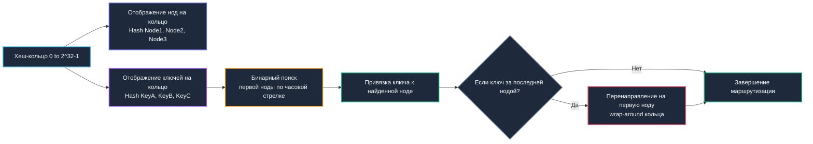
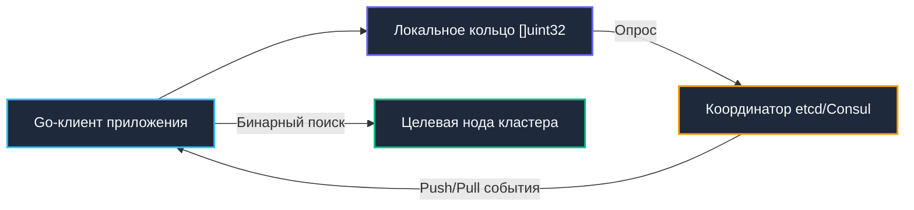

## Введение: Проблема стандартного хеширования и необходимость кольца

В распределенных системах, кластерах кэширования и шардированных хранилищах данных маршрутизация входящих запросов исторически строилась по наивной формуле `hash(key) % N`, где $N$ — число активных вычислительных узлов. Эта схема подкупает математической простотой, однако с инженерной точки зрения таит колоссальную архитектурную угрозу. При динамическом изменении топологии кластера — добавлении новой ноды для масштабирования или аварийном выводе вышедшего из строя сервера — делитель $N$ изменяется. Вследствие этого практически все существующие ключи меняют свои целевые бакеты.

Результатом становится катастрофический лавинообразный сбой кэша (**cache avalanche**): до 80–90% запросов мгновенно терпят промах (cache miss), вся нагрузка многократным цунами обрушивается на реляционные базы данных, время отклика взлетает на порядки, а система погружается в состояние каскадного отказа (cascade failure).

Алгоритм **Consistent Hashing** (консистентное хеширование) устраняет этот фундаментальный изъян математически. При изменении числа узлов кластера с $N$ до $N \pm 1$ миграции подлежит строго $1/N$ часть данных, или пропорционально `K / N` ключей, где $K$ — общее число записей. Это элегантное свойство сделало алгоритм фундаментом для Amazon DynamoDB, Apache Cassandra, Redis Cluster, глобальных сетей доставки контента (CDN) и внутренних балансировщиков RPC-трафика. В Go консистентное хеширование применяется повсеместно: от сетевых маршрутизаторов до распределенных rate-лимитеров и шардированных очередей сообщений.

> [!tip] Собеседование
> **Вопрос:** «Почему при масштабировании Redis-кластера с 3 до 4 нод при использовании `hash % N` происходит массовый сбой, а consistent hashing спасает ситуацию?»
> 
> **Ответ:** При `hash % N` меняется модуль, поэтому остаток для большинства ключей изменяется непредсказуемо. Клиенты начинают стучаться в другие ноды, получают промахи и идут в БД. Consistent hashing отображает ноды и ключи на общее пространство `[0, 2^32-1]`. При удалении ноды ключи переходят только к следующей ноде по часовой стрелке, сохраняя локальность остальных. Перемаппинг затрагивает лишь `1/N` данных, что делает добавление и удаление нод предсказуемым и безопасным.

---

## 1. Математическое ядро: Хеш-кольцо и бинарный поиск

Алгоритм разворачивает абстрактное замкнутое числовое кольцо в диапазоне значений от `0` до `MaxUint32` ($2^{32} - 1$). Каждая нода кластера хешируется (по сетевому IP-адресу или строковому идентификатору) и занимает фиксированную позицию на окружности. Ключи данных хешируются той же самой хеш-функцией. Правило маршрутизации предельно наглядно: ключ закрепляется за первой встретившейся нодой при движении по часовой стрелке.

В программной реализации для поиска целевого узла используется отсортированный срез позиций на кольце и классический **бинарный поиск**. Это гарантирует временную сложность `O(log M)`, где $M$ — суммарное число зарегистрированных виртуальных позиций.



Ключевой алгоритмический инвариант: само кольцо неизменно, мутируют лишь метки на нем. Включение нового сервера отбирает сегмент ключей исключительно у его непосредственного соседа по часовой стрелке. Аварийный вывод узла передает его диапазон следующему узлу. Все остальные сегменты кольца остаются абсолютно интактными.

---

## 2. Production-реализация на Go

В Go консистентное кольцо реализуется комбинацией отсортированного слайса `[]uint32` (для бинарного поиска) и хеш-таблицы для мгновенного сопоставления позиции с физическим объектом ноды. Для синхронизации конкурентного доступа используется `sync.RWMutex`, поскольку мутации топологии происходят редко, а чтение маршрутов выполняется на каждом входящем запросе.

```go
package consistenthash

import (
	"sort"
	"strconv"
	"sync"

	"github.com/cespare/xxhash/v2"
)

const defaultVirtualNodes = 150

// Ring представляет consistent hash кольцо
type Ring struct {
	mu        sync.RWMutex
	nodes     []uint32         // Отсортированные позиции виртуальных нод
	positions map[uint32]*Node // Мапа позиция -> нода
	vnodes    int              // Число виртуальных нод на физическую
}

// Node описывает физическую ноду кластера
type Node struct {
	ID   string
	Data any // Полезная нагрузка, например *redis.Client
}

// New создаёт пустое кольцо с заданным числом виртуальных нод
func New(vnodes int) *Ring {
	if vnodes <= 0 {
		vnodes = defaultVirtualNodes
	}
	return &Ring{
		nodes:     make([]uint32, 0, vnodes*16),
		positions: make(map[uint32]*Node, vnodes*16),
		vnodes:    vnodes,
	}
}

// AddNode добавляет ноду в кольцо
func (r *Ring) AddNode(node *Node) {
	r.mu.Lock()
	defer r.mu.Unlock()

	for i := 0; i < r.vnodes; i++ {
		// Генерируем уникальную позицию для каждой виртуальной ноды
		pos := xxhash.Sum64String(node.ID + "-" + strconv.Itoa(i))
		r.nodes = append(r.nodes, uint32(pos))
		r.positions[uint32(pos)] = node
	}
	sort.Slice(r.nodes, func(i, j int) bool {
		return r.nodes[i] < r.nodes[j]
	})
}

// RemoveNode удаляет ноду и её виртуальные копии
func (r *Ring) RemoveNode(nodeID string) {
	r.mu.Lock()
	defer r.mu.Unlock()

	for i := 0; i < r.vnodes; i++ {
		pos := xxhash.Sum64String(nodeID + "-" + strconv.Itoa(i))
		delete(r.positions, uint32(pos))
	}
	// Пересобираем массив nodes без удалённых позиций
	filtered := make([]uint32, 0, len(r.nodes)-r.vnodes)
	for _, pos := range r.nodes {
		if _, exists := r.positions[pos]; exists {
			filtered = append(filtered, pos)
		}
	}
	r.nodes = filtered
}

// GetNode возвращает ноду для заданного ключа
func (r *Ring) GetNode(key string) *Node {
	if len(r.nodes) == 0 {
		return nil
	}

	hash := uint32(xxhash.Sum64String(key))

	r.mu.RLock()
	defer r.mu.RUnlock()

	// Бинарный поиск первой позиции >= hash
	idx := sort.Search(len(r.nodes), func(i int) bool {
		return r.nodes[i] >= hash
	})

	// Если ключ попал за последнюю ноду, wrap-around на начало
	if idx == len(r.nodes) {
		idx = 0
	}

	return r.positions[r.nodes[idx]]
}
```

Инженерные решения:
* **Выбор `xxhash`**: Криптографические алгоритмы (`SHA256`, `MD5`) вычислительно избыточны и тратят сотни тактов ядра. Быстрый некриптографический хешер `xxhash` (или `MurmurHash3`) обеспечивает великолепное лавинное распределение за минимальное время и нулевые аллокации.
* **`sort.Search` без аллокаций**: Компилятор Go превращает замыкание в предикате `sort.Search` в компактный цикл регистрового бинарного поиска. Логарифмическая сложность `O(log M)` дает гарантированное микросекундное время ответа.
* **Связка массива и мапы**: Хеш-таблица `positions` предоставляет моментальное $O(1)$ разыменование указателя на `Node` сразу после обнаружения целевой точки на числовой оси. Двойная структура данных (`массив + мапа`) — классический trade-off consistent hashing.

---

## 3. Виртуальные ноды: Балансировка нагрузки и trade-offs

Если размещать на кольце только одиночные физические серверы, статистическая погрешность хеш-функции неизбежно приведет к неравномерности (skew): один сервер получит 60% трафика, а остальные будут простаивать. Механизм **виртуальных нод** (Virtual Nodes, vnodes) дробит каждый физический сервер на $V$ квази-точек, хаотично разбросанных по периметру окружности. При выборе `V=100..200` нагрузка выравнивается с математической точностью: коэффициент вариации снижается до `σ/μ < 0.1`.

| Число виртуальных нод (V) | Равномерность нагрузки | Память на ноду | Скорость GetNode |
|---|---|---|---|
| **1–10** | Низкая, высокий skew | Минимальная | Очень высокая |
| **100–200** | Оптимальная | ~3–5 КБ | Высокая |
| **1000+** | Идеальная | ~30–50 КБ | Снижается из-за log M |

В бэкенде на Go константа `V=150` является общепризнанным отраслевым стандартом. При кластере из 10 физических серверов общее кольцо содержит всего 1500 целочисленных элементов, что целиком помещается в быстрый кэш L2 процессора и не создает заметного давления на [[7. Глубокий Go (Внутреннее устройство)|сборщик мусора]].

> [!warning] Ловушка / Gotcha
> **Удаление ноды и пересборка массива**  
> В приведенной реализации метод `RemoveNode` фильтрует срез `[]uint32`, создавая новый массив. Это операция со сложностью $O(M)$. Если топология кластера подвержена высокочастотному автоскейлингу Kubernetes каждую минуту, это может стать узким местом. Решение: ленивое удаление (lazy deletion) с маркировкой узла флагом `active` в таблице либо переход на красно-черное дерево, хотя в подавляющем большинстве промышленных сервисов периодическая пересборка среза раз в сутки абсолютно незаметна.

---

## 4. Mechanical Sympathy: Кэш, CPU и рантайм

Поведение алгоритма на физическом кремнии отражает глубокую механическую симпатию к микроархитектуре CPU.

### Пространственная локальность и бинарный поиск

Массив `r.nodes []uint32` выделяется единым монолитным блоком в оперативной памяти. В процессе вызова `sort.Search` процессор последовательно считывает 32-битные целые числа. Благодаря высокой плотности упаковки в одну стандартную 64-байтную кэш-линию укладывается сразу 16 позиций виртуальных нод. Для 2000 виртуальных узлов бинарный поиск выполняет лишь ~11 итераций, обращаясь всего к 1–2 кэш-линиям. Это на порядки быстрее обхода древовидных структур с произвольными указателями.

### Давление на GC и аллокации

Структура `Ring` инициализируется при старте сервиса и живет в куче на протяжении всего жизненного цикла. Функция `GetNode` выполняется **строго read-only**: захват `RLock`, бинарный поиск в срезе примитивов, чтение указателя. В hot-path нет ни единого вызова `new` или `make`. Анализ побегов ([[7. Глубокий Go (Внутреннее устройство)|Escape Analysis]]) оставляет строковые ключи и локальные переменные на стеке вызова горутины, исключая фазы маркировки GC.

### Сравнение с rendezvous hashing (Highest Random Weight)

Альтернативный подход — rendezvous hashing (Highest Random Weight), где ключ маршрутизируется на узел с максимальным весом псевдослучайной функции `hash(key + nodeID)`. Алгоритм не требует хранения отсортированных массивов, но выполняется за `O(N)` или требует дерева `O(log N)`. Кроме того, в нем сложнее регулировать емкость гетерогенных серверов через виртуальные ноды. Consistent hashing на Go-бэкенде выигрывает благодаря строгой предсказуемости, безупречной локальности кэша и минимальному числу инструкций.

---

## 5. Распределённый консенсус vs Локальное кольцо

Необходимо четко осознавать: consistent hashing — это **локальный алгоритм маршрутизации**, а не протокол распределенного консенсуса. Он детерминированно отвечает на вопрос, на какую ноду адресовать конкретный запрос, но не синхронизирует состояние топологии между серверами.

Архитектурные паттерны синхронизации топологии в проде:
1. **Централизованный координатор**: Внешний распределенный стор (etcd, ZooKeeper, Consul) выступает источником правды для списка живых нод. Клиентские поды подписываются на события (`watch`) и динамически вызывают `AddNode`/`RemoveNode`.
2. **Gossip-протокол**: Ноды кластера обмениваются служебными heartbeats по одноранговой P2P-сети. Клиент аккумулирует метаданные из gossip-сообщений. Схема высокоустойчива, однако время сходимости (convergence) в 10–30 секунд может приводить к кратковременным аномалиям маршрутизации.
3. **Статическая конфигурация**: Состав кластера жестко фиксируется в манифестах `ConfigMap` Kubernetes. Изменение топологии происходит через rolling restart подов.



---

## 6. Ловушки production-разработки и вопросы с собеседований

> [!tip] Собеседование
> **Вопрос 1:** «Что произойдёт, если хеш-функция даст много коллизий для разных нод?»  
> **Ответ:** Несколько виртуальных нод окажутся в одной позиции кольца. Это приведёт к тому, что часть физических нод не получит трафика, а другие будут перегружены. Решение: использовать высококачественные non-cryptographic хеш-функции с хорошим avalanche-эффектом (xxhash, farmhash, murmur3) и добавлять уникальный суффикс к ID ноды.
> 
> **Вопрос 2:** «Почему в Redis Cluster используется хеш-слоты 16384, а не чистое consistent hashing?»  
> **Ответ:** Redis Cluster использует фиксированное число слотов, назначенных нодам. Это упрощает миграцию данных и согласованность, так как слот — это единица перемещения, а не отдельный ключ. Pure consistent hashing требует перемещения отдельных ключей, что сложнее координировать без блокировок. Выбор Redis — trade-off между гибкостью и простотой администрирования.
> 
> **Вопрос 3:** «Как обеспечить zero-downtime обновление кольца при масштабировании?»  
> **Ответ:** 1. Добавить новые ноды в координатор. 2. Клиенты получают обновление и начинают маршрутизировать часть трафика на новые ноды. 3. Фоновый процесс мигрирует данные со старых нод на новые. 4. Когда данные переехали, старые ноды выводятся из кольца. Ключевое: клиенты должны уметь обслуживать оба состояния или координатор должен синхронизировать переход атомарно.
> 
> **Вопрос 4:** «Сравните consistent hashing и шардирование по диапазону key range.»  
> **Ответ:** Диапазонное шардирование эффективно для range-запросов, но страдает от hotspot-проблемы (все пишут в последний диапазон) и сложного ребалансинга. Consistent hashing равномерно распределяет hot-ключи, но не поддерживает range-сканы без обращения ко всем нодам. Выбор зависит от паттерна доступа: точечные/рандомные запросы -> consistent hashing; аналитика/диапазоны -> range sharding.

### Ловушки production-разработки

* **Неправильный хеш-алгоритм**: Тривиальные суррогаты вроде `hash(key) = len(key)` или `hash(key) % 1000` намертво разрушают энтропию. Всегда используйте проверенные битово-перемешивающие функции с доказанным avalanche-эффектом.
* **Игнорирование wrap-around**: Если функция бинарного поиска возвращает `idx == len(nodes)`, а код забывает сбросить индекс в `0`, ключи из верхнего сектора кольца будут бесследно теряться. Проверка границы обязательна.
* **Конкурентная гонка при обновлении**: Любая модификация `r.nodes` обязана быть синхронизирована с помощью `sync.RWMutex`. Иллюзия использования `atomic.Pointer` для динамического слайса приводит к скрытым гонкам (data race), так как `append` реаллоцирует память.
* **Утечка памяти при удалении нод**: Если хеш-таблица `positions` не очищается оператором `delete` при удалении сервера, память будет деградировать. Кроме того, внутренние бакеты `map` в Go не сжимаются после очистки, поэтому при масштабной переконфигурации кластера разумнее пересоздать экземпляр `Ring` целиком.

---

## Итог

* **Consistent Hashing** элегантно устраняет проблему каскадной инвалидации распределенного кэша, ограничивая миграцию ключей величиной строго `1/N` от общего объема данных.
* В языке Go алгоритм идеально реализуется через структуру **отсортированного слайса `[]uint32` + `map[uint32]*Node`** с поиском через `sort.Search`, обеспечивая сложность `O(log M)` и превосходную локальность кэша CPU.
* **Виртуальные ноды** критически необходимы для устранения статистического перекоса (skew). Конфигурация в диапазоне `100-200` vnodes обеспечивает баланс между равномерностью и расходом памяти.
* **Механическая симпатия**: непрерывный массив 32-битных позиций минимизирует промахи кэш-линий, `RLock` допускает сотни тысяч RPS без contention, а escape analysis предотвращает выделения в куче в горячем пути.
* **Распределенная согласованность** выносится на уровень координаторов (etcd, Consul, Gossip-протоколы), разделяя задачи консенсуса и локальной маршрутизации.
* **Интервью-фокус**: компромиссы с range sharding и rendezvous hashing, влияние хеш-функции на балансировку, обработка wrap-around, стратегии обновления кольца без downtime.

Consistent hashing закрывает задачи маршрутизации в распределённых системах. Однако когда требуется анализировать не равномерное распределение, а выявлять наиболее частые, «тяжёлые» события в потоке данных (например, топ-запросов, спамеров или популярных товаров), нам нужны структуры, оптимизированные под частотный анализ в условиях ограниченной памяти. В следующей статье мы детально разберём алгоритмы поиска Top-K heavy hitters, включая Space-Saving, Count-Min Sketch и их гибридные реализации для Go-бэкенда.

[[4. Top K heavy hitters]]