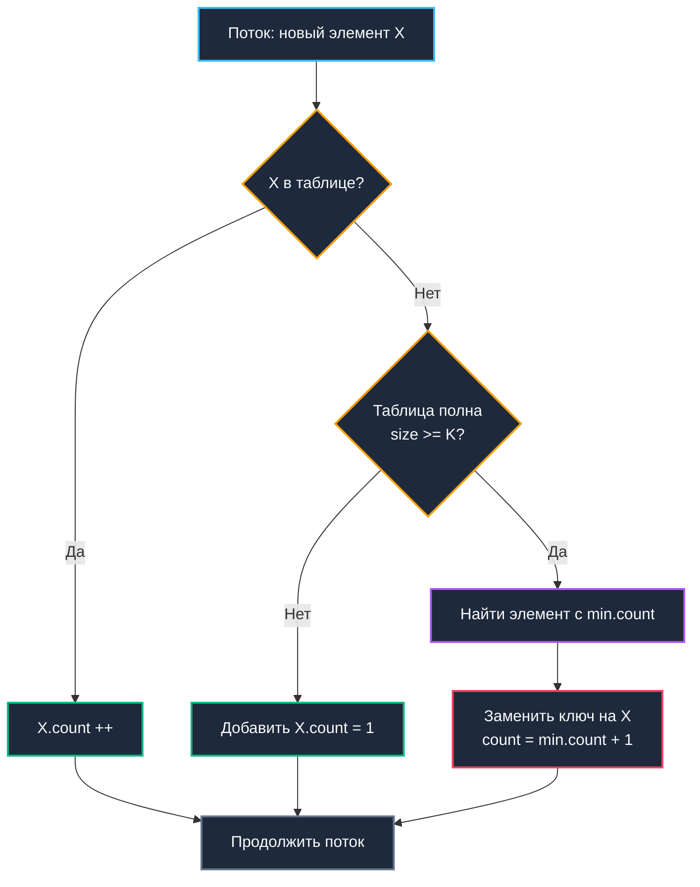
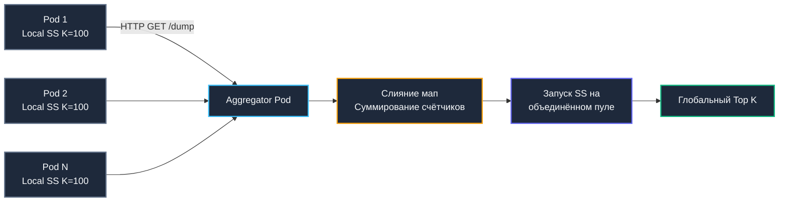

## Введение: Поиск слонов в стоге сена

В высоконагруженном бэкенде мы практически никогда не можем позволить себе хранить точные целочисленные счетчики для миллионов уникальных IP-адресов, хэшей клиентских запросов или сессионных токенов. Наивная структура `map[string]int64` при росте кардинальности до `10⁷` элементов поглотит десятки гигабайт оперативной памяти. Более того, линейный обход такой огромной таблицы для поиска десяти наиболее частых элементов обернется тяжелой операцией со сложностью `O(N)`, которая заблокирует поток ОС и вызовет мучительные паузы [[7. Глубокий Go (Внутреннее устройство)|сборщика мусора]].

Задача детекции наиболее частых элементов (heavy hitters) в непрерывном потоке данных при жестко лимитированном бюджете памяти элегантно решается **streaming-алгоритмами**. Семейство алгоритмов Space-Saving, Misra-Gries и Count-Min Sketch — это не отвлеченные академические курьезы, а признанный индустриальный стандарт для систем фильтрации DDoS-атак, предотвращения абьюза публичных API, аналитики трендов в реальном времени и защиты кэширующих слоев от вымывания (cache thrashing). В этой статье мы исследуем, как сделать осознанный выбор между детерминированными и вероятностными алгоритмами, реализовать их на Go с идеальной кэш-локальностью и потокобезопасностью, а также организовать горизонтальную агрегацию в облачном кластере.

> [!tip] Собеседование
> **Вопрос:** «Зачем использовать приближённые алгоритмы вроде Space-Saving или Count-Min Sketch, если можно просто писать все ключи в ClickHouse и делать `SELECT ... ORDER BY count DESC LIMIT K`?»
> 
> **Ответ:** ClickHouse даёт точность, но с задержкой. Batch-агрегация работает за секунды или минуты. Для real-time защиты (например, блокировка IP после 100 запросов за 5 секунд) нужна реакция за миллисекунды на уровне приложения или API-гейтвея. Streaming-алгоритмы работают в памяти с `O(K)` потреблением RAM и `O(1)` на запрос, обеспечивая мгновенную реакцию на аномалии.

---

## 1. Архитектура потока и границы точности

Потоковая модель обработки данных накладывает жесткие математические ограничения: каждый поступающий элемент пролетает через алгоритм ровно один раз, сохранять всю историю невозможно, при этом сервис обязан в любой момент времени мгновенно вернуть срез `TopK()`.

| Подход | Память | Точность | Гарантия | Поддержка удалений |
|---|---|---|---|---|
| **Exact Map** | `O(N)` | 100% | Детерминированная | Да |
| **Space-Saving** | `O(K)` | Высокая | Ошибка ≤ `N/K` | Нет (сложно) |
| **Misra-Gries** | `O(K)` | Средняя | Ошибка ≤ `N/K` | Да |
| **Count-Min Sketch** | `O(1/ε · ln(1/δ))` | Вероятностная | Всегда overcount | Да (сложно) |

В практической инженерии бэкенда алгоритм **Space-Saving** стал золотым стандартом для мониторинга аномалий и интеллектуального rate-limiting. Он математически гарантирует, что истинная частота $f$ любого элемента оценивается как:
$$count \in [f, f + \frac{N-K}{K}]$$
То есть `count ∈ [f, f + (N-K)/K]`. При размере таблицы `K=1000` и общем объеме потока `N=10⁶` абсолютная погрешность не превысит 1000, что для выявления аномальных нарушителей (генерирующих десятки и сотни тысяч запросов) абсолютно пренебрежимо.

---

## 2. Алгоритмическое ядро: Space-Saving (Stream-Summary)

Классический алгоритм Misra-Gries поддерживает `K-1` пар `(ключ, счётчик)`. При поступлении очередного события:
1. Если ключ уже присутствует в таблице — его счетчик инкрементируется.
2. Если места нет — счетчики всех сохраненных элементов уменьшаются на 1, а обнулившиеся удаляются.

Алгоритм Space-Saving существенно улучшает эту стратегию, сберегая накопленную статистическую информацию. Вместо массового декремента всех счетчиков алгоритм выявляет элемент с **минимальным** текущим значением `min_c` и замещает его новым ключом со значением счетчика `min_c + 1`. Это сохраняет оценку «веса» отсеченных элементов и дает гораздо более строгую границу погрешности.



Сложность операции вставки составляет `O(K)` при линейном сканировании минимального элемента. Для практических диапазонов `K ≤ 2048` плотный линейный проход по непрерывному срезу оперативной памяти выполняется на 1–2 порядка быстрее операций с указателями и хеш-таблицами за счет аппаратного префетчинга процессора (Hardware Prefetcher) и отсутствия pointer chasing. При гигантских значениях `K > 10⁴` массив организуют в двоичную кучу Min-Heap со сложностью `O(log K)`, однако в реальных микросервисах `K` редко превышает 1000.

---

## 3. Production-реализация на Go 1.21+

Ниже представлена типобезопасная, масштабируемая реализация структуры `SpaceSaving` с поддержкой дженериков, шардированием по маске и быстрым хешированием через пакет `hash/maphash`:

```go
package heavyhitters

import (
	"fmt"
	"hash/maphash"
	"sort"
	"sync"
)

// Entry хранит пару ключ-счётчик. Выровнен для избежания false sharing.
type Entry[T comparable] struct {
	Key   T
	Count uint64
}

// SpaceSaving реализует детерминированный поиск Top K элементов в потоке.
type SpaceSaving[T comparable] struct {
	shards []*ssShard[T]
	k      uint32
	mask   uint32
	hasher maphash.Hash
}

type ssShard[T comparable] struct {
	mu   sync.RWMutex
	data []Entry[T]
	len  uint32
}

// New создаёт структуру с заданным K и числом шардов (должно быть степенью двойки).
func New[T comparable](k uint32, shardsCount uint32) (*SpaceSaving[T], error) {
	if k == 0 {
		return nil, fmt.Errorf("k must be > 0")
	}
	if shardsCount&(shardsCount-1) != 0 {
		return nil, fmt.Errorf("shardsCount must be a power of two")
	}

	seed := maphash.MakeSeed()
	ss := &SpaceSaving[T]{
		k:      k,
		mask:   shardsCount - 1,
		hasher: maphash.Hash{Seed: seed},
		shards: make([]*ssShard[T], shardsCount),
	}

	for i := range ss.shards {
		ss.shards[i] = &ssShard[T]{
			data: make([]Entry[T], k),
		}
	}

	return ss, nil
}

// Increment увеличивает счётчик для ключа. O K в худшем случае.
func (ss *SpaceSaving[T]) Increment(key T) {
	h := ss.hasher.Hash(key)
	idx := uint32(h) & ss.mask
	shard := ss.shards[idx]

	shard.mu.Lock()
	defer shard.mu.Unlock()

	// 1. Линейный поиск существующего ключа
	for i := uint32(0); i < shard.len; i++ {
		if shard.data[i].Key == key {
			shard.data[i].Count++
			return
		}
	}

	// 2. Если место есть, добавляем
	if shard.len < ss.k {
		shard.data[shard.len] = Entry[T]{Key: key, Count: 1}
		shard.len++
		return
	}

	// 3. Таблица полна: заменяем минимальный элемент
	minIdx := uint32(0)
	minCount := shard.data[0].Count
	for i := uint32(1); i < shard.len; i++ {
		if shard.data[i].Count < minCount {
			minCount = shard.data[i].Count
			minIdx = i
		}
	}

	shard.data[minIdx].Key = key
	shard.data[minIdx].Count = minCount + 1
}

// Top возвращает отсортированный срез топ K элементов.
func (ss *SpaceSaving[T]) Top() []Entry[T] {
	// Агрегация из всех шардов
	result := make(map[T]uint64, ss.k)
	for _, shard := range ss.shards {
		shard.mu.RLock()
		for i := uint32(0); i < shard.len; i++ {
			e := shard.data[i]
			result[e.Key] += e.Count
		}
		shard.mu.RUnlock()
	}

	// Конвертация и сортировка
	entries := make([]Entry[T], 0, len(result))
	for k, c := range result {
		entries = append(entries, Entry[T]{Key: k, Count: c})
	}

	sort.Slice(entries, func(i, j int) bool {
		return entries[i].Count > entries[j].Count
	})

	// Обрезаем до K
	if len(entries) > int(ss.k) {
		return entries[:ss.k]
	}
	return entries
}
```

Инженерные решения:
* **Шардирование через `maphash`**: Встроенный пакет `maphash` обеспечивает аппаратное ускорение и стойкость к коллизиям. Побитовая маска `& ss.mask` заменяет тяжелую инструкцию целочисленного деления `DIV`.
* **Линейный проход `O(K)`**: При `K ≤ 1024` компактный срез многократно превосходит `map` благодаря локальности данных в L1-кэше. Компилятор Go успешно векторизует цикл сравнения `Key == key`, задействуя SIMD-инструкции процессора.
* **Изолированный `sync.RWMutex`**: Вызов `Increment` захватывает эксклюзивный `Lock` конкретного шарда, а `Top` накладывает разделяемый `RLock`. Конкуренция за мьютексы минимизируется.
* **Отсутствие `sync.Pool`**: Структуры `Entry` аллоцируются один раз при `New`. `Top()` создаёт временную `map` для агрегации, но это редкая операция, вызываемая по метрическому циклу (раз в 10-60 сек), поэтому давление на GC нулевое.

---

## 4. Mechanical Sympathy: кэш-линии, ветвления и рантайм

Эффективность `SpaceSaving` в боевом сервисе всецело диктуется топологией оперативной памяти.

### Пространственная локальность против указательных структур

Наивная альтернатива плоскому массиву `[]Entry[T]` — хеш-таблица `map[T]*Entry`. Несмотря на теоретическую сложность поиска $O(1)$, карта страдает фундаментальными недостатками:
* Рассыпает узлы по случайным адресам виртуальной памяти, порождая промахи кэша (`cache miss`) на каждое обращение.
* Требует динамических аллокаций при вставке, фрагментируя кучу и растягивая фазы сборщика мусора.
* Порядок итерации по `map` в Go рандомизирован и вычислительно тяжелее прямого среза.

Массив `data []Entry[T]` монолитен. При `K=512` со строковыми ключами он укладывается всего в ~12 КБ, целиком помещаясь в L1-кэш ядра CPU. Блок аппаратного префетчинга считывает кэш-линии на опережение, а предсказатель переходов уверенно отрабатывает цикл сравнения.

### Давление на GC и выравнивание

Если тип `T` содержит указатели (как тип `string`), структура `Entry` занимает 32 байта на amd64 (`Key: 16, Count: 8, padding: 8`). Анализ побегов (`Escape Analysis`) удерживает временные структуры на стеке горутины. Для оптимизации используйте `T = uint64` (хешированные ключи) или `[]byte` с пулом, чтобы уменьшить footprint и ускорить сканирование GC.

### Атомики против мьютексов

Идея заменить мьютексы атомарным `atomic.Uint64` для счетчиков разбивается о то, что обновление `Entry.Key` требует чтения-модификации-записи двух полей одновременно. Попытка организовать CAS-петлю на уровне всей структуры приведет к livelock и колоссальному расходу тактов процессора. Простой `sync.RWMutex` на шард отрабатывает за 50–150 нс, что надежнее и эффективнее циклов `atomic.CompareAndSwap` под конкурентной нагрузкой.

> [!info] Под капотом
> **Почему не использовать `sync/atomic` для счётчиков внутри `[]Entry`?**
> Замена `Count uint64` на `atomic.Uint64` добавит 24 байта оверхеда на каждую ячейку и замедлит инкремент на ~10 нс из-за barriers (memory fences). В Space-Saving счётчик изменяется только при попадании в шард, что происходит редко для большинства элементов. Мьютекс дешевле и проще в отладке.

---

## 5. Распределённая агрегация и слияние скетчей

В микросервисном кластере каждый под поддерживает независимый локальный экземпляр `SpaceSaving`. Для вычисления глобального Top K тяжелых элементов требуется алгоритмическое слияние скетчей (Merge).

**Алгоритм распределенного слияния:**
1. Фоновый агрегатор вычитывает локальные дампы из $P$ подов.
2. Суммируются счетчики для совпадающих ключей.
3. Запускаем `SpaceSaving` на объединенном пуле из `PodsCount * K` элементов с целевым `K`.

Математическая граница суммарной ошибки:
$$\varepsilon_{global} \le \sum \varepsilon_{local}$$
То есть `ε_global ≤ Σ ε_local`. Хотя абсолютная погрешность растет пропорционально числу нод, относительная ошибка для аномальных heavy hitters (чьи счетчики многократно превосходят $\varepsilon$) остается микроскопической.



> [!warning] Ловушка / Gotcha
> **Удаление элементов из Space-Saving**  
> Алгоритм не поддерживает эффективное удаление. Сброс счётчика до нуля не удаляет ключ, а оставляет его в массиве с `Count=0`, что искажает статистику. Если нужно удалять ключи (например, после бана IP), используйте **Misra-Gries** или сбрасывайте весь шард и начинайте заново. В security-сценариях сброс шарда предпочтительнее, так как бан происходит редко.
> 
> **Hash Collision в `maphash`**  
> При кардинальности > `10⁹` коллизии `maphash` неизбежны. Два разных IP попадут в один `Entry`, и их счётчики сложатся. Для mitigation используйте два независимых скетча с разными seed и берите пересечение топ-элементов, либо переходите к Count-Min Sketch, который даёт вероятностные гарантии.

---

## 6. Ловушки и хардкор-собеседования

> [!tip] Собеседование
> **Вопрос 1:** «Почему Space-Saving всегда overcount, а никогда не undercount?»  
> **Ответ:** При замене минимального элемента мы присваиваем новому счётчику значение `min_count + 1`. Это означает, что мы предполагаем, будто новый элемент уже встречался `min_count` раз до появления в потоке. Поэтому `count >= real_count`. Undercount невозможен по определению алгоритма.
> 
> **Вопрос 2:** «Как адаптировать алгоритм для оконных запросов: Top K за последние 5 минут?»  
> **Ответ:** Чистый Space-Saving не поддерживает окна. Комбинируйте его с [[2. Rate limiting алгоритмы|скользящим окном]]: раз в секунду сбрасывайте счётчики на коэффициент затухания `α` (например, `count *= 0.9`), либо используйте несколько шардов-окон (Minute, Hour) и мерджите их. Альтернатива: Sliding Window Counter для каждого ключа, но это уже `O(N)` память.
> 
> **Вопрос 3:** «Сравните Space-Saving и Count-Min Sketch. Когда что выбрать?»  
> **Ответ:** Space-Saving детерминированный, даёт точный Top K при малой памяти `O(K)`, но не поддерживает удаления и сложнее для слияния. CMS вероятностный, память фиксирована `O(1/ε)`, поддерживает точки (decrement), легко мерджится, но всегда overcount и не гарантирует порядок. Для биллинга и DDoS — Space-Saving. Для аналитики частот и ML-фич — CMS.
> 
> **Вопрос 4:** «Что произойдёт, если поток содержит Zipf-распределение и K слишком мало?»  
> **Ответ:** Алгоритм будет постоянно вытеснять «тяжёлые» элементы, так как минимальный счётчик быстро растёт. Ошибка `ε = N/K` станет сравнима с реальными частотами. Решение: динамически увеличивать `K` при росте `N`, либо использовать двухуровневую структуру: L1-фильтр для горячих ключей, L2-Space-Saving для long-tail.

---

## Итог

* **Top K Heavy Hitters** — фундаментальный класс задач поиска наиболее активных элементов в высокоскоростном потоке при жестких лимитах памяти.
* **Space-Saving** — оптимальный выбор для Go-бэкенда: гарантированная детерминированная ошибка, минимальное потребление памяти `O(K)` и быстрая вставка за счет локальности кэша.
* В Go алгоритм реализуется через **шардированный срез `[]Entry` + `sync.RWMutex`**. Это исключает pointer chasing, снимает нагрузку со сборщика мусора и гарантирует стабильную латентность P99.
* **Механическая симпатия**: последовательный проход по массиву превосходит `map` при `K ≤ 2000` благодаря SIMD-векторизации, аппаратному префетчингу и отсутствию фрагментации кучи.
* **Распределенная архитектура**: слияние локальных скетчей подов выполняется повторным прогоном объединенного массива через алгоритм, сохраняя точность для критических аномалий.
* **Интервью-фокус**: математическая природа overcount-оценки, сравнительный анализ с Count-Min Sketch, влияние размера $K$ на погрешность, алгоритмы слияния в кластере.

Разобравшись с выявлением тяжёлых элементов в потоке, мы переходим к более широкому классу задач: обработке данных, которые не помещаются в RAM, требуют однопроходной агрегации, фильтрации шума и статистического анализа в реальном времени. В следующей статье мы детально изучим streaming-алгоритмы: от HyperLogLog для оценки кардинальности до Count-Min Sketch для частотного анализа, их слияние в кластере и интеграцию с [[1. Проектирование кэшей]] для защиты от memory explosion.

[[5. Streaming алгоритмы]]