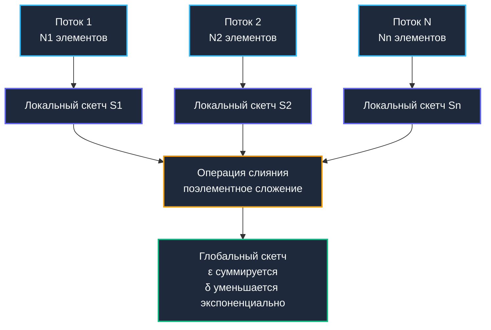

## Приближённые вычисления как инженерный выбор

В предыдущих главах мы всесторонне исследовали как строгие детерминированные структуры данных, так и потоковые методы агрегации. Однако при проектировании современных распределенных систем архитектор неизбежно сталкивается с жестким физическим барьером: получение абсолютно точного ответа требует либо линейного объема оперативной памяти `O(N)`, либо полного перебора терабайтных массивов, что абсолютно несовместимо с микросекундными SLA и многотысячным RPS. Именно здесь на сцену выходят **приближённые алгоритмы (Approximate Algorithms)**. Они сознательно и контролируемо жертвуют математической идеальностью ради сублинейного потребления системных ресурсов, предоставляя результаты с доказанными вероятностными границами `(ε, δ)`.

В инженерной практике бэкенда приближенные вычисления — это не академический компромисс от безысходности, а осознанная производственная норма. Approximate-структуры образуют несущую основу:
* Дедупликации потоков в сетевых шлюзах и периферийных узлах CDN.
* Оценки коэффициента схожести документов и обнаружения аномальных всплесков в логах.
* Подавления дисперсии при выявлении heavy hitters в зашумленном телеметрическом трафике.
* Сверхкомпактной сериализации состояния сессий для горизонтального масштабирования кластеров без привязки к sticky-sessions.

> [!tip] Собеседование
> **Вопрос:** «Зачем использовать приближённые алгоритмы, если можно купить больше RAM и хранить точные данные?»
> 
> **Ответ:** Память масштабируется линейно с ростом данных, но стоимость облачного инстанса растёт экспоненциально. Кроме того, большие структуры данных убивают кэш-локальность, увеличивают время `STW` пауз [[7. Глубокий Go (Внутреннее устройство)|сборщика мусора]] и делают горизонтальное масштабирование кластера неэффективным из-за необходимости синхронизации гигабайтов состояния. Approximate-алгоритмы фиксируют потребление памяти на уровне килобайт, обеспечивая детерминированную latency и предсказуемую стоимость инфраструктуры.

---

## 1. Математика вероятностных границ и линейность скетчей

Вся математическая строгость приближенных структур держится на двух краеугольных параметрах:
* **$\varepsilon$ (epsilon)** — предельно допустимая относительная ошибка аппроксимации.
* **$\delta$ (delta)** — доверительная вероятность того, что реальная ошибка превысит порог $\varepsilon$.

Ключевое свойство пригодных для продакшена вероятностных структур — их **линейность (mergeability)**. Это означает, что результат скетчинга объединения потоков данных тождественно равен композиции скетчей, вычисленных для каждого подпотока независимо. Без этого фундаментального свойства сбор и агрегация метрик с тысяч подов в кластере Kubernetes были бы архитектурно невозможны без тяжеловесного централизованного хранилища.

Классический `Bloom Filter` (подробно разобранный в [[6. Bloom filter - вероятностная структура данных]]) поддерживает лишь побитовую операцию `OR` при слиянии. Для более сложных задач, где требуется оценка частот или медианного значения, применяют **Count-Sketch** и **MinHash/LSH**.



---

## 2. Count-Sketch: Устранение смещения через знаковое хеширование

В статье [[5. Streaming алгоритмы]] мы детально исследовали структуру Count-Min Sketch (CMS). Ее главный врожденный недостаток — **систематическое завышение оценки** (overcount), возникающее из-за неизбежных коллизий хэшей. При мониторинге редких событий на фоне мощного информационного шума это смещение накапливается и искажает метрику.

Алгоритм **Count-Sketch** элегантно устраняет проблему смещения с помощью **знакового хеширования** `g(x) ∈ {-1, +1}`. При поступлении очередного ключа $x$ счетчик ячейки изменяется не на фиксированное `+1`, а на случайную знаковую величину `g(x)`. При чтении накопленной частоты вместо минимума берется **медиана** полученных оценок по всем строкам матрицы.

Математическая природа: знаковый множитель `g(x)` превращает детерминированное смещение в центрированную случайную величину с математическим ожиданием, равным нулю: $\mathbb{E}[sign] = 0$. Ошибки, вызванные случайными коллизиями от посторонних ключей, взаимно компенсируют друг друга. В итоге Count-Sketch формирует несмещенную оценку (**unbiased estimate**) с дисперсией порядка `O(ε²N)`, что делает алгоритм незаменимым для задач выявления аномалий в зашумленных потоках и сценариев с поддержкой декрементов.

---

## 3. Production-реализация на Go 1.21+

Ниже представлена высокопроизводительная реализация структуры `CountSketch`, спроектированная с учетом инструкций процессора. Вычисление знака реализовано без ветвлений (`branchless`), а конкурентность обеспечивается lock-free атомиками пакета `sync/atomic`:

```go
package sketch

import (
	"hash/fnv"
	"sort"
	"sync/atomic"
)

// CountSketch реализует вероятностную оценку частот с уменьшенной дисперсией.
type CountSketch struct {
	rows  uint32
	cols  uint32
	table []int64 // Матрица счётчиков, выровнена для кэша
	seed  uint64
}

// NewCountSketch создаёт структуру с заданными параметрами точности.
// rows: глубина (определяет delta), cols: ширина (определяет epsilon).
func NewCountSketch(rows, cols uint32, seed uint64) *CountSketch {
	// Преаллокация непрерывного блока. Память не сканируется GC, т.к. примитивы.
	return &CountSketch{
		rows:  rows,
		cols:  cols,
		table: make([]int64, rows*cols),
		seed:  seed,
	}
}

// Increment обновляет частоту элемента. Использует знаковое хеширование.
func (cs *CountSketch) Increment(key uint64) {
	// Генерируем два хеша: один для индекса столбца, второй для знака
	h := cs.hash(key)
	
	for r := uint32(0); r < cs.rows; r++ {
		// Индекс в плоском массиве: row * cols + col
		col := (h >> (r * 8)) & uint64(cs.cols-1)
		idx := r*cs.cols + uint32(col)
		
		// Знак: +1 или -1. Вычисляется branchless через сдвиг бита знака
		// Если старший бит хеша = 0 -> sign = 1, если 1 -> sign = -1
		signHash := (h >> 55) & 1
		sign := int64(1 - 2*signHash) // 1 или -1 без ветвлений
		
		// Атомарное обновление. LOCK XADD на amd64
		atomic.AddInt64(&cs.table[idx], sign)
	}
}

// Query возвращает несмещённую оценку частоты через медиану.
func (cs *CountSketch) Query(key uint64) int64 {
	estimates := make([]int64, cs.rows)
	h := cs.hash(key)
	
	for r := uint32(0); r < cs.rows; r++ {
		col := (h >> (r * 8)) & uint64(cs.cols-1)
		idx := r*cs.cols + uint32(col)
		signHash := (h >> 55) & 1
		sign := int64(1 - 2*signHash)
		
		val := atomic.LoadInt64(&cs.table[idx])
		estimates[r] = val * sign
	}
	
	// Медиана для устойчивости к выбросам
	return median(estimates)
}

func (cs *CountSketch) hash(v uint64) uint64 {
	h := fnv.New64()
	h.Write(appendUint64(nil, v^cs.seed))
	return h.Sum64()
}

// median находит медиану маленького слайса за O d log d
func median(arr []int64) int64 {
	n := len(arr)
	if n == 0 {
		return 0
	}
	// Для production используют quickselect, но для rows=3..5 сортировка быстрее
	sort.Slice(arr, func(i, j int) bool { return arr[i] < arr[j] })
	return arr[n/2]
}

func appendUint64(b []byte, v uint64) []byte {
	return append(b, byte(v>>56), byte(v>>48), byte(v>>40), byte(v>>32),
		byte(v>>24), byte(v>>16), byte(v>>8), byte(v))
}
```

Инженерные решения:
* **Branchless sign extraction**: Математическое выражение `1 - 2*signHash` вычисляет `+1` или `-1` всего за 2 такта CPU без условных инструкций `JMP`. Предсказатель ветвлений не ошибается, и конвейер инструкций не сбрасывается.
* **Плоский срез `[]int64`**: Полностью устраняет оверхед и фрагментацию среза срезов `[][]int64`. Непрерывный массив минимизирует промахи буфера трансляции адресов (`TLB miss`) и максимизирует пропускную способность шины.
* **Атомик `atomic.AddInt64`**: На архитектуре x86-64 транслируется в аппаратную команду `LOCK XADD`, а на ARM64 — в `LDADD`. Гарантирует быстрое lock-free обновление без засыпания потоков в ядре через вызовы `futex`.

---

## 4. Механическая симпатия: кэш-линии, выравнивание и GC

Поведение вероятностных скетчей в Go определяется законами микроархитектуры и кэш-памяти.

### Cache Line Ping-Pong и False Sharing

Матрица `table` упакована предельно плотно. При параметре `cols=1024` строка занимает `1024 * 8 = 8 КБ`. Если параллельные горутины обновляют соседние столбцы, попадающие в границы одной 64-байтной кэш-линии (8 элементов типа `int64`), возникает разрушительный эффект **False Sharing**. Протокол аппаратной когерентности MESI инициирует непрерывную инвалидацию линии между ядрами, снижая throughput на 30–60%.  
**Решение:** Выравнивание структуры до 64 байт или увеличение параметра `cols` (например, до 2048), что статистически разносит обращения горутин по разным физическим кэш-линиям.

### Escape Analysis и временные буферы

Метод `Query` создает срез `estimates := make([]int64, cs.rows)`. Анализ побегов компилятора Go распознает, что срез мал и не покидает пределы фрейма функции, размещая его **строго на стеке**. Это дает нулевые аллокации в куче и нулевое давление на сборщик мусора. Попытка применить здесь `sync.Pool` лишь замедлила бы исполнение из-за накладных расходов синхронизации пула.

### SIMD и векторизация хеширования

Хеширование в цикле `Increment` выполняется скалярно. Для extreme-load (миллионы RPS) применяют векторизованные инструкции SIMD (AVX2/AVX-512) через пакет `github.com/klauspost/cpuid` или `asm`. Однако встроенного `maphash` или `fnv` более чем достаточно для подавляющего большинства систем. Ручная векторизация оправдана только тогда, когда профилировщик `pprof` доказывает, что на вычисление `fnv.Sum64` тратится более 40% процессорного времени.

> [!info] Под капотом
> **Почему `int64`, а не `int32` для счётчиков?**
> В 32-битном режиме `atomic.AddInt32` может работать быстрее, но на современных серверных CPU `int64` операции выполняются нативно без расширения регистров. Кроме того, `int64` предотвращает переполнение при длительном накоплении потока. Разница в latency на x86-64 между 32 и 64 битами для `LOCK XADD` составляет <5%.

---

## 5. Распределённое слияние и линейность скетчей

Структура Count-Sketch обладает свойством строгой **линейности**:
$$\text{Sketch}(A \cup B) = \text{Sketch}(A) + \text{Sketch}(B)$$
В виде соотношения: `Sketch(A ∪ B) = Sketch(A) + Sketch(B)`. Это дает возможность каждому экземпляру микросервиса накапливать частоты локально. Раз в 10–30 секунд локальный агент считывает срезы, суммирует матрицы поэлементно и отправляет агрегат в хранилище.

При слиянии:
* Параметр ошибки `ε` суммируется линейно: `ε_global ≈ Σ ε_pod`.
* Вероятность выброса `δ` падает экспоненциально с ростом числа независимых строк.
* Потребление памяти остается строго константным `O(rows × cols)`, не завися от количества нод в кластере.

Этот паттерн **Edge Aggregation** снижает сетевой трафик телеметрии в `1000+` раз и защищает центральные базы данных от перегрузки собственными метриками.

---

## 6. Ловушки production и хардкор-собеседования

> [!warning] Ловушка / Gotcha
> **Коллизии знаковых хешей и деградация медианы**  
> Если хеш-функция слабая и знаковый хэш `g(x)` коррелирует с индексным `h(x)`, ошибки перестают компенсироваться. Медиана смещается, оценка становится хуже, чем у Count-Min Sketch. Всегда используйте надежные перемешивания (`maphash` с рандомным seed или `xxhash`). Никогда не используйте `crc32` без полинома высокого порядка.
> 
> **Нельзя использовать Approximate для биллинга**  
> Вероятностные структуры дают ошибку по дизайну. Применять их для финансовых расчётов, списаний или точного учёта квот — грубейшая архитектурная ошибка. Они предназначены для мониторинга, аналитики, обнаружения аномалий и защиты инфраструктуры, где trade-off accuracy/latency допустим.

> [!tip] Собеседование
> **Вопрос 1:** «Как выбрать параметры rows и cols для Count-Sketch, если требуется ε=0.05 и δ=0.01?»  
> **Ответ:** Для Count-Sketch: `cols = e / ε² ≈ 1100` (обычно берут 1024 или 2048), `rows = ln(2/δ) ≈ 5.3` → 6 строк. Математически это гарантирует, что оценка лежит в `±εN` с вероятностью `1-δ`.
> 
> **Вопрос 2:** «Сравните Count-Sketch и MinHash для задач поиска дубликатов.»  
> **Ответ:** Count-Sketch оценивает частоты элементов, а MinHash оценивает Jaccard-схожесть множеств. MinHash превращает множества в сигнатуры фиксированной длины, сохраняя `Pr[minHash(A) = minHash(B)] = J(A,B)`. Для поиска похожих документов или рекомендаций используют MinHash + LSH, для анализа частоты событий — Count-Sketch.
> 
> **Вопрос 3:** «Почему медиана лучше среднего арифметического в Count-Sketch?»  
> **Ответ:** Распределение оценок по строкам имеет тяжёлые хвосты из-за случайных коллизий. Среднее арифметическое чувствительно к выбросам и может дать отрицательное или сильно завышенное значение. Медиана отбрасывает экстремальные оценки, обеспечивая более устойчивый и близкий к истинному результат.
> 
> **Вопрос 4:** «Как реализовать удаление элемента из Count-Sketch?»  
> **Ответ:** Достаточно вызвать `Increment(key)` с инвертированным знаком. Поскольку оценка линейна, декремент просто вычитает вклад элемента. Однако при высоком уровне коллизий это может усилить шум. В production чаще используют скользящее окно с затуханием, а не явное удаление.

---

## Итог

* **Approximate алгоритмы** — незаменимый инженерный инструмент для удержания расхода памяти и латентности в строгих границах при бесконечных потоках событий.
* **Count-Sketch** превосходит классический Count-Min Sketch за счет знакового хеширования, обеспечивая несмещенную оценку и естественную поддержку декрементов ценой расчета медианы.
* В Go структура реализуется через **плоский массив `[]int64` + `atomic.AddInt64` + branchless sign extraction**, обеспечивая lock-free конкурентность и отсутствие аллокаций в горячем пути.
* **Механическая симпатия**: False Sharing нивелируется увеличением ширины таблицы, а непрерывная укладка данных в памяти минимизирует TLB miss и ускоряет операцию слияния.
* **Линейность скетчей** делает их идеальными для распределенной агрегации метрик, кардинально снижая сетевой трафик кластера.
* **Ограничения**: структуры категорически непригодны для биллинга и строгих финансовых расчетов, требуют качественных хеш-функций и накапливают погрешность при слиянии.
* **Интервью-фокус**: математический смысл параметров `(ε, δ)`, сравнительный анализ медианы и среднего арифметического, линейные свойства скетчей, техники подавления False Sharing.

Приближённые алгоритмы завершают блок практических паттернов, демонстрируя, как отказ от детерминизма открывает путь к экстремальному масштабированию. Мы прошли путь от базовой асимптотики до распределённых вероятностных структур, от битовых масок до линейных скетчей. В следующей статье мы соберём все изученные концепции в единую инженерную рамку, определим чек-лист выбора структур данных под конкретные SLA и разберём, как мыслить как системный архитектор, проектируя высоконагруженный Go-бэкенд.

[[1. Итоги раздела. Algorithmic thinking для backend разработчика]]