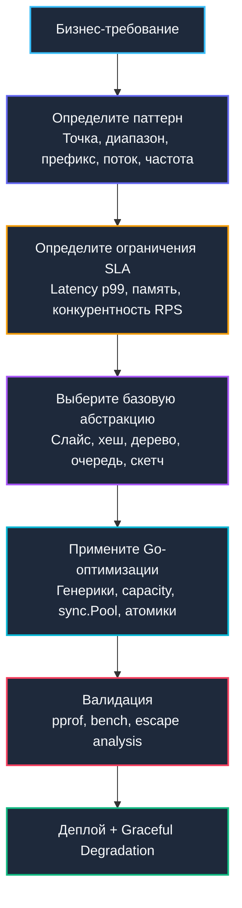

## От теории к продакшену: что такое алгоритмическое мышление

Изучение алгоритмов и структур данных в контексте промышленной разработки не должно сводиться к машинальному заучиванию шагов `QuickSort` или репродукции формул полиномиального хеширования на доске. Подлинное **алгоритмическое мышление** для бэкенд-инженера уровня Senior или Tech Lead — это способность мгновенно и безошибочно транслировать неструктурированные бизнес-требования и целевые SLA на язык конкретных структур данных, безошибочно предвидеть их поведение под предельным сетевым давлением и осознанно идти на инженерные компромиссы.

Академические учебники часто приучают студента к иллюзии существования единственно «правильного» ответа. В суровом мире реального серверного продакшена абсолютных истин не бывает. Существуют лишь оптимальные инженерные решения для жестко очерченного контекста: объема входного потока, характера обращений (read-heavy vs write-heavy), лимитов оперативной памяти, требований к модели согласованности и тонкостей архитектуры рантайма Go. В этой заключительной главе мы сведем все пройденные концепции в целостную операционную систему инженерного анализа.

---

### 1. Пять столпов инженерного выбора

Любое архитектурное решение о выборе контейнера данных в высоконагруженном Go-сервисе должно проходить валидацию по пяти фундаментальным осям:

1. **Паттерн доступа важнее голой асимптотики**  
   Прямой линейный обход среза `slice` на практике работает значительно быстрее выборки из `map` для коллекций размера `N < 1000` благодаря детерминированному аппаратному префетчингу кэш-линий CPU. Регистровый бинарный поиск по отсортированному массиву неизменно выигрывает у сбалансированного бинарного дерева `tree` из-за полного отсутствия pointer chasing. Всегда задавайте вопрос: «*Как именно данные ложатся в память, читаются и мутируют?*» задолго до вопроса «*Какова теоретическая сложность в худшем случае?*».

2. **Иерархия памяти диктует реальную латентность**  
   Сложность `O(1)` в хеш-таблице разительно отличается от `O(1)` в регистрах процессора. Разыменование указателя по произвольному адресу кучи обходится в ~100–300 нс (ожидание ответа шины RAM). Чтение значения из кэша L1 занимает всего 3–4 такта ядра. Непрерывные монолитные массивы, `noscan` аллокации и отказ от лишней указательной индирекции обеспечивают ускорение в 10–50 раз в физическом времени, даже если асимптотический класс сложности Big O формально идентичен. Подробнее см. [[4. Пространственная сложность и cache locality]].

3. **Конкурентность разрушает детерминизм**  
   Одиночный глобальный мьютекс `sync.Mutex` неизбежно обрушивает тайминги P99 при нагрузках свыше `>20k RPS`. Секционное шардирование, атомарные инструкции `sync/atomic`, lock-free очереди и организация противодавления (backpressure) через `chan` или синхронизирующий `cond` превращают абстрактные структуры из учебников в надежные production-компоненты. Конкурентная среда всегда требует жертв: либо мы поступаемся точностью глобального порядка, либо ослабляем модель консистентности, либо усложняем кодовую базу.

4. **Приближённое часто превосходит точное**  
   Когда кардинальность входного потока экспоненциально обгоняет бюджет на оперативную память сервера, монолитная таблица `map[string]int` превращается в главного врага стабильности. Вероятностные структуры HyperLogLog, Count-Sketch, Bloom Filter и Space-Saving обеспечивают математически контролируемую границу погрешности `ε`, надежно фиксируя расход RAM на уровне считанных килобайт. Это не компромиссная заплатка, а зрелый архитектурный паттерн для неограниченного масштабирования телеметрии и защиты инфраструктуры. Подробнее см. [[6. Approximate алгоритмы]].

5. **Рантайм Go — не абстрактная машина Тьюринга**  
   Фазы трехцветной маркировки сборщика мусора, правила анализа побегов (Escape Analysis), скрытые реаллокации срезов, сложная адресация внутренних бакетов мап, таймеры сетевого поллера `netpoll` — каждый из этих факторов непосредственно влияет на throughput. Алгоритм, безупречно работающий на C++, может драматически просесть в Go из-за скрытого боксинга интерфейсов и давления на GC. Писать код на идиоматичном Go — значит проектировать системы в полной гармонии с его рантаймом, а не бороться с ним.

---

### 2. Чеклист проектирования структур данных

При проектировании нового сервиса или рефакторинге узких мест следуйте выверенной последовательности шагов. Этот чеклист закрывает подавляющее большинство практических задач бэкенда:

**Шаг 1: Классификация характера доступа**
* **Точечный поиск/вставка по ключу:** `map` (при малом и среднем объеме $N$) → Sharded map или Concurrent map (при огромном объеме $N$ и высокой частоте конкурентной записи) → Bloom Filter + Cache (при жестких лимитах памяти хоста).
* **Диапазонные выборки / упорядоченный обход:** Отсортированный срез `slice` + `sort.Search` → Дерево отрезков или Fenwick/Segment Tree (если данные непрерывно мутируют) → B-Tree/B+Tree (если данные хранятся на диске или в СУБД).
* **Приоритетная диспетчеризация / выборка Top-K:** Пакет `container/heap` или кастомная плоская куча → Space-Saving / Count-Min Sketch (если размер $K$ динамичен или бюджет памяти строго ограничен).
* **Потоковая буферизация / FIFO / Backpressure:** Канал `chan` → Кольцевой буфер → Linked List (исключительно в сценариях, где вставка и удаление в произвольную позицию критичны).
* **Поиск по префиксам / маршрутизация URL:** Префиксное дерево Trie / Radix Tree → Хеш-кольцо Consistent Hash Ring (в задачах распределенной маршрутизации между серверами).

**Шаг 2: Проверка на механическую симпатию**
* Возможно ли организовать хранение данных в непрерывном массиве (contiguous memory)? (*Да* → срез `slice`, *Нет* → связные структуры на указателях).
* Порождает ли структура лавину мелких кратковременных аллокаций? (*Да* → используйте `sync.Pool`, арены памяти или предварительное выделение `prealloc`).
* Приведет ли рекурсивный обход сборщика мусора к деградации таймингов? (*Да* → устраняйте указатели, переходите на плоские срезы `[]int64`/`[]uint8`, задействуйте `noscan` атрибуты памяти).
* Где локализован ключевой ресурсный bottleneck: ядра CPU, шина RAM, дисковый/сетевой ввод-вывод или межпоточные блокировки? (Локализуйте проблему профилировщиком `pprof` до внесения любых изменений).

**Шаг 3: Стратегия конкурентной синхронизации**
* Преобладание чтений (Read-heavy) → разделяемый `sync.RWMutex` либо атомарное чтение указателей через `atomic.Pointer`.
* Высокочастотная запись (Write-heavy) → шардирование пространства ключей с изолированными локальными мьютексами.
* Паттерн «Поставщик-Потребитель» (Producer-Consumer) → буферизованные каналы или lock-free очереди MPSC.
* Глобальное разделяемое состояние → категорически минимизировать; предпочитать модель eventual consistency, Gossip-протоколы или распределенный кэш.

---

### 3. Реальность Go: где учебники врут

Академические модели и реальное поведение рантайма Go зачастую кардинально расходятся:

| Учебная концепция | Реальность Go-бэкенда | Почему так происходит |
|---|---|---|
| «Map всегда O 1» | `O 1` амортизированно, но с константой 5-10x из-за хеширования, бакетов и коллизий. При росте вызывает реаллокацию и паузы GC. | Внутренняя `hmap`, overflow-бакеты, `sync.Mutex` внутри рантайма для map growth. |
| «LinkedList O 1 вставка» | На практике в 5-10x медленнее slice из-за cache miss, указательного chasing и фрагментации кучи. Использовать только для LRU/LFU или специфичных паттернов. | `container/list` аллоцирует узлы отдельно. CPU ждёт RAM. |
| «Рекурсия чище итерации» | В Go рекурсия растит стек, мешает инлайну, создаёт `morestack`-переходы. Итерация всегда предпочтительна в hot-path. | Динамический стек Go начинается с 2 КБ. Глубокая рекурсия = аллокации + переключение контекста. |
| «Интерфейсы дают гибкость» | `any`/`interface{}` создаёт 16-байтовый дескриптор и аллокацию значения в кучу. Дженерики `T` устраняют этот overhead. | Escape Analysis не может оптимизировать boxing. `container/heap` vs generic heap. |
| «Точность всегда важна» | Для метрик, rate-limiting, поиска аномалий и защиты от DDoS приближённые алгоритмы стабильнее, дешевле и масштабируемее. | Линейность скетчей, фиксированная память, независимость от N. |

> [!tip] Собеседование
> **Вопрос:** «Как бы вы спроектировали систему кэширования сессий для 10 млн активных пользователей с TTL 30 минут и гарантией O 1 доступа?»
> 
> **Слабый ответ:** «Возьму Redis и буду хранить map[SessionID]User».
> 
> **Сильный ответ:** «Архитектурно: L1 local cache на поде + L2 distributed cache (Redis Cluster). В L1 использую sharded LRU/LFU кэш с `sync.Pool` для структур сессий, чтобы снизить GC pressure. В L2 — Redis с hash-маппингом и pipeline-запросами. Для защиты от cache stampede применю `singleflight`, для предотвращения avalanche добавлю jitter в TTL. Если требуется строгая консистентность — использую Outbox pattern или CDC. Память ограничу через `GOMEMLIMIT` и eviction callback'и. Профилирование через pprof и метрики hit/miss rate будут встроены в Observability стек».

---

### 4. Интервью vs Продакшен: разрыв шаблонов

На технических собеседованиях интервьюеры оценивают **способность глубоко рассуждать**. В боевом продакшене бизнес оценивает **способность не обрушить систему в час пик**.

| Критерий | Техническое собеседование | Инженерный продакшен |
|---|---|---|
| **Главный фокус** | Корректность, асимптотика, редкие edge cases | Выполнение SLA, P99 latency, потребление RAM, graceful degradation |
| **Цена ошибки** | Штрафной балл за неоптимальный класс сложности | Штраф за отсутствие резервных путей (fallback), circuit breaker и метрик |
| **Выбор структуры** | «Теоретически самая быстрая по Big O» | «Максимально предсказуемая по графикам и простая в поддержке» |
| **Конкурентность** | «Оберну критическую секцию в Mutex» | «Шардирование, атомики, lock-free, backpressure, graceful shutdown» |
| **Оптимизация** | Ручные побитовые трюки и хаки | Профилирование → инлайнинг → оптимизация аллокатора → кэширование → рефакторинг архитектуры |

Главный признак профессиональной зрелости Senior/Lead инженера — **умение вовремя сказать твердое «нет» преждевременной переоптимизации**. Если связка стандартного `slice` и алгоритма сортировки решает бизнес-задачу за 2 миллисекунды при нагрузке 100 RPS, изобретение самодельного lock-free radix tree — это чистый архитектурный долг. Оптимизировать необходимо только те участки, чей вклад в задержку неопровержимо подтвержден профилировщиком. Но владеть полным арсеналом структур данных, чтобы немедленно заменить неэффективный примитив в момент кризиса — это обязательная профессиональная обязанность.

---

### 5. Итог: Ваш путь к Senior/Lead

Этот фундаментальный модуль вооружил вас не разрозненной коллекцией готовых шаблонов кода, а **системой инженерного анализа и принятия архитектурных решений**. Вы научились:
* Напрямую связывать асимптотическую сложность Big O с тактами ядра CPU, границами кэш-линий и циклами [[7. Глубокий Go (Внутреннее устройство)|сборщика мусора]].
* Проводить осознанную демаркацию между детерминированной точностью и накладными расходами памяти через потоковые и приближенные структуры.
* Проектировать масштабируемый конкурентный код, устойчивый к блокировкам и взаимным блокировкам (deadlock).
* Строить структуры данных, функционирующие в синергии с планировщиком горутин Go, сетевым поллером `netpoll` и блоками аппаратного префетчинга современных процессоров.
* Отличать искусственные академические задачи от реальных требований высокой доступности и аргументированно отстаивать архитектурные trade-offs.

Алгоритмическое мышление — это не финишная черта, а мощнейший несущий фундамент, на котором возводятся все последующие уровни инженерной экспертизы:
* **Проектирование баз данных**: архитектура индексов B-Tree и LSM-деревьев, стратегии партиционирования, шардирование и оптимизаторы запросов. См. [[12. Базы данных]].
* **Системный дизайн и архитектура**: распределенные очереди сообщений, протоколы распределенного консенсуса, балансировка нагрузки и отказоустойчивые топологии. См. [[11. Архитектура и System Design]].
* **Надёжность и эксплуатация**: алгоритмы rate limiting, проектирование многоуровневых кэшей, graceful shutdown и сквозной мониторинг метрик. См. [[1. Проектирование кэшей]], [[2. Rate limiting алгоритмы]], [[16. Профилирование, отладка и производительность]].

Когда инженер смотрит на исходный код и видит не просто синтаксис функций, а физические потоки данных, аллокации в страницах оперативной памяти, миграции кэш-линий между ядрами процессора и динамику захвата мьютексов — он переходит на высший уровень профессионального мастерства. Теперь каждый ваш коммит будет нести в себе подлинную инженерную глубину и архитектурную надежность.

База знаний по алгоритмам и структурам данных (DSA) на языке Go полностью завершена. Вы обладаете фундаментальной базой, чтобы проектировать сложнейшие высоконагруженные сервисы, выдерживать экстремальный трафик и побеждать на самых требовательных технических собеседованиях.