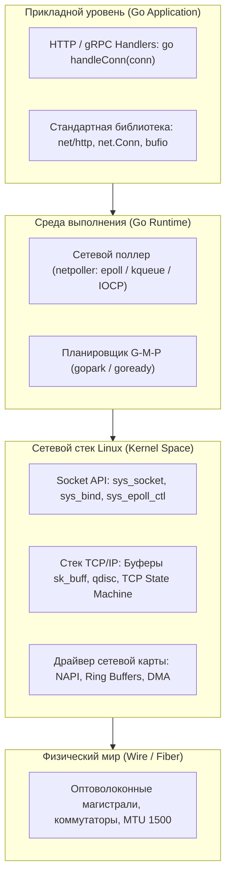
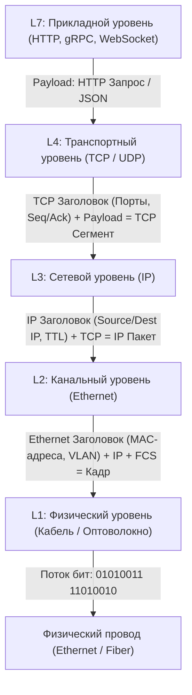
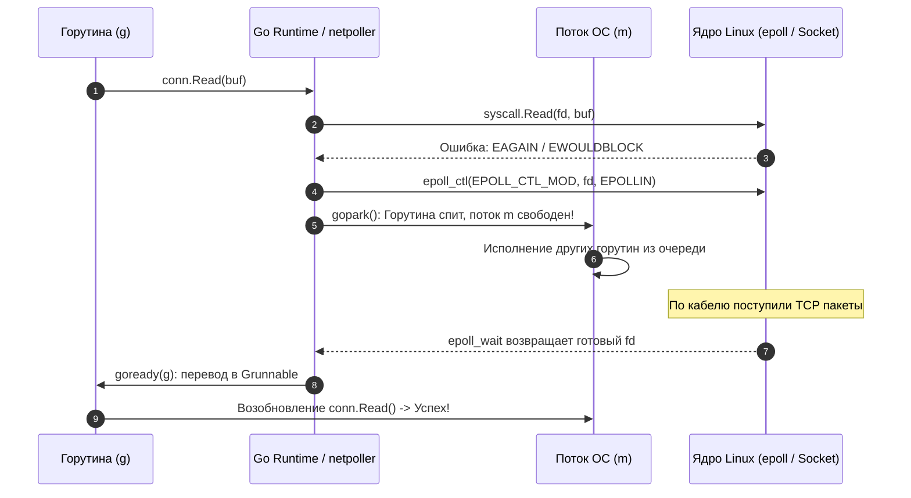

## Зачем бэкенд-разработчику знать сети?

Когда мы пишем на Go простой HTTP-клиент или создаем микросервис с помощью стандартного пакета `net/http`:

```go
resp, err := http.Get("https://api.example.com/data")
```

легко поддаться искушению и поверить в иллюзию: кажется, что данные перемещаются по некоему невидимому, идеальному эфиру. Мы пишем последовательный, синхронный код, проверяем стандартное `if err != nil` и рассчитываем, что удаленный сервер ответит за доли миллисекунды.

Однако реальная сеть — это не абстрактный эфир. Это жесткие законы фундаментальной физики: медные витые пары, фотоны света в кремниевом оптоволокне, кремниевые матрицы коммутаторов, буферы кольцевых очередей сетевых карт (NIC Ring Buffers) и непреложное ограничение скорости света (около 200 000 км/с в стекле). Если тактовый цикл современного процессора с частотой 3 ГГц длится всего 0.3 наносекунды (представим его как 1 секунду человеческого времени), то обращение к оперативной памяти займет несколько минут, а сетевой пинг через Атлантический океан (65 миллисекунд) превратится в **7 долгих лет ожидания**!

Для профессионального Go-разработчика уровней Middle+, Senior и Tech Lead глубокое понимание компьютерных сетей и сетевого стека операционной системы — это водораздел между простым «написанием кода» и подлинным архитектурным проектированием надежных распределенных систем. 

Сетевой стек дает исчерпывающие ответы на критические производственные вопросы:
*   Почему сервер на Go с легкостью удерживает **100k+ и даже 1M одновременных сетевых подключений**, не требуя сотен гигабайт оперативной памяти и не погибая от OOM Killer?
*   Почему случайный блокирующий системный вызов или обращение к DNS способно незаметно «подвесить» рабочий поток операционной системы (`M`), вызвав каскадную деградацию сервиса?
*   Откуда берутся внезапные микропаузы (Tail Latency, всплески p99/p999) и потеря пакетов на уровне прикладного сервиса при абсолютно «зеленых» графиках CPU?
*   Как проектировать отказоустойчивые микросервисы, настраивать балансировку нагрузки L4/L7, управлять сетевыми таймаутами и защищаться от разрушительных атак типа Denial of Service (DDoS)?

Язык Go не изобретал компьютерные сети заново. Но его уникальная модель конкурентности и среда выполнения были изначально спроектированы вокруг предельно эффективного, неблокирующего взаимодействия с сетевым вводом-выводом (I/O). Понимание этой глубокой связи превращает разрозненные сетевые термины в единую, кристалльно ясную систему.



## Архитектура сетевого взаимодействия: от приложения до провода

Любой байт данных, отправленный вашим Go-приложением в сетевой сокет, совершает грандиозное путешествие сквозь строгую иерархию абстракций сетевого стека. Классическая семиуровневая модель OSI (Open Systems Interconnection) и практическая четырех-/пятиуровневая модель TCP/IP описывают этот путь как процесс последовательной инкапсуляции данных:

1.  **Прикладной уровень (Application Layer / L7):** HTTP/1.1, HTTP/2, HTTP/3, gRPC, WebSocket, DNS. Здесь живут бизнес-структуры данных, сериализация (JSON, Protocol Buffers), сжатие и маршрутизация API.
2.  **Транспортный уровень (Transport Layer / L4):** протоколы TCP, UDP, QUIC. Отвечает за логическое соединение между процессами через **порты**, упорядочивание байтов, надежность доставки, контроль перегрузки каналов (Congestion Control) и управление потоком (Flow Control).
3.  **Сетевой уровень (Network / Internet Layer / L3):** протокол IP (IPv4, IPv6), протоколы ICMP, BGP, OSPF. Отвечает за глобальную маршрутизацию пакетов между различными автономными системами и дата-центрами планеты.
4.  **Канальный уровень (Data Link Layer / L2):** Ethernet, Wi-Fi, VLAN, протокол ARP. Отвечает за передачу кадров (фреймов) между физическими интерфейсами в пределах одного локального сегмента сети с использованием **MAC-адресов**.
5.  **Физический уровень (Physical Layer / L1):** электрические импульсы в медном кабеле, лазерные вспышки в оптоволокне, радиоволны.



> [!info] Под капотом
> В стандартной библиотеке Go рантайм полностью скрывает от вас возню с сырыми пакетами и заголовками сетевых уровней. Вы работаете с универсальным интерфейсом `net.Conn`, который под капотом инкапсулирует обычный файловый дескриптор (`fd`) операционной системы. Главная задача среды выполнения Go — незаметно и с максимальной эффективностью спроецировать этот `fd` на легковесные горутины, исключив тяжелые блокировки системных потоков ядра Linux.

## Go и сетевой стек: Netpoller и event-loop

Исторически существовало две крайности в реализации сетевых серверов:
1.  **Модель «Один поток на соединение» (Thread-per-connection):**  
    Классический подход серверов Apache или старых версий Java (до появления Virtual Threads в Project Loom). Сервер выделяет полноценный системный тред операционной системы под каждого подключившегося клиента. При 10 000 клиентов сервер мгновенно умирал под грузом памяти (стек каждого потока ОС занимает от 2 до 8 МБ) и захлебывался в миллионах дорогостоящих переключений контекста CPU.
2.  **Модель событийного цикла (Event Loop / Reactive):**  
    Подход Node.js (libuv) или Nginx. Один тред в бесконечном цикле опрашивает сетевые дескрипторы через вызов ядра `epoll_wait`. Это феноменально быстро и масштабируемо, но заставляет разработчика выворачивать бизнес-логику наизнанку в сложнейшие цепочки коллбэков (Callback Hell) или промисов, а любая блокирующая операция намертво парализует весь сервер.

Язык Go предложил подлинную инженерную революцию — **синтез лучших качеств обоих подходов**. Для программиста код выглядит как кристально чистая, синхронная модель «одна горутина на соединение», но под капотом Go Runtime реализует мощнейший неблокирующий асинхронный событийный цикл — **`netpoller`**.

```go
// Идиоматичный высоконагруженный TCP-сервер на Go.
// Модель "горутина на соединение" не блокирует потоки ОС!
func main() {
    ln, err := net.Listen("tcp", ":8080")
    if err != nil {
        log.Fatal(err)
    }
    defer ln.Close()

    for {
        conn, err := ln.Accept()
        if err != nil {
            log.Println("accept error:", err)
            continue
        }
        // Запуск легковесной горутины (всего ~2 КБ памяти).
        // Горутина будет автоматически парковаться на conn.Read()
        // и не будет удерживать системный поток ОС, пока ждет байты из сети.
        go handleConn(conn)
    }
}
```

Когда горутина вызывает системную операцию чтения `conn.Read()` или ожидания нового клиента `listener.Accept()`:
1.  Рантайм выполняет системный вызов `syscall.Read` на неблокирующем дескрипторе `fd`.
2.  Если удаленный клиент еще не прислал данные, ядро Linux мгновенно возвращает специальный код ошибки `EAGAIN` или `EWOULDBLOCK` («Данных нет, повторите позже»).
3.  Go Runtime перехватывает этот статус, не возвращая ошибку в пользовательский код. Он регистрирует дескриптор в сетевом поллере `netpoller` и **паркует горутину** с помощью вызова `gopark`.
4.  Системный поток ОС (`M`) освобождается за 15 наносекунд и переключается на исполнение других активных горутин из очереди планировщика!
5.  Когда физический пакет поступает на сетевую карту, ядро пробуждает поллер, рантайм вызывает `goready` и возвращает спящую горутину в очередь готовых задач `runq`.



## Mechanical Sympathy: Почему event-loop в Go быстрее тредов?

С точки зрения кремниевого процессора и операционной системы, конкуренция классических потоков ядра обходится колоссально дорого:
*   **Сброс буфера TLB (TLB flush):** Кэш ассоциативной трансляции виртуальных адресов памяти инвалидируется при смене адресного пространства.
*   **Вымывание кэшей процессора (L1/L2 Cache Thrashing):** Горячие данные текущего потока безжалостно вытесняются инструкциями и данными чужого потока, провоцируя сотни дорогостоящих Cache Misses при каждом переключении.
*   **Сохранение регистров ядра:** Процессор вынужден сохранять десятки машинных регистров (RSP, RIP, RFLAGS, сегменты, контекст FPU/AVX).
*   **Накладные расходы планировщика ядра:** Переход процессора в привилегированный Ring 0, расчет динамических приоритетов в планировщике CFS/EEVDF, балансировка нагрузки между физическими ядрами.

Переключение между горутинами в Go выполняется целиком в **User Space** (пространстве пользователя). Среда выполнения манипулирует компактным стеком (всего **2 КБ** по умолчанию против 2–8 МБ у потока ОС) и меняет всего три регистра процессора: указатель стека (`SP`), счетчик команд (`PC`) и контекст горутины. Это занимает считанные десятки процессорных тактов (10–20 наносекунд) против тысяч тактов при системном context switch.

Сетевой поллер `netpoller` виртуозно группирует системные вызовы `epoll_wait` и `kqueue`, используя безопасный вызов `epoll_pwait` для исключения гонок с системными сигналами, обеспечивая рекордную пропускную способность (throughput) и микросекундную предсказуемость задержек (latency).

## Под капотом: Как устроен `netpoller`

В исходном коде Go сетевой поллер реализован в системных файлах `src/runtime/netpoll.go` и платформенно-зависимых файлах `netpoll_epoll.go`, `netpoll_kqueue.go`, `netpoll_windows.go`. Он не является отдельным системным демоном или сторонней библиотекой, а органично вплетен в ядро рантайма Go:

*   **Linux:** интерфейс ядра `epoll` (`epoll_create1`, `epoll_ctl`, `epoll_wait`). Использует современный вызов `epoll_pwait` для безопасной маскировки сигналов.
*   **BSD / macOS:** подсистема `kqueue` (`kqueue`, `kevent`).
*   **Windows:** порты завершения ввода-вывода `IOCP` (I/O Completion Ports).
*   **WebAssembly (WASM):** виртуальный модуль `webPoller`, взаимодействующий с асинхронными браузерными API.

Жизненный цикл сетевого сокета в рантайме:
1.  При старте сетевой подсистемы процедура `netpollInit` инициализирует глобальный дескриптор epoll в ядре операционной системы.
2.  При открытии сокета функция `netpollopen` связывает дескриптор со специальной структурой `pollDesc`.
3.  Когда горутина блокируется на операции ввода-вывода, процедура `netpollBlock` переводит горутину в режим ожидания, связывает ее со структурой дескриптора и при необходимости вызывает `runtime.stopm` для экономии энергии процессора.
4.  Когда сетевое событие свершилось, процедура `netpollReady` с помощью вызова `goready` извлекает горутину и помещает ее в локальную очередь планировщика `runq`.

> [!tip] Собеседование
> **Вопрос:** Что произойдет в системе, если внутри горутины вызвать функцию `time.Sleep` или инициировать тяжелый блокирующий системный вызов, который в принципе не поддерживается сетевым поллером `netpoller` (например, чтение локального файла на диске через `os.File.Read`)?  
> **Ответ:** Функция `time.Sleep` интегрирована с таймерами рантайма и паркует горутину без удержания потока. Однако если горутина выполняет блокирующий системный вызов ядра, не поддерживаемый `netpoller` (дисковый ввод-вывод или CGo-библиотека), **системный поток ОС (`M`) физически блокируется в пространстве ядра**.  
> Планировщик Go спасает ситуацию через механизм Hand-off: он отцепляет логический процессор `P` и пересаживает его на свободный поток ОС из пула. Но если количество заблокированных тредов превысит лимит рантайма (значительно превысив `GOMAXPROCS`), а нагрузка продолжит нарастать, производительность сервиса лавинообразно рухнет. Именно поэтому дисковые и внешние блокирующие вызовы необходимо жестко контролировать и профилировать.

## Ловушки и собеседования

*   **Ловушка 1: Структура `net.Conn` не является полностью потокобезопасной.**  
    Хотя стандартная библиотека Go разрешает одной горутине читать из `net.Conn` (`Read()`), пока другая горутина одновременно пишет в него (`Write()`), **одновременный вызов двух `Read()` или двух `Write()` из разных горутин категорически запрещен**! Это приведет к разрушению внутренних буферов, перемешиванию сетевых кадров и непредсказуемым гонкам данных (Race Conditions). При конкурентной записи необходимо использовать `sync.Mutex` или передавать данные через единый канал-диспетчер.
*   **Ловушка 2: Утечка соединений и зависший Keep-Alive.**  
    Если клиент оборвал сетевой кабель без отправки TCP FIN-пакета, а сервер не настроил таймауты (`SetDeadline`, `SetReadDeadline`), соединение останется «висеть» в памяти вечно. Поллер `netpoller` продолжит удерживать дескриптор в ядре, пока операционная система не исчерпает лимит открытых файлов (`ulimit -n`). Нагрузочные тесты обязаны включать анализ открытых сокетов и сетевой дамп с помощью утилит `tcpdump` и `ss`.
*   **Ловушка 3: Блокировки на уровне разрешения DNS-имен.**  
    Вызов `net.Dial` или `net.ResolveTCPAddr` по умолчанию производит синхронный DNS-запрос. Исторически при использовании системного C-резолвера (`cgo`) это блокировало системный тред ОС. В современном Go (начиная с Go 1.20+) чистый Go-резолвер `netgo` используется по умолчанию на большинстве платформ. Однако в высоконагруженных микросервисных кластерах некорректная конфигурация DNS в `resolvconf` с избыточным параметром `ndots:5` может генерировать до 5 лишних DNS-запросов на каждый HTTP-вызов, драматически увеличивая задержки (рекомендуется выставлять `ndots:0` или локально кэшировать DNS-записи).

```go
// Идиоматичный шаблон безопасного чтения сетевого потока в цикле
for {
    // Обязательная защита от зависших полуоткрытых соединений
    _ = conn.SetReadDeadline(time.Now().Add(30 * time.Second))

    n, err := conn.Read(buf)
    if err != nil {
        if errors.Is(err, io.EOF) {
            // Удаленная сторона корректно закрыла TCP-соединение (получен FIN)
            break
        }
        var netErr net.Error
        if errors.As(err, &netErr) && netErr.Timeout() {
            log.Printf("таймаут соединения для %s", conn.RemoteAddr())
            break
        }
        log.Printf("ошибка чтения сокета: %v", err)
        return err
    }
    // Безопасная обработка полезной нагрузки размером n байт
    processPayload(buf[:n])
}
```

## Сравнение с другими языками

| Язык и платформа | Архитектурная модель I/O | Управление системными потоками | Масштабируемость до 100k+ коннектов |
| :--- | :--- | :--- | :---: |
| **PHP-FPM** | Синхронная блокирующая (Process-per-request) | Один тяжелый процесс ОС на каждого клиента | ❌ Не масштабируется (требует фронтенд Nginx) |
| **Java (до Project Loom)** | Синхронная блокирующая (Thread-per-connection) | Полноценные потоки ОС (стек от 2 МБ) | ⚠️ Дорого по памяти, требует сложного Netty |
| **Node.js (JavaScript)** | Асинхронная неблокирующая (libuv Event Loop) | Один системный тред на JavaScript-рантайм | ✅ Высокая по I/O, но уязвима к блокировкам CPU |
| **Язык Go** | **Гибридная модель (M:N Netpoller)** | **Легковесные горутины поверх пула тредов** | **✅ Идеальный баланс: нативный параллелизм и простота** |

Язык Go безоговорочно выигрывает в сетевом бэкенде благодаря уникальному архитектурному балансу: неблокирующий I/O на уровне ядра через `netpoller`, минимальное потребление оперативной памяти горутинами (~2 КБ) и автоматическое распределение нагрузки по всем ядрам многопроцессорного сервера.

## Итог и навигация

1.  **Сеть как строгая физика:** Компьютерная сеть — это не абстрактный провод, а сложнейший комплекс задержек, буферизации, очередей и аппаратных ограничений.
2.  **Сетевой поллер `netpoller`:** Сердце сетевой мощи Go. Он транслирует неблокирующие вызовы ядра (`epoll`, `kqueue`, `IOCP`) в линейный, кристально понятный синхронный код без коллбэков.
3.  **Mechanical Sympathy:** Переключение горутин в User Space занимает 10–20 наносекунд против микросекунд при смене системных потоков ОС, полностью устраняя проблему C10K/C100K.
4.  **Культура надежности:** Всегда настраивайте сетевые таймауты (`SetDeadline`), учитывайте неполную потокобезопасность `net.Conn` и следите за лимитами дескрипторов `ulimit -n`.

Мы открыли фундаментальный третий модуль нашей энциклопедии. В следующей лекции мы разберем канонические архитектурные модели взаимодействия и проследим побитовый путь данных от пользовательского приложения до физического кабеля: переходим к [[2. Модели OSI и TCP IP. Как данные проходят путь от приложения до провода.md]].
