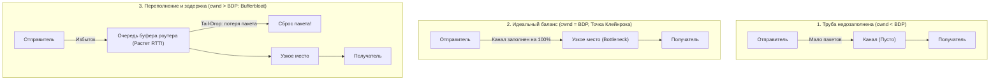
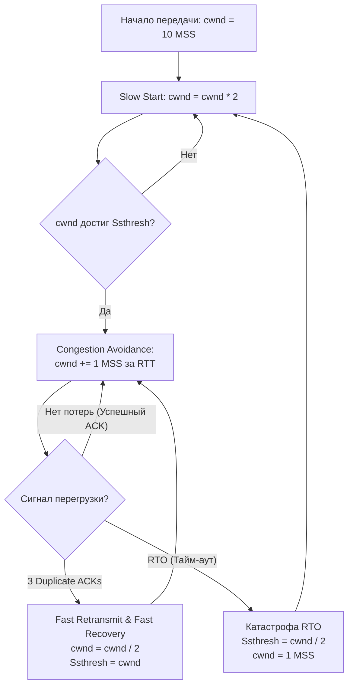
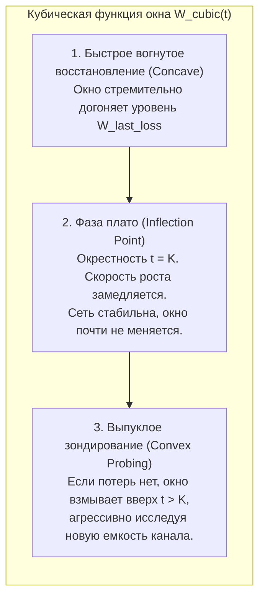
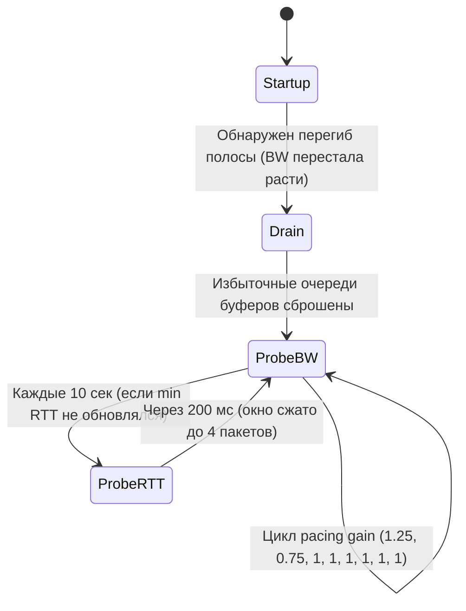

## Введение: Зачем Go-разработчику знать алгоритмы контроля перегрузки?

Представьте себе автомагистраль в час пик. Если въезд на трассу никем не регулируется, сотни автомобилей устремляются на дорожное полотно одновременно. В какой-то момент пропускная способность дороги исчерпывается: машины бампер к бамперу встают в глухую пробку, скорость падает до нуля, а водители в отчаянии съезжают на обочину.

В компьютерных сетях происходит ровно то же самое. Если передающий сервер начнет выстреливать сетевые пакеты на максимальной скорости своего сетевого адаптера (например, 10 или 40 Гбит/с), первый же промежуточный коммутатор или домашний роутер с портом 1 Гбит/с захлебнется. Входные буферы переполнятся, и пакеты начнут падать на пол (Drop). 

Здесь на сцену выходит **контроль перегрузки** (*Congestion Control*) — один из самых красивых и интеллектуальных механизмов сетевого стека ядра Linux. Он непрерывно решает фундаментальную задачу: динамически вычисляет размер окна перегрузки (**`cwnd`** — *Congestion Window*), то есть предельный объем данных (в байтах или пакетах), который отправителю разрешено держать «в полете» (*in-flight*) без подтверждения от получателя.

Для Go-разработчика это далеко не праздное академическое любопытство:
- От выбранного алгоритма зависит, как быстро ваш микросервис на **`net/http`** или gRPC отдаст ответ клиенту через Атлантику или межрегиональный VPC.
- Поведение `cwnd` напрямую управляет буферами сокета в ядре: когда окно захлопывается, системный вызов `write(2)` перестает принимать данные, сокет становится не готов к записи, и сетевой полинг Go (**`netpoller`**) вынужден парковать выполняющуюся горутину.
- Алгоритм определяет **P99** задержки (latency) всей вашей распределенной системы.

> [!info] Под капотом
> В ядре Linux каждый алгоритм контроля перегрузки оформлен как модуль, реализующий структуру **`tcp_congestion_ops`**. В ней определены указатели на функции обратного вызова: `init`, `ssthresh`, `cong_avoid`, `undo_cwnd`, `pkts_acked` и другие. 
> 
> При получении каждого входящего подтверждения (ACK) сетевая карта генерирует аппаратное прерывание, а ядро передает управление обработчику softirq **`NET_RX_SOFTIRQ`**. В этом контексте ядро мгновенно вызывает коллбэк зарегистрированного алгоритма (например, **`cubic_ack`** для Cubic или **`bbr_main`** для BBR). Этот код обязан выполняться за доли микросекунды, решая, на сколько сегментов увеличить или уменьшить `cwnd`. Рантайм Go не вмешивается в эту низкоуровневую математику ядра, но производительность каждого вызова `conn.Write()` напрямую зависит от вердикта `tcp_congestion_ops`.

---

## Фундамент: Как TCP понимает, что сеть перегружена?

В 1986 году глобальный интернет пережил так называемый «коллапс перегрузки» (*Congestion Collapse*): пропускная способность магистрального канала LBL–UC Berkeley рухнула с 32 Кбит/с до 40 бит/с (падение в 800 раз!). Сеть была забита повторными передачами пакетов, которые сами же создавали заторы. Ван Якобсон (*Van Jacobson*) и Майкл Карелс разработали базовые принципы контроля перегрузки, которые спасли TCP/IP.

Чтобы понять суть проблемы, нужно познакомиться с ключевой метрикой сети — **BDP** (*Bandwidth-Delay Product*, произведение пропускной способности на задержку):

$$\text{BDP} = \text{Bandwidth} \times \text{RTT}$$

Физический смысл BDP — это **емкость трубы**. Если пропускная способность узкого места (*Bottleneck Bandwidth*, **`BW`**) равна 1 Гбит/с, а время кругового пути (**`RTT`**) составляет 40 мс:

$$\text{BDP} = \frac{10^9 \text{ бит/с}}{8 \text{ бит/байт}} \times 0.04 \text{ с} = 5\,000\,000 \text{ байт} \approx 5 \text{ МБ}$$

Это означает, что для 100% утилизации канала передатчик должен непрерывно держать в кабеле ровно 5 мегабайт неподтвержденных данных. 
- Если `cwnd` < BDP: труба недозаполнена, дорогой канал простаивает.
- Если `cwnd` > BDP: труба полна, и «лишние» пакеты начинают накапливаться в аппаратных очередях промежуточных маршрутизаторов.



Классические алгоритмы прошлых десятилетий использовали **потерю пакетов** (*Packet Loss*) как единственный и непоколебимый сигнал перегрузки. 

В этом крылся фундаментальный парадокс: *чтобы алгоритм понял, что сеть заполнена, он обязан накачивать её пакетами до тех пор, пока буферы маршрутизаторов не лопнут, начав сбрасывать пакеты (Tail Drop)*!
Заполнение очередей приводит к катастрофическому росту сетевой задержки — явлению, известному как **Bufferbloat**.

---

## TCP Reno: Классический AIMD

Алгоритм **Reno** (RFC 5681) стал классикой компьютерных сетей. Его логика опирается на принцип **AIMD** (*Additive Increase, Multiplicative Decrease* — аддитивное увеличение, мультипликативное уменьшение).

Жизнь соединения в Reno делится на две главные фазы:
1. **Медленный старт (Slow Start):** При старте соединения или после глубокого тайм-аута окно `cwnd` удваивается каждый сетевой оборот (**`RTT`**). При получении каждого ACK размер `cwnd` увеличивается на **`1 MSS`**, то есть на каждый отправленный пакет возвращается два:
   $$\mathbf{cwnd = cwnd \times 2} \quad \text{(за один RTT)}$$
   Экспоненциальный разгон продолжается до тех пор, пока окно не достигнет порога медленного старта (**`Ssthresh`** — *Slow Start Threshold*).
2. **Предотвращение перегрузки (Congestion Avoidance):** Достигнув `Ssthresh`, алгоритм переходит к осторожному линейному зондированию канала:
   $$\mathbf{cwnd\mathrel{+}= 1\text{ MSS за RTT}}$$
3. **Реакция на перегрузку:**
   - **Три дублирующих ACK (Fast Retransmit & Fast Recovery):** Потеря одного сегмента при сохранности остальных. Окно падает ровно вдвое:
     $$\mathbf{cwnd = cwnd / 2}$$
     Порог `Ssthresh` выставляется равным новому значению `cwnd`, и продолжается фаза Congestion Avoidance.
   - **Тайм-аут повторной передачи (RTO — Retransmission Timeout):** Худший сценарий. Полная тишина в канале. `Ssthresh` выставляется в половину текущего окна, а само окно обрушивается до исходного значения:
     $$\mathbf{cwnd = 1\text{ MSS}}$$
     Алгоритм начинает мучительный подъем с фазы Slow Start.



График размера окна Reno напоминает зубья пилы (*Sawtooth pattern*): медленный линейный подъем и резкие вертикальные обрывы вдвое.

В локальных сетях (LAN) 90-х годов с задержкой в 1 миллисекунду Reno работал превосходно. Но представьте современный трансатлантический канал 10 Гбит/с с RTT = 100 мс. BDP такого соединения составляет около 125 мегабайт (~86 000 пакетов по 1460 байт). 
Если при потере одного случайного пакета Reno уменьшит окно наполовину (с 86 000 до 43 000 пакетов), ему потребуется:
$$43\,000 \text{ RTT} \times 0.1 \text{ с} = 4\,300 \text{ секунд} \approx 71 \text{ минута!}$$
Семьдесят минут, чтобы просто вернуться к прежней скорости! Очевидно, что для высокоскоростных глобальных сетей требовалась иная математика.

---

## TCP Cubic: Стандарт Linux и рост по времени

Чтобы устранить медлительность Reno на каналах с большим BDP, исследователи Сантэ Ха, Инджон Ри и Лисун Сюй в 2006 году создали алгоритм **Cubic**. Начиная с ядра 2.6.19 (2006–2009 гг.) и по сей день Cubic остается алгоритмом контроля перегрузки по умолчанию в подавляющем большинстве дистрибутивов Linux.

Главная революция Cubic: **размер окна больше не привязан к частоте подтверждений (ACK) и задержке RTT**. Рост окна рассчитывается как кубическая функция от **физического астрономического времени ($t$)**, прошедшего с момента последнего события потери.

Формула размера окна Cubic:
`W_cubic = C * (t - K)^3 + W_last_loss`

$$W_{\text{cubic}}(t) = C \cdot (t - K)^3 + W_{\text{last\_loss}}$$

где:
- $t$ — физическое время, прошедшее с момента последней потери пакета;
- $W_{\text{last\_loss}}$ — размер окна непосредственно перед предшествующей потерей пакета;
- $C$ — константа масштабирования Cubic (по умолчанию около $0.4$);
- $K$ — расчетный интервал времени, необходимый окну для возвращения к точке $W_{\text{last\_loss}}$:
  $$K = \sqrt[3]{\frac{W_{\text{last\_loss}} \cdot \beta}{C}}$$
  (где $\beta$ — коэффициент мультипликативного уменьшения, в Cubic он мягче, чем в Reno: $\beta \approx 0.2$, то есть при потере окно уменьшается не на 50%, а всего на 20%, сохраняя $80\%$ своего размера).



Кубическая траектория идеальна с точки зрения устойчивости:
1. **Concave (вогнутая область):** Сразу после потери окно быстро восстанавливается до уровня $W_{\text{last\_loss}}$, минимизируя время простоя.
2. **Плато ($t \approx K$):** Вблизи предыдущего максимума окно почти перестает расти. Алгоритм проявляет исключительную деликатность, давая сети возможность стабилизироваться и избегая повторной раскачки буферов.
3. **Convex (выпуклая область):** Если за время плато потерь не возникло, значит, сеть освободилась или емкость канала расширилась. Cubic начинает резко взвинчивать окно, чтобы занять новую доступную полосу.

> [!info] Под капотом
> Независимость Cubic от RTT обеспечивает так называемую **RTT-Fairness** (справедливость по отношению к RTT). В классическом Reno соединение с RTT = 10 мс получало подтверждения в 10 раз чаще, чем параллельное соединение с RTT = 100 мс, и буквально вытесняло конкурента из канала. В Cubic оба соединения наращивают окно по одной и той же временной шкале $t$, справедливо деля общую пропускную способность.

**Плюсы:** Превосходная стабильность, отличная утилизация гигабитных каналов в стабильных сетях.  
**Минусы:** Cubic все еще остается алгоритмом, ориентированным на *потерю пакетов* (*Loss-based*). На зашумленных линиях (Wi-Fi, сотовые сети 4G/5G), где пакеты теряются из-за радиопомех, а не из-за заторов, Cubic ошибочно сбрасывает скорость. Кроме того, в межрегиональных облачных соединениях Cubic упорно заполняет буферы промежуточных маршрутизаторов до отказа, вызывая взрывной рост **P99** latency.

---

## TCP BBR: Смена парадигмы (Lossless Congestion Control)

В 2016 году инженеры Google (Нил Кардвелл, Юйчун Чэн, Кевин Якобсон и др.) представили миру алгоритм **BBR** (*Bottleneck Bandwidth and Round-trip propagation time*). BBR произвел революцию: он отверг потерю пакетов как индикатор перегрузки.

Философия BBR базируется на фундаментальной теории Леонарда Клейнрока (1979 г.): **идеальная рабочая точка сети достигается тогда, когда объем данных в полете в точности равен BDP**.
- В этой точке скорость доставки максимальна (**BW**).
- Время оборота минимально (**min RTT**), так как очереди в роутерах пусты.

Попытка отправить больше пакетов, чем BDP, не увеличит пропускную способность — она лишь заставит пакеты ждать в очередях буферов, раздувая RTT (Bufferbloat).

```
Задержка (RTT)
     ^
     |                                    / (Очередь растет: Bufferbloat)
 min |-----------------------------------/ 
 RTT |                                  /
     +---------------------------------+-------------------------> Окно (in-flight)
Пропускная
способность (BW)
 max |                                 +------------------------- (Канал насыщен)
  BW |                                /
     |                               /
     +------------------------------+---------------------------> Окно (in-flight)
                                    ^
                           Оптимум Клейнрока
                           (cwnd = BDP = BW * min RTT)
```

Сложность заключается в том, что согласно принципу неопределенности Клейнрока, сетевой стек не может измерить максимальную полосу пропускания и минимальную задержку одновременно одним пакетом. Если вы измеряете полосу, вы переполняете канал (и задержка растет). Если измеряете задержку, вы обязаны опустошить канал (и полоса недоиспользуется).

BBR элегантно решает эту дилемму, непрерывно строя физическую модель соединения с помощью автомата состояний из 4 фаз:



1. **`Startup` (Разгон):** Экспоненциальное удвоение скорости отправки каждый RTT (аналог Slow Start), пока регистрируемая пропускная способность растет. Как только прирост замедляется, BBR фиксирует максимальную ширину канала (**`BW`**).
2. **`Drain` (Осушение):** На этапе разгона в сетевых буферах неизбежно застряли лишние пакеты. BBR резко снижает скорость отправки (Pacing rate), чтобы опустошить очереди коммутаторов и вернуть задержку к исходному **`min RTT`**.
3. **`ProbeBW` (Зондирование полосы):** Основное рабочее состояние BBR. Состоит из 8-фазного цикла изменения коэффициента отправки пакетов:
   - В первой фазе отправка ускоряется на $25\%$ ($\text{gain} = 1.25$), чтобы проверить, не расширился ли канал.
   - Во второй фазе отправка замедляется на $25\%$ ($\text{gain} = 0.75$), чтобы тут же сбросить созданную кратковременную очередь.
   - В следующих 6 фазах ($\text{gain} = 1.0$) передача идет строго с расчетной скоростью узкого места.
4. **`ProbeRTT` (Зондирование задержки):** Каждые 10 секунд BBR сжимает окно до 4 пакетов на 200 мс. Это гарантирует абсолютное опустошение любых очередей по всему маршруту и позволяет заново замерить истинный физический **`min RTT`** оптоволоконного кабеля.

> [!tip] Собеседование
> **Вопрос:** Почему переход на BBR может снизить P99 latency сетевого API в разы по сравнению с Cubic?  
> **Ответ:** Cubic — алгоритм на основе потерь (*Loss-based*). Чтобы определить предел скорости, он накачивает буферы сетевого оборудования до отказа (*Tail-Drop*). Очереди пакетов в буферах роутеров создают искусственную задержку (Bufferbloat), которая в трансконтинентальных каналах раздувает RTT со 100 мс до 1–2 секунд!  
> BBR управляет не только размером окна, но и темпом отправки пакетов (**Pacing**). Он удерживает объем данных в полете строго в пределах **`BDP`**, не допуская образования очередей. Результат — стабильный P99 latency, близкий к физическому min RTT кабеля, и нулевая чувствительность к случайным радиопотерям пакетов.

> [!warning] Ловушка / Gotcha
> 1. **Дисциплина очередей ядра Linux:** Для эффективной работы BBR отправка пакетов должна регулироваться с субмикросекундной точностью (*Pacing*). Поэтому BBR требует использования дисциплины очередей **`fq`** (*Fair Queueing*) на сетевом интерфейсе: `tc qdisc replace dev eth0 root fq`. Без `fq` BBR не сможет равномерно распределять пакеты во времени.
> 2. **Несправедливость к Cubic (BBR v1):** Первая версия BBR была настолько агрессивна в удержании канала, что в общих очередях могла вытеснять соединения на базе Reno/Cubic почти до нуля. В версии BBR v2 (и разрабатываемой v3) Google скорректировал алгоритм, добавив учет сигналов ECN (*Explicit Congestion Notification*) и умеренную реакцию на системные потери.

---

## Сравнение и выбор в production

Сведем ключевые характеристики алгоритмов в единую инженерную матрицу:

| Критерий | TCP Reno | TCP Cubic | TCP BBR (v2/v3) |
|---|---|---|---|
| **Главный сигнал** | Потеря пакетов (*Packet Drop / RTO*) | Потеря пакетов (*Packet Drop*) | Пропускная способность (**BW**) и задержка (**min RTT**) |
| **Функция роста окна** | Линейная ($+1\text{ MSS}$ за RTT) | Кубическая по физическому времени ($t^3$) | Моделирование состояния BDP, pacing rate |
| **Реакция на потерю** | Падение вдвое (`cwnd = cwnd / 2`) | Снижение на 20% ($\beta = 0.2$) | Корректировка модели полосы, без паники |
| **Влияние на Bufferbloat** | Высокое (забивает очереди) | Критическое (переполняет буферы) | Минимальное (держит буферы пустыми) |
| **Поведение в Wi-Fi / 4G** | Коллапс скорости из-за шума | Заметная деградация скорости | Игнорирует случайные потери, держит темп |
| **Основная сфера применения** | Устаревшие ОС, локальные тесты | Стандартный серверный трафик в LAN | CDN, межрегиональный RPC, видеостриминг, Cloud API |

---

## Go, Linux и сетевой стек: Практика

Контроль перегрузки реализуется ядром Linux, однако Go-бэкенд непосредственно ощущает его последствия через буферы сокетов и планировщик рантайма.

### 1. Проверка и переключение алгоритма в ОС

Проверить доступные и активные алгоритмы в вашей системе:

```bash
# Список поддерживаемых алгоритмов в текущем ядре
sysctl net.ipv4.tcp_available_congestion_control
# Пример вывода: reno cubic bbr

# Текущий алгоритм по умолчанию
sysctl net.ipv4.tcp_congestion_control
# output: net.ipv4.tcp_congestion_control = cubic
```

Для переключения стека на BBR (требуется ядро Linux 4.9+):

```bash
# Включаем планировщик пакетов fq (Fair Queueing)
sudo sysctl -w net.core.default_qdisc=fq

# Активируем BBR
sudo sysctl -w net.ipv4.tcp_congestion_control=bbr

# Сохраняем в /etc/sysctl.d/99-bbr.conf для сохранения после перезагрузки
echo "net.core.default_qdisc=fq" | sudo tee -a /etc/sysctl.d/99-bbr.conf
echo "net.ipv4.tcp_congestion_control=bbr" | sudo tee -a /etc/sysctl.d/99-bbr.conf
sudo sysctl --system
```

### 2. Настройка сокетов и буферов в Go через Control

Когда BBR или Cubic рассчитывают размер окна перегрузки `cwnd`, физическая отправка данных ограничивается системным буфером передачи сокета (**`sndbuf`**). Если размер буфера в ядре меньше, чем вычисленный BDP канала, сокет не сможет вместить нужный объем данных «в полете», искусственно задушив производительность.

В Go для точечной настройки сокетов на этапе создания сетевого слушателя используется структура `net.ListenConfig` и поле **`Control`**:

```go
package main

import (
	"context"
	"log"
	"net"
	"syscall"
)

func main() {
	// Создаем конфигурацию слушателя с кастомным управлением сокетом
	lc := net.ListenConfig{
		Control: func(network, address string, c syscall.RawConn) error {
			var socketErr error
			// Вызываем Control для прямого доступа к низкоуровневому файловому дескриптору (fd)
			err := c.Control(func(fd uintptr) {
				// 1. Увеличиваем буфер приема (SO_RCVBUF) до 1 МБ
				// Это позволяет приемнику разворачивать Receive Window (rwnd) для высокого BDP
				if err := syscall.SetsockoptInt(int(fd), syscall.SOL_SOCKET, syscall.SO_RCVBUF, 1024*1024); err != nil {
					socketErr = err
					return
				}

				// 2. Увеличиваем буфер отправки (SO_SNDBUF) до 1 МБ
				// Чтобы BBR мог держать достаточный объем in-flight данных без блокировки
				if err := syscall.SetsockoptInt(int(fd), syscall.SOL_SOCKET, syscall.SO_SNDBUF, 1024*1024); err != nil {
					socketErr = err
					return
				}
			})
			if err != nil {
				return err
			}
			return socketErr
		},
	}

	ln, err := lc.Listen(context.Background(), "tcp", ":8080")
	if err != nil {
		log.Fatalf("Ошибка Listen: %v", err)
	}
	defer ln.Close()

	log.Println("Сервер успешно запущен с оптимизированными буферами сокетов")
}
```

> [!info] Под капотом: связь cwnd, sndbuf и netpoller в Go
> Когда Go-программа выполняет вызов `conn.Write(p)`, рантайм вызывает системный вызов `write(2)` над файловым дескриптором сокета. 
> Если окно перегрузки `cwnd` исчерпано или буфер сокета ядра **`sndbuf`** переполнен, Linux-ядро возвращает ошибку `EAGAIN` или `EWOULDBLOCK`. 
> 
> Сетевой полинг Go (**`netpoller`**), работающий поверх **`epoll`** (в Linux) или `kqueue` (в macOS), перехватывает это событие. Рантайм отвязывает текущую горутину (структуру **`g`**) от системного потока `M` и переводит её в состояние ожидания (`_Gwaiting`). Поток `M` не блокируется, а переключается на выполнение других готовых горутин!
> 
> Как только получатель присылает ACK, softirq ядра **`NET_RX_SOFTIRQ`** освобождает байты в `sndbuf` и увеличивает `cwnd`. Ядро генерирует событие готовности сокета к записи (`EPOLLOUT`). `epoll_wait` в фоновом цикле `netpoller` фиксирует это событие и переводит горутину `g` обратно в статус `_Grunnable`, возвращая её в очередь планировщика.
> 
> Чем стабильнее и шире `cwnd`, тем реже происходят эти вынужденные context switch горутин, и тем меньше драгоценных тактов CPU тратится впустую.

---

## Ловушки и собеседования

*   **Bufferbloat и хвостовые задержки (Tail Latency):** Если мониторинг сетевого сервиса показывает резкий скачок P99/P999 задержки при практически 100% утилизации канала, но потери пакетов отсутствуют — это хрестоматийный симптом Bufferbloat. Помогает миграция сетевого интерфейса на современный дисциплинарный фильтр очередей **`fq_codel`** (*Controlled Delay*) или включение BBR на уровне транспортного протокола.
*   **Тюнинг буферов ядра против буферов Go:** В Go 1.19+ в структуру **`net/http.Transport`** добавлены параметры **`ReadBufferSize`** и **`WriteBufferSize`**. Однако они управляют лишь буферами прикладного уровня в пользовательском пространстве (`bufio.Reader` / `bufio.Writer`), экономя память кучи Go. Если узкое место лежит в BDP сети, первостепенное значение имеют параметры ядра:
    ```bash
    # sysctl net.ipv4.tcp_rmem = min default max (буферы приема)
    sysctl net.ipv4.tcp_rmem="4096 87380 16777216"
    # sysctl net.ipv4.tcp_wmem = min default max (буферы отправки)
    sysctl net.ipv4.tcp_wmem="4096 65536 16777216"
    ```
*   **Собеседование: «Что происходит в Go-сервере, если между клиентом и сервером внезапно возрос процент потерь?»**  
    1. При использовании Reno или Cubic потеря пакета трактуется как перегрузка. Ядро сокращает `cwnd` (на 50% или 20%), уменьшая пропускную способность.
    2. Скорость опустошения буфера сокета `sndbuf` резко падает.
    3. Системные вызовы `write(2)` начинают возвращать `EAGAIN`.
    4. `netpoller` чаще паркует горутины `g` в ожидании `EPOLLOUT`.
    5. Число спящих горутин растет, за ними растет потребление оперативной памяти на стеки горутин, а ответы клиентам задерживаются, вызывая деградацию latency всего сервиса.

---

## Итог

1. **Reno** — исторический алгоритм AIMD с линейным наращиванием окна и резким делением пополам при потерях. Неэффективен на современных скоростных каналах с большим BDP.
2. **Cubic** — проверенный стандарт Linux. Окно растет по кубической траектории от физического времени ($t^3$), обеспечивая RTT-Fairness и быстрое восстановление. Однако сохраняет чувствительность к случайным потерям и провоцирует Bufferbloat.
3. **BBR** — революционный алгоритм нового поколения от Google. Моделирует состояние канала по максимальной пропускной способности (**BW**) и минимальной задержке (**min RTT**), удерживая `cwnd` на уровне BDP и обеспечивая минимальный P99 latency.
4. **Связь с Go:** Алгоритм контроля перегрузки через `cwnd` и размер буферов `sndbuf`/`tcp_wmem` напрямую определяет, как часто рантайм Go паркует горутины через **`netpoller`** и **`epoll`**.

Мы досконально изучили, как TCP борется за надежность и филигранно регулирует сетевой поток. Но что делать, если накладные расходы на поддержание состояния, упорядочивание и подтверждения нам попросту не нужны? В следующей статье мы познакомимся с диаметрально противоположной сетевой философией — протоколом UDP: [[14. UDP. Когда ненадежный транспорт лучше TCP.md]].