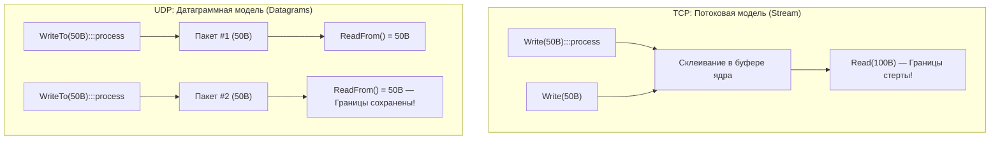
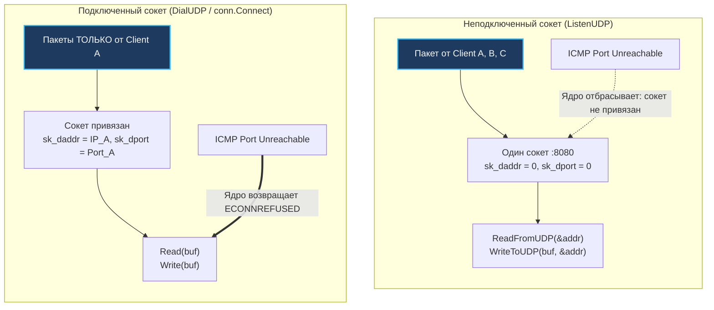

## UDP: Философия и устройство

> *"Сделайте вещь настолько простой, насколько это возможно, но не проще."*  
> — Альберт Эйнштейн

В мире сетевого программирования существует две диаметрально противоположные философии общения. 

Первая — это телефонный звонок (**TCP**). Вы набираете номер, ждете гудков, абонент поднимает трубку, вы обмениваетесь приветствиями (*Handshake*), непрерывно уточняете: «Ты меня слышишь? Повтори последнее слово» (*ACK*, *Retransmit*), аккуратно подстраиваете темп речи под скорость собеседника (*Flow & Congestion Control*) и в конце церемонно прощаетесь (*FIN/ACK*). Это надежно, но требует времени, ресурсов и постоянного поддержания состояния.

Вторая философия — это отправка почтовой открытки (**UDP**, *User Datagram Protocol*). Вы берете карточку, пишете на ней короткий текст, указываете адрес получателя и бросаете в почтовый ящик. Почтовая служба доставит её с максимальным усердием (*Best Effort*), но не дает никаких клятв. Открытка может прийти завтра, может задержаться в пути, может обогнать открытку, отправленную вчера, а может и вовсе промокнуть под дождем и пропасть. Никаких уведомлений о доставке вам не пришлют. Но зато отправить открытку можно мгновенно, без предварительных звонков и договоренностей.

Спецификация **UDP** (RFC 768), написанная Дэвидом Ридом в августе 1980 года, занимает всего три страницы. Это абсолютный шедевр минимализма в истории вычислительной техники. Протокол сознательно отказывается от установления соединения, подтверждения доставки, контроля порядка сегментов и управления перегрузкой. 

В отличие от TCP, который оперирует непрерывным абстрактным байтовым потоком (`SOCK_STREAM`), UDP работает с **датаграммами** (`SOCK_DGRAM`) — самостоятельными, неделимыми пакетами данных.

```
       0      7 8     15 16    23 24    31
      +--------+--------+--------+--------+
      |     Source      |   Destination   |
      |      Port       |      Port       |
      +--------+--------+--------+--------+
      |                 |                 |
      |     Length      |    Checksum     |
      +--------+--------+--------+--------+
      |                                   |
      |          Data (Payload)           |
      |                                   |
      +-----------------------------------+
```

Заголовок UDP предельно аскетичен и занимает **ровно 8 байт**:
1. **Source Port (16 бит):** Порт отправителя (может быть 0, если ответ не требуется).
2. **Destination Port (16 бит):** Порт назначения.
3. **Length (16 бит):** Полная длина датаграммы (заголовок 8 байт + полезные данные). Минимальное значение — 8 байт.
4. **Checksum (16 бит):** Контрольная сумма для проверки целостности заголовка, псевдозаголовка IP и данных.

Для Go-разработчика переход от TCP к UDP — это не просто смена `SOCK_STREAM` на `SOCK_DGRAM` при вызове сетевого API. Это смена парадигмы: вы берете на себя ответственность за надежность, упорядочивание и восстановление потерь, взамен получая минимальную задержку, предсказуемое поведение и доступ к broadcast/multicast.

---

## Под капотом: Ядро Linux и датаграммы

Что происходит внутри ядра операционной системы, когда Go-приложение работает с UDP?

В исходных кодах ядра Linux (`include/net/udp.h`) UDP-сокет описывается структурой **`struct udp_sock`** (расширяющей базовую `struct inet_sock` и `struct sock`). При создании сокета системным вызовом `socket(AF_INET, SOCK_DGRAM, IPPROTO_UDP)` ядро выделяет эту структуру памяти.

Сравните это с монументальной машиной состояний TCP:
- В UDP **нет** очередей ретрансмиссии и ожидания `sk_write_queue` для handshakes.
- В UDP **нет** модулей контроля перегрузки `tcp_congestion_ops` для window management.
- В UDP **нет** понятия состояния `TCP_ESTABLISHED`, таймеров TIME_WAIT или FIN_WAIT.

### Путь отправки данных (TX Path)
Когда ваша программа вызывает `conn.WriteTo(buf, addr)` или системный вызов `sendto(2)`:
1. Системный вызов `sys_write` / `sendto` передает буфер ядру в функцию **`udp_sendmsg`**.
2. Ядро проверяет размер сообщения и выделяет сетевой буфер `sk_buff`.
3. Функция **`ip_append_data`** формирует пакет, ядро навешивает 8-байтный UDP-заголовок (`src_port`, `dst_port`, `length`, `checksum`), рассчитывает контрольную сумму и прикрепляет IPv4/IPv6-заголовок.
4. Функция **`ip_send_skb`** отправляет пакет напрямую в очередь драйвера сетевой карты (`dev_queue_xmit`).

Нет никаких ACK, нет ожидания подтверждений, нет скользящего окна, нет таймеров повторной отправки. Пакет со скоростью света уходит в физическую среду. Если по пути промежуточный коммутатор переполнится — пакет будет выброшен без всяких колебаний.

```mermaid
flowchart LR
    classDef process  fill:#1e293b,stroke:#38bdf8,stroke-width:1px,color:#f8fafc
    classDef success  fill:#064e3b,stroke:#34d399,stroke-width:1px,color:#f8fafc
    classDef error    fill:#7f1d1d,stroke:#f87171,stroke-width:1px,color:#f8fafc
    classDef warning  fill:#78350f,stroke:#fbbf24,stroke-width:1px,color:#f8fafc
    classDef entry    fill:#1e3a5f,stroke:#38bdf8,stroke-width:2px,color:#f8fafc
    classDef aux      fill:#334155,stroke:#64748b,stroke-width:1px,color:#f8fafc
    classDef system   fill:#312e81,stroke:#a78bfa,stroke-width:1px,color:#f8fafc
    classDef data     fill:#132d29,stroke:#2dd4bf,stroke-width:1px,color:#f8fafc
    classDef network  fill:#881337,stroke:#fb7185,stroke-width:1px,color:#f8fafc
    classDef accent   fill:#1e1b4b,stroke:#818cf8,stroke-width:1px,color:#f8fafc
    subgraph TX["Отправка (TX Path)"]
        direction TB
        A["Go приложение<br>conn.WriteTo(buf, addr):::system"] -->|"sys_write / sendto"| B["Ядро Linux<br>udp_sendmsg"]
        B -->|"ip_append_data"| C["sk_buff<br>+ UDP (8B) + IP заголовки"]
        C -->|"ip_send_skb"| D["Сетевой стек / Драйвер NIC"]
    end

    subgraph NET["Физическая сеть"]
        D -->|"Ethernet Frame"| E["Маршрутизаторы / Интернет"]
    end

    subgraph RX["Прием (RX Path)"]
        direction TB
        E -->|"Сетевой кадр"| F["Сетевой адаптер NIC (Приемник)"]
        F -->|"NET_RX_SOFTIRQ"| G["Ядро Linux<br>udp_recvmsg"]
        G -->|"Очередь SO_RCVBUF"| H["Go приложение<br>conn.ReadFrom(buf)"]
    end
```



### Ключевое отличие: Границы сообщений (Message Boundaries)

TCP представляет собой непрерывную реку байтов. Если вы отправите в TCP-сокет три куска по 100 байт:
$$\text{Write}(100) \to \text{Write}(100) \to \text{Write}(100)$$
Получатель на другом конце может прочитать их как угодно: одним куском в 300 байт, тремя кусками по 100 байт или 300 вызовами по 1 байту! В TCP границы сообщений не существуют.

UDP сохраняет **границы сообщений** (*Message Boundaries*) в первозданном виде.
Если отправитель делает:
$$\text{WriteTo}(100) \to \text{WriteTo}(100) \to \text{WriteTo}(100)$$
Приемник на другом конце совершит ровно три вызова `ReadFrom`, каждый из которых вернет ровно по 100 байт. Ядро не склеивает пакеты и не нарезает их (до тех пор, пока они укладываются в лимиты MTU). Это делает UDP идеальным транспортом для передачи дискретных команд, сообщений и метрик.



> [!info] Под капотом
> UDP-заголовок содержит поле **`Checksum`**, алгоритм расчета которого аналогичен TCP: сумма 16-битных слов с дополнением до единицы, вычисляемая поверх псевдозаголовка IP (IP-адреса, протокол 17, длина), заголовка UDP и самого тела пакета.
> 
> В стандарте IPv4 контрольная сумма является опциональной: если в поле записаны нули, проверка пропускается (исторически это делалось для экономии тактов CPU на древних маршрутизаторах). В IPv6 контрольная сумма **строго обязательна**. В Go стандартный пакет `net` всегда прозрачно и корректно рассчитывает контрольную сумму при использовании методов `WriteTo`, `WriteToUDP` или `DialUDP`.

---

## Go-реализация: net.UDPConn и netpoll

В стандартной библиотеке Go работа с UDP инкапсулирована в тип **`net.UDPConn`**, который встраивает универсальный **`net.IPConn`** (и реализует интерфейсы `net.Conn` и `net.PacketConn`).

### Подключенный и неподключенный сокет: conn.Connect

В отличие от TCP-соединений, UDP-сокет по своей физической природе **не имеет состояния подключения**. Однако в Socket API и в Go существует два режима работы:
1. **Неподключенный сокет (`net.ListenUDP`):** Сервер слушает конкретный порт и готов принимать датаграммы от кого угодно, используя `ReadFromUDP`. Отвечать можно на любой адрес через `WriteToUDP`.
2. **Подключенный сокет (`net.DialUDP` или `conn.Connect(addr)`):** Вы можете вызвать `conn.Connect(addr)` на UDP-сокете. Приведет ли это к отправке сетевых пакетов? **Нет, ни единого байта не уйдет в сеть!** 

В ядре Linux вызов `connect(2)` для `SOCK_DGRAM` сокета выполняет сугубо локальные действия:
- Записывает адрес и порт удаленного хоста в поля структуры сокета **`sk->sk_daddr`** и **`sk->sk_dport`** (`sk_daddr` / `sk_dport`).
- Привязывает сокет к маршруту в таблице FIB (*Forwarding Information Base*), исключая повторные поиски шлюза при каждом пакете (ускоряет отправку на 10–15%).
- Позволяет приложению использовать обычные методы **`Write`** и **`Read`** вместо `WriteTo` и `ReadFrom`, так как ядро уже знает адрес назначения по умолчанию.
- **Главный бонус:** Ядро начинает доставлять вашему сокету асинхронные ошибки ICMP (например, `ICMP Port Unreachable`), которые для неподключенного сокета просто игнорируются! Если удаленный хост закрыл порт, вызов `Read()` на подключенном UDP-сокете вернет ошибку `connection refused`.



### Взаимодействие с netpoll

Планировщик Go (**`netpoll`**) интегрирует UDP-сокеты с системным механизмом мультиплексирования **`epoll`** (Linux) или **`kqueue`** (BSD/macOS):
- Событие **`EPOLLIN`**: Сигнализирует о том, что в системном буфере сокета ядра (**`SO_RCVBUF`**) появилась хотя бы одна принятая датаграмма, готовая к вызову `ReadFromUDP`.
- Событие **`EPOLLOUT`**: Означает, что в исходящем буфере (**`SO_SNDBUF`**) или очереди сетевого интерфейса есть место для отправки. Если буфер переполнен экстремальным потоком исходящих сообщений, системный вызов ядра вернет **`EAGAIN`** или **`EWOULDBLOCK`**, и `netpoller` временно усыпит горутину до освобождения очереди.

### Практический пример: Высоконагруженный UDP-сервер на Go

Напишем эталонный пример UDP-сервера с настройкой буферов и правильной обработкой ошибок:

```go
package main

import (
	"fmt"
	"net"
	"os"
	"os/signal"
	"syscall"
)

func main() {
	// 1. Создание UDP-сокета на порту 8080
	serverAddr := &net.UDPAddr{
		IP:   net.ParseIP("127.0.0.1"),
		Port: 8080,
	}

	conn, err := net.ListenUDP("udp", serverAddr)
	if err != nil {
		fmt.Fprintf(os.Stderr, "Ошибка создания сокета: %v\n", err)
		os.Exit(1)
	}
	defer conn.Close()

	// 2. Критически важная настройка: увеличиваем буфер приема ядра
	// По умолчанию Linux выделяет скромные ~212 КБ, что приводит к потерям при всплесках
	const rcvBufSize = 4 * 1024 * 1024 // 4 МБ
	if err := conn.SetReadBuffer(rcvBufSize); err != nil {
		fmt.Fprintf(os.Stderr, "Предупреждение: не удалось увеличить SO_RCVBUF: %v\n", err)
	}

	fmt.Println("UDP сервер запущен на 127.0.0.1:8080. Ожидание датаграмм...")

	// Обработка мягкого завершения (Graceful Shutdown)
	sigChan := make(chan os.Signal, 1)
	signal.Notify(sigChan, os.Interrupt, syscall.SIGTERM)
	go func() {
		<-sigChan
		fmt.Println("\nЗавершение работы UDP-сервера...")
		conn.Close()
		os.Exit(0)
	}()

	// 3. Цикл приема датаграмм
	// Буфер 1500 байт (стандартный Ethernet MTU) гарантирует чтение целого пакета без усечения
	buf := make([]byte, 1500)
	for {
		n, remoteAddr, err := conn.ReadFromUDP(buf)
		if err != nil {
			// При закрытии сокета во время shutdown ReadFromUDP вернет ошибку
			select {
			case <-sigChan:
				return
			default:
				fmt.Fprintf(os.Stderr, "Ошибка чтения: %v\n", err)
				continue
			}
		}

		// Выводим полученное сообщение
		fmt.Printf("Получено %d байт от %s: %s\n", n, remoteAddr, string(buf[:n]))

		// 4. Отправляем ответ отправителю
		response := []byte("ACK: датаграмма получена")
		_, err = conn.WriteToUDP(response, remoteAddr)
		if err != nil {
			fmt.Fprintf(os.Stderr, "Ошибка отправки ответа на %s: %v\n", remoteAddr, err)
		}
	}
}
```

А вот как выглядит подключенный клиент, использующий `DialUDP`:

```go
package main

import (
	"fmt"
	"net"
	"os"
)

func main() {
	serverAddr, err := net.ResolveUDPAddr("udp", "127.0.0.1:8080")
	if err != nil {
		fmt.Fprintf(os.Stderr, "Ошибка разрешения адреса: %v\n", err)
		os.Exit(1)
	}

	// DialUDP создает сокет и выполняет connect(2) на уровне ядра Linux
	conn, err := net.DialUDP("udp", nil, serverAddr)
	if err != nil {
		fmt.Fprintf(os.Stderr, "Ошибка DialUDP: %v\n", err)
		os.Exit(1)
	}
	defer conn.Close()

	// Теперь мы можем использовать обычные Write и Read вместо WriteTo/ReadFrom!
	message := []byte("Привет из Go через UDP!")
	if _, err := conn.Write(message); err != nil {
		fmt.Fprintf(os.Stderr, "Ошибка Write: %v\n", err)
		return
	}

	reply := make([]byte, 1500)
	n, err := conn.Read(reply)
	if err != nil {
		fmt.Fprintf(os.Stderr, "Ошибка Read: %v\n", err)
		return
	}

	fmt.Printf("Ответ от сервера: %s\n", string(reply[:n]))
}
```

---

## Когда UDP выигрывает у TCP

Казалось бы, зачем добровольно отказываться от надежности TCP? Существует четыре фундаментальных сценария, где UDP превосходит TCP на голову:

1. **Критическая задержка и чувствительность к времени (Real-Time Systems):**  
   Отсутствие трехстороннего рукопожатия (3-way handshake) и контроля перегрузки устраняет стартовую паузу. Для создания тысяч коротких взаимодействий в секунду вызов `net.Dial` для UDP в Go отрабатывает моментально.  
   Более того, в видеостриминге, голосовой связи (VoIP, SIP) и сетевых играх устаревший кадр не имеет никакой ценности. Если пакет с координатами игрока на 12-м кадре потерялся, незачем тормозить весь рендеринг и ждать его повторной отправки (Head-of-Line Blocking в TCP) — к моменту прихода запоздалого пакета игра уже отрисовывает 15-й кадр!
2. **Групповая рассылка (Broadcast и Multicast):**  
   TCP физически не способен работать более чем с двумя узлами (он строго Point-to-Point). UDP поддерживает широковещательную рассылку в локальной сети на адрес `255.255.255.255` (**Broadcast**) и многоадресную рассылку группе подписчиков в диапазоне `224.0.0.0/4` (**Multicast**). Это основа протоколов Service Discovery (mDNS, SSDP), протоколов маршрутизации и биржевых финансовых фидов рыночных данных (Market Data Feeds).
3. **Короткие запросы вида «Вопрос — Ответ» (Idempotent Transactions):**  
   Для отправки одного небольшого запроса и получения ответа (DNS, NTP, DHCP) открывать TCP-соединение — непозволительная роскошь: три пакета на handshake, два пакета на данные, четыре пакета на закрытие (итого 9 пакетов ради 1 полезного запроса!). UDP справляется ровно за 2 пакета: один запрос туда, один ответ обратно.
4. **Построение специализированных протоколов нового поколения:**  
   Такие протоколы, как **QUIC** (основа **HTTP/3**), **DTLS** (Datagram TLS), **WireGuard** и протоколы телеметрии (StatsD, Prometheus push-gateway) намеренно выбирают UDP в качестве транспортного фундамента. Они реализуют собственные механизмы шифрования, мультиплексирования потоков и восстановления потерь в пользовательском пространстве (*Userspace*), избегая окостенения стека ядра (*OS Ossification*).

---

> [!warning] Ловушка / Gotcha
> ### 1. Переполнение буфера и «тихая смерть» пакетов
> Если ваше Go-приложение на мгновение заблокировалось (например, долгая пауза Stop-the-World сборщика мусора или занятость пула воркеров) и не успело вызвать `ReadFrom`, системный буфер приема ядра **`SO_RCVBUF`** мгновенно переполнится.  
> 
> В отличие от TCP, который в такой ситуации шлет нулевое окно (`rwnd = 0`) и принудительно останавливает отправителя, UDP **молча выбрасывает вновь прибывшие пакеты в мусорную корзину**. Ваша программа не получит ни ошибки, ни предупреждения!  
> 
> **Как защититься:**
> - Всегда увеличивайте буфер сокета через `conn.SetReadBuffer(size)` (например, `conn.SetReadBuffer(4 * 1024 * 1024)`) до начала первого вызова чтения.
> - Мониторьте системные счетчики дропов пакетов в Linux через `netstat -su` или `ss -u -a` (строка `RcvbufErrors` / `drops`).
> 
> ### 2. Размер MTU, флаг DF и фрагментация
> UDP не фрагментирует данные прикладного уровня самостоятельно. Если размер вашей датаграммы превышает **Path MTU** (максимальный размер нефрагментируемого блока на пути следования), ядро будет вынуждено фрагментировать IP-пакет на уровне L3.  
> 
> Если хотя бы один фрагмент из десяти потеряется в пути — весь IP-пакет будет отброшен приемником целиком! Более того, если в IP-заголовке установлен флаг **`DF`** (*Don't Fragment*), маршрутизатор с меньшим MTU просто уничтожит датаграмму и вернет сообщение ICMP **`Fragmentation needed`**.  
> 
> **Золотое правило:** Никогда не превышайте безопасный размер полезной нагрузки UDP (Payload):
> $$\text{Payload}_{\text{IPv4}} \le 1500\text{ (MTU)} - 20\text{ (IP)} - 8\text{ (UDP)} = \mathbf{1472\text{ байта}}$$
> $$\text{Payload}_{\text{IPv6}} \le 1500\text{ (MTU)} - 40\text{ (IP)} - 8\text{ (UDP)} = \mathbf{1452\text{ байта}}$$
> А для глобального интернета с туннелями VPN и PPPoE надежнее держать размер полезной нагрузки не более **1200–1280 байт**.

---

> [!tip] Собеседование
> **Вопрос:** «UDP не гарантирует доставку и порядок. Как спроектировать надежный протокол поверх UDP?»  
> **Ожидаемый ответ:**  
> «Чтобы построить надежность поверх UDP (по аналогии с тем, как это сделано в **QUIC** или **DTLS**), в заголовок прикладного уровня внедряются следующие компоненты:
> 1. **Порядковые номера (Sequence Numbers):** Для обнаружения дубликатов и восстановления правильного порядка сообщений на приемнике.
> 2. **Подтверждения (ACK или NACK):** Приемник сообщает отправителю об успешном получении пакетов (ACK) либо запрашивает конкретные утерянные пакеты (**NACK** — *Negative ACK*, что очень эффективно в реальном времени).
> 3. **Таймауты и ретрансмиссия:** Отправитель взводит таймер для каждого неподтвержденного пакета и переотправляет его при истечении времени.
> 4. **Скользящее окно (Sliding Window) и Congestion Control:** Чтобы не завалить сеть пакетами, реализуется механизм управления скоростью (например, адаптация BBR или Cubic в userspace).  
> 
> Ключевая прелесть построения надежности поверх UDP заключается в том, что мы берем только те гарантии, которые действительно нужны нашей задаче, избавляясь от жесткой блокировки очереди (Head-of-Line Blocking) TCP.»
> 
> **Вопрос:** «В чем фундаментальная разница между `conn.Connect()` на UDP-сокете и обычным TCP-соединением?»  
> **Ожидаемый ответ:**  
> «Вызов `conn.Connect()` на UDP-сокете не инициирует сетевого трафика и не выполняет handshake. На уровне ядра Linux он лишь заполняет поля адреса назначения в структуре сокета (`sk_daddr` и `sk_dport`). Это переводит сокет в статус *connected*:
> - Позволяет использовать системные вызовы `read(2)` / `write(2)` (в Go методы `Read()` и `Write()`) без передачи адреса в каждом пакете.
> - Ядро фильтрует входящие датаграммы, отбрасывая пакеты от любых других хостов, кроме подключенного.
> - Ядро кэширует маршрут в FIB, снижая накладные расходы CPU на отправку.
> - Ядро передает сокету ошибки ICMP (например, `Port Unreachable`), генерируя системную ошибку `ECONNREFUSED`. В неподключенном UDP-сокете такие ICMP-сообщения молча игнорируются.»

---

## Итог

1. **UDP** — это образец инженерного минимализма: 8-байтный заголовок, отсутствие состояния соединения и полная свобода от алгоритмов контроля потока.
2. **Границы сообщений (Message Boundaries):** В отличие от непрерывного байтового потока TCP, каждая датаграмма UDP неделима и самодостаточна. Сколько байт записано за один `WriteTo` — столько байт будет прочитано за один `ReadFrom`.
3. **Под капотом Linux:** Ядро обходится без очередей retransmission и автоматов состояний. Отправка идет по кратчайшему пути через `udp_sendmsg` в драйвер интерфейса.
4. **Специфика в Go:** `net.UDPConn` отлично интегрирован в `netpoll`. При этом критически важно помнить об увеличении системного буфера через `SetReadBuffer`, иначе при всплесках трафика ядро будет молча уничтожать датаграммы.
5. **Где UDP незаменим:** Стриминг аудио/видео, онлайн-игры, Service Discovery (Multicast/Broadcast), короткие транзакции (DNS, NTP) и современные протоколы на базе UDP (QUIC / HTTP/3).

Мы завершили фундаментальный анализ транспортного уровня. Но как именно операционная система связывает сетевой кабель с пользовательскими процессами? Что такое сокет с точки зрения ядра Linux и файловой системы Unix? В следующей лекции мы погрузимся в недра системного интерфейса: [[15. Порты, сокеты и Socket API.md]].