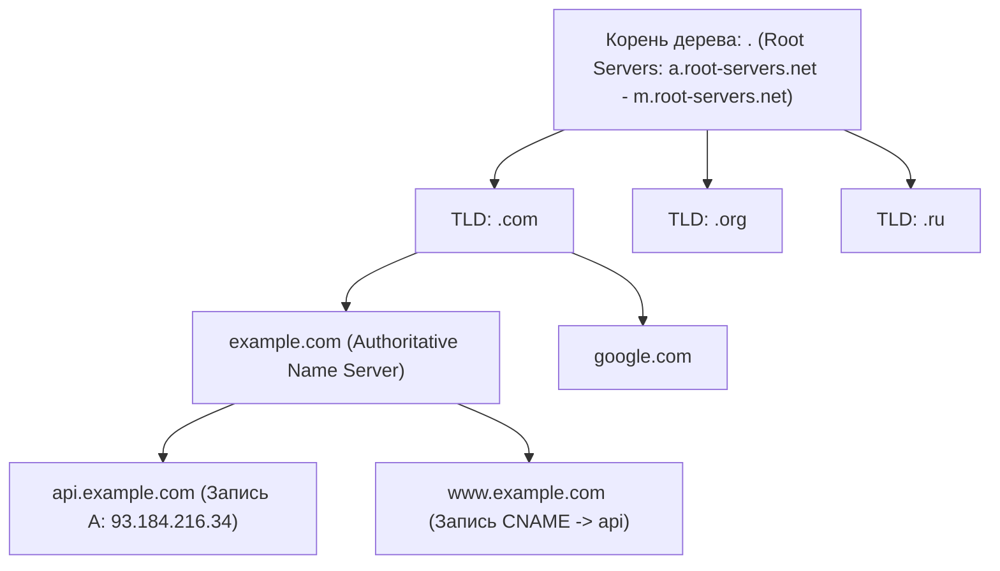
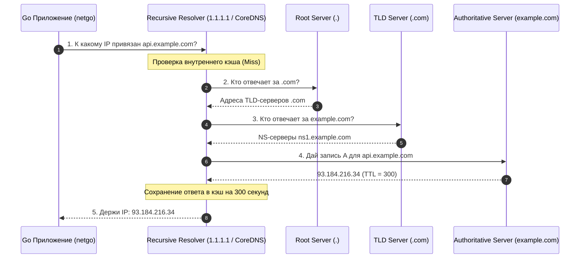
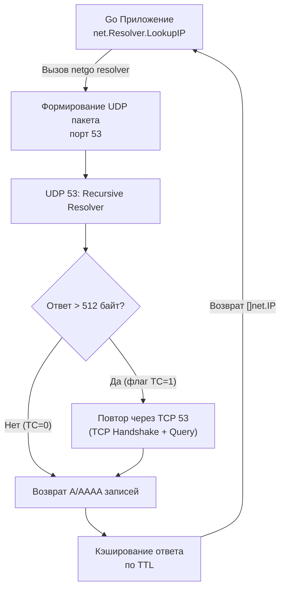

## Введение: DNS как фундамент сетевой инфраструктуры

> *"В начале была строка `HOSTS.TXT`. И была она на одном сервере в Стэнфорде, и скачивали её по FTP раз в неделю все компьютеры планеты. И когда компьютеров стало больше тысячи, наступил хаос."*  
> — Из истории раннего интернета

В конце 1970-х годов, на заре зарождения ARPANET, таблица соответствия человекочитаемых имен компьютеров и их сетевых адресов хранилась в одном-единственном текстовом файле `HOSTS.TXT`. Его вручную редактировала Элизабет Фейнлер в Стэнфордском исследовательском институте (SRI). Каждый системный администратор в мире раз в неделю скачивал свежую версию файла по протоколу FTP. 

Когда число узлов перевалило за несколько тысяч, централизованная схема рухнула под собственной тяжестью. В 1983 году Пол Мокапетрис предложил революционную архитектуру — **DNS** (*Domain Name System*, RFC 882/883, позже RFC 1034/1035). Он создал первую в истории человечества глобально распределенную, иерархическую, отказоустойчивую базу данных без единой точки отказа.

Для бэкенд-разработчика DNS — это не просто абстрактное «преобразование имени в IP-адрес», а самый первый, обязательный и критичный этап абсолютно любого сетевого взаимодействия. 
В Go каждый высокоуровневый вызов:
- `net.Dial("tcp", "api.example.com:443")`,
- `http.Client.Do()` (или `http.Get()`),
- `grpc.Dial()` (или `grpc.NewClient()`)

неявно запускает процесс разрешения доменного имени (*DNS Resolution*). 

Если DNS-инфраструктура дает сбой или отвечает с задержкой в 500 мс, ваше приложение не просто «не находит хост» — оно блокирует сетевые горутины, исчерпывает пулы TCP-соединений, вызывает каскадные таймауты и способно уложить весь production-кластер в считанные секунды. 

---

## Иерархическая модель разрешения

База данных DNS организована в виде перевернутого дерева (*DNS Tree*), где корень обозначается невидимой точкой в самом конце доменного имени: `api.example.com.`.



Когда Go-приложение обращается к домену `api.example.com`, в процесс включаются три ключевых участника:

1. **Stub Resolver (Локальный резолвер):**  
   Минималистичный клиент разрешения имен, находящийся на вашей локальной машине. В традиционных Unix-системах это функция `getaddrinfo()` из библиотеки `glibc`, а в современных Go-приложениях — встроенный чистый резолвер **`netgo`**. Его задача проста: прочитать локальный конфиг `/etc/resolv.conf` и передать запрос по сети рекурсивному серверу.
2. **Recursive Resolver (Рекурсивный резолвер):**  
   «Рабочая лошадка» интернета. Это сервер вашего интернет-провайдера, облачного провайдера (AWS Route 53, CoreDNS в Kubernetes) или публичные резолверы вроде Cloudflare (**`1.1.1.1`**) и Google (**`8.8.8.8`**). Рекурсивный резолвер берет на себя всю тяжелую работу по итеративному обходу цепочки серверов от корня до конца:
   - Спрашивает у Root-сервера: «Где найти `.com`?» — Получает адрес TLD-сервера.
   - Спрашивает у TLD-сервера: «Где найти `example.com`?» — Получает адреса авторитетных NS-серверов.
   - Спрашивает у авторитетного сервера: «Какой IP у `api.example.com`?» — Получает финальный адрес.
3. **Authoritative Name Server (Авторитетный сервер):**  
   Сервер, являющийся первичным источником истины для конкретной зоны. Именно на нем администраторы домена прописывают финальные ресурсные записи: **`A`** (IPv4), **`AAAA`** (IPv6), **`CNAME`** (псевдоним), `MX` (почта) или `TXT`.



> [!NOTE] Под капотом
> В Go начиная с версии 1.11 по умолчанию на всех платформах Unix используется **чистый Go resolver (`netgo`)**. 
> Исторически Go обращался к C-библиотеке `glibc` через `cgo`. Однако системный вызов `getaddrinfo(3)` в Linux является строго синхронным и блокирующим: пока идет DNS-запрос, поток операционной системы заморожен целиком! 
> Чистый `netgo` полностью автономен, написан на Go, использует асинхронный сетевой реактор `netpoller` и позволяет миллионам горутин выполнять параллельные DNS-запросы без создания тысяч системных потоков ОС.

---

## Под капотом: Транспорт, UDP/TCP fallback и структура пакета

Резолвинг в Go начинается с формирования сетевого запроса и отправки UDP-пакета на порт `53`. 

Исторически спецификация RFC 1035 установила жесткое правило: **размер полезной нагрузки DNS-сообщения по UDP не может превышать `512 байт`**. Это ограничение было выбрано в 1983 году, чтобы DNS-пакет гарантированно укладывался в минимальный гарантированный MTU IPv4 (576 байт) без фрагментации.

Однако за кулисами сетевого стека Go реализован умный fallback-механизм:

1. **Основной транспорт (UDP 53):**  
   Запрос улетает мгновенно, без предварительного установления соединения (0 RTT).
2. **Флаг Truncation (`TC`):**  
   Если объем ответа сервера превышает **`512 байт`** (например, домен возвращает десятки IP-адресов или тяжелые криптографические подписи **`DNSSEC`**), сервер обрезает тело ответа до 512 байт и взводит в заголовке битовый флаг **`TC=1`** (**`Truncation`** — отсечение).
3. **Резервный транспорт (TCP 53):**  
   Увидев флаг `TC`, резолвер Go обязан немедленно повторить запрос, установив полноценное соединение через **TCP порт 53**. Это гарантирует надежную передачу объемных данных любого размера, но добавляет как минимум два дополнительных оборота сети (**Round-Trip Time**, **`RTT`**) на Three-Way Handshake. Кроме того, TCP 53 исторически используется серверами для полной передачи зон (**`AXFR`**).

### Анатомия бинарного DNS-пакета

DNS-сообщение имеет строгую 12-байтную бинарную структуру заголовка, за которой следуют четыре секции:

```
+---------------------------------------------------+
|                   Header (12 байт)                |
|  ID (16 бит) | Флаги: QR, opcode, AA, TC, RD, RA |
|  QDCOUNT (вопросы) | ANCOUNT (ответы)             |
|  NSCOUNT (авторитеты) | ARCOUNT (дополнительно)   |
+---------------------------------------------------+
|               Question (Вопрос)                   |
|  Имя домена, Type (A/AAAA), Class (IN)            |
+---------------------------------------------------+
|               Answer (Ответы)                     |
+---------------------------------------------------+
|               Authority (Авторитетные NS)         |
+---------------------------------------------------+
|               Additional (Дополнительные данные)  |
+---------------------------------------------------+
```

Флаги заголовка:
- **`QR` (Query/Response, 1 бит):** `0` — запрос, `1` — ответ.
- **`opcode` (4 бита):** Тип запроса (обычно `0` — стандартный QUERY).
- **`AA` (Authoritative Answer, 1 бит):** `1` означает, что ответ пришел от сервера, владеющего зоной.
- **`TC` (Truncation, 1 бит):** `1` означает, что сообщение обрезано из-за превышения лимита размера.
- **`RD` (Recursion Desired, 1 бит):** Клиент просит сервер выполнить рекурсивный поиск.
- **`RA` (Recursion Available, 1 бит):** Сервер подтверждает, что поддерживает рекурсию.

Секции данных:
- **`Question`:** Содержит запрашиваемое имя, тип записи (`A` — IPv4, `AAAA` — IPv6) и класс (`IN` — Internet).
- **`Answer/Authority/Additional`:** 
  - **`Answer`:** Непосредственно найденные IP-адреса с их индивидуальным временем жизни (**TTL**).
  - **`Authority`:** Список авторитетных NS-серверов зоны.
  - **`Additional`:** Вспомогательные данные (например, IP-адреса самих NS-серверов или служебные записи расширения EDNS0).



---

## Как Go resolver работает «под капотом»

Внутренняя реализация чистого резолвера **`netgo`** (исходные файлы `src/net/dnsclient_unix.go` и `src/net/lookup_unix.go`) представляет собой полноценный асинхронный DNS-клиент:

1. **Парсинг системной конфигурации:**  
   При первом DNS-запросе Go читает и кэширует конфигурацию хоста:
   - В Linux — парсит файл **`resolv.conf`** (`/etc/resolv.conf`).
   - В macOS — опрашивает системный реестр **`SCDynamicStore`**.
   - В Windows — читает реестр через **`dnscfg`**.  
   Из конфигурации извлекаются директивы: адреса DNS-серверов (`nameserver`), локальный домен (`domain`), список поисковых суффиксов (**`search`**) и параметр порогового числа точек (**`ndots`**).
2. **Обработка директив `search` и `ndots`:**  
   Если запрашиваемое имя содержит точек меньше, чем указано в `ndots`, Go начинает последовательно дописывать к имени суффиксы из списка `search`.
3. **Встроенный кэш с дедупликацией (DNS Caching with Deduplication):**  
   Для параллельных запросов Go использует потокобезопасный механизм на базе **`sync.Map`** и каналов синхронизации (аналог паттерна `singleflight`). Это предотвращает повторные отправки одинаковых сетевых пакетов.
4. **Асинхронное исполнение через Netpoller:**  
   Вызовы `net.DialContext` и `resolver.LookupIP` используют неблокирующие сокеты. Если DNS-сервер задерживает ответ, горутина паркуется в `netpoll`, не сжигая процессорные циклы.
5. **Fallback на системный cgo-резолвер:**  
   Если в среде выполнения выставлена переменная окружения **`GODEBUG=netdns=cgo`**, Go принудительно отключает `netgo` и передает все DNS-запросы функции `getaddrinfo` из библиотеки **`glibc`**.

---

> [!warning] Ловушка / Gotcha: resolv.conf и параметр ndots: 5 в Kubernetes
> Это одна из самых коварных сетевых ловушек современного бэкенда!  
> В Kubernetes стандартный файл `/etc/resolv.conf` внутри любого Pod содержит настройки:
> ```ini
> nameserver 10.96.0.10
> search default.svc.cluster.local svc.cluster.local cluster.local
> options ndots:5
> ```
> Параметр **`ndots: 5`** указывает резолверу: *«Если в запрашиваемом домене меньше 5 точек, считай его относительным именем и сначала последовательно опроси все поисковые домены из списка `search`!»*
> 
> Представьте: ваш Go-сервис запускается в кластере, и вы обращаетесь к внутреннему сервису по имени `db-master` или к внешнему платежному шлюзу `api.stripe.com` (в имени всего 2 точки, что строго меньше 5).  
> Резолвер Go начинает судорожно посылать запросы в CoreDNS кластера:
> 1. `api.stripe.com.default.svc.cluster.local` → NXDOMAIN (ошибка)
> 2. `api.stripe.com.svc.cluster.local` → NXDOMAIN (ошибка)
> 3. `api.stripe.com.cluster.local` → NXDOMAIN (ошибка)
> 4. И только четвертым запросом улетает реальный `api.stripe.com.`!
> 
> Результат: CoreDNS захлебывается миллионами мусорных запросов, а каждый внешний HTTP-вызов получает штраф в 10–50 мс задержки!
> 
> **Как решить проблему:**
> 1. Всегда используйте абсолютное доменное имя (**`FQDN`** — *Fully Qualified Domain Name*) с точкой на конце в коде: `api.stripe.com.`. Завершающая точка прямо сообщает резолверу, что имя абсолютное, и `search`-домены подставляться не будут.
> 2. Или явно настройте параметр `ndots: 0` или `ndots: 2` в спецификации пода Kubernetes (`PodSpec`):
>    ```yaml
>    dnsConfig:
>      options:
>        - name: ndots
>          value: "2"
>    ```

---

> [!tip] Собеседование
> **Вопрос:** «Как Go обрабатывает сотни одновременных DNS-запросов к одному и тому же домену (например, при утреннем старте сервиса)?»  
> **Ответ:**  
> «Go использует механизм **DNS Caching with Deduplication** (дедупликация запросов в полете).  
> Когда 1000 горутин одновременно вызывают `net.Dial("tcp", "database.internal:5432")`, Go не отправляет 1000 одинаковых UDP-пакетов в сеть. Первая горутина инициирует фактический сетевой запрос и регистрирует канал ожидания в таблице активных резолвов. Остальные 999 горутин видят, что запрос к данному имени уже находится в полете, и просто подписываются на ожидание этого же канала.  
> Когда единственный UDP-ответ возвращается, рантайм раздает результат всем ожидающим горутинам одновременно. Это защищает локальные DNS-резолверы от эффекта лавины (*Thundering Herd / DNS Storm*).»

---

## Mechanical Sympathy: Влияние на CPU, кэши и задержки

С точки зрения архитектуры процессора и операционной системы, DNS-резолвинг — это операция с колоссальной стоимостью:

1. **Context Switch & Syscall:**  
   Вызов `connect()` для UDP-сокета вызывает системный вызов. Если кэш miss, происходит сетевой I/O, который может заблокировать тред ОС на время RTT (10-100ms). В случае с `cgo`-резолвером (`GODEBUG=netdns=cgo`), каждый вызов блокирует поток операционной системы. При 100 одновременных запросах Go вынужден порождать 100 системных тредов ОС (**`M`**), вызывая переключение контекста ядра и потребляя виртуальную память под стек потоков. Чистый `netgo` лишен этого недостатка.
2. **Загрязнение кэшей CPU (Cache Pollution):**  
   Парсинг DNS-пакетов, чтение битовых полей, декодирование сжатых DNS-имен (*Name Compression pointers*) и сравнение строк создают интенсивный трафик в кэшах данных L1/L2 процессора. При высокой частоте холостых резолвов возникает явление *Cache Thrashing*, вымывающее полезные данные вашего бизнес-кода из кэша CPU.
3. **Escape Analysis и нагрузка на Garbage Collector:**  
   Сетевые структуры ответов `[]net.IP` и буферы сокетов неизбежно убегают в кучу (**Escape Analysis**), генерируя мусор и увеличивая частоту циклов сборщика мусора Go под нагрузкой.
4. **Профилирование DNS-задержек:**  
   Анализировать влияние DNS на производительность Go-приложения можно с помощью встроенного профилировщика **`pprof`** (анализ блокировок в `net/http` и netpoller) и трассировки HTTP-запросов через пакет `net/http/httptrace`.

> [!tip] Собеседование
> **Вопрос:** «Почему `net.DialContext` может висеть дольше, чем указано в дедлайне контекста, если упал DNS-сервер?»  
> **Ответ:**  
> «Исторически в ранних версиях Go системный резолвер `glibc` не поддерживал прерывание по контексту. В современном `netgo` вызов отслеживает контекст, однако если системный сокет ядра зависает на ожидании UDP-пакета от мертвого DNS-сервера, мгновенная отмена `context.Canceled` не убивает сетевой вызов в ту же наносекунду.  
> Чтобы приложение не страдало от каскадных зависаний, необходимо настраивать изолированный `net.Resolver` с жестким таймаутом на уровне сетевого дилера (`net.Dialer.Timeout`), явно обрабатывая как ошибку `context.DeadlineExceeded`, так и ошибки сетевого сокета.»

---

## Идиоматичная работа с DNS в Go

В серьезных production-системах никогда не полагайтесь на глобальный `net.DefaultResolver` со стандартными настройками ОС. Создавайте изолированные резолверы с явными таймаутами и гранулярным контролем протокола:

```go
package main

import (
	"context"
	"errors"
	"fmt"
	"log"
	"net"
	"time"
)

// resolveWithTimeout выполняет надежный DNS-резолвинг с контролем транспорта и таймаута
func resolveWithTimeout(ctx context.Context, host string) ([]net.IP, error) {
	// 1. Создаем изолированный резолвер с явным использованием pure Go netgo
	resolver := &net.Resolver{
		PreferGo: true, // Исключаем glibc блокировки, форсируем чистый Go-стек
		Dial: func(ctx context.Context, network, address string) (net.Conn, error) {
			// Настраиваем локальный дилер с жестким сетевым дедлайном
			d := net.Dialer{
				Timeout: 2 * time.Second, // Жесткий сетевой таймаут на UDP/TCP вызовы
			}
			// Принудительно направляем запросы на проверенный DNS (например, 8.8.8.8)
			return d.DialContext(ctx, network, "8.8.8.8:53")
		},
	}

	// 2. LookupIP с фильтрацией протокола (ip4 или ip6)
	ips, err := resolver.LookupIP(ctx, "ip4", host)
	if err != nil {
		// Классифицируем ошибки для правильной реакции прикладного уровня
		if errors.Is(err, context.DeadlineExceeded) {
			return nil, fmt.Errorf("dns timeout for host %s: %w", host, err)
		}
		if errors.Is(err, context.Canceled) {
			return nil, fmt.Errorf("dns canceled for host %s: %w", host, err)
		}
		return nil, fmt.Errorf("dns lookup failed for host %s: %w", host, err)
	}

	if len(ips) == 0 {
		return nil, fmt.Errorf("no IP addresses found for host %s", host)
	}

	return ips, nil
}

func main() {
	// Ограничиваем общее время операции контекстом
	ctx, cancel := context.WithTimeout(context.Background(), 3*time.Second)
	defer cancel()

	host := "api.example.com"
	ips, err := resolveWithTimeout(ctx, host)
	if err != nil {
		log.Fatalf("Ошибка разрешения DNS: %v", err)
	}

	fmt.Printf("Домен %s успешно разрешен в IP: %v\n", host, ips)
}
```

### Практические рекомендации для бэкенда:
1. **`PreferGo: true`**: Всегда устанавливайте этот флаг в кастомном `net.Resolver`, чтобы гарантировать работу чистого Go-резолвера без участия `glibc`.
2. **Изоляция через `DialContext`**: Позволяет маршрутизировать внутренние домены на CoreDNS кластера, а внешние — на апстрим-серверы.
3. **Дедупликация через singleflight**: При проектировании высоконагруженных шлюзов оборачивайте DNS-запросы в пакет **`golang.org/x/sync/singleflight`** на уровне бизнес-логики сервиса.
4. **Мониторинг метрик**: Логируйте длительность разрешения имен с помощью метрик Prometheus (например, гистограмма **`dns_lookup_duration_seconds`**), чтобы вовремя замечать деградацию сетевой инфраструктуры.

---

## Итог

1. **DNS** — глобально распределенная иерархическая база данных, связывающая человеческие имена с IP-адресами через цепочку: *Stub Resolver* → *Recursive Resolver* → *Authoritative Server*.
2. **Под капотом транспорта:** DNS использует **UDP 53** для скорости, но при превышении пакетом **`512 байт`** взводится флаг **`TC=1`** (**`Truncation`**), заставляя клиента повторить запрос по надежному каналу **TCP 53**.
3. **Чистый Go резолвер (`netgo`):** Автономный асинхронный клиент, работающий поверх `netpoller`, читающий `/etc/resolv.conf` и не блокирующий потоки ОС.
4. **Опасность `ndots: 5`:** В контейнерах Kubernetes неполные доменные имена провоцируют лавину мусорных запросов. Решение — суффикс с точкой (`FQDN`) или явная настройка `ndots: 2`.
5. **Механическое сочувствие:** Управляйте DNS явно через `net.Resolver`, избегайте аллокаций и отслеживайте метрики задержек DNS в production.

Мы рассмотрели общие принципы работы DNS и реализацию резолвинга в Go. Но какие типы ресурсных записей существуют? Как устроены механизмы кэширования, авторитетные зоны и протоколы DNSSEC и DoH? В следующей статье мы разберем эти детали: [[17. DNS под капотом. Record Types, TTL, Recursive Resolver, кеширование.md]].