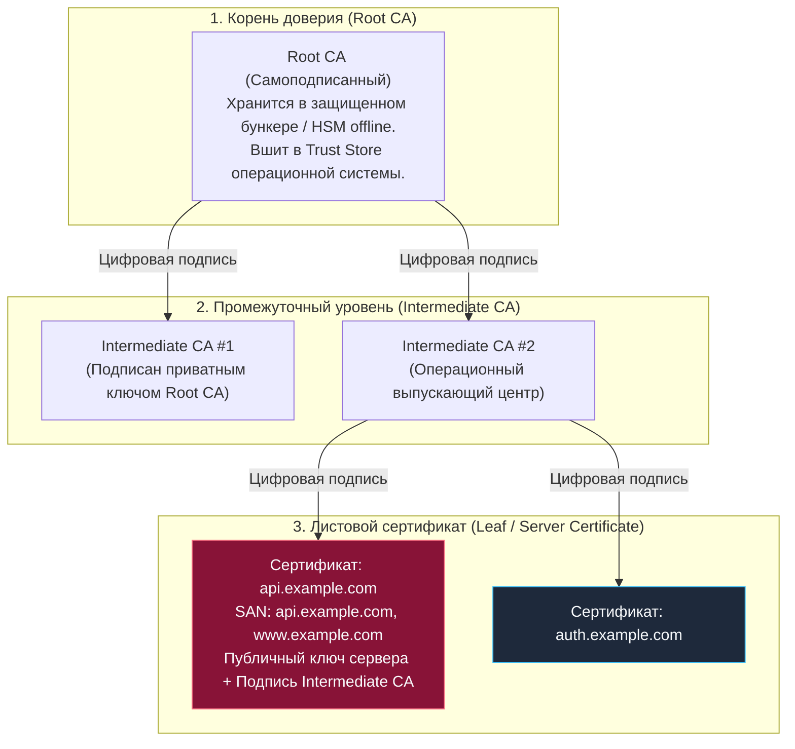
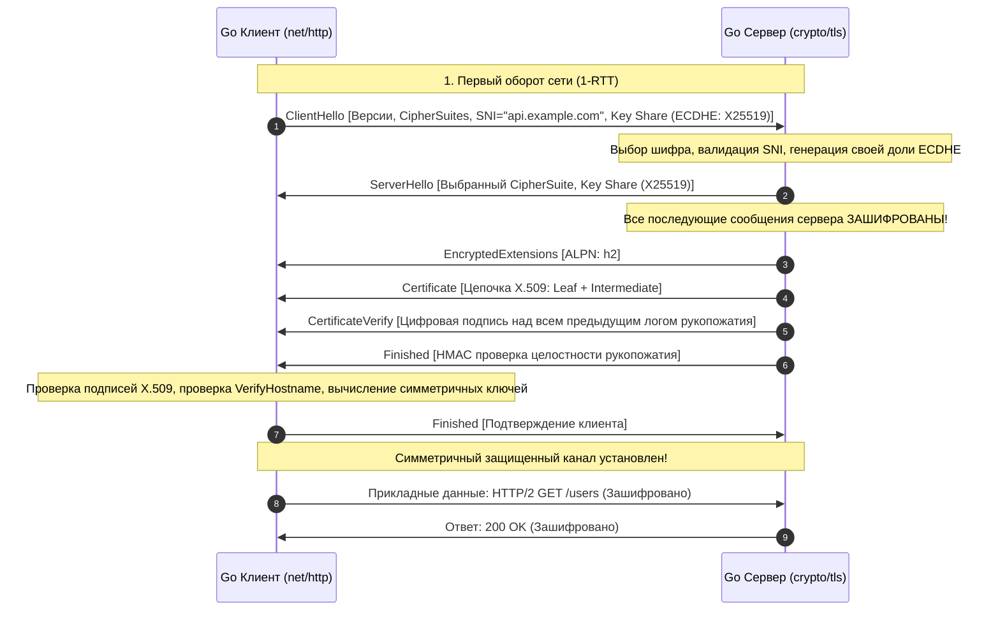
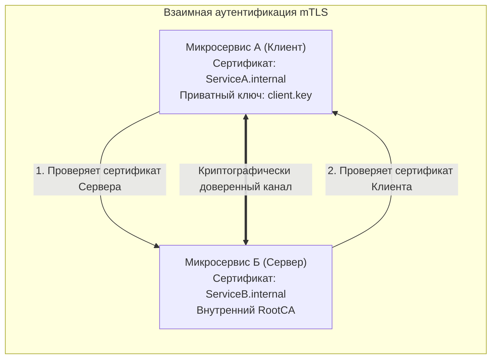

## Фундамент доверия: PKI, Сертификаты и TLS Handshake

> *"Шифрование без надежной аутентификации — это просто конфиденциальный разговор с неизвестным собеседником."*  
> — Фундаментальное правило криптографии

В предыдущей главе мы разобрали протокол [[18. TLS и HTTPS. Шифрование поверх TCP.md]] и убедились: алгоритмы симметричного шифрования (AES-GCM, ChaCha20-Poly1305) способны передавать гигабайты информации с гарантией абсолютной конфиденциальности и целостности.

Однако здесь возникает философский и практический парадокс. Предположим, ваш Go-микросервис открывает защищенный TLS-канал к адресу `api.example.com`. Канал надежно зашифрован, данные не читаемы в транзитном кабеле. Но **с кем именно** вы только что договорились об общем ключе? Если по пути злоумышленник перехватил DNS-запрос и перенаправил ваш TCP-сокет на свой сервер, вы филигранно зашифруете данные... и своими руками отдадите их мошеннику!

Шифрование бессмысленно без **аутентификации**. Как клиент может быть математически уверен, что на другом конце провода находится именно легитимный `api.example.com`, а не фишинговый узел? Ответ на этот вопрос дает **PKI (Public Key Infrastructure)** и цифровая иерархия сертификатов стандарта **X.509**.

---

## PKI и Иерархия доверия

Представьте себе международный паспорт. Как пограничник в незнакомой стране проверяет, что ваш паспорт подлинный?
1. В паспорте есть защитные голограммы, водяные знаки и цифровая подпись ведомства.
2. Пограничник не обязан лично знать вас или начальника вашего паспортного стола. Он доверяет министерству иностранных дел вашей страны.
3. У пограничника есть каталог доверенных государственных образцов и печатей.
4. Ваше имя и фотография в документе в точности совпадают с вашей личностью.
5. Срок действия паспорта еще не истек, и он не числится в базе украденных документов.

В цифровом мире **PKI** (*Public Key Infrastructure* — Инфраструктура открытых ключей) выполняет роль этой мировой паспортной системы. Это комплекс протоколов, криптографических стандартов и центров сертификации, управляющих жизненным циклом цифровых удостоверений.

---

### Цепочка доверия

Краеугольный камень PKI — строгая древовидная иерархия центров сертификации (**Certificate Authority, CA**):



1. **`Root CA` (Корневой центр сертификации):**  
   Вершина пирамиды. Корневой сертификат является *самоподписанным* (Self-signed): его открытый ключ подписан его же собственным закрытым ключом. Публичные сертификаты доверенных Root CA (DigiCert, Let's Encrypt / ISRG Root, GlobalSign) намертво зашиты в доверенное хранилище (**`Trust Store`**) вашей операционной системы (в Linux это `/etc/ssl/certs/ca-certificates.crt`), браузеров или контейнеров. Приватный ключ Root CA хранится в сейфах под круглосуточной вооруженной охраной на изолированных от интернета аппаратных модулях безопасности (HSM).
2. **`Intermediate CA` (Промежуточные центры сертификации):**  
   Корневой CA никогда не выпускает сертификаты для обычных веб-сайтов напрямую. Вместо этого Root CA подписывает сертификаты одного или нескольких промежуточных центров (**Intermediate CA**). Если выпускающий промежуточный ключ будет скомпрометирован, его можно оперативно отозвать, не меняя корневые сертификаты на миллиардах клиентских устройств по всей планете.
3. **`Leaf / Server Certificate` (Листовой сертификат):**  
   Сертификат конечного сервера. Содержит публичный ключ вашего веб-сервера, срок действия, доменные имена (SAN) и цифровую подпись промежуточного CA. Листовой сертификат не имеет права подписывать другие сертификаты (флаг `BasicConstraints: IsCA = false`).

> [!info] Под капотом
> Сертификаты сериализуются по стандарту **X.509 v3** с использованием бинарной схемы кодирования **ASN.1 DER** (*Distinguished Encoding Rules*). Текстовые файлы `.crt` или `.pem`, которые мы видим на диске — это просто заголовки `-----BEGIN CERTIFICATE-----` и бинарные байты DER, закодированные в Base64.
> 
> В стандартной библиотеке Go декодированием занимается пакет **`crypto/x509`**. Структура **`x509.Certificate`** содержит десятки полей:
> - **`Raw`** — полные исходные байты ASN.1;
> - **`RawTBSCertificate`** — тело сертификата TBS (*To Be Signed*), именно поверх которого вычисляется контрольный хеш подписи;
> - **`Signature`** и **`SignatureAlgorithm`** — криптографическая подпись центра сертификации (например, ECDSA-with-SHA256 или RSA-PSS);
> - **`Subject`** и **`Issuer`** — данные владельца и издателя;
> - **`PublicKey`** — открытый ключ сервера.
> 
> Парсинг ASN.1 — сложная рекурсивная процедура обхода байтовых тегов и длин (TLV: Type-Length-Value), создающая заметную нагрузку на кэш-линии процессора при высоких частотах новых соединений.

---

### Валидация цепочки

Когда Go-клиент выполняет рукопожатие, он скачивает от сервера цепочку: `[Leaf Certificate] + [Intermediate CA]`. Процедура верификации включает жесткий аудит:

1. **Криптографическая верификация подписи:** Клиент берет публичный ключ Intermediate CA и проверяет подпись на Leaf-сертификате. Затем берет публичный ключ Root CA из локального хранилища ОС и проверяет подпись на Intermediate CA. Если цепочка не замыкается на доверенный локальный Root CA, вызов завершается фатальной ошибкой **`x509: certificate signed by unknown authority`**.
2. **Временные рамки:** Текущее время машины обязано находиться строго между метками **`NotBefore`** и **`NotAfter`**. Если системные часы на сервере сбились — сертификат будет отвергнут.
3. **Проверка отозванности (Revocation):** Сертификат может быть скомпрометирован до истечения срока. Для проверки используются протоколы:
   - **`CRL`** (*Certificate Revocation List*) — скачивание полного списка отозванных сертификатов (громоздко и не масштабируется).
   - **`OCSP`** (*Online Certificate Status Protocol*) — точечный сетевой запрос к серверу CA: «Действителен ли сертификат с серийным номером X?». В современном бэкенде используется **OCSP Stapling**: веб-сервер сам периодически запрашивает у CA подписанный статус и «прикрепляет» его к TLS Handshake, экономя RTT клиенту.
4. **Сопоставление доменного имени:** Проверяется расширение **`Subject Alternative Name`** (**`SAN`**). Если вы подключаетесь к `api.example.com`, это имя обязано явно присутствовать в списке `DNS Names` сертификата (устаревшее поле `Common Name` / CN современными реализациями Go игнорируется).

---

## Процесс TLS Handshake

Рукопожатие TLS — это согласование криптографических параметров, валидация цепочки доверия и генерация общего симметричного сессионного ключа. 

Посмотрим, как устроен молниеносный протокол **TLS 1.3**:



### Ключевые отличия TLS 1.3 от 1.2

1. **Скорость:** Рукопожатие сокращено до **`1-RTT`** (один сетевой оборот). При повторном соединении через билеты сессий возможен режим **`0-RTT`** (ранние данные передаются в `ClientHello`). В TLS 1.2 требовалось как минимум **`2-RTT`**.
2. **`ECDHE` всегда:** Алгоритм Диффи — Хеллмана на эллиптических кривых (**`ECDHE`**) стал обязательным. Обмен ключами через статический RSA удален из стандарта навсегда, так как он не обеспечивал Perfect Forward Secrecy.
3. **Шифрование метаданных:** Начиная с пакета `EncryptedExtensions`, все служебные сообщения сервера (включая передаваемый сертификат) шифуются временными сессионными ключами. Внешний наблюдатель в сети видит лишь факт рукопожатия, но не видит передаваемый сертификат.
4. **Отказ от легаси:** Исключены уязвимые блочные шифры CBC, хеши SHA-1, MD5.

> [!warning] Ловушка / Gotcha: Критическая роль расширения SNI
> Механизм **`SNI`** (*Server Name Indication*) жизненно необходим в TLS Handshake.  
> На одном физическом IP-адресе балансировщика Nginx или облачного Ingress-контроллера могут работать тысячи разных виртуальных сайтов (`shop.com`, `bank.com`, `company.org`). Поскольку TLS Handshake происходит **до** того, как клиент отправит HTTP-заголовок `Host:`, сервер не знает, сертификат какого именно домена достать из хранилища!  
> 
> Расширение SNI решает эту проблему: клиент отправляет желаемое доменное имя в открытом виде внутри первого сообщения **`ClientHello`**. Сервер считывает SNI, выбирает правильный сертификат и отдает его клиенту.  
> В Go при использовании низкоуровневого `tls.Client` всегда явно заполняйте поле **`tls.Config.ServerName`**. Если поле пустое, SNI не отправится, сервер вернет дефолтный сертификат, и валидация имени хоста провалится!

---

## mTLS: Взаимная аутентификация

В стандартном вебе аутентификация односторонняя: клиент проверяет сервер, а сервер принимает любого анонимного клиента.

В архитектуре Zero Trust и микросервисных облаках используется **`mTLS`** (*Mutual TLS* — взаимный TLS). Сервер не просто предъявляет свой сертификат клиенту, но и отправляет запрос: «Предъяви свой клиентский сертификат, подписанный нашим внутренним CA».



### Где применяется
- **Service-to-Service коммуникация:** Межсервисный обмен в Kubernetes (Service Mesh: Istio, Linkerd, Cilium).
- **Финансовые и банковские шлюзы:** Взаимодействие с платежными системами и процессингами.
- **Доступ к инфраструктуре:** Внутренние API баз данных, HashiCorp Vault, Etcd.

### Реализация в Go

Напишем эталонную реализацию безопасного клиента и сервера на Go с поддержкой mTLS:

```go
package main

import (
	"context"
	"crypto/tls"
	"crypto/x509"
	"fmt"
	"os"
	"time"
)

// NewMTLSConfig создает строгую конфигурацию TLS с взаимной аутентификацией
func NewMTLSConfig(caPath, certPath, keyPath string) (*tls.Config, error) {
	// 1. Читаем корпоративный корневой сертификат CA
	caCert, err := os.ReadFile(caPath)
	if err != nil {
		return nil, fmt.Errorf("ошибка чтения CA: %w", err)
	}

	caPool := x509.NewCertPool()
	if !caPool.AppendCertsFromPEM(caCert) {
		return nil, fmt.Errorf("не удалось распарсить PEM сертификата CA")
	}

	// 2. Загружаем собственную пару ключей (сертификат + закрытый ключ)
	cert, err := tls.LoadX509KeyPair(certPath, keyPath)
	if err != nil {
		return nil, fmt.Errorf("ошибка загрузки клиентского сертификата: %w", err)
	}

	// 3. Формируем конфигурацию с обязательной проверкой обеих сторон
	return &tls.Config{
		// Доверенный пул для проверки сертификатов серверов
		RootCAs: caPool,
		// Требование обязательного наличия и валидации клиентского сертификата на сервере
		ClientAuth: tls.RequireAndVerifyClientCert,
		// Доверенный пул для проверки клиентских сертификатов сервером
		ClientCAs: caPool,
		// Собственные сертификаты для предъявления встречной стороне
		Certificates: []tls.Certificate{cert},
		// Форсируем современный стандарт TLS 1.3
		MinVersion:               tls.VersionTLS13,
		PreferServerCipherSuites: true,
	}, nil
}

func main() {
	cfg, err := NewMTLSConfig("ca.pem", "client.pem", "client.key")
	if err != nil {
		panic(err)
	}

	// Контекст жестко контролирует таймаут рукопожатия
	ctx, cancel := context.WithTimeout(context.Background(), 5*time.Second)
	defer cancel()

	// Используем DialContext с кастомной конфигурацией безопасности
	conn, err := (&tls.Dialer{Config: cfg}).DialContext(ctx, "tcp", "api.internal:443")
	if err != nil {
		panic(fmt.Sprintf("Сбой mTLS соединения: %v", err))
	}
	defer conn.Close()

	tlsConn := conn.(*tls.Conn)
	fmt.Printf("mTLS канал успешно установлен! Версия TLS: 0x%04x, Шифр: 0x%04x\n",
		tlsConn.ConnectionState().Version,
		tlsConn.ConnectionState().CipherSuite,
	)
}
```

---

## Под капотом: Go и криптография

### Чистый Go vs CGO

Пакет `crypto/tls` в Go опирается на криптографические примитивы, написанные преимущественно на чистом Go: **`crypto/x509`**, **`crypto/ecdsa`**, **`crypto/rsa`**. 

В отличие от экосистем, зависящих от системной библиотеки **`libcrypto`** (OpenSSL/BoringSSL), чистый Go исключает падения процесса из-за повреждения памяти в C-библиотеках, устраняет уязвимости переполнения буфера в Cgo и делает бинарники 100% переносимыми. При сборке с флагом **`CGO_ENABLED=1`** (по умолчанию на Linux/macOS) или при интеграции со сторонними криптобиблиотеками рантайм может делегировать криптографию системным библиотекам, но стандартный pure Go подход обычно безопаснее и предпочтительнее.

Однако криптография требует колоссального количества процессорных инструкций. Поэтому самые горячие математические примитивы написаны на оптимизированном ассемблере Go с использованием прямых инструкций современных CPU:
- **`AES-NI`**: Аппаратное ускорение симметричного шифрования AES.
- **`SHA extensions`**: Аппаратное ускорение вычисления криптографических хешей.
- **`ECDSA acceleration`**: Быстрое скалярное умножение точек на эллиптических кривых NIST P-256 и Curve25519 (X25519).

> [!tip] Собеседование
> **Вопрос:** «Криптографические расчеты при рукопожатии могут занимать 2–5 мс CPU. Как среда выполнения Go обрабатывает эту нагрузку, не подвешивая планировщик?»  
> **Ответ:**  
> «Операции асимметричной криптографии (ECDHE, генерация ключей, проверка подписей X.509) являются вычислительными (CPU-bound). Они выполняются в пространстве пользователя на текущем системном потоке **`M`**.  
> Планировщик Go (`runtime.scheduler`) использует кооперативно-преемптивную многозадачность: на точках вызова функций (функции пакета `crypto`) компилятор вставляет проверки предписания (*preemption check*). Если горутина тратит больше 10 мс процессорного времени (sysmon), планировщик мягко снимает её с потока `M` и передает процессор другим задачам.  
> 
> Однако, если под высокой нагрузкой тысячи горутин одновременно выполняют TLS Handshake, процессор мгновенно утилизируется на 100%.  
> **Архитектурные решения:**
> 1. Кэширование сессий: использование поля **`tls.Config.ClientSessionCache`** на клиенте для быстрого возобновления через PSK (0 RTT / 1 RTT без тяжелой асимметричной криптографии).
> 2. Использование функции **`GetConfigForClient`** или **`tls.Config.GetCertificate`** для динамического выбора сертификата с предварительным парсингом в памяти, избегая дискового ввода-вывода внутри сетевого цикла.»

---

### Escape Analysis и память

Сертификаты в формате PEM — это объемные массивы текстовых строк и байтов. При парсинге сертификата функцией **`x509.ParseCertificates`** структуры сертификата почти всегда совершают побег в кучу (**Escape to Heap**):

```go
// Внутреннее представление структуры x509.Certificate в пакете crypto/x509
type Certificate struct {
    Raw                     []byte // Исходные байты ASN.1 DER
    RawTBSCertificate       []byte // Байт-код тела сертификата для подписи
    RawSubjectPublicKeyInfo []byte // Блок открытого ключа
    RawSubject              []byte // Данные субъекта в DER
    RawIssuer               []byte // Данные издателя в DER
    Signature               []byte // Цифровая подпись CA
    SignatureAlgorithm      CertificateSignatureAlgorithm
    PublicKeyAlgorithm      PublicKeyAlgorithm
    PublicKey               interface{} // *rsa.PublicKey, *ecdsa.PublicKey или ed25519.PublicKey
    Version                 int
    SerialNumber            *big.Int // Большое целое число серийного номера
    // ... дополнительные поля и расширения SAN ...
}
```

Парсинг структуры ASN.1 сопровождается созданием десятков вспомогательных слайсов `[]byte`, структур и указателей на **`big.Int`**. Если ваш сервер на каждый входящий запрос будет заново парсить PEM-сертификат с диска, сборщик мусора Go захлебнется в очистке памяти кучи. 

**Инженерное правило:** Парсите корневые центры (**`RootCAs`**) и листовые сертификаты ровно один раз на этапе инициализации сервиса. В коде хендлеров оперируйте исключительно неизменяемыми указателями `*x509.Certificate`.

---

## Ловушки и типичные вопросы на собеседованиях

| Проблема / Вопрос | Причина и решение |
|---|---|
| **`x509: certificate signed by unknown authority`** | Сервер не предоставил полную цепочку сертификатов, либо в локальном хранилище клиента отсутствует Root CA. В веб-серверах (Nginx / Go) файл сертификата обязан объединять листовой сертификат и все промежуточные центры в правильном порядке (`fullchain.pem`). Проверить валидность цепочки локально можно через команду: `openssl x509 -in cert.pem -text`. |
| **`tls: failed to verify certificate: x509: certificate has expired`** | Истек срок действия сертификата (проверьте поля `NotBefore` и `NotAfter`) либо на машине клиента рассинхронизированы системные часы (NTP drift). |
| **Почему TLS 1.3 быстрее TLS 1.2?** | Устранен один полный сетевой оборот (рукопожатие сокращено с 2-RTT до 1-RTT), удалены устаревшие медленные алгоритмы, а обмен долями ключей ECDHE совмещен с первым же пакетом `ClientHello`. |
| **Как отозвать скомпрометированный сертификат?** | Через механизмы **OCSP** (*Online Certificate Status Protocol*) или списки **CRL** (*Certificate Revocation List*). В Go проверка настраивается через структуру **`x509.VerifyOptions`**. |
| **В чем разница между mTLS и JWT-авторизацией?** | **mTLS** аутентифицирует *транспортный канал и сетевую сущность* на уровне L4/L7 с криптографической гарантией целостности машины. **JWT** (JSON Web Token) передается на прикладном уровне (L7) и аутентифицирует *конкретного пользователя или роль*. В современных архитектурах они дополняют друг друга: mTLS обеспечивает Zero Trust периметр между подами, а JWT несет бизнес-контекст пользователя. |

---

## Итог

1. **PKI (Public Key Infrastructure)** — мировая иерархическая система доверия, гарантирующая подлинность открытых ключей через цифровую цепочку: `Root CA` → `Intermediate CA` → `Leaf Certificate`.
2. **Формат X.509:** Бинарный стандарт на базе ASN.1 DER. В Go представлен структурой **`x509.Certificate`** с полями `Raw`, `RawTBSCertificate`, `SignatureAlgorithm`, `SerialNumber` и списком альтернативных имен **SAN**.
3. **TLS 1.3 Handshake:** Сокращен до **`1-RTT`** благодаря обязательной отправке долей ключей **`ECDHE`** в первом пакете `ClientHello`, обязательному расширению **`SNI`** (`tls.Config.ServerName`) и шифрованию служебных метаданных сервера.
4. **mTLS (Mutual TLS):** Двусторонняя аутентификация, где обе стороны предъявляют криптографические сертификаты. Фундамент безопасности в архитектурах микросервисов и Zero Trust.
5. **Под капотом Go:** Пакет **`crypto/tls`** написан на чистом Go, аппаратно ускоряется инструкциями **`AES-NI`** и расширениями SHA, а предварительное кэширование сертификатов исключает паразитное давление на GC.

Мы полностью завершили исследование транспортного уровня, сокетов, механизмов разрешения имен и криптографической защиты сетевого канала. Теперь, когда в нашем распоряжении есть надежный, быстрый и защищенный поток байтов, мы готовы подняться на уровень приложений. В следующей статье мы откроем дверь в мир веб-протоколов: [[20. HTTP 1.1. Структура запроса и ответа.md]].