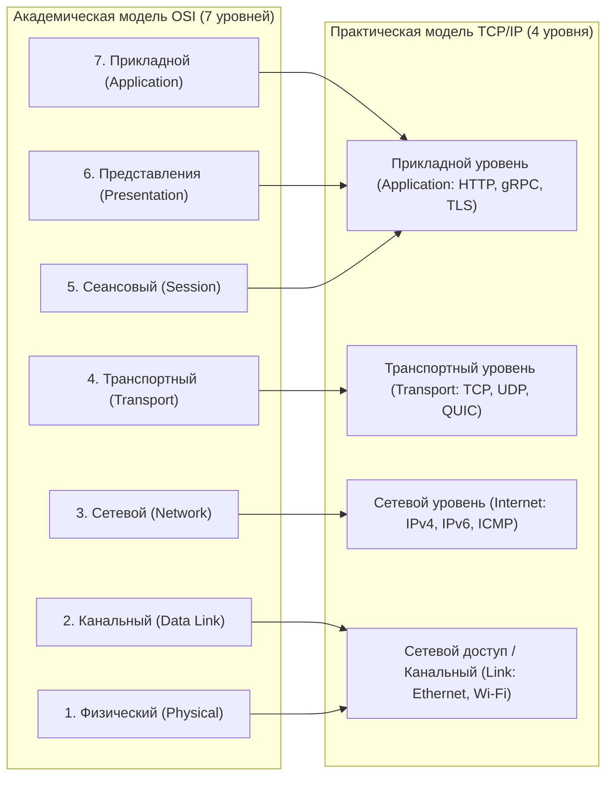
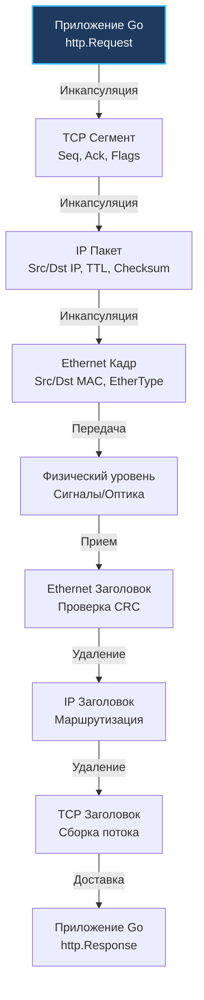
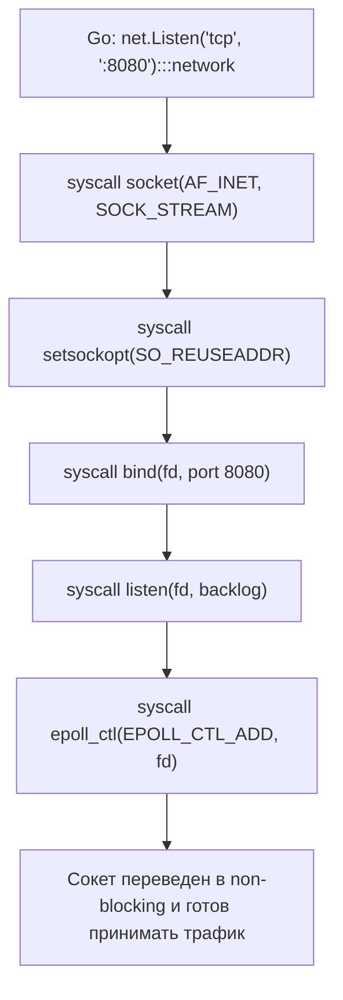

## Введение

Сетевой стек — это не просто теоретическая схема из университетских учебников, а фундаментальный фундамент, на котором возводятся все современные высоконагруженные распределенные системы. Когда мы пишем код на Go, стандартная библиотека бережно ограждает нас от низкоуровневых сложностей: нам редко приходится создавать сырые сокеты (raw sockets) или вручную высчитывать битовые контрольные суммы заголовков. 

Однако за внешней простотой лаконичного интерфейса `net.Conn` скрывается сложнейший физический и программный конвейер. Каждый байт, отправленный через вызов `conn.Write()`, проходит путь трансформации от структур в оперативной памяти процесса до электромагнитных импульсов в витой паре или лазерных вспышек в оптоволокне. 

Без ясного понимания этого пути инженер обречен бороться со следствиями, а не с причинами проблем: бесконечно гадать о природе таймаутов, утечек сокетов в состоянии `TIME_WAIT`, скрытых микропауз в межсервисном взаимодействии и внезапного падения пропускной способности под нагрузкой.

## OSI и TCP/IP: Практический взгляд

В компьютерных науках сосуществуют две ключевые концептуальные модели сетевого взаимодействия:
1.  **Модель OSI (Open Systems Interconnection):** Академический эталон из 7 уровней, разработанный Международной организацией по стандартизации (ISO) в конце 1970-х годов. Это строгая теоретическая модель, призванная стандартизировать сетевые протоколы.
2.  **Стек протоколов TCP/IP (модель DARPA / Internet):** Практическая прагматичная реализация из 4 (или 5) уровней, рожденная в исследовательских центрах Bell Labs, DARPA и университете Беркли. Именно на этой модели построен весь современный интернет.

| Уровень модели OSI | Уровень модели TCP/IP | Роль и физический смысл | Реализация и аналоги в языке Go |
| :--- | :--- | :--- | :--- |
| **7. Прикладной (Application)** | **Прикладной уровень (Application)** | Формирование бизнес-сообщений, прикладные протоколы, контракты API. | `net/http`, `gRPC`, сериализаторы `encoding/json` |
| **6. Представления (Presentation)** | (Объединен в L7) | Кодирование данных, сжатие, шифрование сессий. | Пакеты `encoding`, `crypto/tls` (TLS/HTTPS) |
| **5. Сеансовый (Session)** | (Объединен в L7) | Управление сессиями, авторизация, координация диалога. | `context`, распределенные сессии в Redis/памяти |
| **4. Транспортный (Transport)** | **Транспортный уровень (Transport)** | Логическое соединение конец-в-конец (End-to-End), порты, надежность, контроль потока. | `net.Conn`, структуры `net.TCPConn`, `net.UDPConn` |
| **3. Сетевой (Network)** | **Сетевой уровень (Internet)** | Глобальная адресация (IP), маршрутизация между подсетями. | Внутренние структуры IP-пакетов (драйверы ядра) |
| **2. Канальный (Data Link)** | **Канальный уровень (Link)** | Кадрирование данных, доставка в локальном сегменте, MAC-адреса. | [[3. Ethernet, MAC-адреса и локальные сети.md]] |
| **1. Физический (Physical)** | **Физический уровень (Physical)** | Физическая среда: медные жилы, оптика, радиоволны, биты. | Сетевые адаптеры (NIC), кабели, оптоволокно |

В повседневной разработке на Go программист взаимодействует преимущественно с уровнями **L4** (транспортный: TCP/UDP через `net.Conn`) и **L7** (прикладной: HTTP, gRPC). Все, что находится на уровне L3 и ниже, полностью абстрагировано ядром Linux, драйверами сетевых карт и аппаратными коммутаторами.



> [!info] Под капотом
> **Почему модель TCP/IP безоговорочно победила модель OSI?**  
> Модель OSI проектировалась комитетами теоретиков и страдала от избыточной бюрократической сложности: каждый уровень обязан был строго общаться исключительно с непосредственными соседями, требуя колоссальных накладных расходов на парсинг и промежуточные буферы.  
> Создатели стека TCP/IP руководствовались знаменитым девизом Дэвида Кларка: *«Мы отвергаем королей, президентов и голосование. Мы верим в грубый консенсус и рабочий код»* (Rough consensus and running code). Объединение уровней 5, 6 и 7 в единый прикладной слой дало беспрецедентную гибкость и позволило протоколам эволюционировать со скоростью инноваций в индустрии.

## Путь данных: Инкапсуляция и деинкапсуляция

Чтобы осознать физику передачи данных, представим классическую бытовую аналогию: отправку важного документа почтовой службой.  
Сначала вы пишете текст письма на листе бумаги (полезная нагрузка L7). Затем вы вкладываете его в конверт, на котором указываете номер кабинета получателя (порт TCP на уровне L4). Этот конверт курьер помещает в большую почтовую коробку с адресом улицы и города (IP-адрес на уровне L3). Наконец, коробка загружается в специализированный контейнер почтового грузовика с номером рейса и маршрутной биркой (MAC-адрес кадра Ethernet на уровне L2), и грузовик выезжает на асфальтовую автостраду (L1).

Этот процесс добавления служебных заголовков называется **инкапсуляцией (Encapsulation)**, а обратный процесс разборки пакета получателем — **деинкапсуляцией (De-encapsulation)**:



Пошаговый конвейер:
1.  **Формирование данных (Application / L7):** Go-приложение сериализует бизнес-объект в буфер оперативной памяти (например, JSON-пейлоад или gRPC-сообщение).
2.  **Инкапсуляция TCP (Transport / L4):** Ядро Linux берет порцию данных и добавляет 20-байтный TCP-заголовок (номер порта источника и назначения, порядковый номер Sequence Number, подтверждение Acknowledgement, битовые флаги SYN/ACK/FIN и размер скользящего окна). Полученная сущность называется **TCP-сегментом**.
3.  **Инкапсуляция IP (Network / L3):** К TCP-сегменту ядро добавляет 20-байтный заголовок IPv4 (или 40-байтный IPv6). Он фиксирует IP-адрес отправителя и получателя, контрольную сумму заголовка, тип сервиса и время жизни (TTL — Time To Live). Полученная единица данных называется **IP-пакетом**.
4.  **Кадрирование Ethernet (Data Link / L2):** Сетевой драйвер оборачивает IP-пакет в 14-байтный заголовок Ethernet (MAC-адрес сетевой карты отправителя, MAC-адрес следующего шлюза/коммутатора и поле EtherType `0x0800` для IPv4), а в хвост пакета дописывает 4-байтный трейлер CRC (FCS — Frame Check Sequence) для аппаратной проверки целостности. Полученная единица называется **Ethernet-кадром (Frame)**.
5.  **Физическая передача (Physical / L1):** Сетевой адаптер (NIC) преобразует байты кадра в электрические импульсы, лазерные вспышки или радиоволны.
6.  **Деинкапсуляция на стороне приемника:** Сетевая карта получателя проверяет контрольную сумму CRC кадра (отбрасывая битые данные), ядро Linux снимает Ethernet-заголовок, валидирует IP-адрес и TTL, затем по 4-кортежу (Source IP, Source Port, Destination IP, Destination Port) находит нужный сокет и доставляет чистый поток байтов в буфер Go-горутины.

## Go в сетевом стеке: Архитектура абстракций

В языке Go стандартный пакет `net` представляет собой не просто примитивную обертку над системным заголовочным файлом `sys/socket` операционной системы C. Это мощная, кроссплатформенная абстракция, с ювелирной точностью маскирующая фундаментальные различия между интерфейсами ядер различных платформ (Linux `epoll`, BSD/macOS `kqueue`, Windows `IOCP`).

Ключевые интерфейсы стандартной библиотеки:
*   **`net.Conn`:** Фундаментальный потоковый интерфейс для любого двунаправленного соединения. Включает базовые методы: `Read`, `Write`, `Close`, `LocalAddr` и `RemoteAddr`.
*   **`net.Listener`:** Интерфейс для серверных слушающих сокетов протоколов с установлением соединения (TCP, Unix Domain Sockets). Определяет методы `Accept`, `Close`, `Addr`.
*   **`net.PacketConn`:** Интерфейс для датаграммных протоколов без установления соединения (UDP, ICMP). Предоставляет методы пакетной отправки `ReadFrom` и `WriteTo`.
*   Конкретные системные структуры: `net.TCPConn`, `net.UDPConn`, предоставляющие доступ к низкоуровневым опциям сокетов.

Рассмотрим канонический серверный шаблон на Go с корректной установкой дедлайнов и отменой контекста:

```go
package main

import (
	"context"
	"fmt"
	"log"
	"net"
	"time"
)

func main() {
	// 1. Создание слушателя. Bind привязывает сокет к адресу на уровне ОС.
	// Под капотом вызывается системный вызов net.Listen(":8080")
	listener, err := net.Listen("tcp", ":8080")
	if err != nil {
		log.Fatalf("listen failed: %v", err)
	}
	defer listener.Close()

	log.Println("server started on :8080")

	for {
		// 2. Accept блокирует горутину до появления нового соединения.
		// Под капотом вызывает syscall accept() и epoll_ctl.
		conn, err := listener.Accept()
		if err != nil {
			log.Printf("accept error: %v", err)
			continue
		}

		// 3. Запуск обработчика в отдельной легковесной горутине.
		// Контекст позволяет отменять работу при graceful shutdown.
		go handleConnection(context.Background(), conn)
	}
}

func handleConnection(ctx context.Context, conn net.Conn) {
	defer conn.Close()
	
	// Установка таймаута чтения. В Go это не блокирует системный тред,
	// а регистрирует таймер в netpoller и планирует пробуждение.
	_ = conn.SetReadDeadline(time.Now().Add(30 * time.Second))
	
	buf := make([]byte, 4096)
	for {
		n, err := conn.Read(buf)
		if err != nil {
			if netErr, ok := err.(net.Error); ok && netErr.Timeout() {
				log.Println("read timeout")
				return
			}
			log.Printf("read error: %v", err)
			return
		}
		
		_, writeErr := conn.Write(buf[:n])
		if writeErr != nil {
			log.Printf("write error: %v", writeErr)
			return
		}
	}
}
```

## Под капотом: Системные вызовы и планировщик

Когда в коде на Go выполняется строка `net.Listen(":8080")`, рантайм производит строгую и последовательную цепочку системных вызовов к ядру Linux:

1.  **`socket(AF_INET, SOCK_STREAM, IPPROTO_TCP)`:**  
    Ядро Linux создает внутреннюю структуру сокета `struct socket` и связанную с ней структуру `struct sock`, возвращая приложению файловый дескриптор (`fd`).
2.  **`setsockopt(fd, SOL_SOCKET, SO_REUSEADDR, ...)`:**  
    Рантайм принудительно включает флаг повторного использования адреса. Это позволяет сервису моментально перезапуститься на том же порту без ожидания истечения двухминутного таймаута сокетов в состоянии `TIME_WAIT`.
3.  **`bind(fd, {family: AF_INET, port: 8080})`:**  
    Системный вызов `bind(fd, {family: AF_INET, port: 8080})` связывает абстрактный дескриптор сокета с конкретным сетевым IP-адресом интерфейса и локальным TCP-портом 8080.
4.  **`listen(fd, backlog)`:**  
    Системный вызов `listen(fd, backlog)` переводит сокет из пассивного состояния в слушающее, аллоцируя две системные очереди ядра: очередь полуоткрытых соединений (SYN Queue) и очередь полностью готовых соединений (Accept Queue).
5.  **`epoll_ctl(epfd, EPOLL_CTL_ADD, fd, &event)`:**  
    Рантайм переводит дескриптор в неблокирующий режим (`O_NONBLOCK`) и регистрирует его в глобальном селекторе `epoll` процесса Go. **Это ключевой поворотный пункт: Go никогда не создает системный тред ОС под слушающий сокет!**

Когда внешний клиент подключается к серверу, сетевая карта генерирует аппаратное прерывание, сетевой стек ядра завершает трехстороннее рукопожатие (TCP Handshake) и пробуждает сетевой поллер `netpoller`. Планировщик Go (G-M-P) мгновенно подхватывает свободный системный поток `M`, выполняет вызов `accept()` и запускает горутину обработчика `handleConnection`.



> [!warning] Ловушка / Gotcha
> **Иллюзия блокирующего сетевого вызова:**  
> В коде на Go вызовы `conn.Read()` и `conn.Write()` выглядят как классические синхронные блокирующие методы. Однако на уровне операционной системы Go использует исключительно **неблокирующий ввод-вывод (Non-blocking I/O с `epoll`)**.  
> Если сетевой буфер пуст, горутина **никогда не блокирует системный поток ОС**! Она переходит в специальное состояние рантайма `waiting for network I/O` и бережно удаляется из расписания планировщика. Системный поток `M` остается свободным и мгновенно переключается на обслуживание тысяч других горутин.

## Mechanical Sympathy и влияние на железо

Применение принципа Mechanical Sympathy к сетевому стеку позволяет обнаружить тонкие аппаратные узкие места, невидимые на уровне высокоуровневых абстракций:

1.  **Контекстные переключения процессора (Context Switch Overhead):**  
    Каждое переключение контекста между User Space и Kernel Space требует от CPU сброса конвейера команд и обходится в 1000–5000 процессорных тактов. Сетевой поллер `netpoller` нивелирует этот налог, считывая готовые события из `epoll` пачками (batching) и пробуждая десятки горутин за один системный вызов.
2.  **Промахи строк кэша CPU (L1/L2/L3 Cache Misses):**  
    При приеме сетевых пакетов контроллер сетевой карты помещает байты в память ядра через прямой доступ к памяти (DMA). Затем операционная система копирует эти данные в память пользовательского процесса. Каждое такое копирование безжалостно вымывает данные прикладного кода из L1/L2 кэша процессора. В высоконагруженных Go-сервисах критично минимизировать аллокации буферов с помощью пулов `sync.Pool` и повторного использования срезов через `bufio`.
3.  **Технологии Zero-Copy (`splice()`, `sendfile()`):**  
    В высокопроизводительных обратных прокси (таких как `nginx` или `envoy`) передача больших статических файлов или пересылка трафика между сокетами осуществляется с помощью системных вызовов `sendfile` и `splice()`. Функция `splice()` перебрасывает страницы данных между буферами ядра в оперативной памяти вообще без копирования в пространство пользователя. В Go этот системный интерфейс доступен через вызов `syscall.Splice`, хотя стандартный HTTP-сервер `net/http` по умолчанию применяет классическое копирование ради универсальной совместимости с TLS-шифрованием.
4.  **Аппаратный DMA и процессорные прерывания `softirq`:**  
    Сетевой адаптер (NIC) использует механизм DMA (Direct Memory Access), записывая кадры напрямую в оперативную память RAM без участия центрального процессора. Однако при экстремальном сетевом потоке (миллионы пакетов в секунду) процессор перегружается обработкой программных прерываний (`softirq`), что может приводить к росту времени простоя виртуальных машин (`steal time`) и потере пакетов в кольцевом буфере карты (NIC Ring Buffer Drops).

> [!tip] Собеседование
> **Вопрос:** Почему сервер на Go способен без труда удерживать сотни тысяч одновременных сетевых соединений на одном стандартном сервере, тогда как традиционные стеки на базе PHP-FPM или классической Java захлебываются уже при нескольких тысячах?  
> **Ответ:** Архитектуры вроде PHP-FPM или Java (до внедрения виртуальных потоков Virtual Threads в Java 21) опираются на модель «один поток/процесс ОС на каждое соединение». Полноценный поток операционной системы требует от 1 до 8 МБ виртуальной памяти под свой стек и провоцирует лавинообразный рост тяжелых системных переключений контекста (Ring 0 ↔ Ring 3).  
> Среда Go использует реактивный сетевой поллер `netpoller` поверх `epoll`/`kqueue`/`IOCP`. Десятки тысяч соединений обслуживаются пулом всего из нескольких десятков системных потоков ОС. Легковесный стек горутины занимает всего **2 КБ**, а переключение контекста горутин выполняется за десятки наносекунд в User Space без участия планировщика ядра Linux. Это обеспечивает масштабируемость порядка $O(1)$ по расходу ресурсов на каждое активное сетевое соединение.

## Сравнение с другими экосистемами

| Инженерный критерий | Язык Go (`net`) | Экосистема Java (NIO / Netty) | Классический C (POSIX sockets) | Экосистема PHP (FPM / Swoole) |
| :--- | :--- | :--- | :--- | :--- |
| **Базовая модель I/O** | `epoll` (Linux) / `kqueue` (BSD) / `IOCP` (Win) | `epoll` / `kqueue` / `IOCP` | Низкоуровневые системные вызовы ядра | FPM: синхронные процессы / Swoole: `epoll` |
| **Сетевая абстракция** | Единый интерфейс `net.Conn` | Сложная иерархия `Channel` и буферов `ByteBuf` | Низкоуровневые дескрипторы `fd`, `struct sockaddr` | Встроенные ресурсы потоков / Stream |
| **Управление памятью** | Управляемая куча со сжатием стеков (Escape Analysis) | Объекты кучи JVM с накладными расходами GC | Полностью ручное управление (`malloc/free`) | FPM: изолированные процессы / Swoole: C-буферы |
| **Модель конкурентности** | Планировщик горутин G-M-P | Потоки ОС или Virtual Threads (Java 21+) | Системные потоки ОС (pthreads) | FPM: пулы процессов / Swoole: Event Loop |
| **Сложность кодовой базы** | **Низкая (линейный синхронный код)** | **Высокая (сложнейшая реактивная настройка Netty)** | **Экстремальная (ручная борьба с C10K)** | FPM: простая / Swoole: сложная |

## Итог

1.  **Теория против практики:** Модель OSI служит концептуальным академическим эталоном, в то время как стек TCP/IP является практическим фундаментом интернета. Go оперирует на уровнях L4 (`net.Conn`) и L7 (`net/http`), делегируя уровни L1–L3 ядру Linux.
2.  **Инкапсуляция и деинкапсуляция:** Сетевые данные последовательно упаковываются в TCP-сегменты, IP-пакеты и Ethernet-кадры, получая порты, сетевые IP-адреса и MAC-идентификаторы.
3.  **Сетевой поллер `netpoller`:** Истинный двигатель сетевой производительности Go. Он превращает асинхронные неблокирующие интерфейсы операционной системы в интуитивный синхронный прикладной код.
4.  **Mechanical Sympathy:** Минимизация системных контекстных переключений, буферизация ввода-вывода через `bufio`, повторное использование памяти в `sync.Pool` и технологии Zero-Copy (`syscall.Splice`) формируют основу архитектуры современных Highload-систем.

Мы увидели полную панораму пути данных от прикладного кода до сетевой карты. Теперь настало время спуститься на уровень канальных протоколов локальной сети: в следующей лекции мы детально исследуем архитектуру кадров Ethernet, алгоритмы коммутации и физический смысл MAC-адресации в [[3. Ethernet, MAC-адреса и локальные сети.md]].
