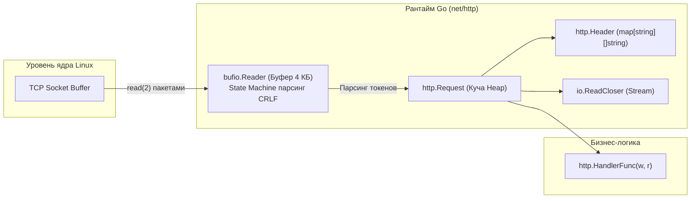

## Введение

> *"Простота — необходимое условие надежности."*  
> — Эдсгер Дейкстра

В 1989 году в европейской лаборатории ядерных исследований CERN британский физик и программист Тим Бернерс-Ли сформулировал концепцию Всемирной паутины (World Wide Web). Первоначальная версия протокола — **HTTP/0.9** — была верхом аскетизма: клиент открывал TCP-соединение, посылал серверу ровно одну строку текста:
```http
GET /index.html
```
Сервер в ответ выплевывал в сокет чистый HTML-текст и **немедленно разрывал TCP-соединение**. В протоколе не было ни заголовков, ни статус-кодов ошибок, ни картинок, ни возможности аутентификации.

К концу 1990-х годов интернет переживал взрывной бум. Рабочая группа IETF под руководством Роя Филдинга разработала спецификацию **HTTP/1.1** (RFC 2616, впоследствии переработанную и уточненную в RFC 7230–7235 и RFC 9112). Протокол превратился в универсальный прикладной стандарт планеты. 

Даже сегодня, в эпоху бинарных протоколов HTTP/2, HTTP/3 (QUIC) и gRPC, понимание текстового формата HTTP/1.1 остается фундаментальной обязанностью бэкенд-инженера:
- Большинство облачных балансировщиков (Nginx, Envoy, AWS ALB) и Ingress-контроллеров транслируют входящий трафик во внутренние сервисы по протоколу HTTP/1.1.
- Это текстовый протокол: вы можете открыть терминал, набрать `telnet localhost 8080` или `nc` и отладить сложнейшую проблему маршрутизации, посылая байты вручную.
- Пакет **`net/http`** в Go спроектирован вокруг структур `http.Request` и `http.Response`. Понимание того, как рантайм парсит байты из сокета в структуры данных языка, позволяет писать код без лишних аллокаций памяти и с минимальным давлением на Garbage Collector.

---

## Структура HTTP-запроса

Протокол HTTP/1.1 является строгим текстовым протоколом формата «запрос — ответ». Любой HTTP-запрос состоит из трех логических секций, отделенных друг от друга стандартизированными символами перевода строки CRLF (`\r\n` — Carriage Return, Line Feed, байты `0x0D 0x0A`):

$$\mathbf{Start\ Line} \xrightarrow{\backslash r\backslash n} \mathbf{Headers} \xrightarrow{\backslash r\backslash n\backslash r\backslash n} \mathbf{Body}$$

```
+--------------------------------------------------------------------+
| METHOD SP Request-URI SP HTTP-Version CRLF                        | <- Start Line
+--------------------------------------------------------------------+
| Header-Key-1: Value-1 CRLF                                         |
| Header-Key-2: Value-2 CRLF                                         | <- Headers
| ...                                                                |
+--------------------------------------------------------------------+
| CRLF (\r\n)                                                        | <- Пустая строка
+--------------------------------------------------------------------+
| Body (Полезная нагрузка: JSON, форма, бинарные данные...)           | <- Body (Опционально)
+--------------------------------------------------------------------+
```

### 1. Start Line (Строка запроса)

Имеет жесткую структуру:
$$\mathbf{METHOD\ SP\ Request\text{-}URI\ SP\ HTTP\text{-}Version\ CRLF}$$
Где `SP` — ровно один символ пробела (`0x20`):
- **`METHOD`**: Глагол действия. Стандарт RFC определяет методы:
  - Безопасные и идемпотентные (чтение): **`GET`**, **`HEAD`** (только заголовки, без тела), **`OPTIONS`** (опрос возможностей сервера), **`TRACE`** (эхо-диагностика).
  - Модифицирующие: **`POST`** (создание ресурса), **`PUT`** (полная замена ресурса, идемпотентен), **`PATCH`** (частичное обновление), **`DELETE`** (удаление ресурса).
  - Служебные: **`CONNECT`** (для организации TCP-туннелей через HTTP-прокси, основа HTTPS-проксирования).
- **`Request-URI`**: Путь к ресурсу на сервере, строка query-параметров и фрагмент (например, `/api/v1/users?id=123`).
- **`HTTP-Version`**: Версия протокола, всегда строка вида `HTTP/1.1`.

### 2. Headers (Заголовки)

Набор метаданных в формате `Key: Value CRLF`.
- Ключи заголовков по стандарту являются **регистронезависимыми** (`Content-Type`, `content-type` и `CONTENT-TYPE` семантически эквивалентны).
- Заголовок **`Host`** является строго обязательным в HTTP/1.1: он сообщает веб-серверу, к какому именно виртуальному сайту обращается клиент (`Host: api.example.com`). Запрос HTTP/1.1 без заголовка `Host` обязан отклоняться сервером со статусом `400 Bad Request`.
- Популярные заголовки клиента: **`User-Agent`**, `Accept`, `Authorization`, `Cookie`.

Границей окончания блока заголовков служит **двойной перевод строки `\r\n\r\n`**.

### 3. Body (Тело запроса)

Опциональный блок полезной нагрузки. Но здесь возникает фундаментальный вопрос сетевого парсинга: *как потоковый TCP-парсер понимает, сколько байт принадлежит телу текущего запроса, а где начинаются байты следующего?*

В HTTP/1.1 существует два взаимоисключающих механизма обрамления:
1. Заголовок **`Content-Length`**: Явное число байтов (например, `Content-Length: 42`). Парсер считывает ровно 42 байта после `\r\n\r\n`.
2. Заголовок **`Transfer-Encoding: chunked`**: Потоковая передача блоками переменного размера, когда общий объем данных заранее неизвестен (стриминг логов, генерация отчетов).

```mermaid
flowchart TD
    subgraph REQ["Структура HTTP/1.1 Запроса на уровне байтов"]
        L1["Start Line: GET /v1/orders?id=42 HTTP/1.1\\r\\n"]
        H1["Host: api.example.com\\r\\n"]
        H2["User-Agent: Go-http-client/1.1\\r\\n"]
        H3["Content-Type: application/json\\r\\n"]
        H4["Content-Length: 18\\r\\n"]
        SEP["\\r\\n (Пустая строка — терминатор заголовков)"]
        B["Body: {\"status\":\"paid\"}"]
        L1 --> H1 --> H2 --> H3 --> H4 --> SEP --> B
    end
```

---

## Структура HTTP-ответа

Ответ сервера зеркально повторяет структуру запроса, но его начальная строка называется строкой статуса:

```
+--------------------------------------------------------------------+
| HTTP-Version SP Status-Code SP Reason-Phrase CRLF                  | <- Start Line
+--------------------------------------------------------------------+
| Content-Type: application/json CRLF                                |
| Set-Cookie: session_id=xyz; HttpOnly; Secure CRLF                  | <- Headers
| Server: Golang/1.24 CRLF                                           |
+--------------------------------------------------------------------+
| CRLF (\r\n)                                                        | <- Пустая строка
+--------------------------------------------------------------------+
| Response Body (JSON, HTML, бинарные файлы...)                      | <- Body
+--------------------------------------------------------------------+
```

### 1. Start Line (Строка статуса)

Строка статуса имеет вид:
$$\mathbf{HTTP\text{-}Version\ SP\ Status\text{-}Code\ SP\ Reason\text{-}Phrase\ CRLF}$$
- **`HTTP-Version`**: Версия протокола (`HTTP/1.1`).
- **`Status-Code`**: Трехзначное десятичное число, определяющее результат обработки. Статусы делятся на 5 классов:
  - `1xx` (Информационные): `101 Switching Protocols` (переход на WebSocket).
  - `2xx` (Успех): **`200`** (**`OK`**), `201 Created`, `204 No Content`.
  - `3xx` (Перенаправление): `301 Moved Permanently`, `302 Found`, `304 Not Modified`.
  - `4xx` (Ошибка клиента): `400 Bad Request`, `401 Unauthorized`, `403 Forbidden`, **`404`** (**`Not Found`**), `429 Too Many Requests`.
  - `5xx` (Ошибка сервера): **`500`** (`Internal Server Error`), `502 Bad Gateway`, `503 Service Unavailable`, `504 Gateway Timeout`.
- **`Reason-Phrase`**: Человекочитаемый текст пояснения (`OK`, `Not Found`). В современном коде этот текст носит исключительно справочный характер и игнорируется парсерами.

### 2. Headers (Заголовки ответа)

Метаданные сервера: тип контента (`Content-Type: application/json; charset=utf-8`), куки пользователя (**`Set-Cookie`**), инструкции кэширования (`Cache-Control: no-store`), имя веб-сервера (**`Server`**).

### 3. Body (Тело ответа)

Байты полезного контента. Если ответ не содержит тела (например, статус `204 No Content`, `304 Not Modified` или ответ на метод `HEAD`), блок тела полностью отсутствует.

```mermaid
flowchart TD
    subgraph RESP["Структура HTTP/1.1 Ответа на уровне байтов"]
        SL["Start Line: HTTP/1.1 200 OK\\r\\n"]
        RH1["Content-Type: application/json; charset=utf-8\\r\\n"]
        RH2["Server: Go-Server/1.24\\r\\n"]
        RH3["Content-Length: 15\\r\\n"]
        RSEP["\\r\\n (Пустая строка)"]
        RB["Body: {\"result\":\"ok\"}"]
        SL --> RH1 --> RH2 --> RH3 --> RSEP --> RB
    end
```

---

## Устройство в Go: `http.Request` и `http.Response`

В стандартном сетевом пакете **`net/http`** абстракции запроса и ответа реализованы через структуры **`http.Request`** и **`http.Response`**:

```go
// http.Request (упрощенная структура из src/net/http/request.go)
type Request struct {
    Method           string            // HTTP-метод: "GET", "POST"
    URL              *url.URL          // Распарсенный URI, путь и query-параметры
    Proto            string            // "HTTP/1.1"
    ProtoMajor       int               // 1
    ProtoMinor       int               // 1
    Header           Header            // Заголовки: map[string][]string
    Body             io.ReadCloser     // Потоковый интерфейс чтения тела
    ContentLength    int64             // Размер тела (-1 если chunked или неизвестно)
    TransferEncoding []string          // Список кодировок: ["chunked"]
    Host             string            // Значение обязательного заголовка Host
    Context          context.Context   // Контекст горутины для отмены и таймаутов
    // ... внутренние поля парсера
}

// http.Header представляет собой типизированную обертку над хэш-таблицей
type Header map[string][]string
```

Обратите внимание: поле `Header` имеет тип **`Header map[string][]string`**. Почему значения хранятся как срез (**`slice`**) строк, а не простая строка `string`?  
Потому что спецификация HTTP допускает отправку нескольких заголовков с одинаковым именем (например, множественные директивы `Set-Cookie` или заголовки аутентификации). 

> [!info] Под капотом
> В Go для работы с заголовками реализована строгая канонизация. 
> При вызове `req.Header.Get("content-type")` функция **`CanonicalMIMEHeaderKey`** преобразует переданный ключ в канонический вид: первая буква каждого слова переводится в верхний регистр, а остальные — в нижний (`Content-Type`). 
> Внутренняя хэш-таблица **`map[string][]string`** хранит именно канонические ключи. Это гарантирует регистронезависимый доступ к заголовкам, написанным в любом регистре (`content-type`, `CONTENT-TYPE`, `Content-Type`).

---

## Mechanical Sympathy и работа с памятью

Парсинг текстового протокола HTTP/1.1 — одна из самых ресурсоемких операций на горячем пути (**Hot-Path**) веб-сервера. Если ваш сервис обрабатывает 100 000 RPS, каждая лишняя аллокация памяти мгновенно транслируется в гигабайты мусора и падение пропускной способности.



### 1. Escape Analysis и аллокации в куче
Объект `http.Request` создается рантаймом в куче (`heap`) для каждого нового запроса. Заголовки запроса практически всегда совершают побег в кучу (**Escape Analysis**), поскольку `map[string][]string` содержит динамические слайсы строк, время жизни которых выходит за пределы функции парсера.

### 2. Строки против слайсов байт (`[]byte`)
В языке Go строки неизменяемы (`immutable`). Когда парсер `net/http` считывает текстовый заголовок из буфера сокета, он выполняет преобразование `string(buf[start:end])`. 
Это приводит к аллокации памяти под новую строку. В Go нет автоматического string interning для заголовков. При каждом запросе создаются новые `string` объекты. Для оптимизации в высоконагруженных сервисах используют `[]byte` на этапе парсинга и избегают `string()` преобразований до последнего момента. Высокопроизводительные альтернативные движки (например, `fasthttp`) намеренно работают только со слайсами байт `[]byte` и переиспользуемыми пулами объектов **`sync.Pool`**, жертвуя совместимостью с интерфейсом `net/http` ради сокращения аллокаций до нуля.

### 3. Буферизация через `bufio.Reader` и конечный автомат
Чтобы не делать системный вызов **`read()`** на каждый байт или строку, `net/http` оборачивает сокет в **`bufio.Reader`** (обычно размером 4 КБ). 
Парсер реализован как классический **конечный автомат** (*Finite State Machine*, FSM): он последовательно ищет разделители `\r\n`, выделяя метод, URI, заголовки и тело. Это позволяет вычитывать из системного буфера сокета тысячи байт за один системный вызов ядра, минимизируя накладные расходы на переключение контекста между User Space и Kernel Space.

### Идиоматичный обработчик с контролем памяти и безопасности

```go
package main

import (
	"encoding/json"
	"fmt"
	"net/http"
	"time"
)

// HandleUserRequest демонстрирует идиоматичную работу с запросом в Go
func HandleUserRequest(w http.ResponseWriter, r *http.Request) {
	// 1. Проверка отмены запроса клиентом через context.Context
	select {
	case <-r.Context().Done():
		http.Error(w, "запрос отменен клиентом", http.StatusServiceUnavailable)
		return
	default:
	}

	// 2. Защита от Slowloris и DoS: жесткое ограничение размера тела
	// Защищает сервер от исчерпания RAM при отправке гигантского тела
	const maxBodyBytes = 2 * 1024 * 1024 // 2 МБ
	r.Body = http.MaxBytesReader(w, r.Body, maxBodyBytes)

	// 3. Декодирование JSON напрямую из потока (JSON пример)
	var payload struct {
		ID string `json:"id"`
	}
	if err := json.NewDecoder(r.Body).Decode(&payload); err != nil {
		http.Error(w, "invalid payload", http.StatusBadRequest)
		return
	}

	// 4. Безопасное чтение заголовков и Cookie
	userAgent := r.Header.Get("User-Agent")
	if userAgent == "" {
		userAgent = "unknown"
	}

	// 5. Формирование ответа
	w.Header().Set("Content-Type", "application/json")
	w.WriteHeader(http.StatusOK)
	fmt.Fprintf(w, `{"id": "%s"}`, payload.ID)
}
```

---

> [!warning] Ловушка / Gotcha
> ### 1. Дублирующиеся заголовки и вызов r.Header.Get()
> **Дублирующиеся заголовники**: `r.Header.Get("X-Custom")` вернёт только первое значение, склеенное через запятую (если оно не является специфичным, например `Set-Cookie`). Для получения всех значений используйте `r.Header.Values("X-Custom")`.
> 
> ### 2. Блокирующее чтение r.Body.Read() и атака Slowloris
> Метод **`r.Body.Read()`** по своей природе блокирует текущую горутину до поступления новой порции данных из TCP-сокета. Злоумышленник может открыть тысячи соединений и отправлять по 1 байту каждые 10 секунд (**Slowloris DoS-атака**).  
> **Как защититься:**
> 1. Всегда оборачивайте чтение тела в **`http.MaxBytesReader`**.
> 2. В структуре **`http.Server`** обязательно выставляйте таймауты: `ReadHeaderTimeout`, `ReadTimeout` и `IdleTimeout`! Сервер со стандартными нулевыми таймаутами (`http.ListenAndServe`) не защищен от зависания горутин.
> 3. Ограничивайте время жизни операций через **`context.WithTimeout`**.

---

## Сравнение с другими языками

| Язык / Фреймворк | Модель жизненного цикла запроса | Работа с памятью и парсинг | Модель конкурентности |
|---|---|---|---|
| **Go (`net/http`)** | `http.Server` пулит горутины, объекты `Request/Response` создаются на каждый connection, но `http.Transport` переиспользует TCP-сокеты. | Парсинг текстовых строк в куче. `http.Header` — мапа на запрос. В Go 1.24 оптимизирован аллокатор, но конвертация `[]byte` в `string` создает GC-нагрузку. | Асинхронный **`netpoller`** (epoll/kqueue) внутри рантайма. Синхронный элегантный код с неблокирующим вводом-выводом. |
| **PHP (ZTS) / Python (WSGI)** | Классический PHP-FPM создает отдельный процесс ОС на запрос. WSGI в Python привязан к синхронным воркерам (Gunicorn). | Каждый запрос инициализирует структуры с нуля (движок **Zend** выделяет структуры памяти). Высокий оверхед на динамическую память. | Процессы или системные потоки ОС. В современных асинхронных фреймворках (Swoole, FastAPI) используется цикл событий (Event-Loop). |
| **C# (ASP.NET Core)** | Middleware pipeline. `HttpContext` создаётся на запрос, но `HttpClient` пулит соединения через `IHttpClientFactory`. | Использование революционных типов **`Span<T>`** и **`Memory<T>`** для парсинга заголовков без единой аллокации в куче (Zero-Allocation Parsing). | **`async/await`** поверх пула потоков `Task` ThreadPool. |

---

> [!tip] Собеседование
> **Вопрос:** «Почему метод `r.Header.Get()` безопаснее и быстрее прямого доступа `r.Header["key"]`?»  
> **Ответ:**  
> 1. **Канонизация регистра:** `Header.Get()` автоматически применяет функцию **`CanonicalMIMEHeaderKey`**. Если клиент прислал заголовок `authorization: Bearer xyz`, прямой доступ `r.Header["Authorization"]` вернет `nil` (заголовок не будет найден!). Метод `Get` нормализует ключ и гарантированно найдет запись.
> 2. **Защита от паники:** При отсутствии ключа `Header.Get()` возвращает пустую строку `""`, а прямой доступ к отсутствующему ключу мапы возвращает пустой nil-слайс, попытка индексации которого `r.Header["X-Key"][0]` вызовет мгновенную панику (`panic: runtime error: index out of range`).
> 
> **Вопрос:** «Как среда выполнения Go обрабатывает потоковую передачу данных с заголовком `Transfer-Encoding: chunked`?»  
> **Ответ:**  
> «Когда сервер или клиент видит заголовок `Transfer-Encoding: chunked`, рантайм Go прозрачно оборачивает сокет в специальный внутренний ридер **`chunkedReader`**.  
> При каждом вызове `r.Body.Read(buf)` ридер считывает шестнадцатеричную длину чанка, вычитывает саму полезную нагрузку, пропускает завершающий CRLF и повторяет цикл до тех пор, пока не встретит терминальный чанк нулевой длины (`0\r\n\r\n`). Для прикладного кода этот процесс абсолютно прозрачен: разработчик просто читает поток через `io.Reader`, не заботясь о парсинге чанков вручную.»

---

## Итог

1. **Текстовый каркас HTTP/1.1:** Запрос и ответ состоят из трех секций: *Start Line*, *Headers* и *Body*, разграниченных символами перевода строки `\r\n` (CRLF) и пустой строкой `\r\n\r\n`.
2. **Абстракции Go:** Структуры **`http.Request`** и **`http.Response`** инкапсулируют поток данных. Поле **`http.Header`** представляет собой регистронезависимую хэш-таблицу **`map[string][]string`**, канонизируемую через `CanonicalMIMEHeaderKey`.
3. **Memory & Performance**: Парсинг текста порождает аллокации строк в куче. Внутренний ридер **`bufio.Reader`** объединяет системные вызовы `read()`, но escape-analysis неизбежен в hot-path. Используйте `[]byte` и **`bytes.Buffer`** для критичных к производительности участков.
4. **Инженерная безопасность:** Ограничивайте размер принимаемого тела через **`http.MaxBytesReader`**, настраивайте таймауты сервера `http.Server` для защиты от атак Slowloris и управляйте жизненным циклом запросов через `context.Context`.

Мы подробно изучили статическую анатомию HTTP-запроса и ответа. В следующей статье мы углубимся в динамическое поведение HTTP/1.1: как работает **`Keep-Alive`**, почему конвейеризация (*Pipelining*) провалилась и как устроен чанковый стриминг: [[21. HTTP 1.1 под капотом. Keep Alive, Chunked Encoding, Pipelining.md]].