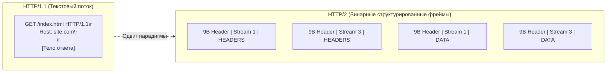
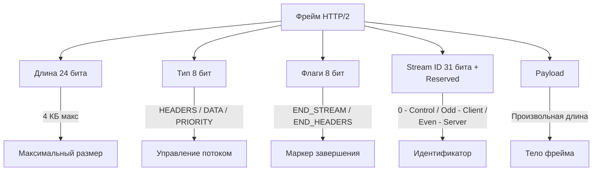
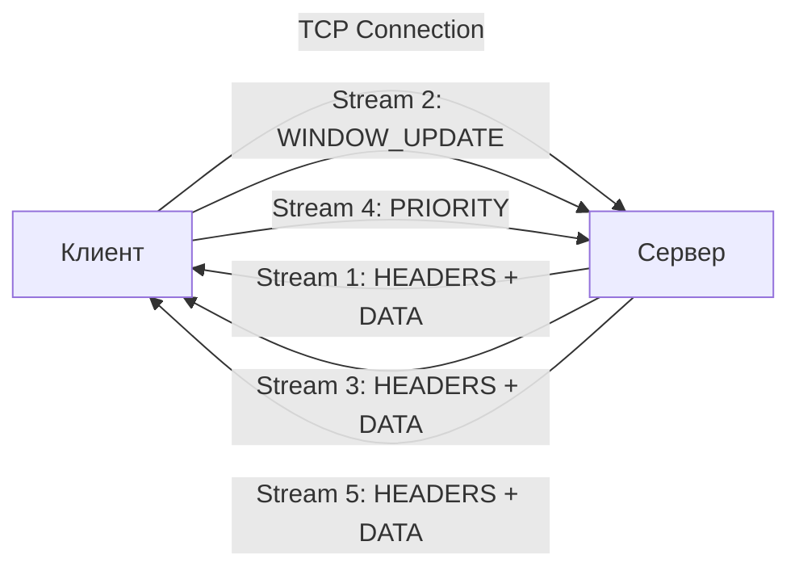
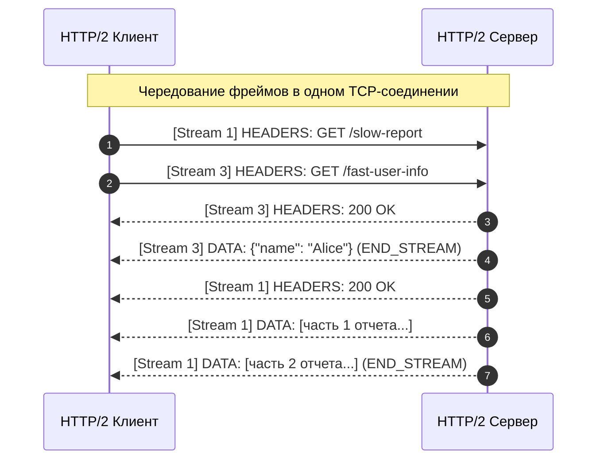
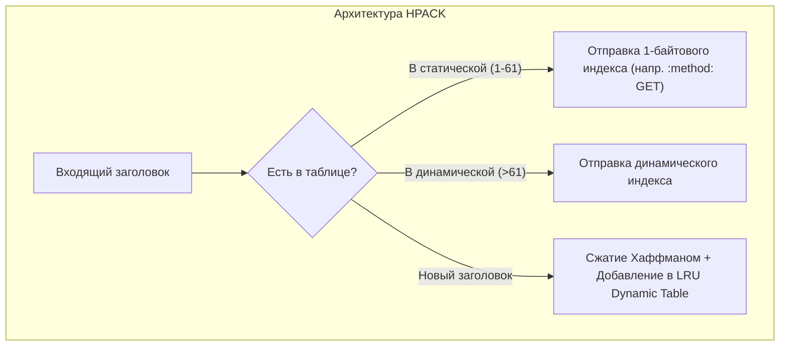

## Сдвиг парадигмы: от текста к бинарным фреймам

В компьютерных науках существует элегантный закон развития систем: протоколы начинаются как человекочитаемый текст, чтобы облегчить отладку первопроходцам, но по мере роста масштаба неизбежно уступают место компактным бинарным структурам.

В статьях [[20. HTTP 1.1. Структура запроса и ответа]] и [[21. HTTP 1.1 под капотом. Keep Alive, Chunked Encoding, Pipelining.md]] мы подробно разобрали, почему текстовый протокол стал узким местом для высоконагруженных систем. Когда Тим Бернерс-Ли создавал Всемирную паутину, возможность подключиться к серверу через утилиту `telnet` и вручную напечатать:
```http
GET / HTTP/1.1\r\n
Host: example.com\r\n\r\n
```
казалась верхом инженерной открытости. Однако для современного процессора и сетевого стека парсинг произвольного текста — это сущий кошмар. Парсинг текста в Go требует выделения памяти под строки, работы с регулярными выражениями и сложной логики разделения заголовков, постоянного сканирования байтов в поисках разделителей `\r\n` и аллокаций в куче.

Стандарт **HTTP/2** (RFC 7540, обновленный в RFC 9113) радикально меняет правила игры: это строгий бинарный протокол, ориентированный на максимальную производительность, мультиплексирование и бережное отношение к тактам процессора.



---

## Бинарный протокол и структура фрейма

В HTTP/2 больше нет строк `GET / HTTP/1.1\r\n`. Весь трафик состоит из **фреймов** (frames) — бинарных пакетов фиксированного формата. Это позволяет парсить данные на уровне CPU без аллокаций строк, что критично для highload.

Процессору больше не нужно читать байт за байтом в цикле, гадая, где кончается заголовок: он читает ровно 9 байт фиксированного заголовка фрейма, за один такт извлекает размер полезной нагрузки и переходит к обработке.



Раскладка заголовка фрейма в памяти (ровно 9 байт):
```
+-----------------------------------------------+
|                 Length (24)                   |
+---------------+---------------+---------------+
|   Type (8)    |   Flags (8)   |
+-+-+-+-+-+-+-+-+-+-+-+-+-+-+-+-+-+-+-+-+-+-+-+-+
|R|                 Stream Identifier (31)      |
+=+=+=+=+=+=+=+=+=+=+=+=+=+=+=+=+=+=+=+=+=+=+=+=+
|                   Frame Payload (0...)        |
+-----------------------------------------------+
```

Каждый фрейм содержит заголовок (9 байт) и полезную нагрузку. Назначение полей:
1. **Length (24 бита):** Длина полезной нагрузки (`Payload`). По умолчанию максимальный размер фрейма ограничен 16 384 байтами (16 КБ), но стороны могут согласовать размер до 16 777 215 байт через `SETTINGS_MAX_FRAME_SIZE`.
2. **Type (8 бит):** Определяет семантику фрейма.
3. **Flags (8 бит):** Битовые флаги для специфических оптимизаций (например, `END_STREAM` сигнализирует о завершении передачи, а `END_HEADERS` — о конце блока заголовков).
4. **R (1 бит):** Зарезервированный бит (всегда 0).
5. **Stream ID (31 бит):** Уникальный идентификатор логического потока, к которому принадлежит данный фрейм.

### Основные типы фреймов:
1. `HEADERS` — заголовки запроса/ответа (сжаты через HPACK). Может открывать новый логический поток.
2. `DATA` — тело сообщения (нагрузка запроса или ответа).
3. `WINDOW_UPDATE` — управление flow control (механизм предотвращения переполнения буферов на уровне потока или соединения в целом).
4. `PRIORITY` — дерево приоритетов потоков (сообщает серверу, какие ресурсы отдавать в первую очередь).
5. `SETTINGS`, `PING`, `GOAWAY` — управление соединением. `SETTINGS` согласует параметры сессии, `PING` измеряет RTT и проверяет живость канала, а `GOAWAY` обеспечивает graceful shutdown соединения.

---

## Мультиплексирование и управление потоками (Streams)

Ключевое отличие от [[21. HTTP 1.1 под капотом. Keep Alive, Chunked Encoding, Pipelining.md]] — **multiplexing**. 

В HTTP/1.1 одно TCP-соединение могло обрабатывать только один запрос-ответ за раз. Если клиенту требовалось 50 ресурсов, браузер открывал пул из 6 TCP-соединений (лимит большинства браузеров), создавая тяжелую нагрузку на память ядра и сетевой стек.

В HTTP/2 один TCP-канал обслуживает сотни логических **streams** (потоков). Каждый stream имеет уникальный 31-битный ID. Клиент использует нечетные ID, сервер — четные. Идентификатор `0x0` зарезервирован для управляющих фреймов всего соединения в целом.



Фреймы различных потоков чередуются (interleave) в одном непрерывном TCP-байт-стриме, словно вагоны разных поездов на одной скоростной железнодорожной магистрали.

Это решает проблему Head-of-Line blocking (HOL blocking) уровня приложения, которая убивала pipelining в HTTP/1.1. Если `DATA` для stream 1 задерживается из-за медленного клиента, stream 3 продолжает передаваться. Если генерация большого PDF-отчета на Stream 1 занимает 5 секунд, это больше не мешает параллельной мгновенной отдаче легковесных JSON-ответов на Stream 3 и Stream 5.



> [!warning] Ловушка / Gotcha
> Мультиплексирование не отменяет TCP HOL blocking. Если на канале теряется пакет на уровне TCP, все потоки ждут retransmission. 
> 
> Поскольку все потоки HTTP/2 упакованы в один общий TCP-сокет, ядро ОС на стороне получателя не может передать приложению фреймы Stream 3, пока не придет потерянный сегмент со Stream 1. При высоком packet loss (от 2% и выше на нестабильных мобильных сетях) HTTP/2 может работать даже медленнее, чем HTTP/1.1 с 6 параллельными сокетами! Именно поэтому в современных системах переходят к [[23. HTTP 3 и QUIC. Почему будущее уходит от TCP.md]].

---

## HPACK: сжатие заголовков и память

В веб-приложениях заголовки запросов часто превышают размер полезной нагрузки: массивные JWT-токены авторизации, длинные куки, служебные заголовки отслеживания, `User-Agent` и заголовки маршрутизации Envoy/Istio могут весить 1–2 КБ на каждый HTTP-запрос. В HTTP/1.1 эти метаданные передавались в открытом текстовом виде снова и снова с каждым запросом.

Почему нельзя было просто применить стандартный gzip/deflate?
В 2012 году исследователи продемонстрировали атаку **CRIME** (Compression Ratio Info-leak Made Easy): если злоумышленник мог подмешать свои данные в запрос (например, через JavaScript в браузере), по размеру сжатого gzip-пакета он мог посимвольно подобрать секретные cookie и токены авторизации.

Специально для HTTP/2 был разработан алгоритм сжатия **HPACK** (RFC 7541). Он спроектирован так, чтобы быть устойчивым к атакам утечки через компрессию, и использует два словаря:

- **Static Table**: Фиксированный набор (например, `:method`, `:scheme`, `:path`, `host`). Индексация по номеру. Содержит 61 предопределенный индекс наиболее часто встречающихся пар заголовок-значение (например, индекс 2 — `method: GET`, индекс 3 — `method: POST`, индекс 4 — `path: /`).
- **Dynamic Table**: LRU-кэш, заполняемый сервером во время сессии. Позволяет сжимать повторяющиеся заголовки (например, `cookie`, `user-agent`). Когда клиент впервые передает заголовок `authorization: Bearer eyJhbGci...`, обе стороны заносят его в динамическую таблицу под индексом 62. Во всех последующих запросах клиент отправляет всего один байт — номер индекса!

Сжатие работает через индексацию (отправка номера в статической/динамической таблице) или Huffman-кодирование (для новых значений). Статическое дерево Хаффмана встроено в спецификацию и оптимизировано под частоту символов в заголовках ASCII.



> [!info] Под капотом
> В Go реализация HPACK находится в пакете `golang.org/x/net/http2/hpack`. Динамическая таблица — это связный список (doubly-linked list) с LRU-эвакцией. При обновлении таблицы выделяются новые `hpack.Entry` (strings + uint32 index). Это создает нагрузку на GC при high-frequency запросах с уникальными заголовками.

---

## Go под капотом: `golang.org/x/net/http2`

В Go поддержка HTTP/2 встроена в `net/http`, но активна только при использовании TLS (ALPN negotiation: `h2`). Реализация вынесена в `golang.org/x/net/http2`.

Когда сервер на базе `http.ListenAndServeTLS` стартует, рантайм Go автоматически конфигурирует параметры протокола в структуре `tls.Config`. Во время TLS Client Hello клиент отправляет расширение **ALPN** (Application-Layer Protocol Negotiation) со списком поддерживаемых протоколов: `["h2", "http/1.1"]`. Если сервер поддерживает `h2`, он выбирает его в Server Hello, и соединение немедленно переходит в бинарный режим без дополнительных сетевых задержек.

Ключевые структуры в рантайме Go:
- `http2.conn`: Обертка над `net.Conn`, содержит `http2.framer`, `http2.writer`, `http2.streamMap`. Управляет состоянием соединения и фоновыми горутинами чтения/записи.
- `http2.stream`: Представляет логический поток. Содержит `http2.dataBuffer` (для chunked чтения), `http2.streamState`, `http2.headerFrame`.
- `http2.framer`: Парсит входящие бинарные фреймы. Использует `bytes.Reader` для zero-copy чтения заголовка.
- `http2.streamMap`: `sync.RWMutex` + `map[uint32]*http2.stream` для быстрого поиска потоков.

```go
// Пример внутренней логики создания потока в http2.server
func (s *conn) newStream(id uint32, writeState writeState) *stream {
    // Аллокация stream. В Go это может уйти в кучу из-за escape analysis,
    // если stream передается в интерфейс или замыкание.
    st := &stream{
        id:        id,
        state:     streamActive,
        data:      new(dataBuffer),
        headerBuf: &bytes.Buffer{}, // Буфер для декомпрессии HPACK
    }
    // Регистрация в мапе потоков
    s.streams[id] = st
    return st
}
```

> [!tip] Собеседование
> **Вопрос:** Почему в Go `net/http` по умолчанию включает HTTP/2 только с TLS?
> **Ответ:** Исторически это было требованием спецификации и браузеров. Хотя спецификация допускает HTTP/2 без шифрования (протокол `h2c`, HTTP/2 Cleartext), браузеры наотрез отказались реализовывать `h2c` из-за обилия старых корпоративных прокси и фаерволов, которые ломались при виде бинарного трафика на 80-м порту. TLS обеспечивает шифрование и предоставляет механизм ALPN (Application-Layer Protocol Negotiation) для согласования протокола на этапе рукопожатия без дополнительных RTT. Без TLS Go не будет апгрейдить соединение до HTTP/2 автоматически (хотя для межсервисного общения `h2c` можно включить вручную через `golang.org/x/net/http2/h2c`).

---

## Mechanical Sympathy и влияние на производительность

Переход на бинарный транспорт меняет профиль утилизации аппаратных ресурсов машины:

1. **CPU Cache & Parsing:** Бинарные фреймы парсятся за O(1) без аллокаций строк. Заголовок фрейма (9 байт) помещается в один кэш-лайн L1. Это сокращает CPU cycles на парсинг на 40-60% по сравнению с HTTP/1.1. Процессор декодирует поля фрейма простыми битовыми сдвигами (`>>`) и побитовыми масками (`&`), что исключает ветвления (branch prediction misses) в машинном коде.
2. **GC Pressure:** HPACK динамическая таблица создает постоянные аллокации (новые `hpack.Entry`). При highload это увеличивает нагрузку на GC. Оптимизация: ограничение размера динамической таблицы (`SETTINGS_HEADER_TABLE_SIZE`) и использование `sync.Pool` для временных буферов в `framer`.
3. **Контекстные переключения:** Мультиплексирование на одном TCP-сокете снижает количество системных вызовов `socket()`, `connect()`, `close()` в ядре Linux. Это критично для сервисов с короткими запросами (microservices). Ядру не нужно держать тысячи сокетов в `TIME_WAIT` и перегружать планировщик.
4. **Escape Analysis:** `http2.stream` часто аллоцируется в кучу, так как его жизнь может превышать время выполнения функции-обработчика (асинхронная обработка). Использование `http2.Transport` с пулом соединений (`http2.ConfigureTransports`) позволяет переиспользовать `http2.conn` и отложить GC.

> [!warning] Ловушка / Gotcha
> **HPDoS (HTTP/2 Rapid Reset / Header DoS):** Осенью 2023 года мир сотрясла крупнейшая в истории интернета DDoS-атака **HTTP/2 Rapid Reset** (CVE-2023-44487), достигавшая сотен миллионов запросов в секунду. 
> 
> Суть уязвимости: атакующий отправляет фрейм `HEADERS` (открывая поток и заставляя сервер выделять структуры данных `http2.stream`, буферы и проводить парсинг HPACK) и тут же отправляет фрейм `RST_STREAM` (сброс потока). Для клиента это стоило микросекунды и пары байт, а сервер тратил гигабайты памяти на создание и немедленную очистку горутин и структур.
> 
> В Go защита: обязательное обновление рантайма, а также жесткая настройка параметров `http2.Server.MaxHeaderListSize` и `http2.Server.ReadHeaderBufferSize`, ограничивающих аппетиты сервера.

---

## Итог

1. HTTP/2 заменил текстовый парсинг на бинарные фреймы, что ускорило обработку на уровне CPU.
2. Мультиплексирование решает проблему HOL blocking приложения, но не отменяет TCP-ограничений.
3. HPACK сжимает заголовки через статические/динамические таблицы и Huffman, но создает нагрузку на GC при высокой частоте уникальных заголовков.
4. В Go реализация строится вокруг `golang.org/x/net/http2`, где `conn`, `stream` и `framer` управляют жизненным циклом потоков.
5. TLS + ALPN обязательны для автоматического апгрейда.

Мы завершили детальный разбор HTTP/2, который стал стандартом де-факто для внутреннего и внешнего API. Однако мультиплексирование все еще привязано к TCP, что сохраняет проблему Head-of-Line blocking на транспортном уровне. В следующей статье мы рассмотрим, как протокол [[23. HTTP 3 и QUIC. Почему будущее уходит от TCP.md]] устраняет эти ограничения на уровне ядра.