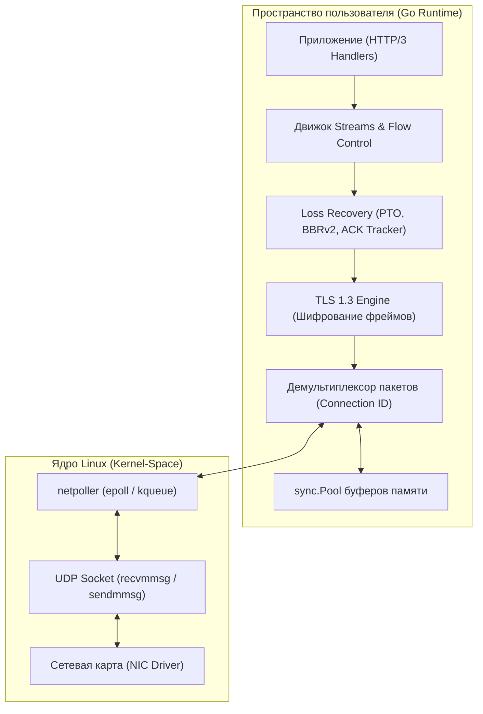
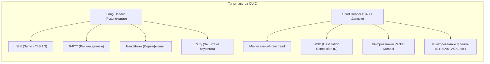
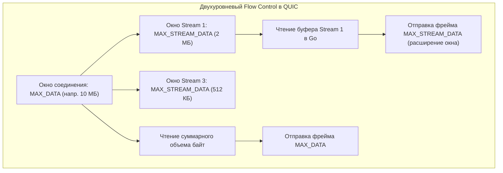
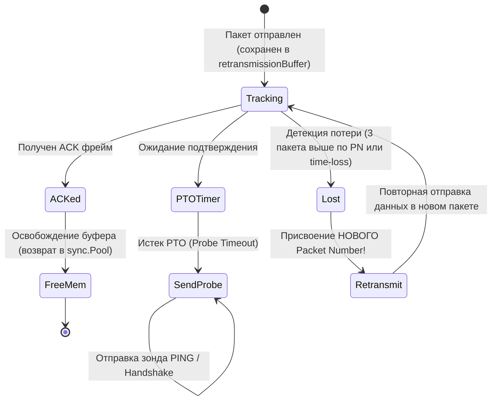

## Введение

В предыдущей статье [[23. HTTP 3 и QUIC. Почему будущее уходит от TCP]] мы рассмотрели мотивы перехода от TCP к UDP + QUIC. Теперь мы спустимся на уровень реализации, чтобы понять, как QUIC заменяет ядро ОС, как Go управляет пакетами в userspace и какие инженерные компромиссы это несёт. 

> [!NOTE]
> Спецификация QUIC разделена IETF на два базовых документа: RFC 9000 (устройство транспорта и инкапсуляция фреймов) и RFC 9002 (алгоритмы детекции потерь и контроля перегрузок). Это модульное разделение позволяет независимо оптимизировать транспортные механизмы и алгоритмы congestion control.

QUIC — это не просто обёртка над UDP. Это полноценный транспортный протокол, реализованный в пространстве пользователя. Для Go-разработчика это означает, что мы берём на себя ответственность за планирование, аллокации, криптографию и контроль перегрузок, которые раньше обеспечивал Linux TCP-стек.

Когда операционная система освобождается от забот о надежности передачи, все обязанности по переотправке пакетов, вычислению RTT, скользящим окнам и криптографии падают на плечи рантайма вашего приложения. Если в TCP вы просто читали байты из файлового дескриптора сокета, то в QUIC ваш Go-процесс становится собственной миниатюрной сетевой подсистемой ядра.



---

### 1. Анатомия пакетов QUIC

QUIC использует два формата заголовка: **Long Header** (для рукопожатия) и **Short Header** (для данных 1-RTT). Ключевое отличие от TCP: заголовок QUIC инкапсулирует всё, включая криптографические токены и Connection ID, а часть заголовка шифруется сразу после Initial-пакета.

**Структура Long Header:**
Используется на начальном этапе установления соединения, когда стороны еще не согласовали рабочие криптографические ключи 1-RTT (типы пакетов: `Initial`, `0-RTT`, `Handshake`, `Retry`).

```
 0                   1                   2                   3
 0 1 2 3 4 5 6 7 8 9 0 1 2 3 4 5 6 7 8 9 0 1 2 3 4 5 6 7 8 9 0 1
+-+-+-+-+-+-+-+-+-+-+-+-+-+-+-+-+-+-+-+-+-+-+-+-+-+-+-+-+-+-+-+-+
|  Version  | 0xQUIC |  DCID Len |  Destination Connection ID  |
+-+-+-+-+-+-+-+-+-+-+-+-+-+-+-+-+-+-+-+-+-+-+-+-+-+-+-+-+-+-+-+-+
|  DCID Len  |  SCID Len  | 0xQUIC  |  Initial Token Length   |
+-+-+-+-+-+-+-+-+-+-+-+-+-+-+-+-+-+-+-+-+-+-+-+-+-+-+-+-+-+-+-+-+
|  Initial Token Length (var)                                   |
+-+-+-+-+-+-+-+-+-+-+-+-+-+-+-+-+-+-+-+-+-+-+-+-+-+-+-+-+-+-+-+-+
|  Payload (encrypted)                                          |
+-+-+-+-+-+-+-+-+-+-+-+-+-+-+-+-+-+-+-+-+-+-+-+-+-+-+-+-+-+-+-+-+
```

**Структура Short Header (1-RTT):**
Используется для 99.9% рабочего трафика после того, как TLS-рукопожатие завершено. Здесь устранены все избыточные поля, остаётся только необходимый минимум для маршрутизации и дешифрования.

```
 0 1 2 3 4 5 6 7 8 9 0 1 2 3 4 5 6 7 8 9 0 1 2 3 4 5 6 7 8 9 0 1
+-+-+-+-+-+-+-+-+-+-+-+-+-+-+-+-+-+-+-+-+-+-+-+-+-+-+-+-+-+-+-+-+
|  Fixed Bit |  Packet Number (var) |  Length (var) | Payload   |
+-+-+-+-+-+-+-+-+-+-+-+-+-+-+-+-+-+-+-+-+-+-+-+-+-+-+-+-+-+-+-+-+
```



> [!info] Под капотом
> **Packet Number (PN)** в QUIC кодируется с помощью delta-сжатия. В Short Header PN занимает 1-4 байта в зависимости от ожидаемого окна. Это экономит байты в кэше L1 процессора при высокочастотной передаче. В отличие от TCP, где PN — это просто SEQ/ACK, в QUIC PN привязан к **Packet Number Space** (Initial, Handshake, Application). Пропуск пакета в одном пространстве не блокирует другие. Более того, при ретрансмиссии данных QUIC присваивает пакету *новый* возрастающий номер PN! Это полностью устраняет классическую проблему TCP («неоднозначность подтверждения повтора» / Retransmission Ambiguity).

> [!warning] Ловушка / Gotcha
> Заголовок Short Header шифруется с использованием ключей, полученных на этапе рукопожатия. Если клиент или сервер потеряют эти ключи (например, после миграции соединения), они не смогут расшифровать данные, даже если IP-адреса совпадают. QUIC использует **Connection ID** именно для этого: он позволяет менять IP-пакет (5-tuple), сохраняя контекст соединения.

---

### 2. Streams и мультиплексирование

QUIC реализует виртуальные каналы (Streams) поверх одного UDP-соединения. Это решает проблему **Head-of-Line Blocking (HOLB)**, которая возникает в TCP: если один TCP-пакет теряется, все последующие блокируются до retransmission.

Каждый поток представляет собой независимый двунаправленный или однонаправленный упорядоченный байтовый поток. Внутри QUIC-пакета полезная нагрузка разбивается на **фреймы** (`STREAM`, `ACK`, `MAX_DATA`, `RESET_STREAM`). Один UDP-датаграмма может содержать одновременно фреймы `STREAM 4`, `STREAM 8` и подтверждение `ACK`.

**Идентификатор потока (Stream ID):**
Идентификатор потока — это 62-битное число переменной длины (varint). Младшие 2 бита определяют природу потока:

| Бит 0 | Бит 1 | Биты 2-62 |
|-------|-------|-----------|
| 0 = Client-initiated<br>1 = Server-initiated | 0 = Bidirectional<br>1 = Unidirectional | Уникальный номер потока |

- `0x00`: Инициирован клиентом, двунаправленный (например, стандартный HTTP-запрос/ответ).
- `0x01`: Инициирован сервером, двунаправленный.
- `0x02`: Инициирован клиентом, однонаправленный (например, поток телеметрии).
- `0x03`: Инициирован сервером, однонаправленный (например, Server-Push или служебный управляющий поток HTTP/3).

> [!tip] Собеседование
> **Вопрос:** Чем QUIC Streams отличаются от HTTP/2 Streams?
> **Ответ:** В HTTP/2 потоки мультиплексируются поверх одного TCP-соединения, но теряют данные при потере любого пакета в TCP-стеке. В QUIC потоки мультиплексируются на уровне транспорта: потеря пакета в Stream A не блокирует Stream B, так как loss recovery работает на уровне QUIC, а не ядра ОС.

**Flow Control (Управление потоком):**
QUIC использует оконный контроль на двух независимых уровнях:
1. **Connection-level**: общий лимит на входящий трафик для всего соединения в целом (фрейм `MAX_DATA`).
2. **Stream-level**: лимит на конкретный поток (фрейм `MAX_STREAM_DATA`).

Если `MAX_DATA` или `MAX_STREAM_DATA` исчерпаны, отправитель должен ждать `WINDOW_UPDATE` фрейма. Это предотвращает OOM на стороне получателя и позволяет тонко настраивать приоритеты (например, притормозить загрузку изображений, пока грузится JS).



---

### 3. Loss Recovery и Congestion Control под капотом

В TCP loss recovery встроен в ядро Linux. В QUIC он реализован в userspace (в пакете `quic-go`). Это даёт гибкость, но снимает аппаратное ускорение (TSO, GRO, checksum offload).

**Ключевые механизмы:**
* **ACK-фреймы**: Отправляются с задержкой (`AckDelay`), кодируют диапазон потерянных пакетов и ECN-маркеры. QUIC использует `ACK Frequency` и `ACK Delay` для снижения overhead. Вместо единичных подтверждений фрейм `ACK` передает список диапазонов (ACK Ranges), компактно описывая, какие именно пакеты были получены.
* **PTO (Probe Timeout)**: Вместо TCP RTO (Retransmission Timeout), QUIC использует PTO: `RTT + 4 * SmoothedRTT + MaxAckDelay`. Если PTO истекает, отправитель шлёт `PING` или пустой пакет, чтобы подтвердить живость пути. Это не считается потерей пакета и предотвращает преждевременный сброс окна перегрузки.
* **ECN (Explicit Congestion Notification)**: QUIC читает поля ECN-Ce и ECN-Echo из IP-заголовка. Если ядро помечает пакеты как CE, QUIC немедленно снижает окно перегрузки, не дожидаясь потери пакета.
* **Congestion Control**: По умолчанию используется **BBRv2** (в `quic-go` настраивается). BBR строит модель пропускной способности и задержки пути, не полагаясь на потерю пакетов как на сигнал перегрузки.



> [!info] Под капотом
> Почему loss recovery в userspace важен для Go?
> Ядро Linux оптимизировано под TCP. При использовании UDP+QUIC мы теряем:
> - **TSO/GRO**: объединение пакетов на сетевой карте.
> - **TCP BBR**: встроенный алгоритм, обученный на миллионах маршрутизаторов.
> - **TCP Fast Open**: ускорение рукопожатия на уровне ядра.
> Go-рантайм компенсирует это за счёт `netpoll` (epoll/kqueue) и асинхронного цикла чтения/записи, но CPU-циклы на сборку пакетов и криптографию ложатся на приложение.

---

### 4. Реализация в Go: netpoll, sync.Pool и Escape Analysis

Стандартная библиотека Go до сих пор не содержит production-ready QUIC. Индустрия использует `github.com/quic-go/quic-go`. Архитектура строится вокруг трёх столпов:

1. **`net.UDPConn` + `poll.FD`**: Прямой доступ к файловому дескриптору UDP-сокета. `netpoll` регистрирует его в epoll/kqueue для событий `readable`/`writable`.
2. **`sync.Pool` для пакетов**: Буферы пакетов (32KB-1MB) выделяются в пуле. Это критично для снижения давления на GC.
3. **Горутина на соединение/поток**: `quic-go` создаёт горутину на каждое соединение и дополнительные горутины на активные потоки. Планировщик Go обрабатывает это эффективно, но при 100k+ соединений нужно учитывать overhead контекста.

```go
// Упрощённый пример управления буфером пакета в quic-go
// Показывает работу с sync.Pool и Escape Analysis

var packetPool = sync.Pool{
    New: func() any {
        // 32KB часто попадает в L2/L3 кэш CPU (L1 обычно 32KB, L2 256KB-8MB)
        // Выделение в стеке невозможно из-за динамического размера
        return make([]byte, 32*1024)
    },
}

func (c *connection) readLoop(fd *poll.FD) error {
    buf := packetPool.Get().([]byte)
    defer packetPool.Put(buf) // Возврат в пул до выхода

    // netpoll ждёт события на сокете (epoll_wait)
    if err := fd.Read(); err != nil {
        return err
    }

    n, _, err := fd.SyscallConn().Read(func(fd uintptr) error {
        // syscall readv для UDP
        return readUDP(fd, buf)
    })
    if err != nil {
        return fmt.Errorf("udp read: %w", err)
    }

    // Парсинг QUIC пакета
    packet, err := ParsePacket(buf[:n])
    if err != nil {
        return fmt.Errorf("parse quic packet: %w", err)
    }

    // Обработка фреймов...
    return nil
}
```

> [!tip] Собеседование
> **Вопрос:** Как Go рантайм влияет на производительность QUIC-сервера?
> **Ответ:** Go использует work-stealing scheduler. При высокой нагрузке на QUIC-соединения возникает конкуренция за `sync.Pool` и мьютексы потоков. Escape analysis выталкивает буферы в кучу, увеличивая Gen0 GC. Для оптимизации:
> 1. Настройка `GOGC=50` или `GOMEMLIMIT` для предсказуемого сбора мусора.
> 2. Использование `netpoll` вместо блокирующих `Read()`/`Write()`.
> 3. Отключение `GODEBUG=asyncpreemptoff=1` только для критических путей, так как async preemption добавляет overhead на контекст.

---

### 5. Ловушки, сравнение с TCP и вопросы для собеседования

| Аспект | TCP (Kernel) | QUIC (Userspace/Go) |
|--------|--------------|---------------------|
| **Оптимизация ядра** | TSO, GRO, Checksum Offload, TCP BBR | Отсутствуют. CPU тратит время на сборку пакетов |
| **HOL Blocking** | Есть на уровне соединения | Решён на уровне потоков (Streams) |
| **Миграция IP** | Разрывает соединение (5-tuple) | Поддерживается через Connection ID |
| **Безопасность** | TLS отдельно (или TLS 1.3 поверх) | TLS 1.3 встроен в транспорт (0-RTT, key rotation) |
| **CPU Utilization** | Низкий (ядро) | Выше (криптография + loss recovery) |

> [!warning] Ловушка / Gotcha
> **UDP Fragmentation & MTU Discovery:** QUIC не умеет автоматически фрагментировать пакеты. Если размер QUIC-пакета > PMTU (Path MTU), пакеты дробятся на UDP-уровне, что приводит к потере целого QUIC-пакета при потере одного фрагмента. Go-реализации используют **Path MTU Discovery (PMTUD)** и **BDP (Bandwidth-Delay Product)** для динамической подстройки размера пакета. В контейнерах (Docker/K8s) MTU часто 1500, но Overlay-сети (VXLAN) отнимают 50 байт. Без корректной настройки QUIC будет фрагментировать, теряя производительность.

> [!tip] Собеседование
> **Типичные вопросы:**
> 1. *Почему QUIC может работать медленнее TCP на локальной сети с 10Gbps?* -> Отсутствие аппаратного ускорения (TSO/GRO), overhead crypto (AES-GCM/ChaCha20), userspace context switches.
> 2. *Как Go обрабатывает потерю пакетов в QUIC?* -> `ackHandler` отслеживает sent packets, `retransmissionBuffer` хранит копии. При PTO или ECN-CE отправитель снижает `congestionWindow` и вызывает `retransmitPacket`.
> 3. *В чём разница между 0-RTT и 1-RTT рукопожатием?* -> 0-RTT использует Resumption TLS Session Ticket (PSK). Данные отправляются до завершения рукопожатия, но уязвимы к replay-атакам. 1-RTT ждёт подтверждения ключей.
> 4. *Как QUIC решает проблему "Thundering Herd" при восстановлении соединения?* -> Connection ID позволяет клиенту восстановить контекст без полного TCP-повтора. Сервер маппит ID на `connectionState` в кэше.

---

## Итог

QUIC переносит транспортный слой из ядра Linux в пространство пользователя, что даёт Go-разработчикам полный контроль над мультиплексированием, криптографией и congestion control, но требует ручного управления аллокациями (`sync.Pool`), awareness к Escape Analysis и настройки MTU в контейнеризованных средах. Понимание `netpoll`, пакетных структур и loss recovery engine критично для написания высоконагруженных QUIC-серверов без утечек памяти и GC pauses.

Мы завершили глубокое погружение в транспортный уровень и протоколы поверх UDP. В следующей статье мы рассмотрим долгоживущие двунаправленные каналы связи: [[25. WebSocket, SSE и долгоживущие соединения]], где разберём, как Go управляет keep-alive соединениями, heartbeat-механизмами и backpressure в real-time сценариях.