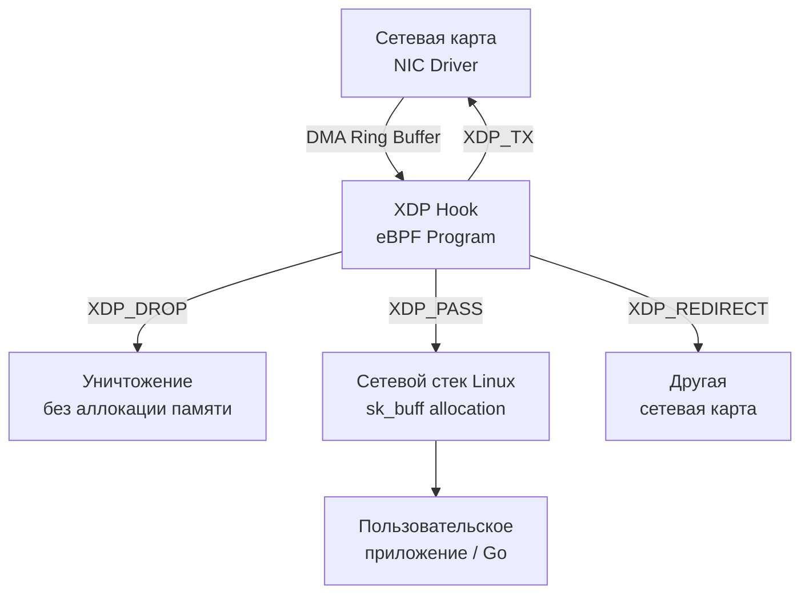

## eBPF и XDP: Ядро как платформа для программирования

> *"The purpose of computing is insight, not numbers."*  
> — Ричард Хэмминг

Десятилетиями системные инженеры сталкивались с жесткой дилеммой. Если требовалось изменить логику обработки сетевых пакетов на сервере Linux — отфильтровать входящий флуд, перенаправить трафик или собрать телеметрию на скорости десятков миллионов пакетов в секунду — существовало лишь два крайних пути:
1. **Писать модуль ядра на C.** Это давало максимальную производительность, но любая ошибка разыменования указателя или сбой в граничных условиях оборачивались мгновенным Kernel Panic и аварийной перезагрузкой сервера. Кроме того, поддержка модуля превращалась в кошмар при каждом обновлении ядра Linux.
2. **Использовать стандартные фильтры (`iptables`/`nftables`) или переносить пакеты в Userspace (например, через DPDK).** Классические таблицы `iptables` проверяют правила последовательно и работают на высоких уровнях сетевого стека, когда ядро уже потратило сотни тактов CPU на парсинг пакета и аллокацию управляющих структур. Перенос же через DPDK полностью монополизирует сетевую карту и изолирует ядро, лишая разработчика стандартных сетевых интерфейсов, файрволов и привычных утилит ОС.

Появление **eBPF (Extended Berkeley Packet Filter)** и **XDP (eXpress Data Path)** произвело тектонический сдвиг, сопоставимый с появлением JavaScript в веб-браузерах. Если раньше браузер умел показывать только статический HTML, а JavaScript превратил его в гибкую операционную среду, то eBPF превратил статическое ядро Linux в безопасную, динамически программируемую платформу.

Для разработчика на Go это открывает потрясающие горизонты: возможность писать сверхскоростные сетевые балансировщики, фильтры и агенты наблюдаемости без единой строчки на CGO, управляя логикой ядра Linux прямо из своего Go-приложения.

---

### Бытовая аналогия: Таможня в аэропорту и досмотр на летном поле

Представьте огромный международный грузовой аэропорт:
- **Традиционный сетевой стек Linux:** Каждый прибывающий самолетом контейнер (пакет) рабочие выгружают на тележку, везут по взлетной полосе в многоэтажный таможенный терминал, регистрируют в журнале в трех экземплярах, распаковывают, маркируют штрих-кодами (аллокация тяжелой структуры `struct sk_buff`), распределяют по полкам складов и только потом проверяют декларацию. Если посылка оказалась спамом или контрабандой, вы всё равно потратили 20 минут и гору бланков на ее обработку.
- **XDP и eBPF:** Инспектор в защитном костюме стоит прямо у грузового трапа самолета (на уровне драйвера сетевой карты). В руках у него сканер. Едва паллет с грузом выкатился из самолета на летное поле (DMA-буфер в памяти), инспектор считывает этикетку за полторы наносекунды. Если посылка от злоумышленника — ее мгновенно сбрасывают в утилизатор (`XDP_DROP`), даже не тратя бумагу на регистрацию. Если это транзитный груз — его тут же перегружают на соседний рейс (`XDP_TX` или `XDP_REDIRECT`), вообще минуя терминал. И только проверенные честные посылки отправляются на стандартную процедуру регистрации в ядро (`XDP_PASS`).

---

## Архитектура eBPF: Виртуальная машина внутри Ring 0

eBPF — это не просто библиотека фильтрации, а полноправная **виртуальная машина (VM)** с RISC-подобным набором инструкций, исполняющаяся прямо в привилегированном адресном пространстве ядра (Ring 0).

```mermaid
flowchart TD
    subgraph Userspace["Пользовательское пространство (Userspace / Go)"]
        Src["eBPF C-код (clang / bpf2go)"] -->|Clang/LLVM| ELF["eBPF Bytecode (.o / ELF)"]
        GoApp["Go-приложение (cilium/ebpf)"]
        ELF --> GoApp
    end

    subgraph Kernel["Пространство ядра (Kernel Space / Ring 0)"]
        GoApp -->|sys_bpf(BPF_PROG_LOAD)| Verifier["Статический Верификатор<br>(DAG, безопасность памяти, лимиты)"]
        Verifier -->|Одобрено| JIT["JIT-компилятор<br>(x86_64 / ARM64 / RISC-V)"]
        JIT --> Native["Машинный код CPU (Ring 0)"]
        
        Native <-->|sys_bpf / atomic| Maps["eBPF Maps / RingBuffer<br>(Хеш-таблицы, массивы, per-CPU)"]
        Hook["Сетевой Hook (XDP / TC / Sockets / kprobe)"] -->|Триггер| Native
    end

    GoApp <-->|Чтение/Запись| Maps
```

### 1. Архитектура процессора eBPF
Виртуальная машина eBPF имеет строгую 64-битную RISC-архитектуру:
- **11 регистров:** Регистры с `r0` по `r9` являются регистрами общего назначения (64 бит), а регистр `r10` — это неизменяемый указатель стека (read-only frame pointer).
- **Размер стека:** Жестко ограничен 512 байтами. Большие структуры данных запрещено размещать на стеке — для них используются внешние карты памяти (Maps).
- **JIT-компиляция (Just-In-Time):** После валидации ядро мгновенно компилирует байткод eBPF в машинные инструкции конкретного хостового процессора (x86_64, ARM64, RISC-V). С этого момента программа работает на голой скорости процессора без эмуляции и интерпретации.

### 2. Verifier (Верификатор): Доказательство безопасности кода
Верификатор — фундамент безопасности Linux при работе с eBPF. Он выполняет математическое доказательство того, что загружаемый код гарантированно не сломает ядро:
- **Отсутствие бесконечных циклов:** Программа анализируется как ориентированный ациклический граф (DAG). Количество инструкций ограничено (до 1 000 000 проверенных инструкций в современных версиях ядра).
- **Абсолютная безопасность памяти:** Запрещен произвольный доступ по указателям. Любое обращение за пределы буфера пакета приводит к отказу загрузки на этапе компиляции. Указатели строго типизированы.
- **Инициализация регистров:** Нельзя читать регистры до того, как в них было записано значение.
- **Отказ от Kernel Panic:** Если верификатор находит хотя бы один потенциальный путь исполнения с нарушением границ памяти, код отвергается с возвратом ошибки `EINVAL` или `EACCES`.

### 3. eBPF Maps (Карты памяти)
Поскольку память eBPF-программы изолирована, для сохранения состояния между пакетами и для обмена информацией с пользовательским процессором (Go) используются специальные структуры данных ядра — **Maps**:
- `BPF_MAP_TYPE_HASH`: Традиционная потокобезопасная хеш-таблица.
- `BPF_MAP_TYPE_ARRAY`: Быстрый массив с фиксированным размером.
- `BPF_MAP_TYPE_PERCPU_HASH` / `BPF_MAP_TYPE_PERCPU_ARRAY`: Карты памяти с отдельной копией для каждого ядра CPU. Это исключает блокировки шины памяти (Cache Line Bouncing) при параллельной обработке пакетов на 64–128 ядрах.
- `BPF_MAP_TYPE_RINGBUF`: Высокопроизводительный неблокирующий циклический буфер событий для передачи данных из ядра в Userspace (заменил устаревший Perf Buffer).
Go-программа взаимодействует с картами через системный вызов `sys_bpf`, не выполняя контекстных переключений сетевого стека.

### 4. BTF (BPF Type Format) и парадигма CO-RE
До появления BTF разработчики eBPF сталкивались с кошмаром: смещения полей в структурах ядра (таких как `struct sk_buff` или `struct net_device`) менялись от версии к версии и зависели от флагов сборки ядра (`.config`). Из-за этого программу приходилось компилировать компилятором `clang` прямо на боевом сервере с установленными заголовками ядра.

**BTF (BPF Type Format)** и механизм **CO-RE (Compile Once, Run Everywhere)** решили эту проблему:
- Формат BTF упаковывает отладочную метаинформацию о типах структур ядра в компактный бинарный вид.
- При загрузке байткода eBPF-загрузчик сопоставляет смещения полей скомпилированной программы с реальной структурой запущенного ядра Linux и выполняет релокацию смещений на лету.

> [!info] Под капотом
> До появления BTF (ядро 5.3+) eBPF-программы писались «вслепую»: разработчики вручную вычисляли смещения полей структур ядра, которые менялись между версиями. BTF позволил компилятору генерировать переносимый код, который адаптируется к структуре ядра на целевом хосте во время загрузки.

---

## XDP: Ускорение на гранике железа

**XDP (eXpress Data Path)** — это сетевой хук наивысшего приоритета в Linux. Он перехватывает пакеты в точке, где драйвер сетевой карты (NIC) только что заполнил кольцевой буфер DMA, но **ДО ТОГО**, как ядро потратит ресурсы на аллокацию `struct sk_buff`.



### Почему это обеспечивает невероятную скорость?
В классическом стеке Linux жизненный цикл входящего пакета чрезвычайно дорог:
1. Сетевая карта копирует пакет по DMA в системную память.
2. Генерируется аппаратное прерывание (IRQ), ядро передает управление подсистеме NAPI/softirq.
3. Выделяется управляющая структура `struct sk_buff` (размером от 300 до 600 байт), на которую тратятся циклы локатора памяти `kmem_cache`.
4. Пакет парсится ядром, проходит через сетевой стек, `nf_tables`/`iptables`, маршрутизацию, сокетные буферы.

Если на сервер обрушивается атака SYN-flood интенсивностью 20 миллионов пакетов в секунду, ядро Linux погибает от нехватки памяти и процессорных циклов на одну лишь аллокацию `sk_buff`!

XDP позволяет принять решение о судьбе пакета **за считанные наносекунды до аллокации `sk_buff`**:
- `XDP_DROP`: Мгновенное уничтожение пакета. Пакет сбрасывается прямо в кольцевом буфере драйвера. Это абсолютное оружие против DDoS-атак (способно обрабатывать до 40+ миллионов пакетов в секунду на одном процессоре).
- `XDP_PASS`: Пакет признан валидным и передается дальше в стандартный сетевой стек ядра для создания `sk_buff`.
- `XDP_TX`: Пакет отправляется обратно в сеть через тот же физический сетевой интерфейс, на который он пришел (идеально для stateless-балансировщиков нагрузки).
- `XDP_REDIRECT`: Пакет перенаправляется на другой сетевой интерфейс, в виртуальную машину (через veth/tap) или в сокет `AF_XDP` пользовательского пространства с нулевым копированием (zero-copy).
- `XDP_ABORTED`: Сигнал об ошибке в программе eBPF, пакет отбрасывается с записью в трассировочные счетчики.

### Режимы работы XDP (Execution Modes)
В зависимости от аппаратной базы и драйверов, XDP может выполняться в одном из трех режимов:
1. **Offloaded Mode (SmartNIC):** eBPF-код компилируется в микрокод сетевого адаптера (например, Mellanox ConnectX, Netronome Agilio) и исполняется на процессоре самой сетевой карты. Ядро хоста и центральный процессор сервера вообще не задействуются!
2. **Native / Driver Mode:** Программа eBPF выполняется в контексте драйвера сетевой карты до аллокации `sk_buff`. Поддерживается всеми промышленными сетевыми картами (Intel `ixgbe`, `i40e`, Mellanox `mlx5`, Broadcom `bnxt`).
3. **Generic Mode:** Режим совместимости для тестирования. Программа вызывается после аллокации `sk_buff`, но до входа в сетевой стек IP. Работает на любых сетевых адаптерах, но теряет ключевое преимущество производительности.

---

## Go-интеграция: библиотека `cilium/ebpf`

Для взаимодействия с eBPF из Go признанным стандартом является библиотека `github.com/cilium/ebpf`, поддерживаемая разработчиками проекта Cilium.

Библиотека полностью написана на чистом Go и взаимодействует с ядром через системный вызов `sys_bpf` с помощью пакета `golang.org/x/sys/unix`. Ей не требуется компилятор C на целевой машине и она не страдает от накладных расходов CGO.

```go
package main

import (
	"log"
	"os"
	"time"

	"github.com/cilium/ebpf"
	"github.com/cilium/ebpf/link"
	"github.com/cilium/ebpf/ringbuf"
)

//go:generate go build -ldflags '-s -w' -o xdp_prog.xdp xdp.c
// xdp.c должен содержать @license SPDX-License-Identifier: GPL-2.0

func main() {
	// 1. Загрузка скомпилированного eBPF-объекта
	spec, err := ebpf.LoadCollectionSpec("xdp_prog.o")
	if err != nil {
		log.Fatalf("ошибка загрузки спецификации: %v", err)
	}

	// 2. Конфигурация и загрузка в ядро
	coll, err := ebpf.NewCollection(spec)
	if err != nil {
		log.Fatalf("ошибка загрузки в ядро: %v", err)
	}
	defer coll.Close()

	// 3. Привязка к сетевому интерфейсу (XDP driver mode)
	link, err := link.AttachXDP(&link.XDPOpts{
		Program:   coll.Programs["xdp_filter"],
		Interface: 2, // Пример: eth1
	})
	if err != nil {
		log.Fatalf("ошибка привязки XDP: %v", err)
	}
	defer link.Close()

	// 4. Чтение карты (map) из пользовательского пространства
	var count uint64
	maps := coll.Maps["packets_dropped"]
	if err := maps.Lookup([]byte("drop_count"), &count); err != nil {
		log.Printf("ошибка чтения карты: %v", err)
	}
	log.Printf("отфильтровано пакетов: %d", count)

	// 5. Работа с ring buffer для асинхронных событий от ядра
	reader, err := ringbuf.NewReader(coll.Maps["events"])
	if err != nil {
		log.Fatalf("ошибка ringbuf: %v", err)
	}
	defer reader.Close()

	go func() {
		for {
			rec, err := reader.Read()
			if err != nil {
				if err == ringbuf.ErrClosed {
					return
				}
				log.Printf("ошибка чтения событий: %v", err)
				continue
			}
			// Парсинг структуры события из rec.RawSample
			log.Printf("событие от ядра: %d байт", len(rec.RawSample))
		}
	}()

	select {
	case <-time.After(30 * time.Second):
		log.Println("завершение работы")
	}
}
```

> [!tip] Собеседование
> **Вопрос:** Почему `cilium/ebpf` не требует CGO?
> **Ответ:** Раньше eBPF-программы писались на C и компилировались в `.o`-файлы, которые линковались через CGO. Современная библиотека использует syscall `sys_bpf` напрямую из Go, загружая уже скомпилированный eBPF-байткод (`elf.Program` -> `sys_bpf(BPF_PROG_LOAD, ...)`). Это устраняет зависимость от компилятора C на этапе выполнения и упрощает кросс-компиляцию.

---

## Mechanical Sympathy и сравнительная производительность

Чтобы по-настоящему осознать разницу в производительности между традиционными механизмами фильтрации и связкой XDP + eBPF, обратимся к физике исполнения кода на процессоре.

```
+-------------------------------------------------------------------------------+
| Механизм          | Задержка на пакет | Пропускная способность (1 core CPU)    |
+-------------------------------------------------------------------------------+
| iptables/netfilter| ~1000 - 3000 нс   | ~1 - 3 млн пакетов/сек (Mpps)        |
| eBPF TC (clsact)  | ~300 - 600 нс     | ~5 - 10 млн пакетов/сек (Mpps)       |
| XDP Driver Mode   | ~25 - 50 нс       | ~20 - 40 млн пакетов/сек (Mpps)      |
| XDP Offloaded     | 0 нс (на CPU)     | ~100+ Mpps (лимит физического порта)  |
+-------------------------------------------------------------------------------+
```

### Почему XDP быстрее `iptables`?
1. **Отсутствие копирования:** XDP работает с сырыми DMA-буферами NIC. Нет аллокации `sk_buff`, нет копирования заголовков.
2. **Минимизация контекстных переключений:** Код исполняется в контексте драйвера NIC (или в softirq), минуя `netfilter` hook-систему и маршрутизацию.
3. **JIT-компиляция:** Никакой интерпретации байткода. Код выполняется как нативный C.
4. **NIC Offload:** Современные сетевые карты (Mellanox, Intel, Marvell) поддерживают **XDP eXpress Data Path with Hardware Offload**. eBPF-программа компилируется в микрокод карты, и фильтрация происходит внутри ASIC. Ядро Linux вообще не участвует в обработке пакета.

### Ограничения eBPF
- **Лимиты верификатора:** Циклы ограничены ~1M инструкций. Рекурсия запрещена. Сложная логика должна выноситься в userspace.
- **Память ядра:** eBPF-программы исполняются в контексте ядра. Утечка памяти или неосвобождённые ресурсы приводят к утечке памяти ядра (kernel memory leak), которую сложно отследить.
- **Блокировка ядра:** Если eBPF-программа зависает или зацикливается, она может заблокировать CPU на уровне ядра, что приведёт к `soft lockup` и зависанию системы.

> [!warning] Ловушка / Gotcha
> **Недооценка BTF:** Если целевая машина не скомпилирована с `CONFIG_DEBUG_INFO_BTF=y` (или не установлен пакет `linux-tools-generic`/`vmlinux.h`), загрузка CO-RE eBPF-программ может завершиться ошибкой `EINVAL`. Всегда проверяйте наличие BTF: `ls /sys/kernel/btf/vmlinux`.
> 
> **XDP и MTU:** При использовании `XDP_TX` или `XDP_REDIRECT` убедитесь, что размер пакета не превышает MTU интерфейса, иначе пакет будет обрезан или отброшен драйвером.

---

## Архитектурные компромиссы и вопросы на собеседованиях

### eBPF vs Традиционные подходы
| Аспект | `iptables`/`nftables` | XDP + eBPF | DPDK |
|--------|----------------------|------------|------|
| **Точка входа** | `NF_INET_PRE_ROUTING` (после `sk_buff`) | NIC DMA Ring (до `sk_buff`) | Пользовательское пространство |
| **Производительность** | ~1-5 Mpps | ~10-40 Mpps | ~50-100+ Mpps |
| **Сложность разработки** | Низкая (CLI) | Средняя (C/Go + ядро) | Высокая (user-space stack) |
| **Безопасность ядра** | Зависит от правил | Verifier + изоляция | Не затрагивает ядро |
| **Кросс-компилация** | Нет проблем | Требует BTF/CO-RE | Да, но требует специфичных драйверов |

### Типичные вопросы на Middle+/Senior
1. **Как eBPF обеспечивает безопасность при исполнении в Ring 0?**
   Верификатор статически анализирует поток управления и доступ к памяти. Запрещены произвольные указатели, бесконечные циклы и вызовы недоверенных функций ядра. Программа должна быть детерминированной и безопасной по памяти.
2. **Что такое BTF и почему он критичен для современного eBPF?**
   BTF хранит отладочную информацию о типах ядра в ELF-файле. Позволяет eBPF-коду обращаться к полям структур ядра (например, `sk_buff->len`) без хардкода смещений. Реализует CO-RE.
3. **В чем разница между XDP, TC (Traffic Control) и kprobe?**
   - **XDP:** Самый ранний хук. Работает с сырыми пакетами до стека.
   - **TC (clsact/qdisc):** Позднее. После маршрутизации, но до передачи сокету. Удобно для QoS, мониторинга.
   - **kprobe/tracepoint:** Хуки на функции/события ядра. Для отладки и профилирования, а не фильтрации пакетов.
4. **Как Go-приложение безопасно обновляет eBPF-программу на лету?**
   Через `link.AttachXDP` с флагом `Replace: true` или через `ebpf.CollectionSpec` с последующей заменой программы. Важно правильно освобождать старые ссылки, чтобы избежать `EBUSY` и утечки ресурсов ядра.

---

## Итог

eBPF и XDP превратили ядро Linux из чёрного ящика в высокопроизводительную программируемую платформу. Для Go-разработчика это открывает прямой путь к созданию инструментов с околожелезной скоростью: L4-балансировщиков, систем отражения DDoS-атак и средств прозрачной трассировки микросервисов без зависимости от CGO и риска обрушить хост в Kernel Panic. Понимание того, как пакеты обрабатываются до создания `sk_buff`, как работает Verifier и как Maps передают данные в userspace — обязательный багаж для инженера высоконагруженных систем.

Мы разобрали, как программно перехватывать и ускорять трафик на самых ранних рубежах ядра. Но чтобы до конца понять, какую именно работу экономит XDP и с какими структурами памяти оперирует ОС, нам необходимо исследовать весь маршрут пакета по сетевому стеку Linux. В следующей лекции [[37. Сетевой стек Linux под капотом]] мы спустимся в недра подсистемы сетевого ввода-вывода ядра, прерываний, очередей qdisc и дескрипторов сокетов.