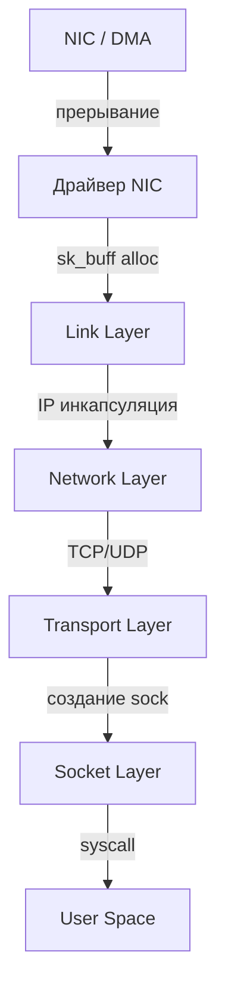
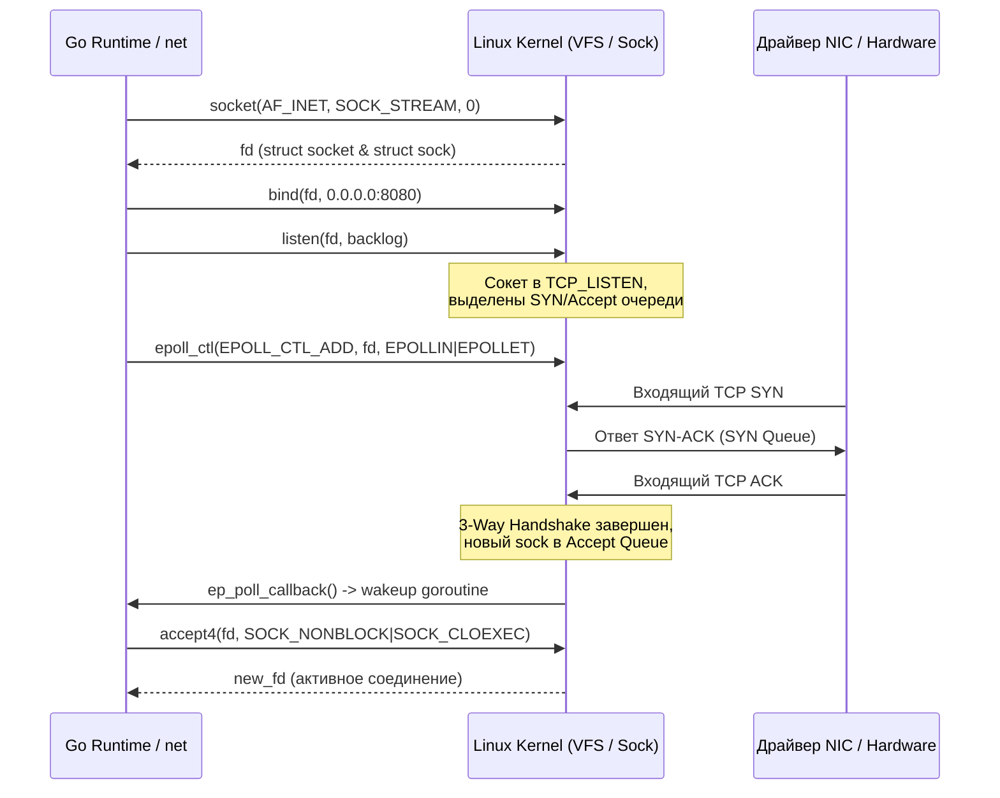
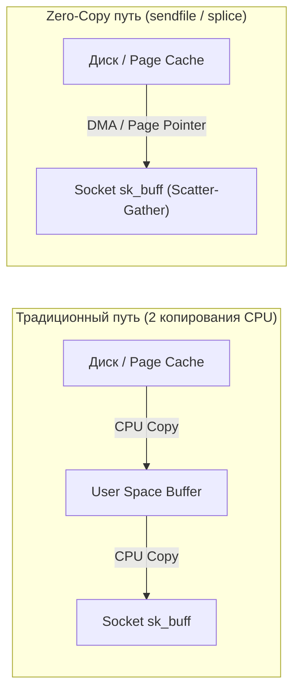

## Введение

> *«Управление сложностью — вот суть программирования».*    
> — Брайан Керниган

В повседневной разработке на Go сетевой ввод-вывод выглядит обманчиво прямолинейно. Вы вызываете `net.Dial()`, получаете объект `net.Conn`, выполняете `conn.Read()` или `conn.Write()` — и байты словно по мановению волшебной палочки отправляются на другой край планеты. Кажется, будто мы читаем и пишем в обычный срез байт в памяти.

Но за этой лаконичной абстракцией скрывается один из сложнейших инженерных механизмов в истории вычислительной техники — сетевой стек ядра Linux. Когда горутина запрашивает чтение из сокета, рантайм Go не выполняет блокирующий опрос процессора. Он передает дескриптор в рантайм-планировщик `netpoll`, где вступают в действие механизмы `epoll`, аппаратные прерывания сетевой карты, очереди кольцевых буферов DMA, цепочки фильтрации `netfilter`, планировщики трафика и сотни строк низкоуровневых структур ядра.

Понимание того, как Linux обрабатывает сетевой трафик, критически важно для Go-разработчика, который хочет выйти за пределы стандартного `net/http` и начать проектировать сверхнадежные и производительные сервисы, прокси или кастомные протоколы.

Знание внутреннего устройства сетевого стека позволяет объяснить и оптимизировать:
* Почему `epoll` работает быстрее устаревших `select` и `poll`.
* Как избежать утечек `sk_buff` и проблемы нехватки сокетов (`TCP`-коннекшн-эксплоушена).
* Где возникают скрытые накладные расходы при передаче больших объемов данных между памятью ядра и userspace.
* Как грамотно настраивать параметры ядра и сетевых буферов для Go-сервисов под экстремальной нагрузкой.

---

### Бытовая модель: Автоматизированный логистический хаб

Чтобы не утонуть в море системных вызовов и структур, представим путь входящего сетевого пакета как работу крупного автоматизированного сортировочного центра почты:
1. **Разгрузочный док (NIC & DMA Ring Buffer):** Грузовик (кабель) привозит посылки. Разгрузочный робот перекладывает их на конвейерную ленту фиксированной длины прямо на склад (DMA переносит байты из сетевой карты в оперативную память). Робот нажимает тревожную кнопку на стене (аппаратное прерывание CPU — IRQ).
2. **Пластиковая папка с маршрутным листом (`struct sk_buff`):** Посылка упаковывается в стандартизированную прозрачную папку. Сверху наклеивается маршрутный лист. Папка содержит свободные поля для штампов сверху и снизу (headroom и tailroom).
3. **Таможня и сортировка (IP, Routing, Netfilter):** Конвейер везет папку через сканеры. Проверяется целостность контрольной суммы, сличается адрес получателя по справочнику (таблица маршрутизации FIB) и проверяются правила безопасности (`iptables`/`nftables`).
4. **Сборка заказов (TCP Reassembly & Socket):** Посылки с одинаковым номером заказа выстраиваются в правильную цепочку (демультиплексирование TCP по портам и контроль последовательности Sequence Number).
5. **Абонентский ящик (`struct sock`):** Папка раскладывается в ячейку конкретного клиента (`sk_receive_queue`).
6. **Выдача клиенту (Go Goroutine & `epoll`):** На дисплее клиента загорается индикатор «Вам посылка» (`epoll_wait`). Курьер берет содержимое папки и перекладывает в портфель клиента (`conn.Read()` копирует данные из памяти ядра в буфер горутины в Userspace).

---

## Архитектура сетевого стека Linux

Сетевой стек Linux спроектирован как модульная конвейерная система. Пакет проходит через несколько слоев, каждый из которых выполняет строго определенную роль:



1. **Device Driver (`net_device`)**: Управляет физическим или виртуальным интерфейсом (`eth0`, `veth`, `lo`). При поступлении пакета драйвер аллоцирует `sk_buff` и передает его в стек через механизм NAPI (New API) в контексте программного прерывания `softirq`.
2. **Link Layer (L2)**: Разбирает MAC-адреса, проверяет контрольную сумму `CRC`, фильтрует пакеты по `MAC` или `VLAN`-тегам.
3. **Network Layer (IP / L3)**: Маршрутизация, проверка `iptables`/`nftables` (Netfilter хуки), фрагментация/дефрагментация, валидация времени жизни пакета `TTL` и проверка контрольной суммы заголовка IPv4.
4. **Transport Layer (TCP/UDP / L4)**: Демultiplexing по портам, конечный автомат `TCP` (state machine), механизмы управления потоком (`flow control`) и перегрузками (`congestion control`), обнаружение потери и переупорядочивания сегментов (reorder detection), проверка контрольной суммы `checksum`.
5. **Socket Layer**: Создает или находит соответствующую структуру `struct sock`, связывает ее с файловым дескриптором процесса, вызывает `copy_to_user` или `splice` для передачи полезных данных в `User Space`.
6. **User Space**: Пользовательское приложение на Go читает данные через вызовы `read()`/`recv()` или асинхронный мультиплексор `epoll`.

> [!info] Под капотом
> Каждый пакет в ядре Linux инкапсулируется в структуру `sk_buff` (socket buffer). Это сердце сетевого стека. Она хранит указатели на заголовки (`mac_header`, `nh`, `th`), данные, метаданные (`cb[]`), ссылку на сокет (`sk`) и устройство (`dev`). Аллокация `sk_buff` происходит в slab-кэш памяти (обычно `kmalloc-256` или `kmalloc-512`), что делает её быстрой, но чувствительной к фрагментации кэша CPU.

---

## Ключевые структуры данных ядра

### `struct sk_buff`

Структура `sk_buff` — один из шедевров системной архитектуры UNIX. Главная инженерная проблема сетевого пакета: по мере движения вверх или вниз по стеку протоколов к нему добавляются или от него отсекаются заголовки (Ethernet, IP, TCP). Если бы ядро копировало память пакета при каждом добавлении заголовка, сетевая производительность упала бы на порядок.

Вместо этого `sk_buff` использует концепцию **Headroom** и **Tailroom**:

```
+-----------------------------------------------------------------------+
|  sk_buff metadata (указатели, счетчики ссылок, флаги, таймстампы)    |
+-----------------------------------------------------------------------+
                                  |
                                  v
+---------------+-------------------------------+-----------------------+
|   Headroom    |         Packet Data           |       Tailroom        |
| (для сетевых  |   (Ethernet | IP | TCP |      |   (для трейлеров и    |
|  заголовков)  |         Payload)              |      padding)         |
+---------------+-------------------------------+-----------------------+
^               ^                               ^                       ^
|               |                               |                       |
head            data                            tail                    end
```

Манипуляции с пакетом выполняются за $O(1)$ без единого байта копирования:
- `skb_reserve(skb, len)`: Сдвигает указатели `data` и `tail` вправо, резервируя место под будущие заголовки.
- `skb_push(skb, len)`: Сдвигает `data` влево (в сторону `head`), добавляя новый заголовок протокола (например, инкапсуляция IP поверх TCP payload).
- `skb_pull(skb, len)`: Сдвигает `data` вправо, «снимая» заголовок при движении пакета вверх по стеку.
- `skb_put(skb, len)`: Сдвигает `tail` вправо (в сторону `end`), резервируя место под полезную нагрузку.

Ключевые поля `struct sk_buff`:
* `head`, `data`, `tail`, `end` — указатели на границы выделенной области памяти пакета.
* `len`, `truesize` — длина полезных данных и реальный объем занятой памяти в ядре (включая служебные заголовки и структуру `sk_buff`; используется для контроля лимитов `tcp_mem`).
* `sk` — ссылка на связанную структуру сокета `struct sock`.
* `destructor` — callback-функция для безопасного освобождения памяти и декремента счетчиков сокета при уничтожении пакета.
* `cb[]` — управляющий буфер контекста (Control Buffer, 48 байт), передаваемый между подсистемами ядра (например, для `TCP` здесь хранится очередь retransmit, а для `UDP` — метаданные очереди `sk_receive_queue`).

### `struct sock`

`struct sock` — базовая абстракция сетевого соединения на уровне ядра Linux. Содержит:
* `sk_prot` — указатель на таблицу диспетчеризации методов протокола (`tcp_prot`, `udp_prot`). Определяет конкретные реализации функций `connect`, `sendmsg`, `recvmsg`, `close`.
* `sk_state` — текущее состояние конечного автомата протокола (`TCP_ESTABLISHED`, `TCP_TIME_WAIT`, `TCP_LISTEN` и др.).
* `sk_backlog` — вспомогательная очередь для пакетов, поступающих во время выполнения системного вызова `accept()` или когда сокет временно заблокирован пользовательским контекстом.
* `sk_sleep` — очередь ожидания (wait queue) для перевода вызвавшего процесса или треда в спящий режим при блокирующем чтении/записи.
* `sk_receive_queue` / `sk_write_queue` — очереди входящих и исходящих пакетов `sk_buff`.

> [!warning] Ловушка / Gotcha
> В Go `net.Conn` не является прямым эквивалентом `struct sock`. Go использует `netpoll` (epoll/kqueue) для асинхронного чтения. Когда `epoll` сигнализирует о готовности, Go вызывает `recvmsg()` или `read()`. Если данные еще не пришли в `sk_receive_queue`, процесс блокируется в ядре до появления пакетов или таймаута.

---

## Системные вызовы и жизненный цикл сокета

Когда сетевой сервис на Go стартует и начинает принимать клиентские подключения, ядро выполняет строгую последовательность системных вызовов:



1. `socket(AF_INET, SOCK_STREAM, 0)` → Ядро создает сокетные структуры `struct socket` (представление VFS) и `struct sock` (сетевой стек), инициализируя таблицу операций `sk_prot` (например, `tcp_prot`).
2. `bind()` → Привязывает сокет к конкретному IP-адресу и порту хоста. Проверяет флаги переиспользования портов `SO_REUSEADDR`/`SO_REUSEPORT`.
3. `listen()` → Переводит сокет в состояние ожидания `TCP_LISTEN`. Создает две очереди: полуоткрытых соединений (SYN backlog) и полностью установленных соединений (Accept backlog), ограниченные параметрами `somaxconn` и `tcp_max_syn_backlog`.
4. `accept()` → В многопоточной модели Go блокируется в `epoll_wait` или вызывает неблокирующий `accept4()`. При прохождении полного рукопожатия (`SYN` → `SYN-ACK` → `ACK`) ядро создает новый дочерний `struct sock` и помещает его в `accept queue`.
5. `epoll_ctl(EPOLL_CTL_ADD, fd, EPOLLIN|EPOLLET, &ev)` → Регистрирует сокет в красно-черном дереве `epoll` ядра. При появлении данных драйвер вызывает callback `ep_poll_callback()`.

> [!tip] Собеседование
> **Вопрос:** Что произойдет, если `backlog` переполнится при высокой нагрузке?
> **Ответ:** Ядро отбрасывает новые `SYN`-пакеты или начинает использовать `syncookies` (если включены). В Go это может привести к `dial timeout` или `connection refused`. Для решения увеличивают `net.core.somaxconn` и `net.ipv4.tcp_max_syn_backlog`, а также используют `SO_REUSEPORT` для распределения нагрузки между горутинами/процессами.

---

## I/O мультиплексирование: epoll под капотом

Главная причина феноменальной сетевой масштабируемости Linux и Go заключается в отказе от устаревших системных вызовов `select` и `poll`. Если `select` требовал линейного сканирования всего массива дескрипторов за `O(N)` при каждом вызове, то подсистема `epoll` работает за `O(1)` для получения готовых событий благодаря трем внутренним механизмам:

1. **Красно-черное дерево (Red-Black Tree):** Хранит множество зарегистрированных дескрипторов внутри пространства ядра. Добавление, изменение и удаление дескриптора через `epoll_ctl` выполняются за `O(log N)`.
2. **Очередь ожидания (Wait Queue) и список готовности (Ready List):** Процессы и горутины добавляются в очередь ожидания `wait_head` сокетного объекта (`sk_sleep`). Когда сетевой адаптер доставляет пакет в память и ядро обрабатывает его в `softirq`, вызывается функция ядра `ep_poll_callback()`. Она помещает готовый дескриптор в двусвязный список `rdllist` (Ready List) и пробуждает поток через `wake_up()`. Вызов `epoll_wait` мгновенно забирает элементы из готового списка за `O(1)`.
3. **Edge-Triggered (ET) vs Level-Triggered (LT):**
   * `EPOLLET` (Edge-Triggered): Уведомление генерируется **только в момент фронта изменения состояния** (поступление новой порции данных в пустой буфер). Рантайм Go использует именно Edge-Triggered режим для минимизации context switches, что требует вычитывать данные из сокета в цикле до тех пор, пока системный вызов не вернет `EAGAIN` или `EWOULDBLOCK`.
   * `EPOLLIN` (Level-Triggered): Уведомление генерируется непрерывно до тех пор, пока в буфере сокета остается хотя бы один непрочитанный байт. Этот режим безопаснее для новичков, но порождает шквал лишних системных вызовов и переключений контекста.

> [!warning] Ловушка / Gotcha
> При использовании `EPOLLET` в Go, если вы прочитали часть данных и вернулись в `epoll_wait`, событие не сгенерируется снова, пока не придет новый пакет. Go решает это внутренним состоянием `netpoller`, но при кастомных `syscalls` или `io_uring` это частая причина "зависания" соединений.

---

## Zero-Copy и обход копирования памяти

Передача данных между накопителем (диском), оперативной памятью и сетевым адаптером традиционно требует четырех переключений контекста и четырех операций копирования данных:
1. Диск $\to$ Page Cache ядра (DMA).
2. Page Cache $\to$ Пользовательский буфер Userspace (CPU copy).
3. Буфер Userspace $\to$ Сокетный буфер ядра `sk_buff` (CPU copy).
4. Сокетный буфер $\to$ Сетевая карта NIC (DMA).

Чтобы исключить холостые циклы процессора и перегрузку шины памяти, Linux предоставляет несколько механизмов **Zero-Copy**:



1. **`sendfile()`**: Системный вызов, передающий дескрипторы файла и сокета напрямую внутри ядра. Данные из `page cache` адресуются указателями в `sk_buff` драйвера NIC с поддержкой Scatter-Gather DMA (`NETIF_F_SG`), полностью исключая копирование в `User Space` буфер.
2. **`splice()`**: Соединяет два произвольных файловых дескриптора (например, сокет и файл или два сокета) через кольцо буферов `pipe` ядра Linux. Байты перемещаются через память ядра без захода в пространство пользователя.
3. **`io_uring`**: Современный асинхронный интерфейс пакетного ввода-вывода Linux (начиная с ядер 5.1+), позволяющий предварительно регистрировать сокетные буферы (`fixed buffers`) и очереди `Submission/Completion Queue`. Ядро и приложение взаимодействуют через кольцевой буфер в общей разделяемой памяти, полностью ликвидируя оверхед классических системных вызовов.

> [!info] Под капотом
> `Zero-Copy` не означает отсутствие копирования. Он означает отсутствие копирования *между ядром и User Space*. Данные все равно копируются через `DMA` из NIC в `page cache`, а затем в `sk_buff`. Однако это устраняет накладные расходы на контекстные переключения и аллокации пользовательских буферов.

---

## Интеграция с Go: netpoll и производительность

Go не использует блокирующие `syscalls` для каждого чтения/записи. Сетевой рантайм Go использует `epoll` (Linux) или `kqueue` (BSD/macOS) через `runtime.netpoll` в специализированных потоках ОС:
1. `netpollinit()` вызывает `epoll_create1()`.
2. При вызове `conn.Read()` рантайм Go проверяет готовность данных. Если данных нет, сокет переводится в `epoll` и горутина паркуется (`gopark`), ее состояние сохраняется, а поток ОС переключается на выполнение другой доступной горутины.
3. Системный поток рантайма (или фоновый Sysmon) вызывает `epoll_wait()`.
4. Когда ядро сообщает о готовности дескриптора сокета, рантайм Go находит связанную горутину в очереди ожидания и переводит ее в состояние готовности (`goready`), после чего горутина продолжает исполнение и забирает байты через неблокирующий `recvmsg()`.

### Критические параметры тюнинга

Для высоконагруженных Go-сервисов (API-шлюзов, прокси, стриминговых платформ) критически важен согласованный тюнинг ядра Linux и параметров соединений в коде:

```bash
# Увеличить очередь listen
sysctl -w net.core.somaxconn=65535
# Увеличить лимит TCP соединений
sysctl -w net.ipv4.tcp_max_syn_backlog=65535
# Включить SO_REUSEPORT для балансировки по ядрам
sysctl -w net.ipv4.ip_local_port_range="1024 65535"
# Уменьшить TIME_WAIT
sysctl -w net.ipv4.tcp_tw_reuse=1
```

В коде на Go тонкая настройка производится через `net.TCPConn` и `net.ListenConfig`:

```go
package main

import (
	"context"
	"net"
	"syscall"
	"golang.org/x/sys/unix"
)

func createOptimizedListener(addr string) (net.Listener, error) {
	lc := net.ListenConfig{
		Control: func(network, address string, c syscall.RawConn) error {
			var controlErr error
			err := c.Control(func(fd uintptr) {
				// Включение SO_REUSEPORT для масштабирования на многоядерных CPU
				controlErr = unix.SetsockoptInt(int(fd), unix.SOL_SOCKET, unix.SO_REUSEPORT, 1)
			})
			if err != nil {
				return err
			}
			return controlErr
		},
	}
	return lc.Listen(context.Background(), "tcp", addr)
}

func tuneConnection(conn *net.TCPConn) {
	conn.SetNoDelay(true)        // Отключает алгоритм Нагла (Nagle), критично для low-latency
	conn.SetReadBuffer(1 << 20)  // 1MB буфер чтения
	conn.SetWriteBuffer(1 << 20) // 1MB буфер записи
	// SO_REUSEPORT настраивается через net.ListenConfig
}
```

> [!tip] Собеседование
> **Вопрос:** Почему `TCP_NODELAY` часто включают в Go-микросервисах?
> **Ответ:** Алгоритм Нагла (Nagle) объединяет мелкие пакеты для экономии bandwidth. В высоконагруженном бэкенде это добавляет задержку (до 40-200ms). `TCP_NODELAY` отключает буферизацию, отправляя пакеты сразу. Для RPC и HTTP/2 это стандартная практика.

---

## Итог

1. **Конвейер ядра:** Сетевой стек Linux спроектирован как высокоэффективный конвейер, в котором каждый пакет оборачивается в легковесную структуру `sk_buff` с поддержкой манипуляций через Headroom/Tailroom без лишнего копирования памяти.
2. **Анатомия задержек:** Аллокация `sk_buff` и копирование байт между `User Space` и `Kernel Space` — главные статьи процессорных расходов и latency при обработке сотен тысяч RPS.
3. **Сила `epoll`:** Использование `epoll` с флагом `EPOLLET` в рантайме Go позволяет организовывать миллионы параллельных соединений при фиксированном количестве системных потоков ядра.
4. **Zero-Copy ускорение:** Системные вызовы `sendfile`, `splice` и подсистема `io_uring` минимизируют участие центрального процессора в перемещении потоков данных между дисковыми накопителями и сетевой картой.
5. **Согласованный тюнинг:** Грамотная настройка системных параметров ядра (`somaxconn`, `tcp_tw_reuse`, `SO_REUSEPORT`) в сочетании с оптимизацией сокетов Go (`TCP_NODELAY`, размеры сокетных буферов) обеспечивает бескомпромиссную стабильность сервиса под пиковыми нагрузками.

Мы детально рассмотрели, как ядро операционной системы Linux принимает, маршрутизирует и буферизует сетевые пакеты. Теперь настало время заглянуть внутрь самого рантайма Go: как именно его планировщик взаимодействует с дескрипторами, как устроен `netpoller` и почему горутины могут «засыпать» и мгновенно просыпаться без перегрузки ОС. Все это мы изучим в следующей лекции: [[38. Как Go работает с сетью. net, net_http, netpoller, epoll]].