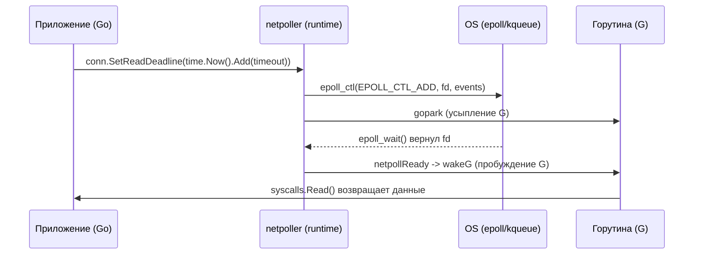
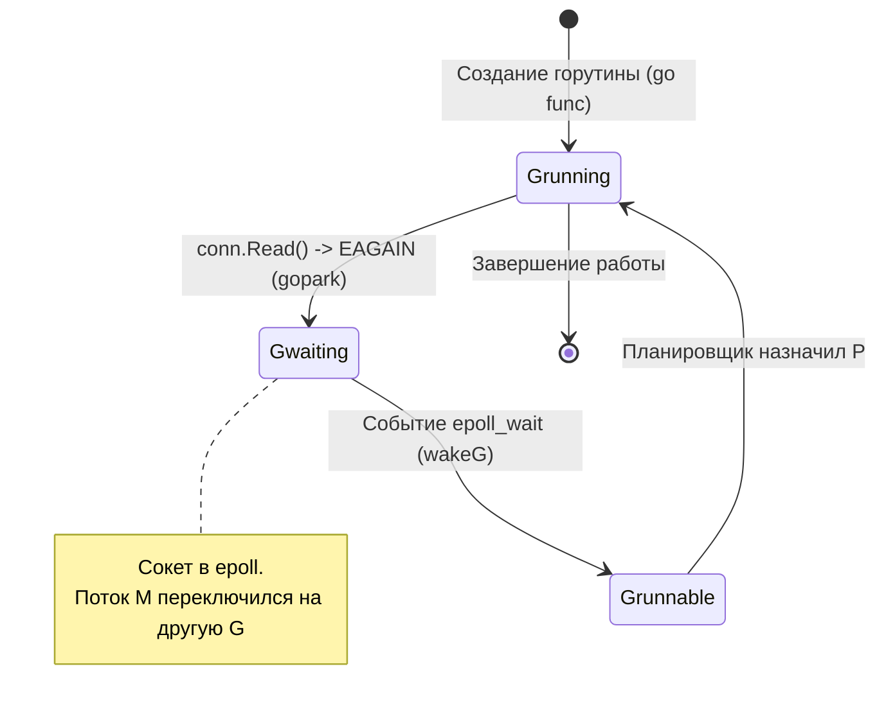

## Введение: Go как событийно-ориентированный runtime

> *"Simplicity is prerequisite for reliability."*  
> — Эдсгер Дейкстра

Одним из величайших инженерных достижений языка Go является то, как он примирил непримиримое: **предельную простоту синхронного программирования** и **предельную производительность асинхронного неблокирующего ввода-вывода**.

В традиционных серверных средах разработчики долгие годы метались между двумя крайностями:
1. **Модель «один поток на соединение» (Thread-per-Connection)**, характерная для классических серверов на Java, Python или PHP (Apache prefork). Она интуитивно понятна: вы пишете простой линейный код, вызываете блокирующий `read()` и ждете. Но системный тред Linux стоит дорого: от 2 до 8 МБ виртуальной памяти под стек, тяжелые переключения контекста ядра и жесткий предел ОС в 5–10 тысяч одновременных потоков. При попытке масштабироваться до 100 000 клиентов операционная система погибает от перегрузки планировщика.
2. **Асинхронная модель с Event Loop** (Node.js, Twisted, Nginx, C++ `epoll`). Она феноменально масштабируема, но навязывает разработчику так называемый «callback hell», инверсию управления и разрывает стек вызовов на сотни мелких асинхронных обработчиков, где невероятно трудно обрабатывать ошибки.

Go разрубил этот гордиев узел. Для прикладного разработчика сетевой код на Go выглядит так, будто он работает синхронно и блокирующе. Но под капотом рантайм использует модель **многопоточных горутин с неблокирующим I/O**. Это позволяет одному системному потоку (M) обслуживать тысячи одновременных соединений, не упираясь в лимиты ОС на процессы/потоки. Ключ к этой архитектуре — пакет `net`, пакет `net/http` и внутренний планировщик ввода-вывода (`netpoller`).

---

### Бытовая аналогия: Электронная очередь и вибропейджеры в банке

Представьте банковское отделение с 8 окнами обслуживания (логические процессоры `P` и системные потоки `M`):
- **Классическая блокирующая модель:** Клиент (запрос) подходит к окну и говорит: «Мне нужно подтверждение от нотариуса из другого города» (`conn.Read()`). Банковский клерк (тред ОС) садится на стул, складывает руки и 15 минут неподвижно смотрит в стену, ожидая курьера. На улице выстраивается очередь из сотен разгневанных людей, хотя все 8 окон формально «заняты».
- **Модель Go (`netpoller`):** Клиент подходит к клерку и сообщает о запросе. Клерк мгновенно регистрирует задачу, вручает клиенту карманный вибропейджер (`gopark`), отправляет его отдохнуть в зал ожидания (`Gwaiting`) и через микросекунду начинает обслуживать следующего посетителя. 
В банке работает автоматическая система слежения за курьерами (`epoll`). Как только курьер привозит ответ от нотариуса, пейджер клиента начинает вибрировать (`netpollReady` $\to$ `wakeG`). Клиент встает в очередь к любому освободившемуся клерку (`P`) и мгновенно забирает свой документ. В результате 8 клерков непрерывно работают на 100% мощности, успевая обслужить 100 000 клиентов.

---

## Абстракция `net` и файловые дескрипторы

Пакет `net` скрывает различия между ОС, предоставляя унифицированные интерфейсы `net.Conn`, `net.Listener`, `net.Dialer`. Под капотом все они оперируют файловыми дескрипторами (file descriptors, FD). В Unix-системах сокет — это просто FD, который можно передать в `epoll`, `kqueue` или `IOCP`.

```go
// Идиоматичное создание TCP-соединения с контекстом и таймаутами
// Таймауты здесь критичны: они предотвращают утечку горутин
// на медленных или отвалившихся соединениях.
dialer := net.Dialer{
    Timeout:   5 * time.Second,
    KeepAlive: 30 * time.Second,
    DualStack: true,
}

conn, err := dialer.DialContext(ctx, "tcp", "127.0.0.1:8080")
if err != nil {
    // Обработка ошибки...
}
defer conn.Close()
```

> [!info] Под капотом
> При создании сокета Go сразу устанавливает флаг `O_NONBLOCK` (или `FIONBIO` на Windows). Это переводит сокет в **неблокирующий режим**. Если приложение попытается вызвать `Read` или `Write` на таком FD, оно получит `EAGAIN` или `EWOULDBLOCK` вместо блокировки ядра. Именно это позволяет Go не привязывать горутину к системному потоку на время ожидания данных.

---

## `netpoller` под капотом: `epoll`, `kqueue`, `IOCP`

Сердце сетевой подсистемы Go находится в `runtime/netpoll.go`. Планировщик Go не может просто вызвать `select()` в цикле — это заблокировало бы весь процесс. Вместо этого используется механизм **Event Notification** ОС.

На Linux Go использует `epoll`, на BSD/macOS — `kqueue`, на Windows — `IOCP`. Инициализация происходит один раз при запуске программы через `runtime.netpollGenericInit` (вызывающую платформозависимый `netpollinit`).

Каждый сокет в Go оборачивается во внутреннюю структуру рантайма `pollDesc`. Она содержит дескриптор сокета `fd`, а также указатели на ожидающие горутины: `rg` (горутина, заблокированная на чтение) и `wg` (горутина, заблокированная на запись).



Когда горутина вызывает `conn.Read()`, а данных нет:
1. Go проверяет `netpoller`. Если FD уже в пуле и готов к чтению — данные берутся сразу через неблокирующий системный вызов `read()` / `recvmsg()`.
2. Если данных нет и ядро возвращает ошибку `EAGAIN` / `EWOULDBLOCK`, горутина вызывает `gopark` и переводится в состояние `Gwaiting`.
3. FD регистрируется в подсистеме ядра через `epoll_ctl` (флаг `EPOLL_CTL_ADD` с событием `EPOLLIN | EPOLLET`).
4. Текущий системный тред (M) освобождается и немедленно берет на исполнение другую исполняемую горутину из очереди процессора `P`.
5. Фоновый опрос в `epoll_wait()` обнаруживает поступление сетевого пакета. Ядро будит поток, `netpoller` извлекает `pollDesc`, определяет связанную горутину `rg` и вызывает `runtime.wakeG`.

> [!warning] Ловушка / Gotcha
> `netpoller` имеет лимит на количество отслеживаемых FD. В современных версиях Go он динамически масштабируется, но при открытии десятков тысяч соединений (например, в прокси или базе данных клиентов) стоит следить за лимитами ОС (`ulimit -n`) и использовать `http2.Transport` или кастомные пулы соединений.

---

## Планирование горутин при IO: `gopark` и `wakeG`

В Go нет прямой связи «горутина = тред ОС». Планировщик (`sched`) оперирует абстракцией GMP (Goroutine, Machine/Thread, Processor):
- **G (Goroutine):** Сверхлегковесный тред рантайма с начальным стеком всего в 2 КБ.
- **M (Machine):** Настоящий системный поток ОС Linux.
- **P (Processor):** Логический контекст исполнения, представляющий доступные ресурсы CPU (обычно равен `GOMAXPROCS`).



Когда горутина уходит в сетевой IO:
- Она сохраняет своё состояние в стеке и структуре `g`.
- Через `gopark` она снимается с текущего `P` (logical processor) и помещается в очередь ожидания `netpoll`.
- Системный поток (M) не блокируется! Он немедленно берет следующую горутину из локальной очереди очереди `runq` процессора `P` или выполняет Work Stealing у соседнего `P`.
- После пробуждения `runtime.wakeG` возвращает горутину в runqueue `P`.
- **Важно:** Пробуждение не гарантирует, что горутина сразу получит CPU. Она станет `runnable` и будет выполнена следующим доступным `P` или в момент next schedule point.

Кроме того, системный фоновый монитор **sysmon**, работающий в выделенном системном потоке без процессора `P`, периодически (каждые 20 мкс — 10 мс) вызывает неблокирующий `netpoll(0)` и проверяет, не поступили ли данные для спящих горутин, гарантируя отсутствие зависаний сетевых задач.

---

## `net/http` и `http.Transport`: пули, контексты и таймауты

Пакет `net/http` строится поверх `net`. `http.Server` принимает подключения через `net.Listener`. Каждое новое соединение оборачивается в `http.conn` и запускается в отдельной горутине:

```go
// Внутри http.Server.Serve():
for {
    rw, err := l.Accept()
    if err != nil { ... }
    c := srv.newConn(rw)
    go c.serve(connCtx) // Отдельная горутина на каждое соединение!
}
```

Критический компонент на стороне клиента — `http.Transport`. Он отвечает за:
- Переиспользование TCP-соединений (`Keep-Alive`).
- Ограничение одновременных соединений (`MaxIdleConns`, `MaxIdleConnsPerHost`).
- Кеширование соединений в пуле для предотвращения постоянных TCP Handshakes и TLS handshakes.

```go
transport := &http.Transport{
    MaxIdleConns:        100,
    MaxIdleConnsPerHost: 10,
    IdleConnTimeout:     90 * time.Second,
    // DialContext передается dialer с таймаутами
}

client := &http.Client{
    Transport: transport,
    Timeout:   10 * time.Second, // Применяется ко всему запросу
}
```

> [!tip] Собеседование
> **Вопрос:** Чем отличается `client.Timeout` от `dialer.Timeout`?
> **Ответ:** `dialer.Timeout` контролирует только установку TCP-соединения (SYN/SYN-ACK). `client.Timeout` применяется ко всему циклу: подключение + отправка запроса + ожидание ответа + чтение тела. Если сервер медленно отвечает, `client.Timeout` сработает, но соединение уже будет установлено.

---

## Mechanical Sympathy: CPU кэши, syscalls, GC

Для обеспечения предельной пропускной способности сетевой стек Go спроектирован с учетом архитектуры современного кремния:

1. **Снижение контекстных переключений:** Благодаря `epoll` и неблокирующим FD, Go избегает блокирующих системных вызовов `read/write` на каждой итерации. Один системный вызов `epoll_wait` обслуживает события тысяч соединений оптом.
2. **Кэш-локальность:** `net/http` и `net` активно используют `sync.Pool` для буферов (например, `bufio.Reader`, `http2.frame`). Это размещает часто используемые объекты в кэшах L1/L2 CPU, снижая cache misses и исключая фрагментацию страниц памяти.
3. **Escape Analysis и GC:** При чтении больших тел ответов Go старается избегать аллокаций в куче. Если буфер передается в `sync.Pool`, сборщик мусора GC не трогает его. Однако, если вы создаете `[]byte` внутри цикла обработки запросов без пула, GC (особенно в современных версиях Go с GOGC по умолчанию 100) будет чаще запускать Stop-The-World паузы. Всегда закрывайте `http.Response.Body.Close()` и используйте `io.CopyBuffer` с кастомными пулами для high-load.
4. **Syscall cost:** Каждый `epoll_ctl` и `epoll_wait` — это системный переход в ядро. В современных версиях Go рантайм минимизирует количество регистраций дескрипторов и применяет `epoll_pwait2` (в Linux 5.11+) для наносекундных таймаутов без необходимости создавать отдельные дескрипторы таймеров `timerfd`.

---

## Ловушки и вопросы на собеседованиях

- **Утечка горутин на таймаутах:** Если использовать `conn.SetDeadline()` без отмены контекстом, горутина может висеть в `epoll_wait` вечно при отмене. Всегда используйте `Dialer.Timeout` или `conn.SetReadDeadline(time.Now().Add(timeout))` в горутине с `ctx.Done()`.
- **`http.Transport` по умолчанию:** Не создавайте `http.DefaultClient` для high-load. Его `http.DefaultTransport` имеет жесткие лимиты (всего 2 Idle соединения на хост по умолчанию!) и не подходит для эффективного пулинга соединений между микросервисами. Всегда инициализируйте кастомный `Transport`.
- **HTTP/2 и Head-of-Line blocking:** В HTTP/2 Go по умолчанию включает h2. Если вы используете `http2.Transport`, помните о блокировке заголовков/тел на уровне единого TCP-соединения. В современных версиях Go рантайм поддерживает `http2.Priority` и оптимизированный фреймовый планировщик.
- **`net.Conn` vs `net.PacketConn`:** Для UDP используйте `net.PacketConn`. Пакет `net` абстрагирует это, но `epoll` для UDP работает иначе (нет концепции "соединения", только FD сокетов без состояний).

---

## Итог

Сетевая подсистема Go — это пример идеального баланса между выразительностью языка и предельной аппаратной эффективностью:
1. `netpoller` полностью берет на себя рутину низкоуровневой работы с `epoll`/`kqueue`/`IOCP`.
2. Горутины пишутся в естественном синхронном стиле, но исполняются полностью асинхронно без накладных расходов на потоки ОС.
3. Пакет `net/http` добавляет поверх промышленный пулинг TCP-соединений, управление жизненным циклом и поддержку HTTP/1.1 и HTTP/2.
4. Слаженная работа планировщика `gopark`, `runtime.wakeG` и системного монитора `sysmon` позволяет сервису на Go удерживать сотни тысяч одновременных сетевых соединений в рамках единого процесса.

Мы разобрали, как Go виртуозно управляет сетевыми соединениями на уровне рантайма. Однако в боевом продакшене даже самый оптимизированный сетевой сервис может внезапно отказать из-за фундаментальных ограничений самого протокола TCP на уровне ОС. В следующей лекции [[39. TIME_WAIT, Port Exhaustion и другие проблемы TCP-сервисов.md]] мы исследуем, почему TCP-соединения не закрываются мгновенно, как бороться с исчерпанием эфемерных портов и почему тысячи сокетов зависают в состояниях `TIME_WAIT`, `FIN_WAIT` и `CLOSE_WAIT`.