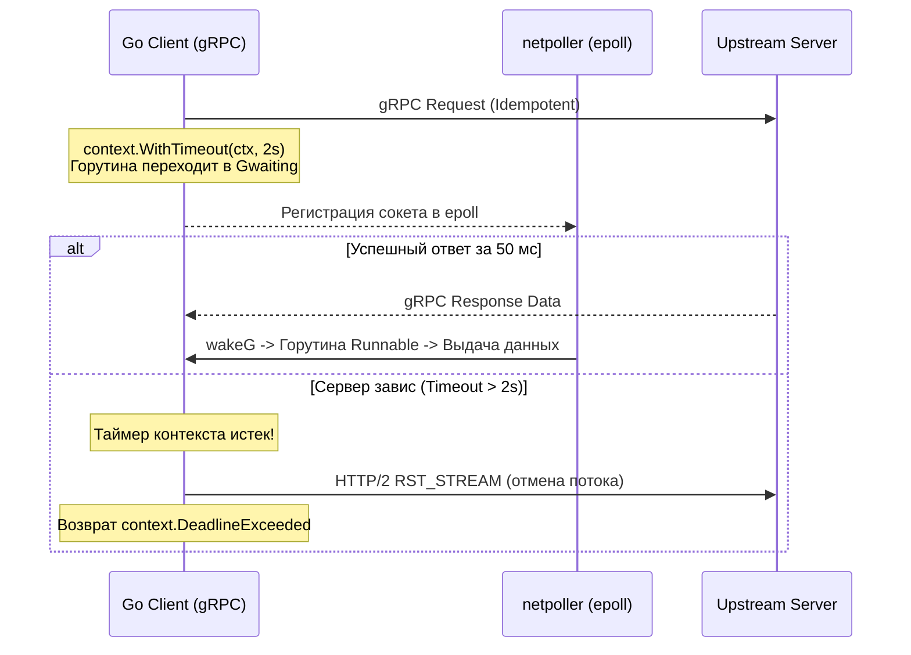
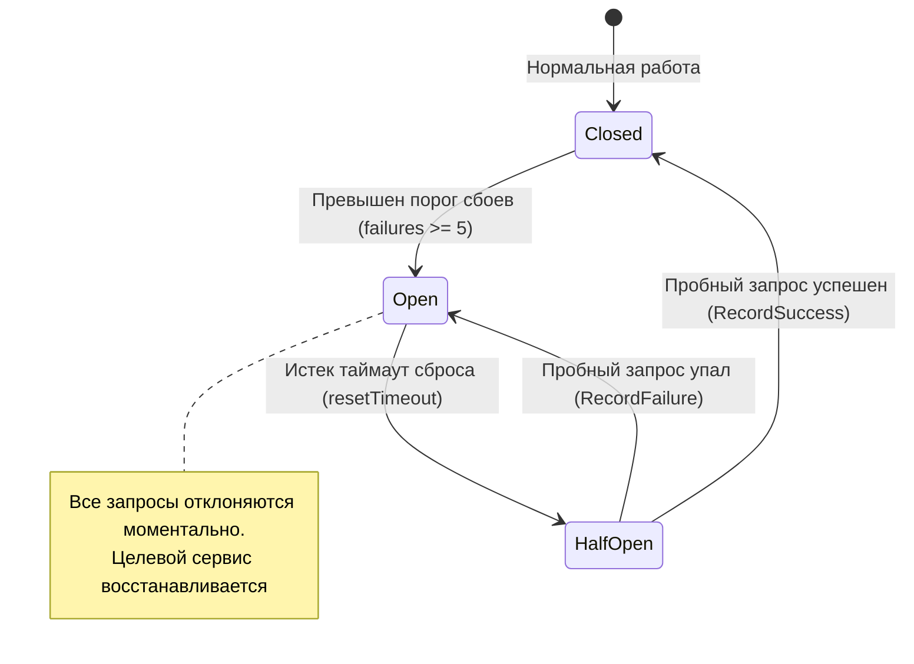

## Введение: Почему паттерны важнее фреймворков

> *«Управление сложностью — вот суть программирования».*    
> — Брайан Керниган

В мире распределенных систем сеть никогда не бывает идеальной медной трубой, по которой байты текут со скоростью света без потерь и искажений. В реальности распределенная сеть больше похожа на сельское почтовое отделение во время урагана: письма теряются в пути, курьеры застревают в грязи на неопределенный срок, посылки дублируются и доставляются с задержкой в три недели, а телефонная линия может оборваться ровно посередине важного разговора.

Любая попытка писать распределенный бэкенд в предположении, что «сеть надежна, а задержка равна нулю» (первые две ошибки из знаменитых *Fallacies of Distributed Computing*), обречена на катастрофу: каскадные отказы, штормы повторных запросов (retry storms) и зависание тысяч горутин.

В отличие от экосистем вроде Java (Spring) или .NET, где отказоустойчивость часто прячут за десятками слоев неявной магии фреймворков и аннотаций, философия Go принципиально иная: **минимализм, явность и контроль над ресурсами**. Язык предоставляет компактный набор мощных примитивов — каналы, контексты (`context.Context`), горутины и пакет `sync` — на основе которых инженер выстраивает надежные сетевые паттерны. 

Понимание того, как эти архитектурные паттерны взаимодействуют с низкоуровневым планировщиком `netpoller`, моделью исполнения G-M-P и сборщиком мусора, отличает рядового разработчика от инженера, способного строить устойчивые к сбоям промышленные системы.

---

### Бытовая аналогия: Электрические предохранители и заказ пиццы

Чтобы почувствовать физику распределенных паттернов, обратимся к двум жизненным ситуациям:
1. **Circuit Breaker (Электрический автомат в щитке):**  
   Если в вашем тостере произошло короткое замыкание, автомат в щитке мгновенно «выбивает» (состояние *Open*), разрывая электрическую цепь. Если бы автомата не было, раскаленные провода в стенах расплавились бы и сожгли весь дом (каскадное падение всех зависимых микросервисов). Спустя время вы осторожно включаете тумблер наполовину (*Half-Open*), чтобы проверить, починили ли прибор, и лишь при успехе возвращаете систему в рабочий режим (*Closed*).
2. **Idempotency Key (Купон на доставку пиццы):**  
   Вы заказываете пиццу через мобильное приложение в метро. В момент нажатия кнопки «Оплатить» поезд въезжает в тоннель, связь обрывается, и на экране выскакивает «Ошибка сети». Списались ли деньги? Начал ли повар готовить пиццу? Если вы нажмете «Повторить» пять раз, вам могут привезти пять одинаковых пицц и списать сумму пятикратно. Но если к заказу прикреплен уникальный случайный номер — ключ идемпотентности (Idempotency Key), — сервер пиццерии сразу поймет: «Этот заказ №12345 уже оплачен и находится в печи, просто возвращаю подтверждение».

---

## 1. Request-Reply и RPC (gRPC/HTTP/2)

Классический паттерн синхронного взаимодействия. В Go реализуется через `net/http` или `gRPC`. Ключевая проблема: сетевые вызовы не детерминированы по времени. Если вызываемый микросервис завис на тяжелом SQL-запросе, вызывающая горутина будет ждать вечно, если разработчик забыл выставить дедлайн.



**Идиоматичная реализация с контекстом и таймаутами:**

```go
package service

import (
	"context"
	"errors"
	"fmt"
	"time"

	"google.golang.org/grpc/codes"
	"google.golang.org/grpc/status"
)

type Item struct {
	ID   string
	Name string
}

type Service struct {
	grpcClient pb.CatalogClient
}

func (s *Service) GetItem(ctx context.Context, id string) (*Item, error) {
	// Контекст с таймаутом обязателен для сетевых вызовов.
	// Предотвращает утечку горутин и зависание в netpoller.
	ctx, cancel := context.WithTimeout(ctx, 2*time.Second)
	defer cancel()

	req := &pb.GetItemRequest{Id: id}
	resp, err := s.grpcClient.GetItem(ctx, req)
	if err != nil {
		// grpc errors.IsNotFound(err) или status.Code(err) == codes.NotFound
		if errors.Is(err, context.DeadlineExceeded) {
			return nil, fmt.Errorf("timeout: %w", err)
		}
		if status.Code(err) == codes.NotFound {
			return nil, fmt.Errorf("item not found: %w", err)
		}
		return nil, fmt.Errorf("rpc failed: %w", err)
	}
	return resp.Data, nil
}
```

> [!info] Под капотом
> Когда горутина вызывает `grpcClient.GetItem`, она блокируется на чтении/записи в TCP-сокет. Блокировка **не** останавливает системный тред (M). `netpoller` (под капотом `epoll` в Linux или `kqueue` в BSD/macOS) регистриует дескриптор сокета. Горутина переходит в состояние `Gwaiting`, а тред M возвращается в пул или переключается на другую горутину. Когда данные приходят, `netpoll` будит горутину через `runtime.wakeG`. Это обеспечивает обработку сотен тысяч соединений на одном трде без context switch от ядра ОС.

> [!warning] Ловушка / Gotcha
> `gRPC` по умолчанию **не имеет встроенного механизма retry**. При сетевом сбое вызов падает. Для production необходимо использовать `grpc-go/retry` middleware или реализовывать кастомный backoff. Также помните, что `context.WithTimeout` не прерывает TCP-соединение мгновенно. Он отменяет чтение/запись, но сокет остаётся в стеке ОС до `TCP_CLOSE`.

---

## 2. Pub/Sub и Event Streaming

Паттерн асинхронного взаимодействия с полным разрывом временной связности (Temporal Decoupling). В Go часто реализуется через `nats.go`, `sarama` (Kafka) или `redis.Streams`. Главная инженерная задача: обработка противодавления (backpressure) и корректное завершение работы (graceful shutdown).

**Шаблон потребителя с `errgroup` и контекстом:**

```go
package messaging

import (
	"context"
	"fmt"
	"log"
	"time"

	"github.com/nats-io/nats.go"
)

func RunConsumer(ctx context.Context, conn *nats.Conn) error {
	sub, err := conn.Subscribe("orders.created", func(msg *nats.Msg) {
		// Обработка в отдельной горутине или пуле
		go func() {
			ctx, cancel := context.WithTimeout(context.Background(), 5*time.Second)
			defer cancel()
			if err := processOrder(ctx, msg.Data); err != nil {
				log.Printf("processing failed: %v", err)
			}
		}()
	})
	if err != nil {
		return fmt.Errorf("subscribe failed: %w", err)
	}
	defer sub.Unsubscribe()

	// Блокируем текущую горутину, пока не придет сигнал отмены
	<-ctx.Done()
	return ctx.Err()
}

func processOrder(ctx context.Context, data []byte) error {
	// Имитация бизнес-логики обработки заказа
	return nil
}
```

> [!tip] Собеседование
> **Вопрос:** Как в Go реализовать flow control для Pub/Sub потребителя, чтобы не перегрузить CPU?
> **Ответ:** Использовать буферизованные каналы с ограниченным размером (`make(chan msg, 100)`) и блокирующий `for`-цикл чтения. Если канал заполнен, `sub.SetPendingLimits` или кастомный backoff на стороне брокера предотвратят падение. В Go 1.21+ также можно использовать `sync.Pool` для переиспользования десериализованных структур, чтобы снизить нагрузку на GC.

---

## 3. Retry, Backoff и Circuit Breaker

Без этих паттернов любая распределённая система рухнет при первом же частичном сбое. В Go они строятся на `time.Ticker`, `time.AfterFunc` и атомарных состояниях. Если упавший сервис баз данных попытается подняться, а тысячи клиентов начнут синхронно слать повторные запросы, они мгновенно уронят его повторно — это классическая проблема **Thundering Herd** (стадный эффект).

Для защиты применяются три ключевые механики:
1. **Exponential Backoff с Jitter (Случайной задержкой):** Интервал между повторными попытками удваивается с добавлением случайного шума, чтобы размазать пик нагрузки во времени:
   $$\text{Interval} = \text{random}(0, \min(\text{MaxWait}, \text{Base} \times 2^{\text{attempt}}))$$
2. **Circuit Breaker (Конечный автомат размыкания цепи):**



**Имплементация Circuit Breaker с защитой от сбоев:**

```go
package resilience

import (
	"sync"
	"time"
)

type CircuitBreaker struct {
	mu           sync.Mutex
	state        int // 0: Closed, 1: Open, 2: Half-Open
	failures     int
	lastFailTime time.Time
	resetTimeout time.Duration
}

func NewCircuitBreaker(timeout time.Duration) *CircuitBreaker {
	return &CircuitBreaker{
		resetTimeout: timeout,
	}
}

func (cb *CircuitBreaker) Allow() bool {
	cb.mu.Lock()
	defer cb.mu.Unlock()

	switch cb.state {
	case 0: // Closed
		return true
	case 1: // Open
		if time.Since(cb.lastFailTime) > cb.resetTimeout {
			cb.state = 2 // Half-Open
			return true
		}
		return false
	case 2: // Half-Open
		return true // Разрешаем один запрос для проверки
	}
	return false
}

func (cb *CircuitBreaker) RecordSuccess() {
	cb.mu.Lock()
	defer cb.mu.Unlock()
	cb.state = 0
	cb.failures = 0
}

func (cb *CircuitBreaker) RecordFailure() {
	cb.mu.Lock()
	defer cb.mu.Unlock()
	cb.failures++
	cb.lastFailTime = time.Now()
	if cb.failures >= 5 {
		cb.state = 1 // Open
	}
}
```

> [!info] Под капотом
> Использование `sync.Mutex` в hot-path Circuit Breaker может вызывать contention. Для high-load систем заменяют на `atomic.Int32` или `atomic.Value`. Также `time.Since` и `time.Now` работают через syscall `clock_gettime` (или fast path в ядре), что крайне дешево, но в циклах retry нужно избегать allocations.

> [!warning] Ловушка / Gotcha
> **Thundering Herd Problem:** Если все инстансы сервиса одновременно перезапускаются после сбоя, они шлют пик нагрузки на восстановленный сервис. Решение: **Jitter** (случайная задержка) в backoff и **Saturation Backoff** (уменьшение скорости retry при росте utilization целевого сервиса).

---

## 4. CQRS и Event Sourcing (Сетевой аспект)

CQRS (Command Query Responsibility Segregation) разделяет операции модификации данных (commands) и операции чтения (queries). Event Sourcing сохраняет состояние объекта как неизменяемый поток исторических событий. 

В сетевом взаимодействии это порождает две главные проблемы:
1. **Eventual Consistency (Согласованность в конечном счете):** После отправки команды чтение может вернуть старое состояние, пока событие не пройдет через брокер.
2. **Idempotency (Идемпотентность):** Из-за сетевых таймаутов клиент может повторить команду несколько раз. Сервер обязан гарантировать, что повторный запрос не приведет к дублированию действий.

**Idempotency Key на стороне клиента:**

```go
package client

import (
	"context"
	"fmt"
	"time"

	"github.com/google/uuid"
)

type OrderReq struct {
	ItemID string
	Amount int
}

func (s *Service) CreateOrder(ctx context.Context, req *OrderReq) error {
	idempKey := uuid.New().String()
	ctx, cancel := context.WithTimeout(ctx, 3*time.Second)
	defer cancel()

	// Отправка с заголовком idempotency-key
	resp, err := s.grpcClient.CreateOrder(ctx, &pb.CreateOrderRequest{
		Order:          req,
		IdempotencyKey: idempKey,
	})
	if err != nil {
		return fmt.Errorf("create order failed: %w", err)
	}
	_ = resp
	return nil
}
```

На стороне сервера `idempotency-key` сохраняется в быстром хранилище (Redis или базе данных) с настроенным временем жизни TTL. Если поступает запрос с уже зарегистрированным ключом, сервер возвращает сохраненный результат из кэша, не проводя повторную оплату или создание сущности.

---

## Go Runtime и Mechanical Sympathy в сетевых паттернах

1. **`netpoller` и Goroutines:** Горутина не привязана к системному треду навсегда. При сетевой блокировке тред освобождается. Это позволяет Go сервису держать 100k+ соединений при минимальном потреблении RAM (стеки горутин растут динамически, начиная с 2 КБ).
2. **Escape Analysis:** В сетевом коде критично избегать аллокаций в куче. Используйте `[]byte` pools через `sync.Pool`, передавайте буферы через `io.ReadCloser`, избегайте `string()` конверсий в hot-path. Лишние аллокации = частый Minor GC = паузы `pacing`.
3. **TCP Keep-Alive vs Application Heartbeat:** `net.Conn.SetKeepAlive(true)` отправляет TCP-пакеты каждые 72000 сек (по умолчанию в Linux, настраивается через `sysctl net.ipv4.tcp_keepalive_time`). Для микросервисов этого мало. Реализуйте application-level heartbeat через `time.Ticker` и `conn.Write`, иначе NAT-роутеры или cloud LB закроют "мёртвое" соединение.
4. **`SO_REUSEADDR` и `SO_REUSEPORT`:** При graceful shutdown TCP-соединения могут оставаться в `TIME_WAIT` (~60 сек). Если вы перезапускаете сервис на том же порту, получите `address already in use`. Решение: `net.ListenConfig{Control: func(network, address string, c syscall.RawConn) error { return c.Control(func(fd uintptr) { syscall.SetsockoptInt(int(fd), syscall.SOL_SOCKET, syscall.SO_REUSEADDR, 1) }) }`

---

## Ловушки, Gotchas и вопросы с собеседований

> [!tip] Собеседование
> **Вопрос:** Как Go обрабатывает асинхронный I/O без `async/await` или `Promise`?
> **Ответ:** Через комбинацию `netpoller` и планировщика G-M-P. Горутина блокируется на `epoll_wait`, переходит в `Gwaiting`, тред M возвращается в пул. При готовности сокета `netpoll` ставит горутину в run queue. Это работает на уровне ядра и рантайма, обеспечивая O(1) масштабирование по количеству соединений.

> [!warning] Ловушка / Gotcha
> **Port Exhaustion:** В высоконагруженных сервисах (например, outbound proxy) сервер может исчерпать локальные порты, так как каждое TCP-соединение занимает уникальный `src_ip:src_port`. Решение: `SO_REUSEPORT`, увеличение `net.ipv4.ip_local_port_range`, или использование connection pooling с `http2.Transport`.

> [!tip] Собеседование
> **Вопрос:** Channel vs `sync.Mutex` для контроля конкурентности в сетевых хендлерах?
> **Ответ:** Каналы лучше для flow control и передачи данных (pub/sub, очередь задач). Мьютексы лучше для защиты общих структур состояния (счётчики, кэши, circuit breaker state). В Go канальная аллокация и блокировка на канале дороже, чем CAS на мьютексе в hot-path. Используйте `sync.Mutex` или `atomic` для метрик и состояний, каналы — для оркестрации.

---

## Итог

Сетевые паттерны в Go — это не просто абстрактные диаграммы из учебников. Это управление жизненным циклом горутин, контроль аллокаций памяти, глубокая интеграция с `netpoller` и ясное понимание того, как протоколы TCP и HTTP взаимодействуют с ядром Linux. Идиоматичный код на Go в распределенных системах всегда предельно явен: в нем нет места магии, а есть строгие таймауты, распространение контекстов, экспоненциальный retry со случайным джиттером, идемпотентные обработчики и бережное отношение к ресурсам машины.

Мы завершили детальный разбор ключевых программных паттернов распределенных систем. В заключительной лекции нашего модуля мы соберем воедино всю величественную мозаику сетевого стека — от кремния сетевой карты и очередей Linux до рантайма Go и облачных сетей: [[44. Итоги раздела. Полная картина сетевого стека для Go-разработчика]].