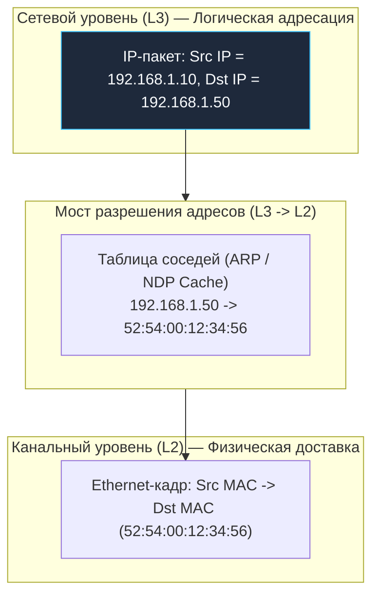
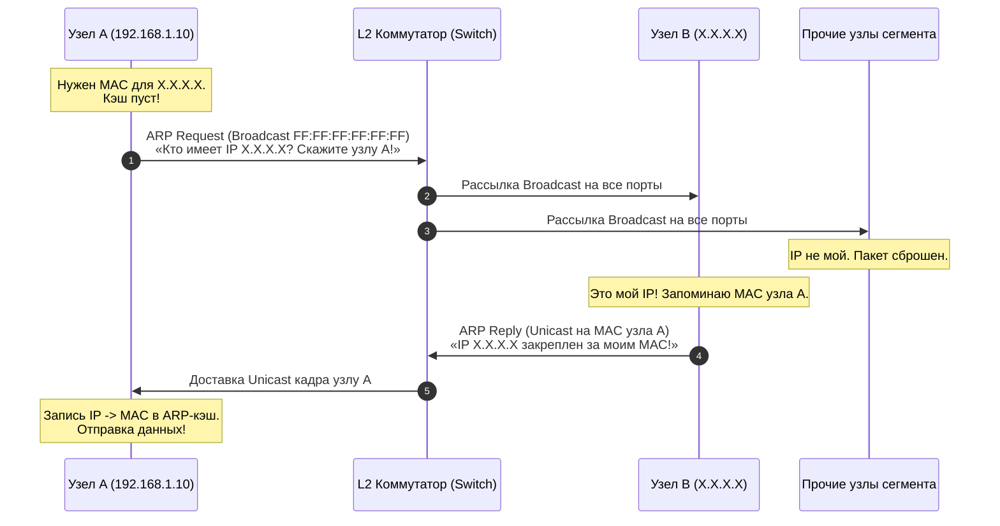
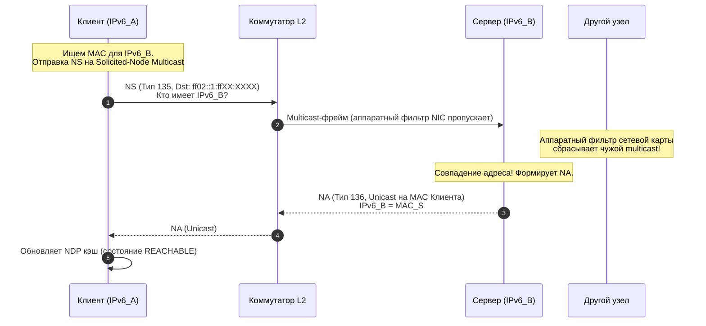
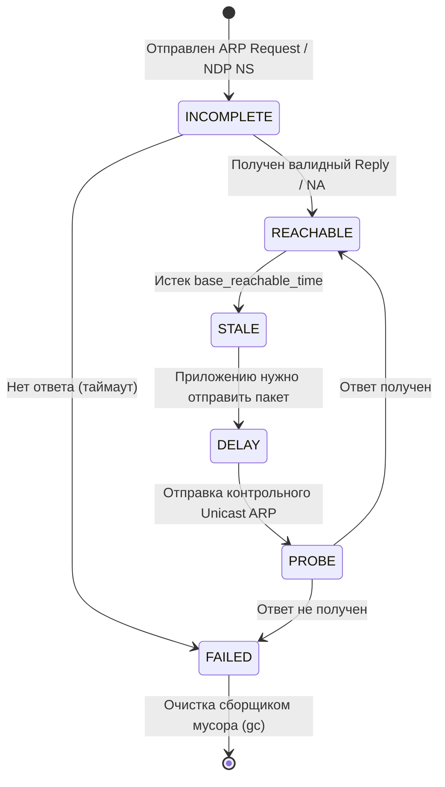

# ARP, Neighbor Discovery и поиск узла в локальной сети

> *«Цель вычислений — понимание, а не числа».*    
> — Ричард Хэмминг

Представьте, что вы находитесь в просторном опенспейсе технологической компании. У каждого инженера есть уникальный номер рабочего контракта и логический почтовый адрес — скажем, отдел биллинга, стол №42. Это логический адрес сетевого уровня (IP-адрес): он строго упорядочен, отражает иерархию организации и позволяет любому посетителю понять, в какую комнату нужно направить пакет документов. 

Но когда курьер входит в конкретный зал, абстрактные номера комнат теряют смысл. Чтобы передать конверт лично в руки, курьеру нужно подойти к живому человеку из плоти и крови — обладателю конкретного физического лица или бейджа с микрочипом. В компьютерных сетях этим неизменным аппаратным паспортом выступает 48-битный физический MAC-адрес сетевой карты.

Когда ваше приложение на Go вызывает функцию `net.Dial("tcp", "192.168.1.50:80")` или системный инструмент выполняет запрос `curl http://192.168.1.50/api/health`, операционная система формирует сегмент TCP, заворачивает его в сетевой пакет IP, а затем обязана упаковать в кадр Ethernet канального уровня (L2). Однако коммутаторы (Ethernet-свитчи) локальной сети работают исключительно с MAC-адресами: они понятия не имеют, что такое IP-адреса, порты и маршруты.

Возникает фундаментальный разрыв между логическим миром IP (L3) и физическим миром проводов и коммутаторов (L2). Мостом над этой пропастью служат протоколы разрешения адресов: почтенный ветеран **ARP (Address Resolution Protocol)** в мире IPv4 и элегантный, продуманный протокол **NDP (Neighbor Discovery Protocol)** в мире IPv6. В этой лекции мы разберем их анатомию, заглянем в таблицы соседей ядра Linux и посмотрим, как сетевой стек Go опирается на эти невидимые шестеренки.

---

## 1. Зачем нам ARP и NDP? Слой 2 и проблема адресации

Сетевая модель с разделением ответственности уровней OSI / TCP/IP прекрасна своей модульностью, но на границе между сетевым (L3) и канальным (L2) уровнями возникает инженерная дилемма. 

Сетевой уровень оперирует глобальной маршрутизацией: IP-адрес указывает, в какой географической или логической сети находится узел. Но на физическом проводе или в радиоэфире Wi-Fi пакеты перемещаются между сетевыми интерфейсами (NIC), каждый из которых слушает исключительно свой собственный аппаратный MAC-адрес. 



Если узел `A` хочет отправить данные узлу `B` внутри одной локальной сети, ядро Linux смотрит на IP назначения (`192.168.1.50`) и задается простым вопросом: *«В какой именно Ethernet-кадр мне завернуть этот пакет? Какой `Dst MAC` указать в заголовке?»*. 

Если MAC-адрес назначения неизвестен, сетевая карта не сможет сформировать корректный Ethernet-кадр. Коммутатор не поймет, в какой физический порт направить данные, и сетевое взаимодействие остановится. 

Протоколы разрешения адресов решают именно эту задачу: динамически сопоставлять логический IP-адрес узла с его физическим MAC-адресом в пределах одного широковещательного сегмента сети.

---

## 2. ARP (Address Resolution Protocol): Механизм IPv4

Протокол **ARP** был специфицирован еще в далеком 1982 году в RFC 826. Это один из самых простых и прямолинейных сетевых протоколов, работающий прямо поверх канального уровня без использования IP-заголовков. 

ARP выполняет динамическое сопоставление `IP -> MAC` в пределах одного широковещательного домена (broadcast domain).

### Как работает ARP (пошагово)

Рассмотрим классический сценарий: узел `A` хочет отправить пакет узлу `B` с IP-адресом `X.X.X.X`.



1. **Проверка локального кэша:** Прежде чем посылать сигналы в сеть, ядро узла `A` обращается к своей системной таблице соседей. Если соответствие `IP -> MAC` уже найдено и запись актуальна, кадр формируется мгновенно.
2. **Формирование ARP-запроса (Request):** Если записи в кэше нет, узел `A` создает специальный ARP-пакет и упаковывает его в широковещательный Ethernet-кадр:
   - `Dst MAC`: `FF:FF:FF:FF:FF:FF` (Broadcast — слушают абсолютно все сетевые карты в сегменте).
   - `EtherType`: `0x0806` (код протокола ARP в заголовке Ethernet).
   - `Sender MAC/IPv4`: `A` (физический и логический адреса отправителя).
   - `Target MAC/IPv4`: `00:00:00:00:00:00 / X.X.X.X` (искомый адрес, целевой MAC пока заполнен нулями).
3. **Обработка коммутатором:** Коммутатор L2 получает широковещательный кадр и лавинно рассылает (флудит) его во все активные порты, кроме порта отправителя.
4. **Обработка узлами:** Все компьютеры локальной сети получают кадр и передают его сетевому стеку ОС. Узлы, чей IP не совпадает с `X.X.X.X`, молча отбрасывают запрос.
5. **Формирование ответа (Reply):** Узел `B`, опознавший свой собственный IP `X.X.X.X`, обновляет свой ARP-кэш записью об узле `A` (раз уж узел `A` прислал свои координаты), формирует адресный ответ (Unicast) и отправляет его обратно узлу `A`.
6. **Запись в кэш:** Узел `A` принимает ответ, сохраняет пару `IP -> MAC` в памяти ядра и незамедлительно отправляет скопившиеся в очереди данные.

> [!info] Под капотом
> ARP-кадр инкапсулируется прямо в Ethernet-фрейм без заголовка IP. Это делает ARP протоколом, не зависящим от IP, хотя исторически он привязан именно к IPv4.  
> 
> Внутренняя структура ARP-пакета строго регламентирована:
> * `Hardware Type` (2 байта, для Ethernet равен `1`);
> * `Protocol Type` (2 байта, для IPv4 равен `0x0800`);
> * `Hardware Size` (1 байт, длина MAC-адреса = `6`);
> * `Protocol Size` (1 байт, длина IPv4-адреса = `4`);
> * `Opcode` (2 байта, `1` для ARP Request, `2` для ARP Reply);
> * Поля адресов: `Sender MAC`, `Sender IP`, `Target MAC`, `Target IP`.

В текстовом представлении раскладка ARP-пакета выглядит исключительно компактно:

```
 0                   1                   2                   3
 0 1 2 3 4 5 6 7 8 9 0 1 2 3 4 5 6 7 8 9 0 1 2 3 4 5 6 7 8 9 0 1
+-+-+-+-+-+-+-+-+-+-+-+-+-+-+-+-+-+-+-+-+-+-+-+-+-+-+-+-+-+-+-+-+
|       Hardware Type (1)       |      Protocol Type (0x0800)   |
+-+-+-+-+-+-+-+-+-+-+-+-+-+-+-+-+-+-+-+-+-+-+-+-+-+-+-+-+-+-+-+-+
|  Hw Size (6)  | Proto Size (4)|          Opcode (1 or 2)      |
+-+-+-+-+-+-+-+-+-+-+-+-+-+-+-+-+-+-+-+-+-+-+-+-+-+-+-+-+-+-+-+-+
|                          Sender MAC                           |
|                          (6 байт)                             |
+-+-+-+-+-+-+-+-+-+-+-+-+-+-+-+-+-+-+-+-+-+-+-+-+-+-+-+-+-+-+-+-+
|                          Sender IP (4 байта)                  |
+-+-+-+-+-+-+-+-+-+-+-+-+-+-+-+-+-+-+-+-+-+-+-+-+-+-+-+-+-+-+-+-+
|                          Target MAC                           |
|                          (6 байт)                             |
+-+-+-+-+-+-+-+-+-+-+-+-+-+-+-+-+-+-+-+-+-+-+-+-+-+-+-+-+-+-+-+-+
|                          Target IP (4 байта)                  |
+-+-+-+-+-+-+-+-+-+-+-+-+-+-+-+-+-+-+-+-+-+-+-+-+-+-+-+-+-+-+-+-+
```

---

## 3. NDP (Neighbor Discovery Protocol): Эволюция в IPv6

Когда архитекторы IETF создавали протокол IPv6, они твердо решили исправить родовые травмы IPv4. Главным пороком ARP была его неизбирательность: широковещательные рассылки (Broadcast) заставляют *каждый* компьютер в сети прерывать работу процессора, считывать пакет из буфера сетевой карты и анализировать его в ядре, даже если пакет предназначен совершенно другому серверу. В огромных дата-центрах широковещательный шторм ARP мог парализовать работу тысяч серверов.

В IPv6 протокол ARP был упразднен. На смену ему пришел **NDP (Neighbor Discovery Protocol)**, описанный в RFC 4861. Вместо отдельного обособленного сетевого протокола NDP построен на базе служебных сообщений **ICMPv6**.

### Ключевые отличия NDP от ARP

1. **Отказ от Broadcast в пользу Multicast:** Сообщения NDP никогда не рассылаются на адрес «всем-всем-всем». Запросы отправляются на специализированный групповой адрес — **Solicited-Node Multicast Address**. Этот адрес формируется по шаблону `ff02::1:ffXX:XXXX`, где префикс `ff02::1:ff` дополняется младшими 24 битами целевого IPv6-адреса. Сетевые адаптеры фильтруют такие кадры на аппаратном уровне, поэтому чужие процессоры даже не просыпаются!
2. **Типы сообщений:** 
   - `Neighbor Solicitation` (NS, тип 135) — запрос физического адреса соседа («Кто имеет IPv6 адрес B?»).
   - `Neighbor Advertisement` (NA, тип 136) — ответ на запрос («IPv6 адрес B закреплен за моим MAC-адресом»).
   - `Router Solicitation` (RS, тип 133) и `Router Advertisement` (RA, тип 134) — автоматическое обнаружение маршрутизаторов и префиксов подсетей (SLAAC).
3. **Атомарность и многофункциональность:** Помимо поиска MAC-адреса, NDP берет на себя проверку уникальности IP при включении интерфейса — механизм **`Duplicate Address Detection, DAD`** (обнаружение дубликатов IP), а также обнаружение недоступности узлов (NUD) и перенаправление маршрутов (ICMPv6 Redirect).
4. **Безопасность:** Протокол расширяется стандартом **`SEND (Secure Neighbor Discovery)`** (RFC 3971) с криптографически генерируемыми адресами (CGA) и цифровыми подписями, исключающими подмену адресов (хотя в реальных корпоративных средах чаще применяют изоляцию на коммутаторах).



---

## 4. Как это работает в ядре Linux и Go

Когда программист на Go пишет высоконагруженный бэкенд, среда исполнения Go (Go runtime) не занимается ручной сборкой кадров ARP или NDP. Язык Go следует классическому принципу Unix: прикладной код работает с абстракциями сокетов, а всю механику L2/L3 прозрачно выполняет ядро операционной системы.

### Внутренности ядра Linux

В ядре Linux вся информация о соседях по локальной сети сосредоточена в универсальной модульной подсистеме ядра **`neighbour`**. Для протокола IPv4 она использует таблицы `arp_tables`, а для протокола IPv6 — модуль `ndisc` (Neighbor Discovery).

Каждая запись о соседе в памяти ядра проходит через строгий конечный автомат состояний (Neighbor Unreachability Detection, NUD):



1. **INCOMPLETE:** Ядро отправило широковещательный запрос и ожидает ответа. Исходящие пакеты приложения буферизуются в специальной очереди.
2. **REACHABLE:** Подтвержденное рабочее состояние. Кадры уходят на известный MAC без задержек.
3. **STALE:** Прошло время `base_reachable_time`. Запись считается устаревшей («засохшей»), но трафик пока отправляется по старому MAC.
4. **DELAY / PROBE:** Если запись в состоянии STALE используется для отправки трафика, ядро отправляет прямой точечный Unicast-запрос для подтверждения актуальности.

Управлять поведением подсистемы `neighbour` системный инженер может через виртуальную файловую систему `/proc`:
* `/proc/sys/net/ipv4/neigh/` и `/proc/sys/net/ipv4/neigh/<iface>/` — параметры IPv4-соседей для каждого интерфейса;
* `/proc/sys/net/ipv6/neigh/<iface>/` — аналогичные настройки для стека IPv6;
* `base_reachable_time_ms` и `base_reachable_time` — базовое время жизни записи в состоянии REACHABLE (по умолчанию около 30 секунд со случайным разбросом для предотвращения синхронных всплесков запросов);
* `gc_stale_time` — периодичность проверки и очистки устаревших записей фоновым сборщиком мусора;
* `proxy_arp` — флаг включения прокси-ARP (ядро будет отвечать на ARP-запросы за другие подсети, выступая невидимым маршрутизатором).

Для взаимодействия с таблицей соседей системные вызовы исторически использовали устаревший `ioctl(SIOCGARP)` или функцию `getifaddrs()`. В современном Linux золотым стандартом является протокол **`rtnetlink`** (семейство сокетов `AF_NETLINK` с сообщениями `RTM_GETNEIGH` / `RTM_NEWNEIGH`). Пакеты расширений Go `golang.org/x/net/ipv4`, `ipv6` и низкоуровневый `golang.org/x/sys/unix` предоставляют идиоматичные типизированные интерфейсы к этим структурам ядра.

### Go и сетевое разрешение

Что происходит в недрах сетевого стека, когда ваша программа на Go выполняет коннект к удаленному хосту?

```mermaid
flowchart TD
    classDef process  fill:#1e293b,stroke:#38bdf8,stroke-width:1px,color:#f8fafc
    classDef success  fill:#064e3b,stroke:#34d399,stroke-width:1px,color:#f8fafc
    classDef error    fill:#7f1d1d,stroke:#f87171,stroke-width:1px,color:#f8fafc
    classDef warning  fill:#78350f,stroke:#fbbf24,stroke-width:1px,color:#f8fafc
    classDef entry    fill:#1e3a5f,stroke:#38bdf8,stroke-width:2px,color:#f8fafc
    classDef aux      fill:#334155,stroke:#64748b,stroke-width:1px,color:#f8fafc
    classDef system   fill:#312e81,stroke:#a78bfa,stroke-width:1px,color:#f8fafc
    classDef data     fill:#132d29,stroke:#2dd4bf,stroke-width:1px,color:#f8fafc
    classDef network  fill:#881337,stroke:#fb7185,stroke-width:1px,color:#f8fafc
    classDef accent   fill:#1e1b4b,stroke:#818cf8,stroke-width:1px,color:#f8fafc
    GoApp["Go Приложение: net.Dial('tcp', '192.168.1.50:80'):::network"] --> Netpoller["Рантайм Go (netpoller): connect(fd, sockaddr)"]
    Netpoller --> RouteLookup["Ядро Linux: Поиск в таблице маршрутизации FIB"]
    
    RouteLookup --> CheckSubnet{"Целевой IP в локальной подсети?"}
    
    CheckSubnet -->|Да| NeighLookup["Поиск MAC целевого IP в neighbour cache"]
    CheckSubnet -->|Нет (удаленный хост)| GWLookup["Поиск IP и MAC шлюза по умолчанию (Default Gateway)"]
    
    NeighLookup --> Found{"MAC найден в кэше?"}
    GWLookup --> Found
    
    Found -->|Да (REACHABLE)| SendEth["Формирование Ethernet-кадра и передача в NIC"]
    Found -->|Нет (Кэш пуст)| TriggerARP["Ядро переводит сокет в ожидание и шлет ARP Request / NDP NS"]
    
    TriggerARP --> ArpWait["Получен ARP Reply -> Обновление кэша -> Завершение connect()"]
```

1. Среда исполнения Go проверяет адрес и создает неблокирующий файловый дескриптор сокета через `socket(AF_INET, SOCK_STREAM, ...)`.
2. Системный вызов `connect()` передается ядру Linux.
3. Подсистема маршрутизации FIB проверяет системную таблицу маршрутов ([[6. Маршрутизация. Таблица маршрутов, шлюзы и default route.md]]).
4. Если целевой хост находится в той же физической подсети, ядро ищет его MAC в `neighbour`. Если хост находится в другой сети, ядро ищет MAC-адрес **шлюза по умолчанию (Default Gateway)**.
5. Если MAC отсутствует, ядро переводит процесс/горутину в ожидание и инициирует процедуру ARP/NDP. Как только ответ получен, ядро собирает кадр Ethernet, передает сетевой карте и возвращает Go дескриптор с установленным сетевым соединением `syscall.Conn`.

Следующий пример на Go демонстрирует исследование локальных сетевых интерфейсов, их аппаратных MAC-адресов и параметров L2/L3:

```go
package main

import (
	"fmt"
	"log"
	"net"
	"time"
)

// Демонстрация взаимодействия Go с сетевыми интерфейсами и L2/L3 стеком
func main() {
	// 1. Получаем список физических и виртуальных сетевых интерфейсов ОС
	ifaces, err := net.Interfaces()
	if err != nil {
		log.Fatalf("Ошибка получения списка сетевых интерфейсов: %v", err)
	}

	fmt.Println("=== Сетевые интерфейсы хоста и аппаратные адреса L2 ===")
	for _, iface := range ifaces {
		// Извлекаем назначенные IP-адреса (L3) для интерфейса
		addrs, err := iface.Addrs()
		if err != nil {
			log.Printf("Не удалось получить адреса для %s: %v", iface.Name, err)
			continue
		}

		fmt.Printf("Интерфейс: %-8s | MTU: %-5d | MAC (L2): %-17s | Флаги: %v\n",
			iface.Name, iface.MTU, iface.HardwareAddr, iface.Flags)

		for _, addr := range addrs {
			fmt.Printf("   -> Назначенный L3 адрес: %s\n", addr.String())
		}
	}

	// 2. Имитация сетевого подключения
	// При первом вызове net.DialTimeout ядро прозрачно инициирует ARP/NDP разрешение
	fmt.Println("\n=== Инициация сетевого подключения через сокет L3/L4 ===")
	target := "192.168.1.1:80" // Адрес локального шлюза или тестового сервера
	
	start := time.Now()
	conn, err := net.DialTimeout("tcp", target, 2*time.Second)
	duration := time.Since(start)

	if err != nil {
		log.Printf("Не удалось установить TCP-соединение с %s (возможно, узел отключен или не отвечает на ARP): %v (время: %v)", 
			target, err, duration)
	} else {
		defer conn.Close()
		fmt.Printf("Успешное соединение с %s! Разрешение L2/L3 выполнено ядром за %v.\n", target, duration)
		fmt.Printf("Локальный адрес сокета: %s | Удаленный адрес: %s\n", 
			conn.LocalAddr(), conn.RemoteAddr())
	}
}
```

---

## 5. Ловушки безопасности и производительности

Понимание механики разрешения адресов критично для любого системного инженера, сопровождающего сервисы под нагрузкой. Историческая простота ARP делает его уязвимым для изощренных сетевых атак, а динамическая природа таблиц соседей может преподносить неприятные сюрпризы в облачных средах.

> [!warning] Ловушка / Gotcha: Атаки ARP Spoofing и Poisoning
> Протокол ARP проектировался в эпоху безграничного доверия. Узлы принимают ARP-ответы (ARP Reply) без всякой предварительной аутентификации, даже если они никогда не отправляли соответствующего запроса!  
> 
> Злоумышленник в том же сетевом сегменте может запустить утилиту вроде `arpspoof` и непрерывно отправлять ложные пакеты ARP Reply на целевой сервер и на маршрутизатор:  
> *«Шлюз 192.168.1.1 теперь находится на моем MAC-адресе!»*  
> *«Сервер 192.168.1.50 теперь находится на моем MAC-адресе!»*  
> 
> Ядро жертвы перезаписывает ARP-таблицу, и весь трафик начинает течь через машину злоумышленника. Возникает классическая атака **Man-in-the-Middle (MITM)**, позволяющая перехватывать незашифрованные данные или внедрять вредоносный код.  
> 
> **Методы защиты:**
> 1. **Аппаратные средства:** Включение функций **Dynamic ARP Inspection (DAI)** и IP Source Guard на управляемых коммутаторах L2, блокирующих неавторизованные ARP-пакеты.
> 2. **В IPv6:** Использование политик **NDP Guard** на свитчах, защищающих от поддельных сообщений Router Advertisement.
> 3. **В прикладном коде Go:** Никогда не полагайтесь на безопасность локального сегмента сети. Весь внутренний трафик между микросервисами должен шифроваться с помощью **mTLS (Mutual TLS)** с обязательной взаимной валидацией сертификатов.

> [!warning] Ловушка / Gotcha: Широковещательные штормы и переполнение кэша соседей
> Если ваше приложение работает в крупном кластере **Kubernetes**, где ежеминутно создаются и уничтожаются сотни контейнеров (явление **pod churn**), ядро базовой ноды вынуждено непрерывно рассылать ARP/NDP-запросы для каждого нового эфемерного IP-адреса.  
> 
> Это может привести к двум тяжелым последствиям:
> 1. **Широковещательный шторм (Broadcast Storm):** Сеть заполняется миллионами broadcast-кадров, парализуя работу коммутаторов и съедая процессорное время серверов.
> 2. **Переполнение ARP-таблицы ядра:** Таблица `neighbour` имеет фиксированный размер. Если лимиты исчерпаны, ядро выводит фатальную ошибку:  
>    `neighbor table overflow!`  
>    В этот момент сервер полностью теряет способность устанавливать исходящие соединения, и все вызовы `net.Dial()` в Go начинают падать с ошибкой `no route to host`.  
> 
> **Тюнинг ядра под высокую нагрузку:**  
> В конфигурационном файле `/etc/sysctl.conf` необходимо увеличить пороги сборщика мусора для подсистемы `gc_*`:
> ```ini
> net.ipv4.neigh.default.gc_thresh1 = 2048
> net.ipv4.neigh.default.gc_thresh2 = 4096
> net.ipv4.neigh.default.gc_thresh3 = 8192
> ```

> [!tip] Собеседование: Каверзные вопросы по ARP и NDP
> **Вопрос:** Почему протокол ARP принципиально не способен работать между двумя разными подсетями?  
> **Ответ:** Кадры ARP передаются канальным уровнем внутри Ethernet-кадра с широковещательным адресом `FF:FF:FF:FF:FF:FF`. Любой маршрутизатор (L3-устройство) является границей широковещательного домена: он по определению никогда не пересылает широковещательные пакеты из одной подсети в другую, предотвращая глобальный коллапс интернета. Если узел хочет отправить пакет на IP в другой подсети, он запрашивает через ARP физический адрес не удаленного получателя, а своего **шлюза по умолчанию (default gateway)**.
> 
> **Вопрос:** Что такое Gratuitous ARP (GARP) и как он используется в продакшене?  
> **Ответ:** **Gratuitous ARP (GARP)** — это особый ARP-запрос или ответ, в котором узел указывает свой собственный IP в качестве целевого адреса (`Sender IP == Target IP`).  
> Он решает две важнейшие задачи:
> 1. Обнаружение конфликтов IP-адресов: если на такой запрос кто-то ответил, значит, в сети уже есть дубликат этого IP.
> 2. Мгновенное обновление кэшей при миграции виртуальных IP (VIP): кластерные менеджеры высокой доступности (Keepalived, VRRP) при падении основного узла поднимают плавающий IP на резервном сервере и немедленно рассылают GARP. Коммутаторы и клиенты мгновенно обновляют свои таблицы `IP -> MAC`, направляя трафик на резервный сервер без секундных задержек.

---

## 6. Итог и переход к следующей теме

Протоколы ARP и NDP представляют собой критически важное связующее звено между абстрактной логической адресацией сетевого уровня и аппаратной реальностью канального оборудования:

1. **Необходимость разделения:** Слой L3 отвечает за глобальную сквозную маршрутизацию, а физическая коммутация на слое L2 опирается исключительно на аппаратные MAC-адреса.
2. **ARP в IPv4:** Опирается на широковещательные запросы `FF:FF:FF:FF:FF:FF` с кодом `0x0806`. Прост, но уязвим для атак подмены (ARP Spoofing) и создает избыточную broadcast-нагрузку.
3. **NDP в IPv6:** Эволюционный шаг вперед. Построен на служебных протоколах ICMPv6 (типы 135 и 136) и специализированных групповых рассылках Solicited-Node Multicast (`ff02::1:ffXX:XXXX`), снижающих нагрузку на процессоры и поддерживающих безопасное расширение SEND.
4. **Ядро Linux:** Полностью берет на себя управление жизненным циклом записей через модули `neighbour`, `arp_tables` и `ndisc`. Управлять параметрами кэша можно через `/proc/sys/net/ipv4/neigh/` и утилиту `ip neighbour`.
5. **Роль Go-разработчика:** Сетевой стек Go делегирует разрешение адресов операционной системе. Однако понимание состояний NUD, параметров `gc_*` и специфики широковещательных пакетов необходимо для предотвращения сбоев в высоконагруженных микросервисных кластерах.

Мы досконально изучили, как компьютеры находят друг друга внутри одной локальной сети. Но как сетевой пакет выходит за границы домашней или офисной подсети и находит дорогу к серверам на другом конце света?

В следующей лекции мы поднимемся на уровень выше и разберем фундаментальные основы маршрутизации: изучим таблицы маршрутов ядра Linux, метрики, метки интерфейсов и концепцию шлюза по умолчанию в [[6. Маршрутизация. Таблица маршрутов, шлюзы и default route.md]].