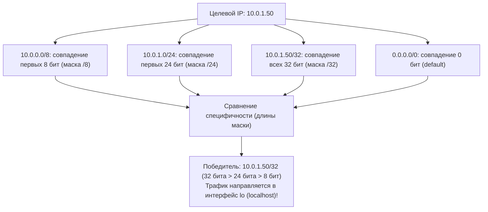
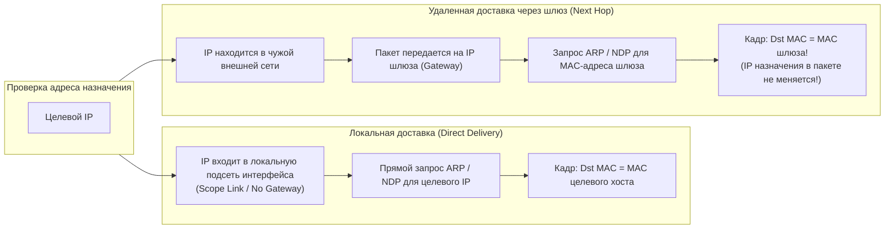
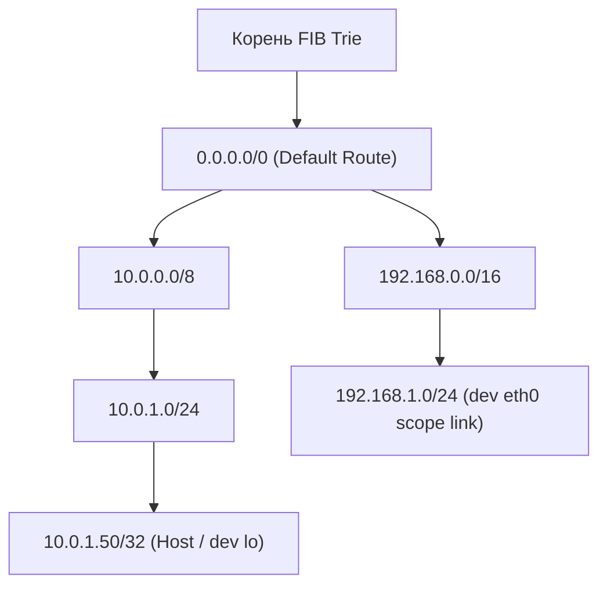
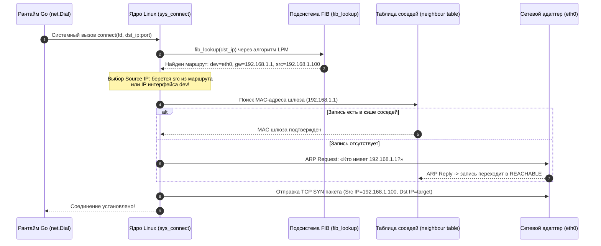

# Маршрутизация: Таблица маршрутов, шлюзы и default route

> *«Есть два способа создания программных систем: первый — сделать их настолько простыми, чтобы в них явно не было недостатков; второй — настолько сложными, чтобы в них не было явных недостатков».*    
> — Тони Хоар

Представьте, что вы отправляете письмо из небольшого городка. Если адресат живет на соседней улице, почтальон берет конверт и лично пешком доставляет его в почтовый ящик соседа. Но если адресат находится в другой стране или на другом континенте, местный почтальон даже не пытается выяснить точное расположение чужого дома. Он просто отвозит письмо на центральный почтамт — в распределительный логистический шлюз (Gateway), который знает, по какой магистральной автодороге или авиалинии отправить отправление дальше.

В компьютерных сетях этот процесс называется **маршрутизацией (Routing)**. Для разработчика высоконагруженных бэкенд-систем на Go, работающего в современных облачных средах (AWS, GCP, Kubernetes) или на многосетевых (multi-homed) серверах, понимание маршрутизации перестает быть абстрактной заботой сетевых администраторов. 

Каждый раз, когда ваше приложение на Go вызывает `net.Dial("tcp", "dst_ip:port")`, ядро операционной системы должно мгновенно решить фундаментальные инженерные вопросы:
* Через какой именно физический или виртуальный сетевой интерфейс (`eth0`, `eth1`, `br-abc123`) отправить пакет?
* Какой **исходящий IP-адрес (Source IP)** назначить локальному сокету?
* Какому промежуточному узлу (Next Hop) передать пакет канальным уровнем?
* Что делать, если прямой маршрут отсутствует?

Ошибки в понимании этих механизмов приводят к загадочным падениям соединений, асимметричной маршрутизации (когда исходящий трафик идет через один интерфейс, а входящий возвращается через другой и блокируется файрволом), а также к «зависаниям» сетевых вызовов в Go. В этой лекции мы разложим по полочкам механизм маршрутизации ядра Linux, алгоритм Longest Prefix Match и интеграцию рантайма Go с сетевым стеком ОС.

---

## Что такое маршрутизация?

**Маршрутизация (Routing)** — это процесс определения наилучшего пути для передачи сетевого IP-пакета от источника к получателю через цепочку промежуточных сетей и узлов на основе адреса назначения.

В сетевой архитектуре операционных систем принципиально важно разделять два термина, которые в разговорной речи часто смешивают:

```mermaid
flowchart TD
    subgraph ControlPlane ["Control Plane (Плоскость управления — Интеллект)"]
        RoutingTable["Таблица маршрутизации (Routing Table)"]
        RoutingDaemons["Маршрутизирующие демоны / Контроллеры CNI (BGP, OSPF, Netlink)"]
        RoutingDaemons -->|Обновление маршрутов| RoutingTable
    end

    subgraph DataPlane ["Data Plane / Forwarding Plane (Плоскость данных — Скорость)"]
        FIB["FIB (Forwarding Information Base)<br/>Radix Tree / LC-Trie в ядре Linux"]
        PacketIngress["Входящий IP-пакет"]
        LPM["Поиск по дереву (LPM)"]
        PacketEgress["Пересылка кадра в NIC (Next Hop / Dev)"]
        
        PacketIngress --> LPM
        FIB -.->|Мгновенная выборка O(k)| LPM
        LPM --> PacketEgress
    end

    RoutingTable -->|Компиляция и загрузка в ядро| FIB
```

1. **Routing (Маршрутизация — Интеллектуальная часть):** Находится в плоскости управления (Control Plane). Это построение, анализ и обновление карты сети и правил пересылки. Таблица маршрутов формируется статически администратором либо динамически с помощью протоколов BGP, OSPF или оркестратора Kubernetes.
2. **Forwarding (Переадресация — Механическая часть):** Находится в плоскости данных (Data Plane). Это низкоуровневая операция, выполняемая ядром Linux или аппаратным сетевым процессором (ASIC): взять входящий пакет из кольцевого буфера сетевой карты, за доли наносекунд найти интерфейс отправки в таблице FIB, уменьшить TTL, пересчитать контрольную сумму и отправить кадр в нужную очередь NIC.

В Go-приложениях мы редко манипулируем таблицами маршрутизации вручную. Когда мы вызываем стандартные методы `net.Dial` или `net.Listen`, ядро Linux автоматически выполняет поиск по таблицам маршрутов при инициализации сокета. Однако если сервер обладает несколькими сетевыми интерфейсами (например, `eth0` для публичных запросов пользователей, а `eth1` для высокоскоростной приватной связи с базами данных), некорректная конфигурация маршрутизации приводит к асимметрии: входящий SYN-пакет приходит на `eth1`, а ответный SYN-ACK ядро отправляет через `eth0`, потому что туда указывает шлюз по умолчанию. Клиент сбрасывает соединение флагом RST, а инженер бэкенда безуспешно ищет баги в коде на Go.

---

## Таблица маршрутов (Routing Table)

Таблица маршрутов — это внутренняя структура данных ядра операционной системы, которая сопоставляет диапазоны IP-адресов назначения с физическими интерфейсами и промежуточными шлюзами.

В современных дистрибутивах Linux для инспекции таблицы маршрутизации используется утилита `ip route show` (пакет `iproute2`), пришедшая на замену устаревшей утилите `route -n`:

```bash
$ ip route show
default via 192.168.1.1 dev eth0 proto dhcp metric 100 
10.0.0.0/8 via 10.240.0.1 dev eth1 metric 50 
172.16.0.0/16 dev br-abc123 proto kernel scope link src 172.16.0.1 
192.168.1.0/24 dev eth0 proto kernel scope link src 192.168.1.100 metric 100 
```

Каждая запись в таблице маршрутизации ядра содержит следующие ключевые атрибуты:
* **Destination (dst):** Адрес целевой сети или конкретного хоста (например, `192.168.1.0/24`, `10.0.0.0/8` или отдельный IP `10.0.0.1`).
* **Prefix Length (mask):** Длина сетевого префика в битах (маска подсети), определяющая размер адресного пространства.
* **Gateway (gw / via):** IP-адрес промежуточного маршрутизатора (Next Hop). Если поле `via` отсутствует (как для сети `192.168.1.0/24`), это означает **прямую локальную доставку (Direct Delivery)**: целевые узлы находятся в одном физическом проводе с данным интерфейсом.
* **Device (dev):** Имя сетевого интерфейса (`eth0`, `eth1`, мост `br-abc123`, loopback `lo`), через который должен уйти пакет.
* **Metric:** Численный приоритет маршрута. Чем **меньше** числовое значение метрики, тем выше приоритет данного маршрута при прочих равных условиях.
* **Type:** Семантический тип маршрута в ядре Linux:
  - `unicast` — классический маршрут для передачи данных на конкретный узел или шлюз;
  - `local` — специальный маршрут, означающий, что данный IP-адрес назначен локальному интерфейсу этого сервера (пакет не уходит в сеть, а заворачивается внутрь ядра);
  - `blackhole` — пакеты, попадающие под это правило, немедленно и молча отбрасываются (Drop) без уведомления отправителя (эффективно для защиты от DDoS-атак);
  - `prohibit` — пакеты отбрасываются с отправкой отправителю диагностического ICMP-сообщения «Communication Administratively Prohibited».

---

## Алгоритм выбора: Longest Prefix Match (LPM)

Когда ядру Linux требуется отправить пакет на конкретный IP-адрес назначения, оно не просматривает таблицу маршрутов сверху вниз случайным образом. В основе поиска маршрута лежит фундаментальный алгоритм **Longest Prefix Match (LPM, сопоставление по наибольшему префиксу)**.

> **Правило Longest Prefix Match:**  
> Из всех маршрутов, подходящих под IP-адрес назначения, ядро всегда выбирает тот маршрут, у которого **наибольшая длина сетевой маски (наиболее специфичный префикс)**.

Рассмотрим наглядный пример. Пусть в таблице маршрутов нашего сервера настроены следующие правила:

```text
Таблица маршрутов хоста:
1) 10.0.0.0/8      via 192.168.1.1   dev eth0   metric 100
2) 10.0.1.0/24     via 172.16.0.1    dev eth1   metric 50
3) 10.0.1.50/32    via 127.0.0.1     dev lo     metric 0
4) default         via 192.168.1.1   dev eth0   metric 200
```

Наше приложение на Go выполняет вызов:
```go
conn, err := net.Dial("tcp", "10.0.1.50:8080")
```

Как ядро Linux принимает решение о направлении трафика?



1. Префикс `0.0.0.0/0` (default) совпадает на 0 бит.
2. Префикс `10.0.0.0/8` совпадает на 8 бит.
3. Префикс `10.0.1.0/24` совпадает на 24 бита.
4. Префикс `10.0.1.50/32` совпадает на все 32 бита.

**Результат:** Пакет будет отправлен через правило `10.0.1.50/32` на интерфейс `lo`. При этом значение метрики на предыдущих маршрутах (даже метрика 50 для `10.0.1.0/24`) вообще не играет никакой роли, поскольку длина префикса `/32` превосходит все остальные!

> [!tip] Собеседование: Коллизии префиксов и Equal-Cost Multi-Path (ECMP)
> **Вопрос:** Как ядро Linux разрешает ситуацию, если для целевого IP найдено несколько маршрутов с абсолютно одинаковой длиной префикса?  
> **Ответ:**  
> 1. Если длины префиксов равны, ядро сравнивает атрибут **`metric`** каждого маршрута. Побеждает маршрут с наименьшим значением метрики.  
> 2. Если и длины префиксов, и значения метрик полностью идентичны, вступает в действие механизм **ECMP (Equal-Cost Multi-Path)**. Ядро вычисляет хэш от кортежа полей пакета (Source IP, Destination IP, Protocol, Source Port, Destination Port) и псевдослучайно распределяет потоки по доступным интерфейсам. Это позволяет балансировать исходящий сетевой трафик между несколькими параллельными аплинками без нарушения порядка пакетов внутри одной TCP-сессии.

---

## Шлюзы (Gateways) и локальная доставка

Каждый маршрут в таблице ядра описывает один из двух фундаментальных способов доставки IP-пакета:



1. **Локальная доставка (Direct Delivery / Scope Link):**  
   Если IP-адрес назначения находится в той же IP-подсети, что и локальный сетевой адаптер (например, хост `192.168.1.100` отправляет пакет на `192.168.1.50/24`), маршрутизатор не требуется. В таблице маршрутов такой путь помечен как `dev eth0 scope link`. Ядро проверяет, не является ли этот адрес адресом самого хоста (`type local`). Если адрес чужой, ядро выполняет локальный ARP-запрос (или NDP в IPv6), находит MAC-адрес целевого компьютера и отправляет Ethernet-кадр напрямую получателю.
2. **Удаленная доставка через шлюз (Gateway Delivery / Next Hop):**  
   Если адрес назначения принадлежит другой сети (например, обращение к внешнему серверу `93.184.216.34`), пакет не может быть доставлен напрямую канальным уровнем. Ядро отправляет пакет на промежуточный узел — **Шлюз (Gateway)**.  
   *Критически важная деталь:* В заголовке сетевого IP-пакета адрес назначения остается оригинальным (`Dst IP = 93.184.216.34`). Но в заголовке Ethernet-кадра канального уровня в качестве адреса получателя (`Dst MAC`) указывается MAC-адрес шлюза! Шлюз распакует Ethernet-кадр, увидит чужой IP-адрес и передаст пакет дальше по своей таблице маршрутизации.

> [!warning] Ловушка / Gotcha: Путаница между маской и метрикой
> Распространенная ошибка инженеров при настройке маршрутизации на серверах с несколькими интерфейсами: уверенность в том, что параметр `metric` может переопределить длину маски подсети.  
> 
> Представьте, что на сервере есть два маршрута:
> * `192.168.0.0/16` via `10.0.0.1` dev `eth0` metric `10`
> * `192.168.0.0/24` via `10.1.0.1` dev `eth1` metric `1000`
> 
> Инженер наивно полагает: *«Метрика 10 намного меньше метрики 1000, значит, весь трафик к 192.168.0.5 пойдет через eth0!»*.  
> Это грубая ошибка. Сеть `192.168.0.0/24` имеет префикс длиной 24 бита, а `192.168.0.0/16` — только 16 бит. По правилу Longest Prefix Match префикс `/24` **всегда** побеждает префикс `/16`. Трафик уйдет через интерфейс `eth1`, невзирая на гигантскую метрику 1000. Метрика сравнивается **исключительно** между маршрутами с строго одинаковой маской!

---

## Default Route (0.0.0.0/0)

Что происходит, когда сервер хочет связаться с хостом в интернете, чей адрес не описан ни в одном правиле локальной таблицы? Для этого существует концепция **Default Route (шлюз по умолчанию)**.

В нотации бесклассовой адресации CIDR шлюз по умолчанию обозначается как **`0.0.0.0/0`** в протоколе IPv4 и **`::/0`** в протоколе IPv6. Маска `/0` означает, что с данным правилом совпадает буквально *любой* IP-адрес Вселенной (совпадение 0 бит).

```bash
$ ip route show default
default via 172.17.0.1 dev eth0 proto dhcp metric 100
```

Поскольку длина префикса `/0` минимальна из всех возможных, маршрут по умолчанию работает как всеобъемлющий улавливатель (Catch-All). Он вступает в действие только тогда, когда алгоритм LPM не нашел ни одного более специфичного маршрута в таблице.

В современных облачных архитектурах (AWS VPC, Google Cloud, Yandex Cloud) маршрут по умолчанию виртуальной машины всегда указывает на внутренний шлюз виртуального облака. В кластерах **Kubernetes** default route внутри сетевого пространства имен пода (Pod Network Namespace) указывает на виртуальный интерфейс (veth-пару) CNI-плагина (Cilium, Calico, Flannel), который берет на себя инкапсуляцию пакета в оверлейную сеть (VXLAN или Geneve).

Если у сервера есть два интернет-провайдера (два внешних интерфейса `eth0` и `eth1`), администратор может настроить два маршрута `0.0.0.0/0` с разными метриками (`metric 100` и `metric 200`). Ядро будет использовать быстрый канал с метрикой 100, а при его падении автоматически переключится на резервный интерфейс.

---

## Под капотом: Linux FIB и Lookup

В недрах ядра Linux подсистема маршрутизации оперирует высокопроизводительной базой данных пересылки — **FIB (Forwarding Information Base)**. 

Если бы ядро хранило маршруты в обычном линейном списке или связном массиве, то при каждом сетевом пакете процессору приходилось бы выполнять линейное сканирование O(N). В маршрутизаторах интернета, где полная таблица (BGP Full View) содержит более 950 000 маршрутов, линейный поиск вызвал бы моментальный коллапс производительности.

По этой причине FIB в Linux реализована в виде модифицированного сжатого префиксного дерева — **Radix Tree (LC-Trie — Level-Compressed Trie)**:



Префиксное дерево позволяет ядру находить наилучший маршрут за алгоритмическое время $O(k)$, где $k$ — фиксированная разрядность адреса (всего 32 итерации для IPv4 и 128 для IPv6), независимо от того, сколько миллионов маршрутов загружено в память.

### Жизненный цикл вызова сокета: от `sys_connect` до выбора Source IP

Когда ваше Go-приложение инициирует исходящее соединение, в ядре разворачивается четкая цепочка событий:



1. Программа на Go вызывает `net.Dial("tcp", "dst_ip:port")`. В рантайме создается неблокирующий сокет и вызывается системный вызов `sys_connect`.
2. Ядро Linux обращается к подсистеме маршрутизации и вызывает внутреннюю функцию `fib_lookup()`.
3. Алгоритм LPM за константное число шагов находит наиболее специфичную запись в FIB.
4. Из найденного маршрута ядро извлекает исходящее устройство (`dev`) и адрес следующего узла (`Gateway`).
5. **Автоматический выбор Source IP:** Если приложение явно не вызвало системный вызов `bind()`, ядро выбирает исходящий IP-адрес сокета. Ядро берет IP-адрес, явно прописанный в атрибуте `src` маршрута (preferred source), либо берет первичный IP-адрес интерфейса `dev`. Именно этот назначенный адрес возвращается в коде Go при вызове `conn.LocalAddr().(*net.TCPAddr).IP`.
6. Если маршрут указывает на внешний шлюз, ядро заглядывает в таблицу соседей (`neighbour table`) для получения MAC-адреса шлюза.
7. Сетевая карта отправляет TCP SYN кадр, и соединение успешно устанавливается.

> [!info] Под капотом: Отказ от `ip_route_cache` в пользу RCU
> В старых версиях ядра Linux (до ветки 2.6.38) ядро кэшировало результаты поиска маршрутов в отдельной хэш-таблице `ip_route_cache`. Однако под высокой сетевой нагрузкой этот кэш становился источником тяжелых блокировок, состояний гонки (Race Conditions) и подвергался DoS-атакам (злоумышленник отправлял пакеты на случайные IP, вызывая переполнение кэша маршрутов и судорожную работу сборщика мусора ядра).  
> 
> Начиная с ядер Linux 3.6 и в современных версиях (5.x, 6.x), кэш маршрутов был полностью ликвидирован. Вместо него дерево FIB было оптимизировано для работы через механизм **RCU (Read-Copy-Update)**. Теперь миллионы параллельных сетевых горутин и системных потоков в Go могут одновременно читать таблицу FIB без захвата спинлоков и мьютексов. Время задержки (lookup latency) стало предсказуемым и стабильным даже при интенсивном трафике.

---

## Go и маршрутизация: Как net выбирает IP

Пакет `net` стандартной библиотеки Go спроектирован так, чтобы максимально изолировать разработчика от платформозависимых деталей. В нем нет собственной встроенной таблицы маршрутизации — Go полностью доверяет эту работу ядру операционной системы.

Однако в реальных распределенных архитектурах возникает множество ситуаций, когда разработчику требуется тонко управлять поведением маршрутизации на уровне Go-кода:

### 1. Выбор исходящего адреса (Source IP Binding)

По умолчанию при вызове `net.Dial("tcp", "target:80")` Go передает адрес назначения ядру, и ядро само назначает исходящий IP. Если вам строго необходимо отправить трафик с определенного IP-адреса (например, у сервера два внешних адреса, и фаервол удаленной базы данных пускает запросы только с одного из них), используют поле `LocalAddr` в структуре `net.Dialer`:

```go
dialer := &net.Dialer{
    LocalAddr: &net.TCPAddr{
        IP: net.ParseIP("192.168.1.100"), // Явный Source IP
    },
    Timeout: 5 * time.Second,
}
conn, err := dialer.Dial("tcp", "203.0.113.50:443")
```

### 2. Привязка сокета к интерфейсу через `SO_BINDTODEVICE`

Бывают ситуации, когда одного указания IP недостаточно: на сервере настроена сложная маршрутизация на основе политик (**Policy Routing**, утилита `ip rule`), и трафик необходимо жестко привязать к конкретному физическому адаптеру (например, `eth1`), игнорируя стандартный default route. 

В Linux для этого применяется сокетная опция **`SO_BINDTODEVICE`**. В современном Go (начиная с Go 1.11+) это элегантно реализуется через хук `net.ListenConfig.Control` (для серверов) или через структуру `net.Dialer` (для клиентов):

```go
package main

import (
	"context"
	"fmt"
	"log"
	"net"
	"syscall"
)

func main() {
	// Тонкая настройка сокета перед системным вызовом bind() / connect()
	cfg := net.ListenConfig{
		Control: func(network, address string, c syscall.RawConn) error {
			var socketErr error
			// Метод Control дает безопасный доступ к нативному дескриптору сокета (fd)
			err := c.Control(func(fd uintptr) {
				// Принудительно привязываем сокет к сетевому интерфейсу "eth1"
				socketErr = syscall.SetsockoptString(
					int(fd),
					syscall.SOL_SOCKET,
					syscall.SO_BINDTODEVICE,
					"eth1",
				)
			})
			if err != nil {
				return err
			}
			return socketErr
		},
	}

	listener, err := cfg.Listen(context.Background(), "tcp", ":8080")
	if err != nil {
		log.Fatalf("Ошибка запуска слушателя на eth1: %v", err)
	}
	defer listener.Close()

	fmt.Println("TCP-сервер успешно запущен и жестко привязан к интерфейсу eth1")
}
```

### 3. Низкоуровневые флаги: `IP_FREEBIND` и `IP_TRANSPARENT`

При разработке высокопроизводительных реверс-прокси, балансировщиков нагрузки (аналогов `haproxy` или Envoy на Go) часто возникает необходимость слушать трафик на плавающем виртуальном IP (VIP), который в данный момент физически еще не назначен ни одному локальному интерфейсу машины.

В стандартном режиме ядро Linux немедленно вернет ошибку `EADDRNOTAVAIL` («Cannot assign requested address»). Чтобы обойти это ограничение, на дескриптор сокета (`sysfd`) накладывают специальные опции ядра:
* **`IP_FREEBIND`:** Разрешает приложению вызвать `bind()` на любой произвольный IP-адрес, даже если он отсутствует в системе. Это спасает кластерные сервисы высокой доступности от падения при рестарте до того, как Keepalived поднимет виртуальный IP.
* **`IP_TRANSPARENT`:** Позволяет сокету перехватывать чужой транзитный трафик, направленный сторонним серверам (фундамент создания прозрачных сетевых прокси — Transparent Proxy / TPROXY).

### 4. Взаимодействие с DNS в многосетевых системах

Когда на сервере настроено несколько сетевых карт, стандартный резолвер Go (`net.Resolver`) может возвращать список IP-адресов в порядке, продиктованном системными файлами `/etc/resolv.conf` и конфигурацией переключателя служб имен `nsswitch.conf`. 

Если резолвер возвращает одновременно адреса IPv6 и IPv4, рантайм Go использует алгоритм Happy Eyeballs, проверяя оба маршрута. Чтобы предотвратить утечки DNS-запросов во внешнюю сеть через незащищенный интерфейс, разработчики конфигурируют кастомный `net.Dialer.Resolver`, явно направляя запросы к внутреннему DNS-серверу через доверенный интерфейс.

> [!tip] Собеседование: Как направить исходящий трафик в обход default route?
> **Вопрос:** В таблице маршрутизации default route указывает на интерфейс `eth0`. Как заставить Go-микросервис отправлять все исходящие запросы к определенной базе данных строго через резервный интерфейс `eth1` с его собственным IP?  
> **Ответ:**  
> Решение строится на двух уровнях:
> 1. **На уровне ОС (рекомендуемый для продакшена):** Настройка маршрутизации по политикам (**Policy Routing**). Создается дополнительная таблица маршрутов (например, таблица `100`), в которую прописывается маршрут по умолчанию через шлюз интерфейса `eth1`. С помощью правила `ip rule add from <IP_eth1> lookup 100` ядро заставляют использовать таблицу 100 для всех пакетов, у которых Source IP совпадает с адресом `eth1`. В коде на Go достаточно указать этот адрес в `net.Dialer.LocalAddr`.
> 2. **На уровне сокета в Go:** Использование опции `SO_BINDTODEVICE` через коллбэк `Control` структуры `net.Dialer`. Сокет жестко привязывается к имени устройства `"eth1"`, вынуждая ядро Linux отправлять пакеты и искать маршрут только в контексте данного сетевого интерфейса.

---

## Итог

Маршрутизация — это невидимый фундамент, на котором держится вся архитектура распределенных систем и надежность сетевого ввода-вывода в Go:

1. **Разделение обязанностей:** Маршрутизация (Routing / Control Plane) вычисляет оптимальные пути, а пересылка (Forwarding / Data Plane) за константное время пересылает кадры в сетевые интерфейсы.
2. **Алгоритм Longest Prefix Match:** Ядро всегда выбирает наиболее специфичный префикс (максимальную длину маски). Метрика учитывается **только** при равенстве длин префиксов.
3. **Прямая vs Шлюзовая доставка:** При локальной доставке кадр уходит напрямую получателю. При удаленной доставке Ethernet-кадр отправляется на MAC-адрес шлюза (Next Hop), но IP-адрес назначения в самом сетевом пакете остается неизменным.
4. **Default route (`0.0.0.0/0` и `::/0`):** Универсальный маршрут по умолчанию с наименьшим приоритетом префикса, собирающий весь несекционированный трафик.
5. **Внутреннее устройство FIB:** Современное ядро Linux использует безблокировочные RCU-деревья Radix Trie, исключающие задержки и деградацию производительности под высокой нагрузкой.
6. **Роль Go:** Стандартная библиотека делегирует выбор маршрута ядру ОС. Однако с помощью `net.Dialer.LocalAddr`, низкоуровневых опций `SO_BINDTODEVICE`, `IP_FREEBIND` и механизма `ListenConfig.Control` инженер на Go может с ювелирной точностью управлять сетевыми потоками на самых сложных многоинтерфейсных серверах.

Мы разобрали, как ядро локальной машины принимает решения на основе статических правил маршрутизации. Но как огромные глобальные сети и современные облачные дата-центры обучают тысячи маршрутизаторов находить кратчайшие пути и мгновенно обходить аварии на линиях связи?

В следующей лекции мы погрузимся в мир алгоритмов динамической маршрутизации: разберем векторно-дистанционные и линк-стейт протоколы RIP, OSPF и глобальный протокол междоменной маршрутизации интернета BGP в [[7. Статическая и динамическая маршрутизация. RIP, OSPF, BGP.md]].