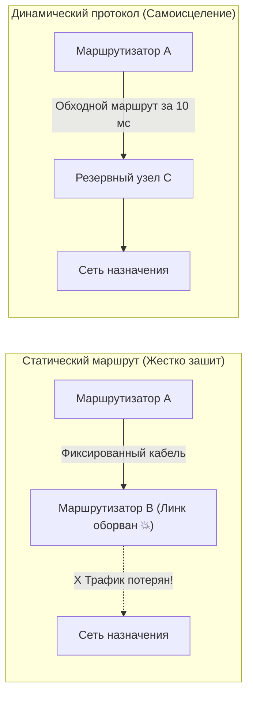
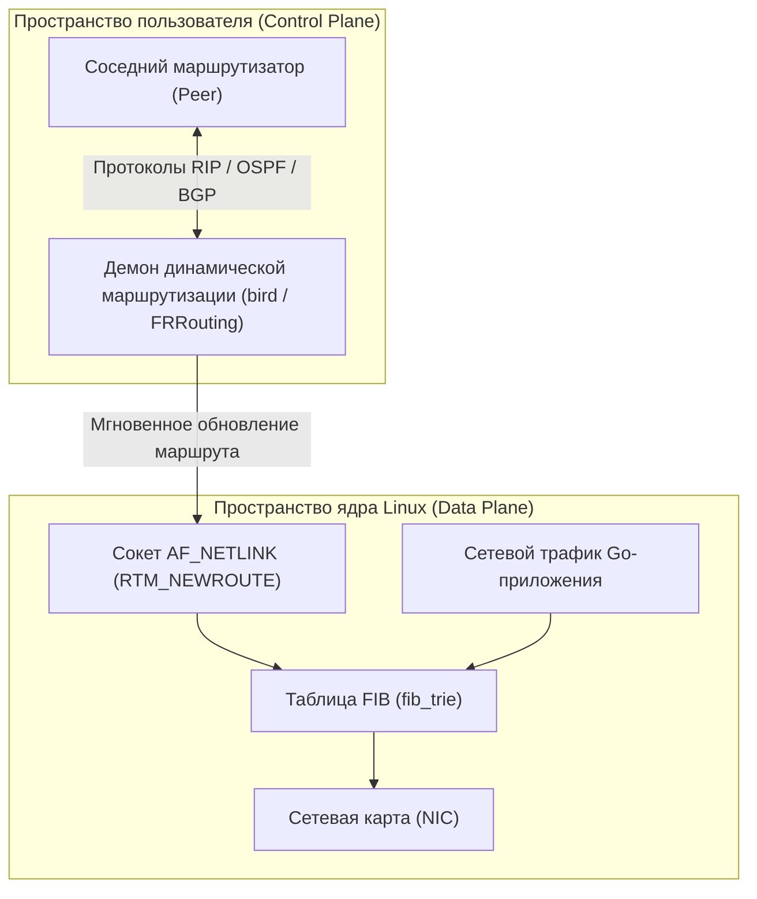
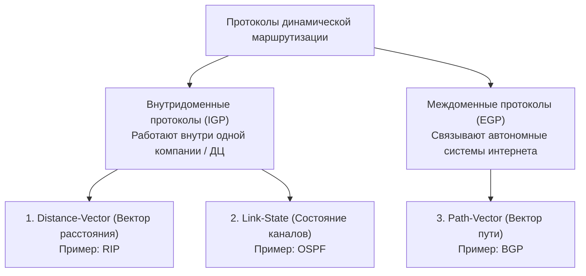
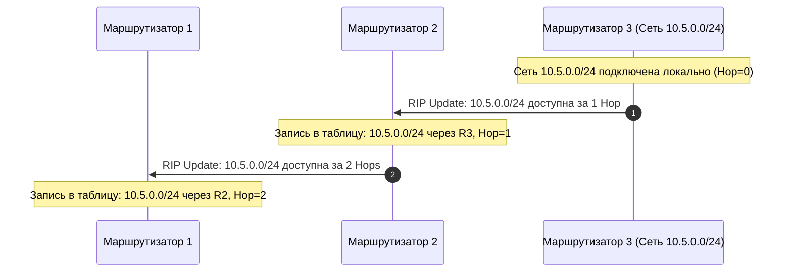
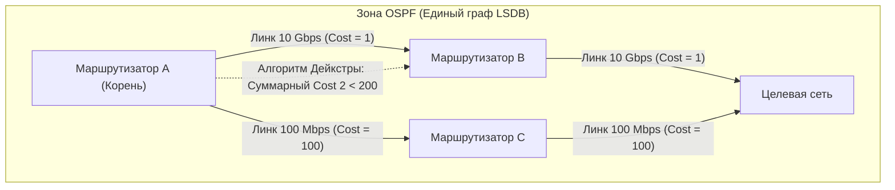

# Статическая и динамическая маршрутизация: RIP, OSPF, BGP

> *«Простота — непременное условие надежности».*    
> — Эдсгер Дейкстра

Представьте себе старую однопутную железную дорогу XIX века. Стрелочник на перегоне вручную переводит стрелочный перевод по строгому печатному расписанию: грузовой состав №42 всегда уходит на третий путь. Это **статическая маршрутизация**: простая, абсолютно детерминированная, надежная — ровно до тех пор, пока на третий путь не упадет вековая сосна или не осядет насыпь. В этот момент составы останавливаются намертво, и движение замирает до тех пор, пока путевой обходчик лично не прибудет на место аварии и вручную не переложит рельсовые стрелки.

В противовес этому динамическая маршрутизация похожа на современный центр управления воздушным движением: сотни авиалайнеров непрерывно обмениваются по радиосвязи данными о координатах, турбулентности и грозовых фронтах. Если аэропорт назначения закрыло туманом, диспетчеры и бортовые компьютеры за доли секунды пересчитывают маршрут и уводят борт на запасной аэродром без участия человека.

В предыдущей статье мы выяснили, как ядро операционной системы принимает локальные решения с помощью таблицы маршрутизации и шлюза по умолчанию. Но как эта таблица заполняется в реальном мире? Как тысячи маршрутизаторов планеты узнают о новых каналах связи и обходят катастрофы на оптоволоконных магистралях? 

Для Go-разработчика понимание разницы между статической и динамической маршрутизацией — это не академическое упражнение. Архитектура современных облачных дата-центров, распределенные Kubernetes-кластеры и CNI-плагины (Calico, Cilium) построены прямо на протоколах динамической маршрутизации (BGP-to-the-Host). Ошибки в понимании этих механизмов оборачиваются необъяснимыми сетевыми задержками, ошибками `connection refused` или `connect: no route to host` и разрывами сессий при сбоях нод.

---

## Статическая маршрутизация: Детерминизм и ручной контроль

**Статическая маршрутизация** — это метод организации сети, при котором все маршруты к целевым сетям и шлюзам следующего прыжка (next-hop) жестко прописываются системным администратором вручную и остаются неизменными до следующего прямого вмешательства человека.

В операционной системе Linux статические правила создаются с помощью команд подсистемы `iproute2` (`ip route add`) или устаревшей утилиты `route add`. На уровне ядра таблица пересылки (FIB — Forwarding Information Base) хранит эти пути в виде сжатого дерева, где поиск следующего узла осуществляется строго по IP-адресу назначения:

```bash
# Добавление статического маршрута к приватной подсети через конкретный шлюз
$ ip route add 10.200.0.0/16 via 192.168.1.254 dev eth0 metric 10
```



### Преимущества статической маршрутизации:
1. **Полная предсказуемость и детерминизм:** Пакеты всегда перемещаются по строго определенному физическому пути. Нет риска, что маршрут внезапно изменится посреди сессии.
2. **Нулевая накладная нагрузка на CPU:** Маршрутизаторам и серверам не требуется запускать фоновые фоновые демоны маршрутизации, тратить такты процессора на пересчет графов и засорять каналы связи служебным трафиком.
3. **Безопасность (Security by Default):** Злоумышленник не может отравить таблицу маршрутизации фальшивым сетевым анонсом, поскольку система принципиально не слушает входящие сообщения о топологии сети.

### Недостатки статической маршрутизации:
1. **Хрупкость и отсутствие отказоустойчивости:** Если промежуточный коммутатор или магистральный кабель выходит из строя, трафик продолжает безрезультатно уходить в «мертвый» линк. Связь полностью прерывается до тех пор, пока дежурный инженер не исправит конфигурацию.
2. **Невозможность масштабирования:** В инфраструктурах из сотен серверов, десятков подсетей и виртуальных облаков ручная поддержка статических таблиц превращается в администрирование с экспоненциальной вероятностью человеческой ошибки.

> [!warning] Ловушка / Gotcha: Иллюзия статичности в облаках и контейнерах
> В современных публичных облаках (AWS VPC, GCP Cloud Router, Yandex Cloud) и контейнерных оркестраторах Kubernetes статическая маршрутизация полностью изолирована за фасадом программно-определяемых сетей (**SDN — Software-Defined Networking**).  
> Инженер может наивно думать: *«Я просто прописал CIDR пода в конфигурации, значит, здесь работает статика!»*.  
> В реальности под капотом виртуального коммутатора работает распределенный SDN-контроллер, который на лету генерирует правила OpenFlow или программирует ядро через eBPF при каждом создании или перемещении контейнера. Понимание низкоуровневой маршрутизации жизненно необходимо для отладки on-premise кластеров, edge-серверов и bare-metal инсталляций.

---

## Динамическая маршрутизация: Адаптивность и метрики

**Динамическая маршрутизация** автоматизирует управление сетевыми потоками. Маршрутизаторы непрерывно общаются друг с другом по специализированным сетевым протоколам, сообщая о доступных подсетях, задержках линий связи и авариях. При изменении топологии сеть **сходится (converges)** к новому стабильному состоянию без участия человека.

В операционной системе Linux за работу протоколов динамической маршрутизации отвечают специализированные демоны пользовательского пространства — например, **`bird`** или пакет **`frr` (FRRouting)**. Они устанавливают сетевые сессии с соседями, вычисляют оптимальные пути и записывают актуальные маршруты напрямую в таблицу FIB ядра через протокол `netlink`.



Если один и тот же префикс подсети анонсируется несколькими разными протоколами или через разные каналы, ядро и маршрутизаторы выбирают лучший путь на основе двух критериев:
1. **Административное расстояние (Administrative Distance, AD):** Степень доверия к источнику маршрута (например, локальный статический маршрут надежнее динамического OSPF, а OSPF надежнее RIP).
2. **Метрика (Metric):** Стоимость пути внутри конкретного протокола (число прыжков, пропускная способность, задержка канала).

Все протоколы динамической маршрутизации исторически делятся на три фундаментальных класса:



---

## 1. RIP (Routing Information Protocol)

Протокол **RIP** (RFC 1058, RFC 2453) — исторический первопроходец динамической маршрутизации, относящийся к классу **Distance-Vector (дистанционно-векторные протоколы)**. 

Идея протокола предельно наивна: каждый маршрутизатор знает расстояние (вектор) до известных ему сетей и регулярно делится этой шпаргалкой со своими непосредственными физическими соседями.

### Механика работы под капотом:
1. Каждые **30 секунд** маршрутизатор формирует служебное сообщение со списком всех известных ему сетей и рассылает его соседям.
2. В качестве метрики используется банальный счетчик промежуточных узлов — **Hop Count (число прыжков)**. Прямо подключенная сеть имеет метрику 0, маршрутизатор на расстоянии одного узла — метрику 1 и так далее.
3. Получив обновление от соседа, маршрутизатор прибавляет единицу к метрике каждого маршрута. Если полученный маршрут короче имеющегося в локальной таблице, запись в FIB обновляется.
4. **Ограничение бесконечности:** Максимально допустимое число прыжков в RIP равно **15**. Значение **16** считается математической бесконечностью и означает, что сеть недостижима.



> [!info] Под капотом: Почему RIP ушел на пенсию
> Протокол RIP инкапсулирует свои служебные сообщения в датаграммы протокола UDP на стандартный **порт 520**.  
> RIP страдает от тяжелых органических недостатков:
> * **Проблема счета до бесконечности (Count-to-Infinity):** При обрыве линка узлы могут циклически пересылать друг другу устаревшие маршруты, медленно увеличивая счетчик от 1 до 16 на протяжении многих минут. Для частичного решения применяются эвристики *Split Horizon* (не передавать маршрут обратно в тот порт, откуда он был получен) и *Poison Reverse*.
> * **Игнорирование качества каналов:** Для RIP гигабитный оптоволоконный линк через 2 маршрутизатора считается вдвое «хуже», чем старый телефонный модем на 56 кбит/с через 1 маршрутизатор!  
> В современных дата-центрах и продакшен-сетях протокол RIP практически не встречается и изучается исключительно как историческая база.

---

## 2. OSPF (Open Shortest Path First)

Протокол **OSPF** (RFC 2328 для IPv4, RFC 5340 для IPv6) — золотой стандарт внутрикорпоративной маршрутизации (IGP), относящийся к классу **Link-State (протоколы состояния каналов)**. 

В отличие от «сплетника» RIP, передающего чужие списки расстояний, OSPF исповедует инженерный подход Bell Labs: **каждый маршрутизатор обязан знать точную карту всей сети целиком**.

### Алгоритм Дейкстры и сходимость OSPF:
1. **Обнаружение соседей (Hello Packets):** Маршрутизаторы непрерывно обмениваются легковесными Hello-пакетами каждые несколько секунд, поддерживая статус соседства (Adjacency).
2. **Рассылка объявлений о состоянии каналов (LSA):** Каждый узел следит за состоянием собственных физических интерфейсов. При изменении статуса линка маршрутизатор генерирует компактный пакет — **LSA (Link State Advertisement)** — и лавинно рассылает (флудит) его по всей сети.
3. **Единая база топологии (LSDB):** Все маршрутизаторы в пределах зоны (Area) накапливают идентичную базу данных состояния каналов — **LSDB (Link State Database)**. Это точный математический граф сети, где вершины — маршрутизаторы, а ребра — каналы связи.
4. **Расчет кратчайшего пути (SPF):** Каждый маршрутизатор независимо от других запускает на графе LSDB классический **алгоритм Дейкстры (Shortest Path First, SPF)**, принимая себя за корень дерева. На основе расчета генерируются наилучшие пути, которые загружаются в системную таблицу FIB.
5. **Метрика стоимости (Cost):** Метрика OSPF обратно пропорциональна пропускной способности канала ($\text{Cost} = \frac{\text{Reference Bandwidth}}{\text{Interface Bandwidth}}$). Быстрый 100-гигабитный линк всегда имеет ничтожную стоимость и побеждает медленные соединения.



> [!tip] Собеседование: Почему OSPF сходится за миллисекунды, а RIP — за минуты?
> **Вопрос:** В чем фундаментальная причина колоссальной разницы во времени сходимости (Convergence Time) между RIP и OSPF при физическом обрыве магистрального кабеля?  
> **Ответ:**  
> 1. **RIP** пассивно ожидает истечения периодических таймеров обновления (таймаут потери маршрута составляет 180 секунд). Узлы не знают общей топологии сети и вынуждены долго разрешать циклические зависимости через медленный инкремент счетчика прыжков.  
> 2. **OSPF** управляется событиями (Event-Driven). Аппаратный обрыв линка немедленно детектируется сетевой картой за доли миллисекунды. Маршрутизатор моментально рассылает точечный LSA всем соседям. Каждый узел тут же локально перезапускает алгоритм Дейкстры на готовом графе LSDB и мгновенно переключает FIB на резервный путь за 10–50 миллисекунд без потери TCP-сессий.

---

## 3. BGP (Border Gateway Protocol)

Если OSPF — это скоростная внутренняя сеть отдельного здания или кампуса, то **BGP (Border Gateway Protocol, текущая версия BGP-4 в RFC 4271)** — это становой хребет глобального интернета.

BGP относится к классу **Path-Vector (протоколы вектора пути)**. Глобальный интернет представляет собой мозаику из десятков тысяч независимых сетей — **Автономных Систем (AS — Autonomous Systems)**. Каждая AS принадлежит определенной организации: интернет-провайдеру (Tier-1 операторы вроде Lumen или Telia), облачному гиганту (Google, Amazon, Microsoft, Яндекс) или крупной корпорации.

Главная задача BGP — связывать автономные системы между собой, предотвращать глобальные циклы маршрутизации и предоставлять операторам гибкие инструменты для реализации **политик маршрутизации (Routing Policies)**.


### Ключевые особенности BGP для архитектора бэкенда:
1. **Транспорт поверх надежного TCP:** В отличие от других протоколов, BGP не занимается изобретением собственных велосипедов для надежной доставки. Соседи (BGP Peers) устанавливают обычное TCP-соединение на **порт 179**. Вся сложность контроля целостности и повторной передачи пакетов делегируется проверенному стеку TCP.
2. **Огромный масштаб (BGP Full View):** Таблица полной маршрутизации глобального интернета насчитывает более **950 000 префиксов IPv4** и свыше 200 000 префиксов IPv6. BGP оптимизирован для устойчивого хранения и инкрементальной передачи таких массивов данных.
3. **Маршрутизация по политикам (Policy-Based Routing):** BGP выбирает путь не по наименьшему пингу или числу роутеров, а по бизнес-правилам и атрибутам пути:
   - **AS-Path:** Список автономных систем, через которые прошел маршрут. Маршрут отбрасывается, если в списке уже есть собственный номер AS (гарантированная защита от глобальных петель!).
   - **Local Preference:** Приоритет выбора исходящего шлюза внутри компании (например, «отправлять трафик через дешевый прямой пиринг, а дорогой транзитный канал использовать как резерв»).
   - **BGP Communities:** Числовые теги, прикрепляемые к анонсам для управления трафиком у вышестоящих провайдеров.
4. **BGP-to-the-Host в Kubernetes:** В современных облачных микросервисных кластерах CNI-плагины (например, **Project Calico**) запускают BGP-демон (BIRD) прямо на каждой рабочей ноде Kubernetes! Каждый воркер анонсирует IP-адреса запущенных на нем подов на физические Top-of-Rack (ToR) коммутаторы дата-центра. Это исключает накладные расходы оверлейных сетей (VXLAN) и обеспечивает чистую маршрутизацию со скоростью физической линии связи.

---

## Под капотом: FIB и Longest Prefix Match

Когда исходящий сетевой пакет формируется приложением или транзитный кадр поступает на физический интерфейс сетевого адаптера, драйвер ядра передает управление подсистемам `netfilter` и `routing`. 

Ядро Linux обращается к фундаментальному алгоритму **Longest Prefix Match (LPM)**, оперируя внутренней структурой данных **`fib_trie`**. Это высокооптимизированное префиксное дерево (Radix Trie), в котором каждый узел разветвляется в зависимости от очередных бит IP-адреса.

```mermaid
flowchart TD
    Packet["Входящий пакет: Dst IP"] --> HashLookup{"Аппаратный offload<br/>TCAM на сетевой карте?"}
    
    HashLookup -->|Да (Hardware Fast Path)| TCAM["TCAM Match (< 10 наносекунд)<br/>Немедленная пересылка в порт"]
    HashLookup -->|Нет (Software Slow Path)| CPU_FIB["Ядро Linux: обход fib_trie в оперативной памяти"]
    
    CPU_FIB --> CacheCheck{"Попадание в L1/L2 кэш CPU?"}
    CacheCheck -->|Cache Hit| FastTrie["Мгновенная выборка из кэша процессора"]
    CacheCheck -->|Cache Miss| MemoryStall["Задержка выборки из RAM (~50-80 нс)<br/>Падение сетевой пропускной способности"]
    
    FastTrie --> NextHop["Определение Next-Hop и отправка"]
    MemoryStall --> NextHop
```

### Принцип Mechanical Sympathy: Аппаратные реалии маршрутизации
1. **Алгоритмическая сложность в худшем случае:** Поиск по `fib_trie` в памяти требует последовательного чтения указателей узлов дерева. На огромных таблицах интернета (Full View) дерево становится глубоким, что может вызывать частые промахи по кэшам процессора (L1/L2 Cache Misses). Если сетевой трафик хаотично направлен на миллионы случайных IP-адресов, ядро тратит драгоценные такты CPU на ожидание данных из оперативной памяти.
2. **Аппаратная акселерация (TCAM Offloading):** Высокопроизводительные коммутаторы и современные «умные» сетевые карты (SmartNIC) переносят поиск LPM из оперативной памяти в специализированные кремниевые чипы — **TCAM (Ternary Content-Addressable Memory)**. Память TCAM сопоставляет все биты адреса и маски одновременно параллельно за один-единственный такт процессора. Это обеспечивает задержку маршрутизации менее **10 наносекунд на пакет**. С помощью инструментов `tc` и `iproute2` в Linux можно прозрачно делегировать правила фильтрации и пересылки в аппаратный чипсет NIC (Hardware TCAM Offload).
3. **Совет для бэкенда:** При проектировании высоконагруженных сетевых сервисов на Go группируйте пулы соединений и клиентские IP в компактные подсети (CIDR-блоки). Локализация адресного пространства гарантирует, что горячие ветки дерева `fib_trie` останутся в L1-кэше процессора, минимизируя латентность вызовов `net.Dial`.

---

## Go и маршрутизация: Практика

Стандартный пакет `net` в Go умышленно абстрагирует разработчика от низкоуровневых протоколов маршрутизации. Когда ваша программа выполняет вызов:

```go
conn, err := net.Dial("tcp", "host:port")
```

Под капотом рантайм Go выполняет строгую последовательность шагов:
1. Выполняет DNS-резолвинг доменного имени `host` в IP-адрес через встроенный Go-резолвер или системную библиотеку `getaddrinfo`.
2. Создает сокет и инициирует системный вызов `connect()` ядра Linux.
3. Сетевой стек ядра обращается к локальной структуре `fib_trie`, находит оптимальный next-hop интерфейс и отправляет пакет.

Однако если вы разрабатываете системные сетевые утилиты, контроллеры распределенных систем или кастомные CNI-плагины для контейнеров, стандартного пакета `net` становится недостаточно. Для прямого программного взаимодействия с таблицей маршрутизации ядра Linux из Go промышленным стандартом является библиотека **`github.com/vishvananda/netlink`**, которая общается с ядром через системный сокет `AF_NETLINK`.

### Практический пример: Инспекция маршрутов ядра через Go

Следующий рабочий пример демонстрирует, как сервисы на Go могут инспектировать системные таблицы маршрутов ядра Linux, находить шлюз по умолчанию и параметры сетевых линков:

```go
package main

import (
	"fmt"
	"log"
	"net"

	"github.com/vishvananda/netlink"
)

// Демонстрация программного анализа сетевых маршрутов Linux через протокол netlink
func main() {
	// 1. Запрашиваем у ядра список всех активных IPv4-маршрутов
	routes, err := netlink.RouteList(nil, netlink.FAMILY_V4)
	if err != nil {
		log.Fatalf("Ошибка получения списка маршрутов netlink: %v", err)
	}

	fmt.Println("=== Системная таблица маршрутов (Linux FIB) ===")
	var defaultGw net.IP
	var defaultLinkName string

	for _, r := range routes {
		dst := "0.0.0.0/0 (Default)"
		if r.Dst != nil {
			dst = r.Dst.String()
		}

		// Получаем имя сетевого интерфейса по его числовому индексу
		link, err := netlink.LinkByIndex(r.LinkIndex)
		linkName := "unknown"
		if err == nil {
			linkName = link.Attrs().Name
		}

		gw := "прямая доставка (direct)"
		if r.Gw != nil {
			gw = r.Gw.String()
		}

		fmt.Printf("Цель: %-18s | Шлюз: %-15s | Устройство: %-8s | Метрика: %d\n",
			dst, gw, linkName, r.Priority)

		// Поиск маршрута по умолчанию (Dst == nil или 0.0.0.0/0)
		if (r.Dst == nil || r.Dst.String() == "0.0.0.0/0") && r.Gw != nil {
			defaultGw = r.Gw
			defaultLinkName = linkName
		}
	}

	if defaultGw != nil {
		fmt.Printf("\n[OK] Активный шлюз по умолчанию: %s через сетевой адаптер %s\n",
			defaultGw.String(), defaultLinkName)
	} else {
		log.Fatal("Шлюз по умолчанию не обнаружен в локальной таблице маршрутов!")
	}
}
```

### Важнейшие архитектурные аспекты для Go-инженера:

1. **Изоляция сетевых пространств имен (Network Namespaces):**  
   В контейнеризованных средах (Docker, Kubernetes) каждый под изолирован в собственном `network namespace`. У контейнера своя суверенная таблица маршрутизации! Внутри пода команда `ip route` покажет только локальный loopback `127.0.0.1/8`, доступ к link-local сервису метаданных облака `169.254.169.254/32` и шлюз по умолчанию, смотрящий в виртуальный интерфейс **`veth`**, соединенный с мостом **`CNI-bridge`** хоста.
2. **Инкапсуляция CNI:** Приложение на Go внутри контейнера ничего не знает о физической топологии сети. Пакеты перехватываются оверлейными протоколами CNI-плагина ([[8. NAT, PAT и почему приватные сети работают через один IP.md]]).
3. **Управление исходящим интерфейсом через `DialContext`:**  
   При использовании стандартного клиента `net/http.Client` вы можете тонко переопределить адрес отправки с помощью поля `DialContext` структуры `net.Dialer`. Это критично для многоинтерфейсных серверов, где трафик к разным внешним API должен уходить строго через разные выделенные сетевые каналы.

> [!tip] Собеседование: ECMP и поведение Go при сбоях маршрутизации
> **Вопрос:** Если на сервере с несколькими сетевыми адаптерами настроено несколько одинаковых маршрутов к одной подсети, как среда Go выбирает интерфейс отправки?  
> **Ответ:** Go полностью делегирует выбор ядру операционной системы. При создании сокета ядро проверяет таблицу FIB. Если обнаружено несколько равноценных путей, ядро задействует механизм **ECMP (Equal-Cost Multi-Path)**: оно вычисляет хэш от 5 параметров пакета (Source IP, Destination IP, Protocol, Source Port, Destination Port) и псевдослучайно привязывает сессию к одному из интерфейсов. Чтобы принудительно заставить Go использовать конкретную карту, необходимо воспользоваться низкоуровневым системным вызовом привязки сокета к устройству (`SO_BINDTODEVICE` через сокетную обертку `unix.Bind` или через библиотеку `netlink`).
> 
> **Вопрос:** Что произойдет с работающим Go-микросервисом, если внутри сетевого пространства имен пода внезапно пропадет маршрут по умолчанию (Default Route)?  
> **Ответ:** Все исходящие вызовы `net.Dial()` к внешним сервисам немедленно завершатся критической ошибкой уровня ядра:  
> `*net.OpError: dial tcp: connect: no route to host`.  
> Соединения внутри пода (на `localhost`) и прямые запросы к адресам локальной подсети контейнера продолжат работать, но внешний мир станет недоступен. Приложение на Go не может автоматически восстановить разрушенный сетевой стек ОС; поэтому промышленный код обязан реализовывать механизмы повторных попыток (Retry Logic с экспоненциальным backoff) и отдавать статус `Degraded` на эндпоинтах L4 Health-Check для немедленной перезагрузки пода оркестратором.

---

## Итог

Маршрутизация — это кровеносная система интернета и облачных дата-центров, определяющая надежность и задержки любого распределенного бэкенда:

1. **Статическая маршрутизация:** Дает абсолютный детерминизм и максимальное быстродействие, но абсолютно лишена гибкости и требует ручного восстановления при любых авариях.
2. **Динамическая маршрутизация:** Решает проблему масштабируемости и отказоустойчивости за счет непрерывного обмена топологической информацией между маршрутизаторами.
3. **RIP:** Устаревший протокол класса Distance-Vector с ограничением в 15 хопов и медленной сходимостью.
4. **OSPF:** Высокоэффективный протокол Link-State внутри одной автономной системы, использующий алгоритм Дейкстры и сходящийся за десятки миллисекунд.
5. **BGP:** Фундаментальный протокол интернета класса Path-Vector, работающий поверх TCP (порт 179) и определяющий глобальную политику движения мирового трафика. В современных Kubernetes-кластерах BGP применяется прямо на серверах для сверхбыстрого безинкапсуляционного роутинга подов.
6. **Mechanical Sympathy:** Поиск LPM в ядре Linux выполняется через префиксное дерево `fib_trie`. Аппаратная акселерация TCAM на сетевых адаптерах снижает задержку пересылки до наносекунд.
7. **Практика Go:** Рантайм Go передает управление маршрутизацией ядру ОС. Для прямого контроля маршрутов и сетевых пространств имен в продакшене используется библиотека `netlink`.

Мы детально изучили, как маршрутизаторы находят оптимальные пути между сетями. Но как миллиарды устройств выходят в глобальный интернет, если адресного пространства IPv4 катастрофически не хватает, а подавляющее большинство серверов спрятано в изолированных приватных сетях?

В следующей лекции мы разберем технологию, спасшую интернет от адресного голода: изучим механизмы трансляции адресов NAT и PAT в [[8. NAT, PAT и почему приватные сети работают через один IP.md]].