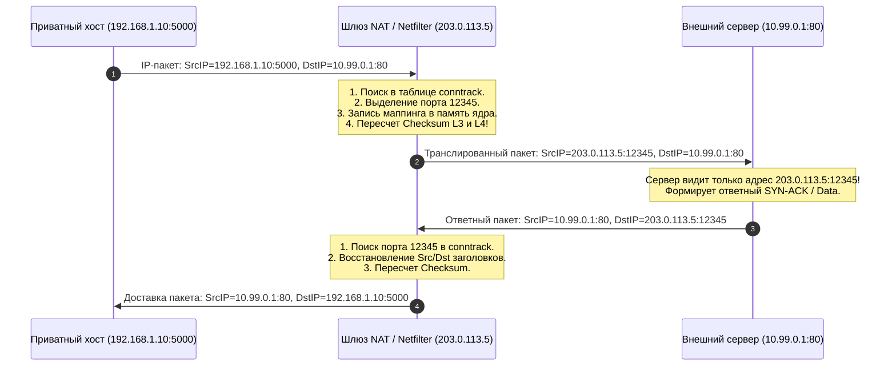
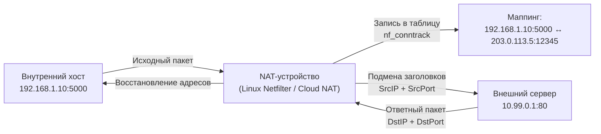
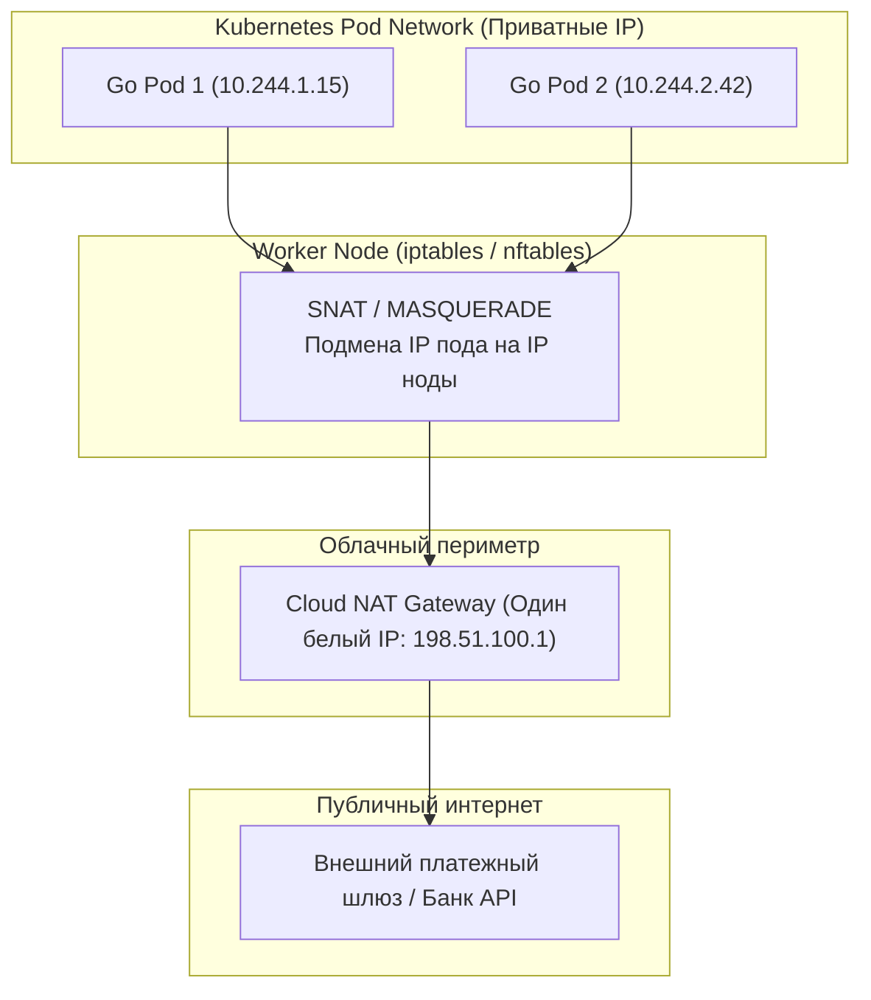
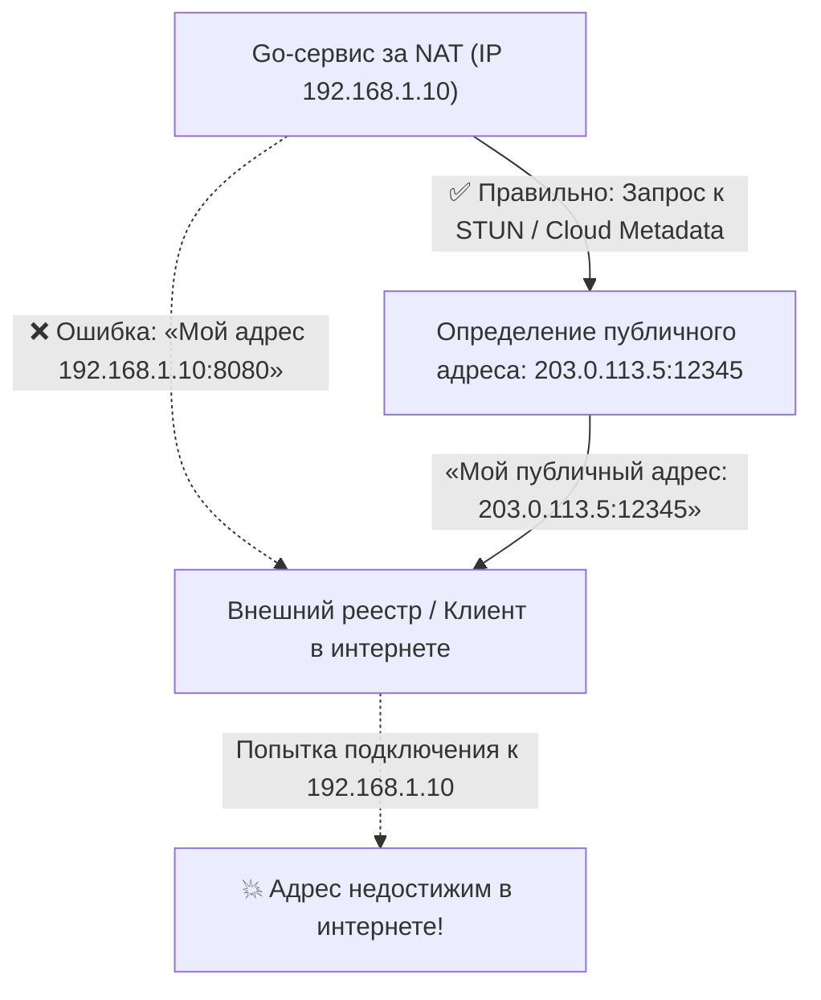
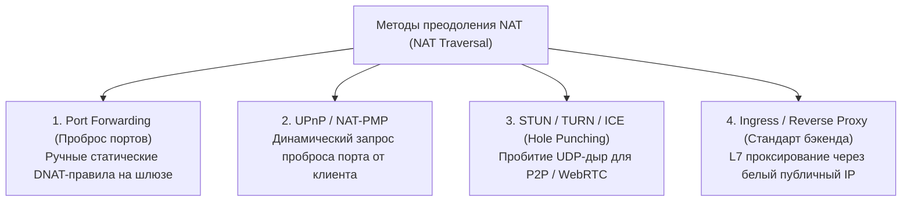
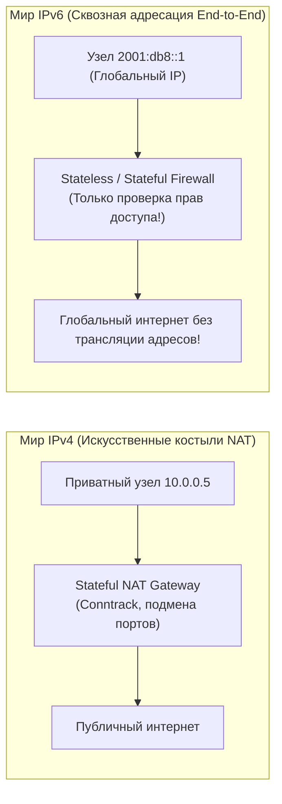

# NAT, PAT и почему приватные сети работают через один IP

> *"All problems in computer science can be solved by another level of indirection, except of course for the problem of too many levels of indirection."*  
> — Дэвид Уилер

Представьте себе огромный офисный небоскреб, где работают тысячи сотрудников. В телефонном справочнике города у этого здания указан всего один публичный телефонный номер — например, `203.0.113.5`. При этом у каждого сотрудника на рабочем столе стоит внутренний телефон со своим добавочным номером: отдел логистики сидит на номере 5000 (`192.168.1.10:5000`), бухгалтерия — на 5001, а серверная — на 5002.

Когда инженер с добавочного номера 5000 звонит внешнему клиенту, телефонная станция здания (PBX) занимает одну из свободных внешних линий — скажем, линию №`12345` — и связывается с абонентом. На экране телефонного аппарата клиента высвечивается единый офисный номер с линией `203.0.113.5:12345`. Коммутатор офиса делает пометку в журнале: *«Внешняя линия 12345 в данный момент соединена с внутренним сотрудником 5000»*. Когда внешний собеседник произносит фразу, станция направляет звуковой сигнал точно в трубку инженера. 

Но если случайный человек с улицы попытается напрямую позвонить из города на внутренний добавочный номер 5000, звонок сорвется. Городская сеть понятия не имеет о внутренних добавочных номерах здания: звонящий наткнется на секретаря или голосовое меню на главной линии, либо вызов будет отброшен.

В архитектуре компьютерных сетей эта телефонная станция называется **NAT (Network Address Translation)**, а ее порт-ориентированная разновидность — **PAT (Port Address Translation)**. Для разработчика высоконагруженных бэкенд-систем на Go понимание NAT критично: 99% ваших микросервисов, подов Kubernetes, виртуальных машин в AWS или Yandex Cloud живут в изолированных приватных сетях и выходят в открытый мир исключительно через трансляцию адресов.

---

## Проблема исчерпания IPv4 и рождение NAT

Когда в 1981 году отцы-основатели интернета специфицировали протокол IPv4 в RFC 791, 32-битное адресное пространство казалось неисчерпаемым океаном:

$$2^{32} = 4\,294\,967\,296 \text{ адресов}$$

Четыре миллиарда адресов представлялись колоссальной цифрой для мира мейнфреймов и университетских лабораторий. Однако к середине 1990-х годов стремительный взрыв персональных компьютеров, а затем серверов и мобильных устройств поставил мировую сеть на грань катастрофы: глобальные пулы свободных публичных адресов IPv4 стремительно иссякали.

Кардинальным архитектурным решением проблемы стало создание стандарта IPv6 со 128-битными адресами ([[4. IP. IPv4, IPv6 и устройство сетевого пакета.md]]). Однако одномоментно заменить всё сетевое оборудование планеты было невозможно. В качестве временного, но гениального инженерного компромисса инженеры IETF предложили технологию **NAT (RFC 1631)** в сочетании с выделением диапазонов **приватных IP-адресов (RFC 1918)**:

| Диапазон приватных сетей | Бесклассовая маска (CIDR) | Количество адресов | Типичная сфера применения |
|---|:---:|:---:|---|
| `10.0.0.0` – `10.255.255.255` | **`10.0.0.0/8`** | 16 777 216 | Корпоративные ЦОД, Kubernetes Pod Networks, VPC облаков |
| `172.16.0.0` – `172.31.255.255` | **`172.16.0.0/12`** | 1 048 576 | Docker default bridge, внутренние сервисные подсети |
| `192.168.0.0` – `192.168.255.255` | **`192.168.0.0/16`** | 65 536 | Домашние Wi-Fi роутеры, небольшие офисные локальные сети (SOHO) |

Эти диапазоны зарезервированы исключительно для локального использования. Интернет-провайдеры и магистральные маршрутизаторы гарантированно отбрасывают любые пакеты, в заголовках которых указаны адреса из RFC 1918. 

Благодаря NAT миллионы независимых локальных сетей по всей планете могут использовать одни и те же IP-адреса (у каждого дома настроена сеть `192.168.1.0/24`), но при выходе в интернет все устройства компании или квартиры делят **один общий публичный IP-адрес**.

---

## Как работает NAT и PAT (под капотом)

Классический статический NAT (One-to-One NAT) просто заменяет один IP-адрес на другой без изменения портов. Это не спасает от исчерпания адресов. Настоящей рабочей лошадкой современного интернета является динамический **PAT (Port Address Translation)**, также называемый NAPT (Network Address Port Translation) или **Source NAT (SNAT)** с маскарадингом (Masquerade).

### Пошаговый алгоритм трансляции исходящего пакета

Рассмотрим жизненный цикл сетевого пакета, когда контейнер с IP-адресом `192.168.1.10` отправляет HTTP-запрос со своего эфемерного порта `5000` на внешний веб-сервер `10.99.0.1:80`. Роль NAT-шлюза выполняет Linux-маршрутизатор с публичным внешним адресом `203.0.113.5`.



1. **Инициация сессии:** Приватный узел отправляет пакет: `SrcIP:SrcPort` = `192.168.1.10:5000`, а `DstIP:DstPort` = `10.99.0.1:80`.
2. **Перехват пакета ядром NAT:** Пакет попадает на маршрутизатор через правило маршрутизации шлюза по умолчанию ([[6. Маршрутизация. Таблица маршрутов, шлюзы и default route.md]]).
3. **Поиск в таблице состояний (Connection Tracking Table):** Ядро проверяет системную таблицу `conntrack`. Если это новый поток, шлюз выделяет свободный порт из своего внешнего диапазона — например, `12345`.
4. **Трансляция и мутация заголовков:** Ядро Linux прямо в структуре `sk_buff` перезаписывает поля IP и TCP:
   - `SrcIP` подменяется на публичный `203.0.113.5`;
   - `SrcPort` подменяется на выделенный `12345`.
   - **Mechanical Sympathy:** Поскольку заголовки изменились, ядро обязано заново пересчитать контрольные суммы IPv4 Header Checksum и TCP Checksum! Современные сетевые адаптеры с поддержкой Hardware Checksum Offloading делают это аппаратно на кремниевом чипе.
5. **Сохранение маппинга:** В памяти ядра фиксируется двунаправленная связь:  
   `192.168.1.10:5000` $\longleftrightarrow$ `203.0.113.5:12345` $\longleftrightarrow$ `10.99.0.1:80`.
6. **Ответ внешнего сервера:** Внешний сервер получает пакет и отвечает на адрес источника: `DstIP` = `203.0.113.5`, `DstPort` = `12345`.
7. **Обратная демультиплексация:** NAT-шлюз перехватывает ответный кадр, находит по порту `12345` исходную сессию в таблице `conntrack`, восстанавливает заголовки `DstIP` $\to$ `192.168.1.10`, `DstPort` $\to$ `5000` и отправляет кадр во внутреннюю подсеть.



> [!info] Под капотом: Подсистема Netfilter и `nf_conntrack`
> В операционной системе Linux механизм трансляции адресов построен на базе модулей ядра **Netfilter** и подсистемы отслеживания состояний соединений **`nf_conntrack`** ([[32. Firewall, iptables, nftables и базовая фильтрация трафика.md]]).  
> 
> NAT является **состоятельным (Stateful)**: ядро обязано помнить историю каждого установленного TCP- или UDP-потока. Для каждого соединения создается структура данных в кэше ядра, отслеживающая фазы жизненного цикла: `SYN_SENT`, `ESTABLISHED`, `TIME_WAIT` и закрытие соединения.  
> Если для неактивного TCP-соединения не поступает пакетов, запись хранится в памяти до истечения таймаута: для установленных сессий `ESTABLISHED` по умолчанию в Linux таймаут составляет **432 000 секунд (5 суток)**, однако в облачных NAT-шлюзах (AWS NAT Gateway, GCP Cloud NAT) его часто принудительно урезают до **350 секунд** ради экономии памяти!

---

## Влияние на Go-разработчика и бэкенд-архитектуру

В эпоху классических монолитных серверов с выделенными «белыми» IP-адресами разработчик мог не думать о трансляции адресов. Но в микросервисной архитектуре, облачных сервисах и контейнерах Kubernetes ([[41. Kubernetes Networking. CNI, Pod Network, Service, Ingress.md]]) весь трафик бэкенда проходит через несколько слоев NAT:
* Виртуальные интерфейсы контейнеров (veth) транслируются через iptables/nftables на ноде;
* Исходящий интернет-трафик кластера выходит через корпоративный Egress NAT Gateway;
* Входящий трафик направляется через Ingress Controller и балансировщики L4/L7.



> [!warning] Ловушка / Gotcha: Исчерпание таблицы Conntrack (Connection Tracking Exhaustion)
> Память ядра Linux не бесконечна. Максимальный размер таблицы отслеживания соединений строго лимитирован системным параметром:  
> `net.netfilter.nf_conntrack_max`.  
> 
> Каждая запись в `nf_conntrack` занимает около **320–352 байт** невыгружаемой оперативной памяти ядра (SLAB-кэш). Если на сервере развернут высоконагруженный Go-сервис, который делает сотни тысяч коротких исходящих HTTP/gRPC запросов без повторного использования соединений (HTTP Keep-Alive отключен или пулы коннектов не настроены), таблица мгновенно заполняется устаревшими записями в состоянии `TIME_WAIT`.  
> 
> Когда лимит исчерпан, ядро Linux начинает беспощадно отбрасывать любые новые пакеты (политика `DROP` с системной пометкой `NO ROUTE`):
> ```text
> kernel: nf_conntrack: table full, dropping packet
> ```
> 
> **Симптомы в коде на Go:**  
> Клиентские вызовы начинают падать с загадочными ошибками:  
> `dial tcp: connect: no route to host`  
> либо запросы зависают по таймауту контекста, не дождавшись TCP SYN-ACK. Сетевой поллер Go (`[[38. Как Go работает с сетью. net, net_http, netpoller, epoll.md]]`) просто бесконечно ждет ответа от дескриптора сокета.  
> 
> **Диагностика и мониторинг:**  
> Всегда ставьте алерты на текущий размер таблицы:
> ```bash
> $ cat /proc/sys/net/netfilter/nf_conntrack_count
> ```

---

## Привязка к адресам в Go

Когда вы разрабатываете сетевой сервер на Go и вызываете стандартный метод прослушивания входящих подключений:

```go
listener, err := net.Listen("tcp", ":8080")
```

Рантайм Go передает ядру системный вызов `bind(fd, 0.0.0.0:8080)`. Маска **`0.0.0.0`** означает привязку ко всем сетевым интерфейсам хоста. Внутри приватной сети за NAT сервер работает безупречно: локальные запросы успешно принимаются.

Однако фундаментальная проблема возникает тогда, когда бэкенд на Go должен сообщить свой сетевой адрес внешнему клиенту или стороннему сервису — например, при регистрации в Service Discovery, при работе с пиринговыми протоколами, SIP-телефонией, WebRTC или при передаче Webhook Callback URL:



Если сервис на Go наивно считает локальный адрес интерфейса (`192.168.1.10`) через функцию `net.InterfaceAddrs()` и отправит его внешнему клиенту, клиент никогда не сможет к нему подключиться!

Для корректной работы в таких архитектурах приложение на Go должно динамически определять свой внешний публичный адрес с помощью протокола **STUN (Session Traversal Utilities for NAT)** либо через доверенный сервис метаданных облачного провайдера (AWS EC2 Metadata Service по адресу `http://169.254.169.254/latest/meta-data/public-ipv4` или аналогичный сервис в Google Cloud).

Следующий рабочий пример на Go демонстрирует корректное определение локальных приватных адресов и демонстрацию взаимодействия с сокетом:

```go
package main

import (
	"fmt"
	"log"
	"net"
	"net/netip"
)

// Демонстрация классификации адресов: локальные приватные (RFC 1918) против публичных
func main() {
	// Список адресов для анализа
	sampleAddrs := []string{
		"192.168.1.10",
		"10.244.0.15",
		"172.20.10.5",
		"203.0.113.5",
		"127.0.0.1",
	}

	fmt.Println("=== Анализ IP-адресов в контексте NAT и RFC 1918 (Go netip) ===")
	for _, raw := range sampleAddrs {
		addr, err := netip.ParseAddr(raw)
		if err != nil {
			log.Printf("Некорректный IP: %v", err)
			continue
		}

		// Современный пакет net/netip предоставляет быстрые методы без аллокаций
		isPrivate := addr.IsPrivate()
		isLoopback := addr.IsLoopback()

		status := "Публичный (Интернет / Egress IP)"
		if isLoopback {
			status = "Локальная петля (Loopback)"
		} else if isPrivate {
			status = "Приватный за NAT (RFC 1918 — не маршрутизируется в WAN)"
		}

		fmt.Printf("IP: %-15s -> %s\n", addr.String(), status)
	}

	// Запуск сетевого сервера
	listener, err := net.Listen("tcp", ":8080")
	if err != nil {
		log.Fatalf("Ошибка Listen: %v", err)
	}
	defer listener.Close()

	fmt.Println("\n[OK] Сервер слушает сокет на всех интерфейсах (0.0.0.0:8080)")
}
```

---

## NAT Traversal и проблемы состояний

Фундаментальное свойство NAT: **он работает в одностороннем порядке**.  
Внутренний узел может легко инициировать исходящее соединение во внешний мир (Outbound). Но внешний клиент в интернете **принципиально не может** инициировать входящее подключение к серверу за NAT (Inbound), поскольку на шлюзе отсутствует соответствующая запись в таблице трансляции, а публичный порт никем не зарезервирован.

Для преодоления этой проблемы (NAT Traversal) инженеры используют четыре классических архитектурных подхода:



1. **Static Port Forwarding (DNAT):** Администратор роутера вручную настраивает постоянное правило: *«Любой трафик, пришедший на публичный порт `203.0.113.5:8080`, безусловно пересылать на `192.168.1.10:8080`»*. Метод не масштабируется в облаках.
2. **UPnP (Universal Plug and Play):** Протокол локальной сети, позволяющий приложению автоматически запросить у домашнего роутера открытие временного порта. Имеет фатальные уязвимости безопасности и запрещен в корпоративных ЦОД.
3. **STUN / TURN / ICE (Hole Punching — «Пробитие дыр»):** Фундамент технологии WebRTC и P2P-сетей. Клиент отправляет UDP-пакет на публичный STUN-сервер. В этот момент NAT-роутер открывает временное «окно» в таблице `conntrack`. Узнав свой внешний порт через STUN, два приватных клиента одновременно шлют UDP-пакеты на порты друг друга, обманывая механизмы фильтрации NAT. Если маршрутизатор использует строгий симметричный NAT (Symmetric NAT, меняющий порт для каждого нового адреса назначения), прямое соединение невозможно, и весь трафик ретранслируется через промежуточный релейный сервер TURN.
4. **Reverse Proxy и Ingress Controllers:** Промышленный стандарт микросервисной разработки. Мы не пробиваем порты наружу. Вместо этого на границе облака выставляется реверс-прокси с публичным IP ([[27. Прокси, Reverse Proxy и API Gateway.md]], [[28. nginx, Envoy и HAProxy. Как работают современные прокси.md]]). Балансировщик принимает входящие HTTP/gRPC запросы клиентов и проксирует их во внутреннюю изолированную сеть подов.

> [!tip] Собеседование: Бесшумная смерть TCP-сессий при перезагрузке NAT
> **Вопрос:** Что произойдет с долгоживущим TCP-соединением между Go-клиентом и внешней базой данных, если промежуточный NAT-шлюз внезапно перезагрузится или сбросит таблицу состояний? Как защитить сервис?  
> **Ответ:**  
> При аппаратной или программной перезагрузке NAT-маршрутизатора его таблица `conntrack` в оперативной памяти полностью стирается.  
> При этом в операционных системах клиента и сервера сокеты продолжают находиться в статусе **`ESTABLISHED`**! Ни один из узлов не отправлял управляющие флаги `FIN` или `RST`.  
> 
> Когда Go-приложение попытается отправить очередной пакет с данными в существующий сокет `net.Conn`, NAT-шлюз не найдет соответствия в чистой таблице и просто отбросит пакет, либо сервер вернет флаг `RST` в ответ на неожиданный номер последовательности `ACK`. Если же сокет простаивает без передачи данных, клиент может сутками ждать ответа, заблокировав горутину.  
> 
> **Методы защиты в коде на Go:**
> 1. Включение системного механизма **TCP KeepAlive** в структуре `net.Dialer{KeepAlive: 15 * time.Second}` ([[12. TCP Retransmission, Keep Alive, Nagle и Delayed ACK.md]]). Ядро периодически отправляет пустые контрольные зонды, предотвращая удаление записи из NAT-таблицы по таймауту неактивности и быстро детектируя разрыв соединения.
> 2. Реализация прикладных проверок пульса (**Application-Level Heartbeats / Ping-Pong**) в протоколах WebSocket, gRPC и SSE ([[25. WebSocket, SSE и долгоживущие соединения.md]]).
> 3. Рантайм Go не восстанавливает разорванные TCP-сокета самостоятельно. В прикладном коде всегда должна быть заложена логика автоматического переподключения (Reconnect Loop с Exponential Backoff).

---

## IPv6: Почему NAT отмирает

Главная историческая причина появления NAT заключалась в острейшем дефиците адресов IPv4. 

В глобальном протоколе нового поколения IPv6 ([[4. IP. IPv4, IPv6 и устройство сетевого пакета.md]]) адресное пространство практически бесконечно: 128 бит адреса обеспечивают $3.4 \times 10^{38}$ уникальных адресов. Стандартная архитектура IPv6 выделяет каждому конечному абоненту, серверу или даже отдельному поду Kubernetes персональную подсеть размером **`/64`** (это $1.8 \times 10^{19}$ адресов на один интерфейс!).



### Преимущества мира без NAT в IPv6:
1. **Восстановление сквозной связности (End-to-End Connectivity):** Каждый контейнер или микросервис получает честный глобальный IP-адрес. Любые два сервиса могут связаться напрямую без сложных костылей вроде STUN, TURN или проброса портов.
2. **Ликвидация узкого горлышка Conntrack:** Маршрутизаторам больше не требуется вести колоссальные таблицы состояний и пересчитывать контрольные суммы для миллионов одновременных соединений. Сеть становится быстрее, дешевле и надежнее.
3. **Исчезновение проблемы исчерпания портов:** Проблема нехватки 65 535 исходящих портов ([[39. TIME_WAIT, Port Exhaustion и другие проблемы TCP-сервисов.md]]) полностью растворяется.
4. **Простая сетевая архитектура Kubernetes:** В чистых IPv6-кластерах CNI-плагины маршрутизируют трафик напрямую по проводам дата-центра без накладных расходов на инкапсуляцию и оверлеи.
5. **Безопасность через файрвол, а не через NAT:** Бытует опасный миф, будто NAT защищает сеть. Это заблуждение: безопасность обеспечивается фильтрацией пакетов файрволом, а не подменой адресов. В IPv6 межсетевые экраны блокируют неавторизованный входящий трафик точно так же, но без вредных побочных эффектов трансляции заголовков.

Современный сетевой стек Linux (`[[37. Сетевой стек Linux под капотом]]`) и сокетное API Go (`[[15. Порты, сокеты и Socket API]]`) поддерживают работу в режиме **Dual-Stack**, позволяя бэкенд-приложениям прозрачно обслуживать как легаси-клиентов за IPv4 NAT, так и современные сквозные соединения IPv6.

---

## Итог

Трансляция сетевых адресов — это один из самых влиятельных инженерных компромиссов в истории вычислительной техники, продливший жизнь протоколу IPv4 на три десятилетия:

1. **Назначение NAT/PAT:** Позволяет многотысячным пулам внутренних компьютеров и контейнеров делить один общий публичный IP-адрес за счет динамической подмены портов L4.
2. **Stateful-природа:** Ядро Linux непрерывно поддерживает состояние каждого потока через таблицу `nf_conntrack`. Любая модификация пакета требует пересчета контрольных сумм L3 и L4.
3. **Уязвимость Conntrack:** Переполнение таблицы `net.netfilter.nf_conntrack_max` приводит к тихому отбрасыванию пакетов с ошибками `dial tcp: connect: no route to host` в Go.
4. **Асимметрия входящего трафика:** NAT блокирует любые прямые входящие соединения из внешнего мира, требуя использования Ingress-контроллеров, реверс-прокси или техник NAT Traversal (STUN/TURN).
5. **Бесшумный разрыв сессий:** Перезагрузка NAT-маршрутизатора уничтожает сокетные сессии без отправки `FIN`/`RST`. Разработчик на Go обязан защищать соединения с помощью TCP KeepAlive и прикладных heartbeat-проверок.
6. **Будущее за IPv6:** Протокол IPv6 со сквозными адресами префиксов `/64` полностью устраняет потребность в трансляции адресов, возвращая интернету изначальную простоту архитектуры End-to-End.

Мы изучили, как изолированные приватные сети выходят в глобальный интернет через один публичный адрес. Но как изолировать трафик внутри самого дата-центра или облачного кластера, разделив сеть на независимые виртуальные сегменты для безопасности и мультитенантности?

В следующей лекции мы разберем технологии виртуализации канального и сетевого уровней: изучим тегирование 802.1Q VLAN и современные оверлейные туннели VXLAN в [[9. VLAN, VXLAN и сегментация сети.md]].