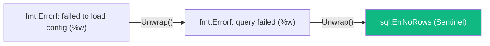

# Обработка ошибок в Go. if err != nil как часть дизайна

В инженерной практике надежность системы проверяется не тем, как она работает в идеальных условиях, а тем, как она встречает неизбежные сбои. Написать код «счастливого пути» (Happy Path) способен любой новичок. Но именно продуманная обработка отказов сети, дискового ввода-вывода и некорректных входных данных отделяет любительский скрипт от промышленного сервиса, выдерживающего годы непрерывной эксплуатации.

В предыдущей статье мы выяснили фундаментальную причину, почему создатели Go отказались от неявных исключений: они стремились сделать поток управления (Control Flow) абсолютно прозрачным и линейным.

Однако концепция «ошибки — это значения» раскрывает свой потенциал только в том случае, если инженер умеет виртуозно управлять этими значениями. Конструкцию `if err != nil` дилетанты часто называют «утомительным бойлерплейтом». В руках опытного gopher-а этот блок представляет собой интеллектуальный узел маршрутизации: здесь ошибка обогащается контекстом, здесь принимается решение о повторе (retry), откате транзакции или эскалации сбоя на верхний уровень.

Давайте детально разберем внутреннее устройство типа `error`, главные подводные камни рантайма и современные идиоматичные стандарты обработки ошибок в Go.

---

## Что такое `error` под капотом?

Прежде всего, `error` — это не встроенный компиляторный примитив и не числовой код возврата. Это самый обыкновенный интерфейс, объявленный в базовом пакете языка (`builtin`):

```go
type error interface {
    Error() string
}
```

Любая структура данных, для которой определен метод `Error() string`, автоматически реализует этот интерфейс и может возвращаться в качестве ошибки.

> [!info] Под капотом: Структура `iface`
> В рантайме Go интерфейс с методами представляется внутренней структурой `iface` (размером 16 байт на 64-битной архитектуре). Она состоит ровно из двух 8-байтных указателей:
> 1. `tab` (или `_type`): указатель на таблицу интерфейса (`itab`), содержащую метаданные о конкретном типе значения и адреса скомпилированных методов.
> 2. `data`: указатель на непосредственное значение или экземпляр структуры в памяти.
>
> Интерфейсное значение считается равным `nil` **только тогда, когда оба внутренних указателя (`tab` и `data`) равны `nil`**.

```
Интерфейс iface в памяти:
┌───────────────────────────────┐
│ tab  *itab                    │ ────► [*itab: тип структуры + метод Error()]
├───────────────────────────────┤
│ data unsafe.Pointer           │ ────► [Данные структуры ошибки]
└───────────────────────────────┘
```

Понимание этой двухкомпонентной структуры критически необходимо для избежания самой коварной ловушки языка, на которой регулярно спотыкаются даже опытные программисты.

> [!warning] Ловушка / Gotcha: Интерфейс с nil-значением не равен nil
> Представьте, что вы создали собственный тип ошибки:
> ```go
> type MyError struct { Msg string }
> func (e *MyError) Error() string { return e.Msg }
> ```
> И написали следующую функцию:
> ```go
> func doWork() error {
>     var err *MyError = nil // Явно типизированный nil-указатель
>     // ... бизнес-логика отработала успешно, ошибка не возникла ...
>     return err // Возвращаем nil-указатель
> }
> ```
> Вызывающий код проверяет результат:
> ```go
> if err := doWork(); err != nil {
>     // УСЛОВИЕ ВЫПОЛНИТСЯ! Программа решит, что произошла ошибка!
> }
> ```
> **Почему это происходит?**  
> Функция декларирует возврат интерфейса `error`. При возврате типизированного указателя `*MyError(nil)` рантайм Go упаковывает его в интерфейс `iface`. Указатель `data` действительно равен `nil`, но указатель `tab` **не равен nil** — он указывает на метаданные типа `*MyError`! Поскольку интерфейс `iface` содержит непустой `tab`, проверка `err != nil` возвращает `true`.
>
> **Железное правило:** Если в функции не произошло ошибки, всегда возвращайте нетипизированный литерал `nil`: `return nil`.

---

## Типы ошибок в Go

В современной практике разработки на Go выделяют три основных паттерна работы с ошибками.

### 1. Сигнальные ошибки (Sentinel Errors)

Сигнальные ошибки — это глобальные неизменяемые переменные на уровне пакета, сигнализирующие о конкретном известном результате операции. Классические примеры из стандартной библиотеки: `sql.ErrNoRows` или `io.EOF`.

```go
var ErrUserNotFound = errors.New("user not found")

func GetUser(id int) (*User, error) {
    if id == 0 {
        return nil, ErrUserNotFound
    }
    return &User{}, nil
}
```

**Когда применять:** Когда вызывающему коду важно категоризировать ситуацию (например, «запись не найдена — создадим новую»), но не требуются специфические детали инцидента. Сигнальные ошибки проверяются через функцию `errors.Is`.

### 2. Кастомные типы ошибок (Custom Error Types)

Когда сбою сопутствует богатый контекст (какой именно сетевой порт был недоступен, сколько попыток повтора было совершено, какой HTTP-статус вернуть клиенту), создается специализированная структура:

```go
type HTTPError struct {
    StatusCode int
    Err        error
}

func (e *HTTPError) Error() string {
    return fmt.Sprintf("status %d: %v", e.StatusCode, e.Err)
}
```

**Когда применять:** На стыке архитектурных слоев (например, при конвертации системных ошибок базы данных в прикладные ответы HTTP API) или в сложной доменной логике (DDD).

### 3. Обертывание ошибок (Error Wrapping)

До релиза Go 1.13 разработчики часто просто возвращали ошибку наверх: `return err`. В результате в логах продакшена появлялись загадочные сообщения: `connection refused`. Где именно произошел сбой? В соединении с Redis? При обращении к платежному шлюзу? На каком этапе?

Золотое правило промышленного Go:  
**Функция обязана либо полностью обработать ошибку на месте, либо обогатить ее контекстом текущей операции и вернуть наверх.**

Начиная с Go 1.13, пакет `fmt` поддерживает форматирующий глагол `%w` (wrap), позволяющий вложить исходную ошибку внутрь новой, формируя причинно-следственную цепочку (Error Chain):

```go
func fetchConfig() error {
    file, err := os.Open("config.json")
    if err != nil {
        // Оборачиваем ошибку, фиксируя контекст: ЧТО именно мы пытались сделать
        return fmt.Errorf("failed to open config: %w", err)
    }
    // ...
}
```

В журнале событий появится исчерпывающая запись: `failed to open config: open config.json: no such file or directory`. Инженер получает прозрачный причинный трейс без накладных расходов на генерацию полного стек-трейса.

---

## Проверка ошибок: errors.Is и errors.As

Поскольку ошибки оборачиваются друг в друга подобно матрешке, классическое прямое сравнение указателей `err == sql.ErrNoRows` перестало быть надежным: целевая ошибка `ErrNoRows` может быть запечатана на три уровня вглубь цепочки.

Для прозрачной работы с обернутыми ошибками стандартный пакет `errors` предоставляет две фундаментальные функции:



### `errors.Is`: Проверка факта

Функция рекурсивно раскручивает цепочку через метод `Unwrap()` и проверяет, совпадает ли какая-либо из вложенных ошибок с целевым значением (по значению или указателю):

```go
err := fetchConfig()
if errors.Is(err, os.ErrNotExist) {
    // Условие сработает, даже если ErrNotExist обернут трижды через %w
    log.Println("Файл конфигурации не найден, применяем дефолтные параметры")
}
```

### `errors.As`: Безопасное извлечение типа

Функция действует как рекурсивное приведение типов (Type Assertion). Она сканирует цепочку в поисках ошибки заданного *типа* и при успехе распаковывает ее в переданную переменную:

```go
var httpErr *HTTPError
// Обратите внимание: передается УКАЗАТЕЛЬ на переменную интерфейса/структуры (&httpErr)
if errors.As(err, &httpErr) {
    // Внутри блока безопасно читаем кастомные поля структуры
    w.WriteHeader(httpErr.StatusCode)
    w.Write([]byte(httpErr.Error()))
}
```

> [!tip] Собеседование
> **Вопрос:** В чем принципиальная разница между `errors.Is` и `errors.As`?
>
> **Ответ:** 
> * `errors.Is` сравнивает ошибку по значению (Equality Check) — это стандарт для сигнальных ошибок (Sentinel Errors, таких как `sql.ErrNoRows` или `os.ErrNotExist`). Также она учитывает кастомный метод `Is(target error) bool`.
> * `errors.As` ищет ошибку по конкретному типу данных (Type Check) и извлекает ее значение по переданному указателю, позволяя получить доступ к дополнительным полям (например, статус-коду или контексту валидации). Также она проверяет метод `As(target any) bool`.
> 
> Обе функции автоматически и рекурсивно вызывают метод `Unwrap()` у интерфейсов `interface{ Unwrap() error }` (или `Unwrap() []error`, появившийся в Go 1.20 для нескольких ошибок).

---

## Главный антипаттерн: Двойное логирование

Среди инженеров, только начинающих писать сервисы на Go, широко распространен вредный антипаттерн: логировать ошибку в месте возникновения и затем возвращать ее наверх.

**Антипаттерн (Засорение логов):**
```go
func InsertUser(db *sql.DB, u *User) error {
    err := db.QueryRow("...").Scan(&id)
    if err != nil {
        log.Printf("error inserting user: %v", err) // ❌ Логируем
        return err                                   // ❌ И возвращаем выше
    }
    return nil
}
```

Если подобный подход применить на всех слоях приложения (`Repository` -> `Service` -> `Transport`), то при единичном сбое базы данных в централизованной системе Observability (ELK, Grafana Loki) появится 3–4 дублирующих записи с разной степенью контекста. Во время серьезной аварии это приводит к шторму логов (Log Storm), забивает диск и превращает поиск первопричины в кошмар.

**Идиоматичный подход (Go-way):**
Ошибку следует логировать **ровно один раз** — на самом верхнем периметре системы (например, в HTTP Middleware, gRPC Interceptor или в корневой функции горутины). Внутренние функции только обогащают ошибку контекстом через `fmt.Errorf("%w")`.

```go
// Слой доступа к данным: только добавляем контекст операции
func InsertUser(db *sql.DB, u *User) error {
    err := db.QueryRow("...").Scan(&id)
    if err != nil {
        return fmt.Errorf("failed to insert user %s: %w", u.Email, err)
    }
    return nil
}

// Транспортный слой (Верхний уровень): логируем один раз и возвращаем статус клиенту
func UserHandler(w http.ResponseWriter, r *http.Request) {
    err := InsertUser(db, user)
    if err != nil {
        // Логируем один раз с полным сквозным контекстом!
        log.Printf("request failed: %v", err)
        http.Error(w, "Internal Server Error", 500)
        return
    }
}
```

---

## Итог

Конструкция `if err != nil` — это не признак примитивности языка, а фундаментальный инструмент обеспечения надежности:
1. **Прозрачность потока:** Каждая потенциальная точка сбоя видна непосредственно в коде.
2. **Контроль цепочек:** Форматирование `%w` строит ясные причинно-следственные связи без дорогого сбора стек-трейсов.
3. **Безопасность типов:** Функции `errors.Is` и `errors.As` гарантируют надежную проверку вложенных структур на границах систем.

Мы рассмотрели, как идиоматично управлять штатными сбоями распределенных систем. Но как реагировать, если программа столкнулась с фатальным состоянием, исключающим дальнейшую корректную работу — повреждением инвариантов памяти, делением на ноль или выходом за границы буфера? Для этих катастрофических инцидентов предназначен механизм паник.

В следующей лекции мы детально разберем темную сторону языка и правила обращения с ней: [[11. Panic и Recover. Когда они нужны, а когда вредны]].
