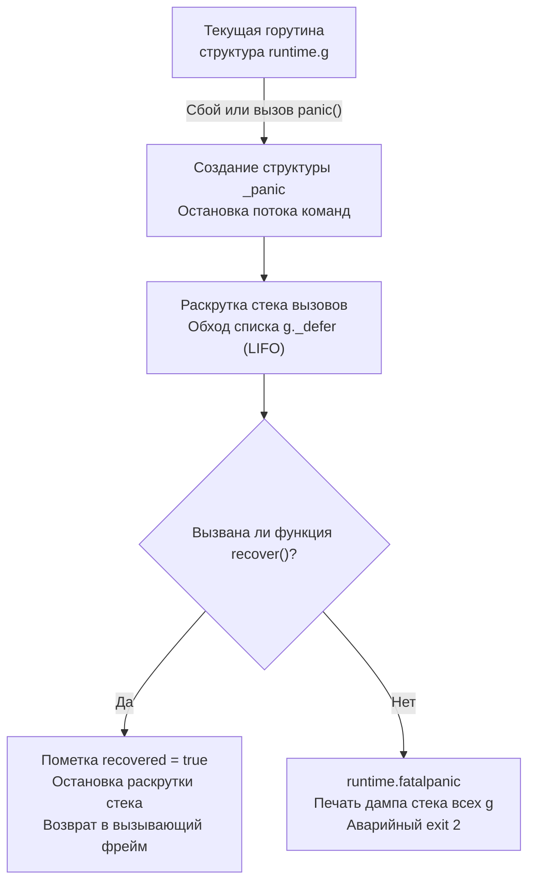

# Panic и Recover. Когда они нужны, а когда вредны

В предыдущих главах ([[9. Errors Are Values. Почему в Go нет исключений]] и [[10. Обработка ошибок в Go. if err != nil как часть дизайна]]) мы подробно исследовали главную инженерную мантру Go: штатные сбои распределенных систем обязаны передаваться как обычные значения через тип `error`.

Однако каждый, кто запускал Go-код в терминале, хотя бы раз сталкивался с ситуацией, когда программа внезапно падает с многостраничным дампом регистров и трассировкой стека: обращение по недопустимому индексу слайса (`arr[100]`), деление на ноль или разыменование указателя `nil`. В этот момент в бой вступает системный механизм **Panic (паника)**.

Разработчики, воспитанные в традициях Java, Python или C++, нередко смотрят на связку встроенных функций `panic` и `recover` и радостно восклицают: *«Эврика! Вот же они, наши старые добрые `throw` и `catch`, просто слегка замаскированные авторами Go! Сейчас мы напишем пару хелперов и вернем привычную обработку исключений»*. 

Это опаснейшая ментальная ловушка. Попытка использовать `panic` как замену исключениям в бизнес-логике разрушает архитектуру приложения, слепит оптимизирующий компилятор и многократно снижает пропускную способность сервиса на уровне кремния.

Давайте разберем, как `panic` и `recover` устроены в рантайме Go, почему их нельзя использовать для управления штатным потоком данных и где проходит тонкая граница их легитимного инженерного применения.

---

## Под капотом: Как работает Panic

В отличие от возврата значения ошибки, который выполняется за 0 наносекунд в регистрах процессора, возникновение паники запускает тяжеловесный спасательный конвейер внутри среды исполнения Go.

Когда программа вызывает явную инструкцию `panic("...")` или когда ядро процессора фиксирует аппаратный сбой (например, SIGFPE при целочисленном делении на ноль или SIGSEGV при разыменовании `nil`), компилятор передает управление функции рантайма `runtime.gopanic`.

Что происходит внутри рантайма в этот момент:
1. **Аллокация дескриптора паники:** Рантайм создает структуру `_panic` и связывает ее с текущей горутиной, помещая в заголовок связного списка `g._panic` (в структуре горутины `g`).
2. **Остановка нормального исполнения:** Текущая функция немедленно прерывает выполнение своих инструкций.
3. **Раскрутка стека и вызов defer:** Рантайм начинает процесс раскрутки стека (Stack Unwinding). Он последовательно обходит односвязный список отложенных вызовов (структуры `_defer`), привязанных к данной горутине через поле `g._defer`, и исполняет их в строгом порядке LIFO (Last In, First Out — последним вошел, первым вышел).
4. **Финал:** Если ни один из отложенных вызовов `defer` не нейтрализовал панику вызовом `recover`, рантайм вызывает процедуру `runtime.fatalpanic`. Процесс выводит в стандартный поток ошибок полный стек-трейс всех горутин и принудительно завершается операционной системой с кодом возврата `exit 2`.



### Механика Recover

Встроенная функция `recover()` — это единственный штатный способ перехватить падающую горутину и предотвратить крах процесса. Она обладает фундаментальным ограничением: **`recover()` имеет силу только внутри отложенной функции (`defer`)**.

Если `recover()` вызывается в обычном коде (вне контекста `defer`), она просто возвращает `nil` и не оказывает никакого эффекта.

Когда функция `recover()` срабатывает внутри отложенного вызова в момент активной паники, рантайм Go (`runtime.gorecover`):
1. Находит текущую активную структуру `_panic` в `g._panic`.
2. Выставляет в ней внутренний флаг `recovered = true`.
3. Извлекает и возвращает пользовательское значение, переданное аргументом в `panic()`.
4. Останавливает дальнейшую раскрутку стека.

> [!warning] Ловушка / Gotcha: Продолжение выполнения
> Ключевое отличие `recover` от классического блока `catch` в Java или C++ заключается в точке возобновления работы программы.
> 
> В Java после перехвата исключения в блоке `catch` исполнение продолжается со следующей строчки того же метода.
> 
> В Go перехват паники **никогда не возвращает управление в ту точку, где возникла паника**. Функция, в которой произошел сбой, уже безвозвратно уничтожена: ее стековый фрейм разобран, а локальные переменные потеряны. Выполнение возобновляется **в той функции, которая вызвала функцию с отложенным defer-ом**. Вы принципиально не можете «исправить ошибку на месте и повторить попытку».

---

## Почему эмуляция try/catch — это антипаттерн?

Представьте инженера, который решил обойти «скучные» проверки ошибок и написал следующий код в стиле псевдо-Java:

```go
// АНТИПАТТЕРН: Использование паники для бизнес-логики
func CreateUser(u *User) {
    if u.Name == "" {
        panic("validation error: empty name") // Эмулируем throw
    }
    // сохранение пользователя...
}

func Process() {
    defer func() {
        if r := recover(); r != nil {
            log.Println("Поймали ошибку:", r) // Эмулируем catch
        }
    }()
    CreateUser(&User{})
}
```

Почему такой подход категорически отвергается инженерной культурой Go:

1. **Разрушение контрактов API:** Глядя на сигнатуру `func CreateUser(u *User)`, программист (и вызывающий код) обоснованно считает, что операция детерминирована и завершается успешно. Сигнатура лжет. Любому читателю придется построчно изучать реализацию, чтобы обнаружить скрытую мину в виде `panic`.
2. **Колоссальный оверхед (Mechanical Sympathy):** Вызов `panic()` заставляет рантайм выделять структуры `_panic`, обходить связанные списки `_defer` и производить раскрутку стека инструкций. Это на два порядка (в 100–300 раз) медленнее, чем передача легковесного интерфейса `error` в регистрах процессора!
3. **Блокировка оптимизаций компилятора:** Компилятор Go активно применяет встраивание функций (Inlining) и анализ утечек памяти (Escape Analysis). Наличие неявного динамического прерывания стека блокирует большинство этих оптимизаций: компилятор перестраховывается и аллоцирует переменные в куче (Heap), увеличивая нагрузку на сборщик мусора.

> [!tip] Собеседование
> **Вопрос:** Вы разработали HTTP-сервер на Go. В одном из обработчиков запускается фоновая асинхронная задача `go doBackgroundWork()`, и внутри этой фоновой горутины случается `panic`. В функции `main` или в глобальном middleware HTTP-роутера у вас установлен перехватчик `defer recover()`. Упадет ли сервис целиком?
>
> **Ответ:** Сервер **гарантированно упадет**. 
> 
> Паника привязана строго к той горутине, в которой она была инициирована (поле `_panic` в структуре конкретной горутины `g`). Механизм `defer recover()` обходит список отложенных вызовов только своей собственной горутины. Он физически не способен перехватить панику в параллельной горутине `doBackgroundWork`. 
> 
> Рантайм обнаружит, что список `g._defer` фоновой горутины исчерпан, паника осталась неперехваченной, и вызовет `runtime.fatalpanic`, что приведет к мгновенному падению всего процесса операционной системы. 
> 
> **Вывод:** Каждая независимо порождаемая долгоживущая горутина обязана иметь собственный локальный `defer recover()`, если ее авария не должна приводить к краху всего сервиса.

---

## Когда Panic и Recover действительно нужны?

Несмотря на строжайший запрет на применение паник для управления бизнес-логикой, в промышленной инженерии Go существуют два абсолютно законных и необходимых сценария их использования.

### 1. Fail-Fast на этапе инициализации (Паттерн Must)

Если сервис при запуске не способен выполнить фундаментальные предусловия своего существования — например, не может прочитать файл конфигурации, подгрузить криптографические ключи или скомпилировать критически важный regex, — продолжать работу бессмысленно. 

Сервис не должен делать вид, что он готов принимать клиентский трафик. Попытка вернуть ошибку наверх до `main`, чтобы там написать громоздкое `if err != nil { os.Exit(1) }`, лишь загромождает код инициализации.

Идиоматичный подход Go — немедленное аварийное падение (**Fail-Fast**). В стандартной библиотеке функции, работающие по этому принципу, традиционно имеют префикс `Must`:

```go
// Идиоматично: инициализация на уровне пакета
// Если синтаксис регулярного выражения битый — это очевидный баг разработчика.
// Программа обязана упасть еще до того, как начнет обслуживать запросы.
var emailRegex = regexp.MustCompile(`^[a-z]+@[a-z]+\.[a-z]+$`)

// Внутреннее устройство MustCompile в стандартном пакете regexp:
func MustCompile(str string) *Regexp {
    regexp, err := Compile(str)
    if err != nil {
        panic(`regexp: Compile(` + quote(str) + `): ` + err.Error())
    }
    return regexp
}
```

### 2. Защита границ приложения (Boundary Defenses)

Сетевой сервер (HTTP, gRPC, WebSocket) — это долгоживущий демон, рассчитанный на обработку миллионов клиентских сессий. Если из-за скрытого бага в одной из сотен бизнес-функций конкретный экзотический запрос вызовет разыменование `nil`-указателя, эта ошибка убьет горутину этого запроса.

Позволить единичному некорректному запросу уронить весь физический сервер и разорвать соединения остальных 50 000 клиентов — недопустимо для production-системы.

Для предотвращения катастрофы на внешних границах приложения устанавливаются защитные перехватчики (Middleware):

```go
// Идиоматичный HTTP Middleware для изоляции сбоев
func PanicRecoveryMiddleware(next http.Handler) http.Handler {
    return http.HandlerFunc(func(w http.ResponseWriter, r *http.Request) {
        defer func() {
            if err := recover(); err != nil {
                // 1. Фиксируем полную трассировку стека в логах для исправления бага инженерами
                log.Printf("PANIC RECOVERED: %v\n%s", err, debug.Stack())
                
                // 2. Отвечаем клиенту корректным статус-кодом 500
                http.Error(w, "Internal Server Error", http.StatusInternalServerError)
            }
        }()
        
        // Выполняем цепочку обработчиков бизнес-логики
        next.ServeHTTP(w, r)
    })
}
```

Стандартный HTTP-сервер из пакета `net/http` по умолчанию содержит встроенный перехватчик `recover` для каждого входящего TCP-соединения. Но в самописных демонах, воркерах очередей сообщений (Kafka, RabbitMQ, NATS) обязанность по возведению защитного периметра целиком ложится на плечи разработчика.

---

## Итог

Разделение зон ответственности между ошибками и паниками в Go кристально ясно:

1. **Ошибки (`error`):** Предназначены для **ожидаемых сбоев** внешнего мира и бизнес-логики (сетевые таймауты, валидация полей, занятый порт). Они передаются как значения и обрабатываются явно.
2. **Паники (`panic`):** Предназначены для **багов программиста** (нарушение границ массивов, разыменование `nil`, deadlock) и критических проблем при старте приложения (паттерн `Must`).
3. **Восстановление (`recover`):** Служит исключительно **защитным периметром на границах системы** (HTTP middleware, фоновые воркеры), изолируя крах отдельной операции от падения всего сервиса.

Освоив механику обработки ошибок и паник, мы готовы перейти к исследованию архитектурной модели данных в Go. Почему создатели языка полностью исключили ключевое слово `extends` и как строить выразительные доменные модели через чистую композицию? Об этом пойдет речь в следующей статье: [[12. Composition Over Inheritance. Почему в Go нет наследования]].
