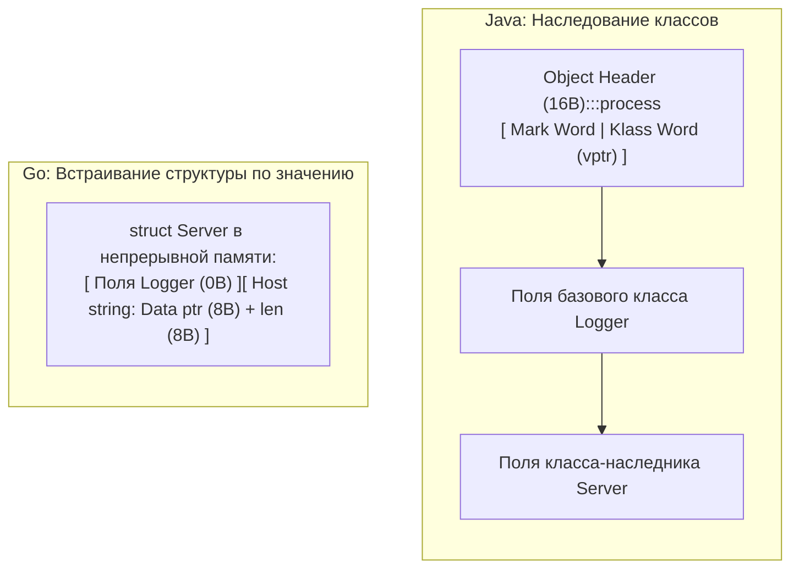

# Embedding. Как в Go реализуется композиция

В предыдущей статье ([[12. Composition Over Inheritance. Почему в Go нет наследования]]) мы детально разобрали, почему отцы-основатели Go сознательно отказались от классического наследования и связанных с ним таблиц виртуальных методов (`vtable`). 

Однако, если собирать систему исключительно через явную композицию (храня зависимые объекты как именованные поля), инженер неминуемо сталкивается с рутиной «бойлерплейта». Представьте, что ваш компонент `DB` обладает десятком полезных методов. Если вы поместите его обычным полем в структуру `UserRepository`, вам придется вручную писать 10 тривиальных методов-делегатов, единственная задача которых — перенаправить вызов внутрь `u.db.Query(...)`.

Чтобы избавить программиста от механической работы и сохранить чистоту архитектуры, создатели Go предложили элегантный механизм — **Встраивание (Embedding)**. Это синтаксический инструмент языка, позволяющий структурам заимствовать методы и поля других типов.

Внешне этот механизм настолько напоминает наследование, что подавляющее большинство программистов с бэкграундом в Java или C# попадают в ментальную ловушку, пытаясь использовать его как директиву `extends`. Но под капотом рантайма это совершенно иная инженерная модель.

---

## Механика встраивания: Поднятие методов (Method Promotion)

Встраивание происходит в тот момент, когда вы объявляете поле внутри структуры **без указания имени идентификатора**, оставляя только тип (так называемое анонимное поле):

```go
type Logger struct {}

func (l *Logger) Info(msg string) {
    fmt.Println("[INFO]", msg)
}

type Server struct {
    Logger // Анонимное поле — это и есть встраивание (Embedding)
    Host   string
}
```

Благодаря механизму **поднятия методов (Method Promotion)**, все поля и методы внутренней структуры `Logger` автоматически становятся доступны на верхнем уровне структуры `Server`. Мы можем вызывать их напрямую:

```go
srv := Server{Host: "localhost"}

// Метод Info доступен напрямую у экземпляра srv
srv.Info("Server started") 

// Под капотом компилятор Go разворачивает это обращение в строгую делегацию:
srv.Logger.Info("Server started")
```

Синтаксически это выглядит почти неотличимо от наследования, но принципиальная разница заключается в том, как структура располагается в физической памяти и как вызовы обрабатываются компилятором.

---

## Под капотом: Layout в памяти (Mechanical Sympathy)

В классических объектно-ориентированных языках (например, в Java при наследовании `class Server extends Logger`) среда исполнения создает сложный составной объект. Он включает в себя заголовок (**Object Header**) размером 12–16 байт с информацией о классе, битах синхронизации и указателем `vptr` для обеспечения полиморфизма.

В Go встраивание структуры по значению (`Logger`, а не `*Logger`) означает, что компилятор просто размещает поля встроенного типа **непосредственно внутри** внешней структуры `Server` в виде единого непрерывного блока байт:



Такая компоновка обеспечивает безупречную **локальность данных (Data Locality)**. При обращении к полям `Server` процессор загружает в кэш-линию L1 (размером 64 байта) всю структуру целиком. Здесь нет ни косвенных прыжков по адресам, ни фрагментации кучи, ни служебных заголовков.

---

## Ловушка №1: Перекрытие вместо Переопределения (Shadowing vs Overriding)

Это самый жесткий концептуальный барьер для тех, кто привык мыслить категориями полиморфизма подтипов. В классическом ООП дочерний класс может переопределить виртуальный метод базового класса (Override), и тогда методы базового класса начнут автоматически вызывать новую версию.

В Go динамической диспетчеризации для встроенных структур не существует. **Методы перекрываются (Shadowing), но никогда не переопределяются.**

Взгляните на классическую задачу, часто встречающуюся на технических интервью:

```go
type Base struct{}

func (b Base) Print() {
    fmt.Println("Base Print")
}

// Метод Run вызывает метод Print у своего ресивера
func (b Base) Run() {
    b.Print()
}

type Derived struct {
    Base
}

// Перекрываем метод Print у Derived
func (d Derived) Print() {
    fmt.Println("Derived Print")
}

func main() {
    d := Derived{}
    d.Run() // ЧТО БУДЕТ ВЫВЕДЕНО НА ЭКРАН?
}
```

> [!tip] Собеседование
> **Вопрос:** Что именно выведет вызов `d.Run()` и почему?
>
> **Ответ:** 
> Программа выведет: `Base Print`.
> 
> В Java или C++ (при условии виртуальности метода `Print`) вызов привел бы к печати `Derived Print`. Но в Go метод `Run` скомпилирован строго для ресивера `Base`. 
> 
> Когда мы пишем `d.Run()`, компилятор Go благодаря поднятию методов превращает это в явный вызов `d.Base.Run()`. Внутри тела метода `Run` ресивером `b` является исходная структура `Base`. Она **физически ничего не знает** о том, что была встроена в какую-то внешнюю структуру `Derived`! Поэтому вызов `b.Print()` обращается к собственной реализации из `Base`. Встраивание — это синтаксический сахар для явной композиции и делегации, в нем полностью отсутствует нисходящий виртуальный полиморфизм.

---

## Ловушка №2: Полиморфизм подтипов отсутствует (Subtyping)

Даже если структура `Server` встроила в себя `Logger`, она **не становится** типом `Logger`. Отношение «Is-A» в системе типов Go для структур не существует:

```go
func HandleLog(l Logger) {}

srv := Server{}
// HandleLog(srv) // ❌ ОШИБКА КОМПИЛЯЦИИ: cannot use srv (type Server) as type Logger
```

Компилятор строго пресекает попытки подмены типов. Если требуется написать функцию, способную одинаково оперировать и `Server`, и `Logger`, вы обязаны выделить **структурный интерфейс** (например, с методом `Info(string)`). Полиморфизм в Go реализуется исключительно через интерфейсы (`interface`).

---

## Встраивание по указателю vs Встраивание по значению

Язык позволяет встраивать структуры двумя способами: непосредственно по значению (`Struct`) или через указатель (`*Struct`).

```go
type Server struct {
    *Logger // Встраивание по указателю
}
```

Выбор между ними напрямую затрагивает управление памятью и стабильность сервиса:

1. **Опасность `nil`-разыменования:** При создании `srv := Server{}` встроенный указатель `Logger` равен `nil`. Любая попытка вызвать метод `srv.Info()` немедленно приведет к аварийной остановке `panic: nil pointer dereference`. Инженер обязан вручную инициализировать вложенное поле: `srv := Server{Logger: &Logger{}}`.
2. **Разделяемое состояние:** Если несколько экземпляров `Server` содержат указатель на один и тот же экземпляр `Logger`, они разделяют общую память, что требует строгой синхронизации при параллельном доступе.
3. **Нагрузка на Escape Analysis:** Встраивание по указателю часто заставляет компилятор отправлять структуру `Logger` в кучу (Heap), создавая дополнительную работу сборщику мусора и приводя к промахам кэша из-за дополнительной индирекции.

> [!warning] Ловушка / Gotcha: Встраивание sync.Mutex
> Начинающие разработчики часто встраивают мьютекс прямо в бизнес-структуру ради краткости синтаксиса:
> ```go
> type Cache struct {
>     sync.RWMutex // Встраивание по значению
>     data         map[string]string
> }
> ```
> Это позволяет элегантно писать `c.Lock()` и `c.Unlock()` без обращения к внутреннему полю. Однако в этом кроется смертельная опасность: **структура `Cache` становится строго некопируемой!**
> 
> Если случайно передать экземпляр `Cache` по значению (а не по указателю) в функцию или горутину, рантайм побайтово скопирует состояние мьютекса (включая флаги блокировки и счетчик заблокированных потоков). Это гарантированно приведет к неуловимым гонкам данных (Data Race) или взаимной блокировке (Deadlock). 
> 
> **Рекомендация:** Объявляйте мьютексы как явные приватные поля структуры: `mu sync.RWMutex`. Это не позволяет внешнему коду вызывать метод `Lock()` из публичного API и защищает инкапсуляцию.

---

## Конфликты имен (Коллизии)

Что произойдет, если встроить в одну структуру два типа, имеющих методы с совпадающими сигнатурами?

```go
type ReaderA struct{}
func (a ReaderA) Read() {}

type ReaderB struct{}
func (b ReaderB) Read() {}

type MultiReader struct {
    ReaderA
    ReaderB
}
```

Компилятор Go решает проблему коллизий в высшей степени прагматично:
1. Само по себе объявление структуры `MultiReader` **не вызывает ошибки компиляции**.
2. Ошибка компилятора `ambiguous selector` возникнет **только в момент прямого обращения**: `m.Read()`.
3. Чтобы устранить конфликт, достаточно явно указать путь диспетчеризации: `m.ReaderA.Read()` или `m.ReaderB.Read()`.

---

## Итог: Как правильно использовать встраивание

Встраивание (Embedding) в Go — это не эрзац наследования, а специализированный инженерный инструмент:

1. **Устранение шаблонного кода:** Позволяет быстро проксировать вызовы к проверенным низкоуровневым компонентам без ручного написания методов-делегатов.
2. **Композиция интерфейсов:** Позволяет легко собирать новые интерфейсы из базовых (например, `io.ReadWriter` собирается из `io.Reader` и `io.Writer`).
3. **Ортогональность:** Встроенная структура никогда ничего не знает о внешней оболочке, сохраняя независимость и тестируемость.

Мы убедились, что структуры в Go лишены возможности строить иерархии полиморфизма. Но как тогда в масштабных распределенных системах решать задачу абстракции — например, подменять реальную базу `PostgresDB` на тестовый `MockDB`?

Для этого Go предлагает один из самых совершенных механизмов в истории языков программирования — неявные структурные интерфейсы. К их исследованию мы переходим в следующей статье: [[14. Интерфейсы в Go. Неявная реализация и маленькие интерфейсы]].
