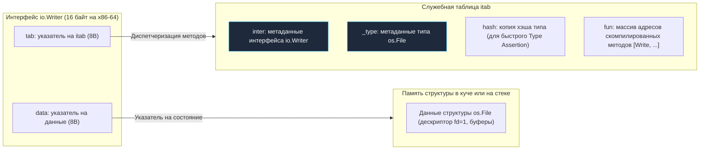

# Интерфейсы в Go как альтернатива классическому ООП

В языках классического объектно-ориентированного программирования (Java, C#, C++) концепция полиморфизма неразрывно спаяна с жесткой иерархией наследования. Если вы хотите, чтобы метод принимал различные типы объектов, эти типы обязаны **явно** декларировать свою принадлежность к общему предку через ключевое слово `implements` или `extends`.

В Go наследования нет в принципе (как мы убедились в [[12. Composition Over Inheritance. Почему в Go нет наследования]]). Всю ответственность за полиморфное поведение берут на себя интерфейсы. Но под капотом рантайма они устроены принципиально иначе, чем в привычных ООП-языках.

В C++ абстрактный интерфейс — это контракт, жестко вшитый в сам объект через скрытый указатель `vptr` и таблицу `vtable`. 

В Go интерфейс — это **самостоятельный легковесный рантайм-контейнер (Fat Pointer)**, который динамически упаковывает конкретную структуру в момент присваивания. Чтобы писать высокопроизводительный код и не попадаться в архитектурные ловушки, необходимо досконально понимать компоновку этого контейнера в памяти.

---

## Под капотом: iface и eface

В рантайме Go интерфейсы — это не просто абстрактные правила проверки типов компилятором. Это вполне осязаемые структуры данных в оперативной памяти, занимающие ровно два машинных слова (16 байт на 64-битной архитектуре x86-64 / ARM64).

Рантайм Go разделяет интерфейсы на два фундаментальных типа:
1. **`eface` (Empty Interface):** Пустой интерфейс `interface{}` (или псевдоним `any`, появившийся в Go 1.18). Он не содержит методов и способен хранить значение абсолютно любого типа. Состоит из указателя на описание типа `_type` и указателя на данные `data`.
2. **`iface`:** Непустой интерфейс, содержащий как минимум один метод (например, `io.Reader`, `io.Writer` или `error`).

Взглянем на внутреннее определение структуры `iface` из исходного кода рантайма Go (`src/runtime/runtime2.go`):

```go
type iface struct {
    tab  *itab          // Указатель на таблицу методов и метаданные типа
    data unsafe.Pointer // Указатель на реальные данные структуры в памяти
}
```

Когда вы присваиваете конкретное значение интерфейсной переменной:

```go
var w io.Writer = os.Stdout
```

Среда выполнения Go конструирует в стековом фрейме 16-байтную структуру `iface`:
* Поле `data` указывает на память структуры `os.File`.
* Поле `tab` указывает на специализированную таблицу `itab`.



> [!info] Под капотом: Таблица `itab`
> Таблица `itab` — это сердцевиный механизм полиморфизма в Go. Она генерируется **для каждой уникальной пары «Интерфейс + Конкретный Тип»**.
> 
> Внутри `itab` хранится хэш типа (позволяющий мгновенно проверять совместимость типов при `Type Assertion`), ссылка на метаданные исходного типа и, самое главное, массив функциональных указателей `fun`. Этот массив содержит абсолютные физические адреса скомпилированных функций в сегменте кода `.text`.
> 
> Когда код выполняет инструкцию `w.Write()`, процессор считывает адрес из `tab`, смещается до массива `fun`, извлекает адрес метода `Write` для типа `os.File` и совершает косвенный переход (Indirect Jump).

---

## Mechanical Sympathy: Цена полиморфизма

Понимание структуры `iface` позволяет трезво оценить накладные расходы полиморфизма на уровне физического кремния (Mechanical Sympathy):

1. **Аллокация в куче (Escape Analysis):**  
   Когда вы передаете структуру по значению в интерфейс (`var w io.Writer = MyStruct{}`), рантайм обязан сохранить указатель на нее в поле `iface.data`. Если интерфейсное значение покидает пределы локальной функции, компилятор не может гарантировать безопасность стека и принудительно переносит копию структуры в кучу (Heap), создавая работу сборщику мусора.
2. **Промахи кэша (Cache Misses):**  
   Вызов метода через интерфейс требует двух последовательных разыменований указателей: сначала чтение `tab -> fun` для получения адреса инструкции, затем чтение `data` -> `реальная память` для получения состояния полей. Если структуры или таблицы `itab` были вытеснены из L1/L2 кэша, процессор простаивает десятки тактов.
3. **Блокировка встраивания (Inlining):**  
   Прямой вызов метода конкретной структуры компилятор Go практически всегда заменяет телом функции (Inlining). Но полиморфный вызов через интерфейс заинлайнить невозможно, поскольку фактический адрес метода становится известен лишь в рантайме.

**Прагматичное правило архитектуры:**  
Не плодите интерфейсы превентивно! Классическая привычка из enterprise-Java создавать интерфейс `IUserService` к единственной структуре `UserService` в Go является антипаттерном. Если у структуры существует ровно одна реализация, всегда возвращайте конкретную структуру. Интерфейс должен появляться только тогда, когда вам действительно необходим полиморфизм или абстракция для тестов.

---

## Ловушка: Указатель на интерфейс (*interface)

Одна из самых грубых ошибок разработчиков, пришедших из C++ или C#, — попытка передать «указатель на интерфейс», наивно полагая, что это ускорит работу программы:

```go
// АНТИПАТТЕРН: Указатель на интерфейс
func WriteData(w *io.Writer) { // ❌ Грубейшая ошибка архитектуры
    // ...
}
```

Почему это архитектурный тупик:
1. **Интерфейс уже является контейнером указателей:** Значение `io.Writer` занимает всего 16 байт (два регистра процессора `RAX`/`RBX`). Передача его по значению практически бесплатна.
2. **Лишний уровень косвенности:** Конструкция `*io.Writer` создает указатель на 16-байтную структуру в памяти. Процессор вынужден делать тройной переход по памяти (Pointer to Fat Pointer to Data).
3. **Разрушение структурной типизации:** Вы больше не сможете передать обычный `*os.File` в эту функцию, потому что тип `*os.File` не является типом `*io.Writer`! Компилятор выдаст фатальную ошибку несовместимости типов.

> [!warning] Ловушка / Gotcha: Интерфейсы передаются только по значению
> Запомните жесткое правило: **Интерфейсы в Go передаются исключительно по значению.** 
> 
> Сам интерфейс внутри себя может указывать как на структуру по значению, так и на указатель. Но в сигнатурах функций всегда пишется `io.Writer`, а не `*io.Writer`. Единственное редкое исключение во всей стандартной библиотеке — функция `json.Unmarshal(data, &v)`, где указатель на пустой интерфейс `*any` необходим рефлексии, чтобы переписать сам контейнер интерфейса новым значением.

---

## Динамическая природа Go

В отличие от классических языков, где все таблицы виртуальных методов формируются статически на этапе сборки, построение таблиц `itab` в Go обладает удивительной гибкостью: они могут синтезироваться прямо **в процессе работы программы (в рантайме)**.

Представьте ситуацию приведения типов (Type Assertion) между интерфейсами:

```go
var r io.Reader = GetReader()
if closer, ok := r.(io.Closer); ok {
    closer.Close()
}
```

В момент выполнения проверки рантайм Go обращается к таблице методов исходного типа, спрятанного внутри `io.Reader`, и проверяет: реализует ли этот конкретный тип сигнатуру метода `Close() error`? 

Если проверка успешна, рантайм на лету компилирует новую таблицу `itab` для связки «Исходный Тип + `io.Closer`» и помещает ее в глобальный потокобезопасный кэш `itabTable` внутри рантайма. Все последующие приведения этого же типа будут выполняться мгновенно за время $O(1)$.

> [!tip] Собеседование
> **Вопрос:** Если интерфейс — это два 8-байтных указателя (`tab` и `data`), как именно рантайт выполняет операцию сравнения двух интерфейсов (`if a == b`)?
>
> **Ответ:** 
> Два интерфейса считаются равными тогда и только тогда, когда совпадают оба их внутренних компонента:
> 1. Сначала рантайм сравнивает указатели `tab` (или `_type` для пустых интерфейсов). Если динамические типы различаются — интерфейсы гарантированно не равны.
> 2. Если типы идентичны, рантайм переходит к сравнению поля `data`. Если внутри хранятся указатели, сравниваются физические адреса памяти. Если внутри интерфейса упаковано конкретное значение типа-значения (например, число `int` или структура), рантайм производит побайтовое сравнение содержимого памяти. 
> 
> *Важное следствие:* если внутри интерфейса лежит несравнимый тип (например, слайс `[]int` или мапа `map`), сравнение интерфейсов вызовет панику в рантайме!

---

## Итог

1. **Интерфейс в Go — это конкретный контейнер:** 16-байтный «толстый указатель» (`iface`), связывающий метаданные таблицы `itab` с реальными данными в памяти.
2. **Осознанная плата за полиморфизм:** Вызовы через интерфейс дороже прямых вызовов из-за невозможности инлайнинга и потенциальных аллокаций в куче.
3. **Строгая идиоматичность:** Интерфейсы всегда передаются по значению, инкапсулируя полиморфное поведение без построения хрупких иерархий классов.

Мы разобрались с тем, как интерфейсы функционируют на уровне памяти и машинных инструкций. Но почему разработчики по всему миру восхищаются интерфейсами Go? 

Дело в феноменальной гибкости: чтобы реализовать интерфейс, типу **вообще не нужно знать о существовании этого интерфейса**! Эта концепция структурной типизации (Duck Typing) кардинально преображает дизайн современных микросервисов. О ней мы поговорим в следующей статье: [[15. Duck Typing и неявная реализация интерфейсов]].
