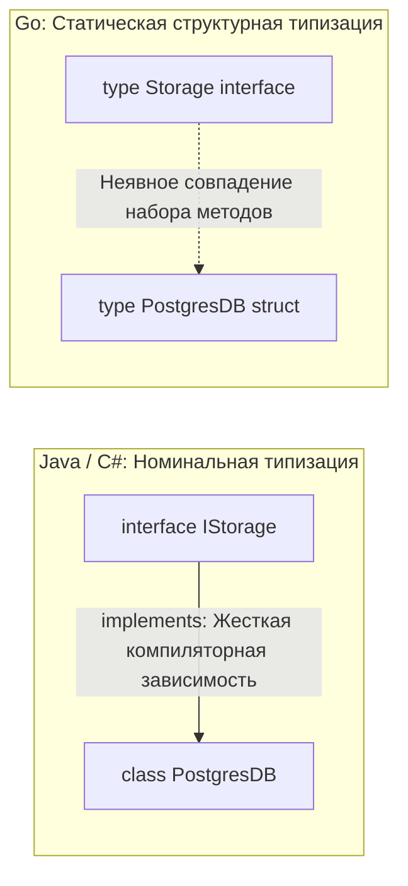
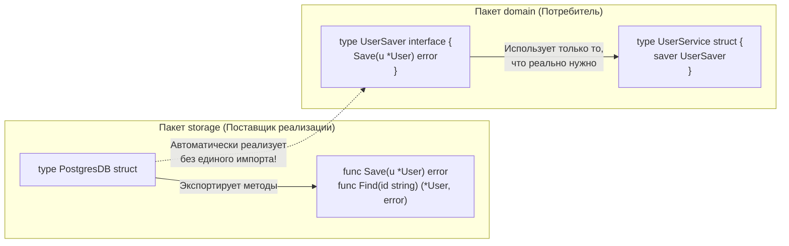

# Duck Typing и неявная реализация интерфейсов

Переход из мира языков с номинальной типизацией (Java, C#, C++, PHP) в экосистему Go неизменно сопровождается у инженера острым ощущением потери контроля. Вы создаете интерфейс, объявляете структуру, реализуете методы, но нигде в коде не пишете спасительное ключевое слово `implements`.

Кажется невероятным, но компилятор Go самостоятельно, без единой подсказки со стороны программиста, понимает, что ваша конкретная структура удовлетворяет требованиям интерфейса. Этот феномен в компьютерной литературе называют **Duck Typing (Утиная типизация)**, или, если выражаться языком строгой теории типов — **Статическая структурная типизация (Static Structural Subtyping)**.

Старая поговорка гласит: *«Если нечто выглядит как утка, плавает как утка и крякает как утка, то это, вероятно, и есть утка»*. 

Давайте разберем, почему Роб Пайк и Кен Томпсон сделали ставку на неявные интерфейсы, как компилятор находит соответствия за линейное время, и какие коварные ловушки адресации памяти подстерегают разработчика при работе с ресиверами методов.

---

## Номинальная типизация vs Структурная типизация

В традиционных enterprise-языках господствует **Номинальная типизация** (от латинского *nomen* — имя):

```java
// Java: Жесткая номинальная привязка
public class PostgresDB implements IStorage { ... }
```

Чтобы класс `PostgresDB` мог быть передан в функцию, ожидающую интерфейс `IStorage`, он обязан **явно задекларировать** эту связь в своем определении: `class PostgresDB implements IStorage`. Класс намертво привязан к интерфейсу на уровне исходных файлов. Это порождает монолитное зацепление (Tight Coupling): автор библиотеки обязан заранее предвидеть все мыслимые интерфейсы, которым может захотеть соответствовать его пользователь.

В Go реализована **Структурная типизация**:



Интерфейс в Go — это чистый математический контракт: список сигнатур методов. Любой тип (структура, числовой алиас, функция), сигнатуры методов которого в точности совпадают с контрактом, **автоматически и неявно реализует данный интерфейс**. Никаких директив `implements` не требуется.

> [!tip] Собеседование
> **Вопрос:** Является ли типизация интерфейсов в Go классическим Duck Typing, как в Python или JavaScript?
>
> **Ответ:** 
> Нет. В динамических языках (Python, Ruby, JavaScript) Duck Typing работает **в рантайме (Runtime)**. Интерпретатор пытается вызвать метод `quack()` у переданного объекта непосредственно во время исполнения. Если нужного метода у объекта не окажется, программа рухнет с аварийным исключением `AttributeError` прямо в продакшене.
> 
> В Go типизация **строго статическая**. Совпадение сигнатур проверяется **на этапе компиляции**. Компилятор Go откажется собирать бинарный файл, если структура не реализует хотя бы один метод интерфейса или если типы аргументов расходятся на один байт. Поэтому строгий научный термин для Go — **статическая структурная типизация**.

---

## Под капотом: Как компилятор собирает itab

В предыдущей лекции ([[14. Интерфейсы в Go как альтернатива классическому ООП]]) мы выяснили, что интерфейсное значение представляется структурой `iface`, хранящей указатель на данные и указатель на служебную таблицу методов `itab`.

Но как компилятор узнает о совместимости типов без ключевого слова `implements`?

Когда компилятор встречает инструкцию присваивания конкретной структуры интерфейсу, например:

```go
var s Storage = PostgresDB{}
```

Он запускает быстрый алгоритм верификации:
1. Берет отсортированный по алфавиту список сигнатур методов целевого интерфейса `Storage` (размером $N$).
2. Берет отсортированный по алфавиту список методов структуры `PostgresDB` (размером $M$).
3. Проводит параллельное слияние (Merge Check) двух упорядоченных списков за линейное время $O(N + M)$.
4. Если каждый метод интерфейса обнаружен в структуре и их сигнатуры полностью идентичны, компилятор формирует структуру `itab` для этой конкретной пары «Тип + Интерфейс» и запекает ее в бинарный файл.

Если же приведение типов происходит динамически во время выполнения через Type Assertion (`v, ok := myVar.(io.Reader)`), рантайм производит ту же операцию сравнения списков, после чего кэширует созданную таблицу `itab` в глобальной хэш-таблице памяти.

---

## Ловушка: Value Receiver vs Pointer Receiver

Это классический подводный камень структурной типизации Go, на котором регулярно ошибаются инженеры при переходе с других языков.

Взгляните на следующий пример:

```go
type Saver interface {
    Save() error
}

type User struct {
    Name string
}

// Метод объявлен для УКАЗАТЕЛЯ на User (Pointer Receiver)
func (u *User) Save() error {
    fmt.Println("User saved")
    return nil
}

func main() {
    // Вариант 1:
    var s1 Saver = &User{} // ✅ Успешно компилируется

    // Вариант 2:
    var s2 Saver = User{}  // ❌ ОШИБКА КОМПИЛЯЦИИ!
}
```

Компилятор безжалостно останавливает сборку:  
`User does not implement Saver (Save method has pointer receiver)`

Но почему? Ведь если объявить обычную переменную `u := User{}`, мы можем совершенно свободно вызвать метод `u.Save()`, и он отработает штатно! Почему же саму структуру по значению нельзя присвоить интерфейсу `Saver`?

> [!info] Под капотом: Адресуемость памяти (Addressability)
> Разгадка кроется в понятии **адресуемости памяти (Addressability)** спецификации Go.
> 
> Когда вы вызываете `u.Save()` у локальной переменной `u`, компилятор применяет синтаксический сахар: он знает точный адрес переменной на стеке и автоматически берет указатель: `(&u).Save()`.
> 
> Но когда вы присваиваете структуру переменной интерфейса (`var s2 Saver = User{}`), рантайм **копирует** структуру `User` внутрь контейнера `iface` (в область памяти поля `data`). Согласно спецификации Go, данные, находящиеся внутри интерфейса, **принципиально неадресуемы (not addressable)**!
> 
> Компилятор не имеет права взять указатель на внутреннюю копию данных интерфейса, чтобы передать его в метод `Save(u *User)`. Ведь если бы метод изменил поле `u.Name`, он изменил бы временную копию внутри интерфейса, а не исходную переменную, что привело бы к трудноуловимым багам. 
> 
> **Фундаментальное правило Method Set:**
> * Методы с ресивером по значению `(t T)` входят в набор методов **и значения `T`, и указателя `*T`**.
> * Методы с указательным ресивером `(t *T)` входят в набор методов **исключительно указателя `*T`**.

---

## Хак: Проверка реализации во время компиляции

В больших проектах или публичных библиотеках отсутствие ключевого слова `implements` иногда создает психологический дискомфорт: что, если в процессе рефакторинга кто-то случайно изменит аргумент метода структуры, и она перестанет удовлетворять интерфейсу? Ошибка проявится лишь там, где эту структуру попытаются передать в функцию.

Чтобы застраховать себя от подобных неожиданностей, в сообществе Go выработался идиоматичный паттерн **проверки времени компиляции (Compile-time Interface Check)**:

```go
type MyHandler struct {}

func (h *MyHandler) ServeHTTP(w http.ResponseWriter, r *http.Request) {
    // логика обработки HTTP-запроса...
}

// Защитный барьер времени сборки:
var _ http.Handler = (*MyHandler)(nil)
```

Как работает этот трюк:
1. `(*MyHandler)(nil)` — мы берем нетипизированный `nil` и явно приводим его к типу указателя `*MyHandler`. Никакой памяти в куче не выделяется, код выполняется за 0 наносекунд.
2. `var _ http.Handler = ...` — мы присваиваем этот типизированный указатель интерфейсу `http.Handler` и сразу сбрасываем результат в пустой идентификатор `_`.
3. Если сигнатура метода `ServeHTTP` в структуре `MyHandler` хоть на йоту разойдется с контрактом интерфейса, компилятор немедленно прервет сборку ровно на этой строке.

---

## Архитектурный сдвиг: Инверсия зависимостей по-гошному

Структурная типизация полностью переворачивает проектирование архитектуры крупномасштабных систем.

В классическом ООП из-за номинальной типизации пакет, реализующий базу данных (Producer), вынужден зависеть от пакета с интерфейсами. Программисты создают искусственные пакеты-«помойки» вроде `common` или `interfaces`, чтобы разорвать циклические импорты.

В Go действует непреложный архитектурный закон:  
**Потребитель (Consumer) определяет интерфейс там, где он его использует.**



Пакет `storage` (где лежит драйвер базы данных) **вообще ничего не знает** о существовании бизнес-пакета `domain`. Он просто реализует конкретную структуру `PostgresDB` с ее методами.

Пакет `domain`, которому требуется сохранять пользователей, сам объявляет локальный микроинтерфейс `UserSaver`, включающий только один нужный ему метод `Save`.

Это дает грандиозные преимущества:
1. **Нулевая связность (Zero Coupling):** Пакету `domain` не нужно импортировать пакет `storage`. Вы можете использовать структуры из внешних библиотек (например, `os.File`), не требуя от их авторов писать `implements YourInterface`.
2. **Абсолютная простота тестирования:** Чтобы протестировать `UserService`, достаточно прямо в файле тестов объявить структуру-заглушку, реализующую один-единственный метод `Save`.
3. **Устранение пакетов `interfaces`:** Интерфейсы живут локально рядом с бизнес-логикой.

---

## Итог

1. **Duck Typing в Go статичен и надежен:** Проверка контрактов выполняется компилятором, предотвращая неожиданные ошибки `Method Not Found` в рантайме.
2. **Адресуемость памяти определяет совместимость:** Указательные методы нельзя вызывать через value-интерфейсы, так как данные внутри интерфейса скопированы и неадресуемы.
3. **Инверсия архитектуры:** Создавайте узкие интерфейсы на стороне потребителя, полностью развязывая модули распределенных систем.

Но если мы формулируем интерфейсы на стороне вызывающего кода, возникает фундаментальный вопрос: какого размера должен быть правильный интерфейс? Почему в стандартной библиотеке Go интерфейсы `io.Reader` и `io.Writer` состоят ровно из одного метода, а в Java интерфейсы нередко насчитывают десятки функций?

Принципу проектирования компактных интерфейсов посвящена следующая статья: [[16. Почему маленькие интерфейсы лучше больших]].
