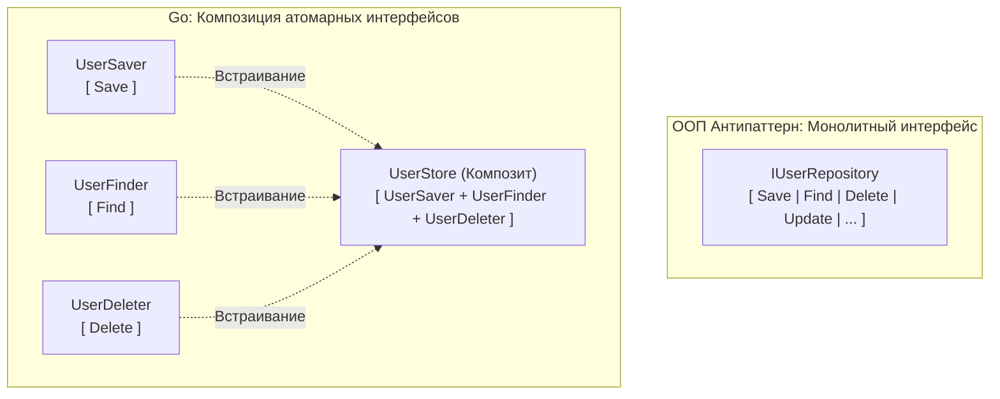

# Почему маленькие интерфейсы лучше больших

Одной из самых закоренелых привычек, которую разработчики переносят из enterprise-экосистем Java или C# в Go, является проектирование «интерфейсов-монолитов».

Каждый из нас встречал на практике абстракции вроде `IUserRepository` или `IOrderService`, декларирующие по 15–20 методов: `Create`, `Update`, `Delete`, `FindByID`, `FindByEmail`, `ListAll`, `SoftDelete` и так далее. Разработчики создают их автоматически, руководствуясь книжными постулатами многослойной архитектуры.

В Go подобные интерфейсы считаются грубейшим антипаттерном. Создатель языка Роб Пайк сформулировал одно из самых фундаментальных правил проектирования в виде афоризма:  
**«Чем больше интерфейс, тем слабее абстракция» (The bigger the interface, the weaker the abstraction).**

Давайте разберем, какой глубокий математический и аппаратный смысл скрывается за этой пословицей, как размер интерфейса влияет на рантайм и почему вся стандартная библиотека Go выстроена вокруг интерфейсов длиной в одну строку.

---

## Парадокс силы абстракции

Что делает абстракцию по-настоящему сильной? Способность объединить под одним элегантным контрактом колоссальное множество совершенно разнородных физических сущностей.

Взгляните на эталонный интерфейс `io.Reader` из стандартной библиотеки Go:

```go
type Reader interface {
    Read(p []byte) (n int, err error)
}
```

Он содержит ровно один метод с минималистичной сигнатурой. Но именно потому, что он требует от окружающего мира столь малого, под эту абстракцию (благодаря статической структурной типизации, см. [[15. Duck Typing и неявная реализация интерфейсов]]) подходит практически **любой источник байтов во Вселенной**:
* Файловый дескриптор на жестком диске (`os.File`).
* Сетевое двунаправленное TCP-соединение (`net.Conn`).
* Тело входящего HTTP-запроса клиента (`http.Request.Body`).
* Кольцевой буфер байт в оперативной памяти (`bytes.Buffer`).
* Потоковый декомпрессор GZIP, симметричный шифратор AES, генератор криптографических случайных чисел.

Если вы пишете функцию, принимающую на вход `io.Reader`, ваш код способен без единой правки работать с десятками системных ресурсов, включая те протоколы и алгоритмы сжатия, которые еще даже не были придуманы на момент компиляции вашего сервиса. Это **абсолютно сильная абстракция**.

А теперь взгляните на корпоративный интерфейс `IUserRepository` с 15 методами. Сколько структур во всей вашей компании способны удовлетворить этому контракту? Ровно одна: конкретный драйвер базы данных PostgreSQL (и, возможно, искусственная структура-мок для юнит-тестов). 

Это **предельно слабая абстракция**. Она ничего не абстрагирует: она лишь механически копирует сигнатуры конкретного слоя данных, добавляя в проект визуальный шум и ложную иллюзию гибкости.

---

## Развязывание архитектурных узлов

Громоздкие интерфейсы создают сильнейшую форму взаимного зацепления модулей (Tight Coupling).

Представьте микросервис авторизации. У вас есть доменный сервис отправки приветственных писем (`SendWelcomeEmail`) и слой хранения данных:

```go
// АНТИПАТТЕРН: Монолитный интерфейс базы данных
type IUserRepository interface {
    Create(user *User) error
    Delete(id int) error
    FindByID(id int) (*User, error)
    // ... и еще 10 специфических методов
}

// Бизнес-слой принимает монстра:
func SendWelcomeEmail(repo IUserRepository, userID int) error {
    user, _ := repo.FindByID(userID)
    // формируем и отправляем email...
    return nil
}
```

Что порочно в этом дизайне:
1. **Нарушение принципа наименьших привилегий (Least Privilege):** Функции `SendWelcomeEmail` требуется исключительно операция чтения пользователя по его идентификатору. Зачем вручать ей интерфейс с правами на физическое удаление (`Delete`) и создание пользователей? Случайная ошибка junior-разработчика или битый вызов могут привести к деструктивным последствиям.
2. **Искусственная связанность пакетов:** Доменный сервис теперь намертво привязан к огромному контракту хранилища.

### Идиоматичный подход Go: Микроинтерфейс на стороне потребителя

В Go интерфейс объявляется вызывающим кодом (Consumer) ровно под ту задачу, которую решает конкретная функция:

```go
// Идиоматично: Доменный слой объявляет локальный контракт
type UserGetter interface {
    FindByID(id int) (*User, error)
}

// Функция принимает ровно то, что ей необходимо:
func SendWelcomeEmail(getter UserGetter, userID int) error {
    user, _ := getter.FindByID(userID)
    // логика отправки...
    return nil
}
```

Функция `SendWelcomeEmail` теперь полностью защищена. Она физически не способна мутировать данные в базе, не привязана к репозиторию и требует для своего тестирования минимальных усилий.

> [!tip] Собеседование
> **Вопрос:** В чем принципиальная разница между философией проектирования интерфейсов в Java и в Go?
>
> **Ответ:** 
> В Java интерфейсы традиционно проектируются «сверху вниз» (Top-Down): разработчик заранее чертит многостраничные интерфейсы абстрактных репозиториев `IRepository`, от которых затем наследуются конкретные классы. 
> 
> В Go проектирование идет «снизу вверх» (Bottom-Up / Emergent Design). Программист сразу пишет простые конкретные структуры (`PostgresDB`). Интерфейсы не создаются заранее. Они появляются органически и локально — на стороне вызывающих функций (например, `UserGetter`), забирая из конкретной структуры только те методы, которые реально требуются вызывающему контексту.

---

## Боль тестирования и Mock-объектов

Большие интерфейсы превращают написание изолированных тестов в мучительную рутину.

Если тестируемая функция принимает `IUserRepository` с 15 методами, вам придется:
1. Создавать структуру тестового дублера и писать заглушки (stubs) для 14 методов, которые вообще не участвуют в данном тестовом сценарии.
2. Прибегать к внешним тяжелым кодогенераторам вроде `gomock` или `mockery`, генерирующим гигабайты автогенерированного кода, который замедляет сборку проекта и засоряет коммиты.

Когда функция принимает узкий `UserGetter` из одного метода, полноценный мок конструируется прямо в теле теста буквально в три строки с помощью адаптера функции:

```go
type mockGetter func(id int) (*User, error)
func (m mockGetter) FindByID(id int) (*User, error) { return m(id) }

func TestSendEmail(t *testing.T) {
    // Весь мок декларируется локально и прозрачно:
    getter := mockGetter(func(id int) (*User, error) { 
        return &User{Name: "Ivan"}, nil 
    })
    
    err := SendWelcomeEmail(getter, 1)
    if err != nil {
        t.Fatalf("unexpected error: %v", err)
    }
}
```

Компактные интерфейсы ликвидируют потребность во внешних фреймворках мокирования в 90% повседневных инженерных задач.

---

## Композиция интерфейсов

Что делать, если системе действительно необходим сложный компонент, способный одновременно и читать, и записывать данные?

Вместо проектирования монолита Go предлагает собирать более крупные контракты из атомарных строительных блоков с помощью **композиции интерфейсов**:

```go
type Reader interface {
    Read(p []byte) (n int, err error)
}

type Writer interface {
    Write(p []byte) (n int, err error)
}

// Новый интерфейс собирается в одну строчку:
type ReadWriter interface {
    Reader // встраивание интерфейса
    Writer // встраивание интерфейса
}
```



Такой модульный подход позволяет клиентскому коду запрашивать ровно ту грань контракта, которая ему необходима: сервису аналитики достаточно `UserFinder`, а сервису синхронизации — полного `UserStore`.

---

## Mechanical Sympathy: Размер интерфейса и itab

Преимущество маленьких интерфейсов проявляется не только в эстетике исходного кода, но и на уровне работы компилятора и оперативной памяти:

> [!info] Под капотом: Генерация itab
> Как мы выяснили при анализе рантайма, компилятор и рантайм связывают интерфейс со структурой через генерацию служебной таблицы `itab`.
> 
> Алгоритм валидации соответствия методов работает за время $O(N + M)$, где $N$ — количество методов в интерфейсе, а $M$ — количество методов структуры.
> * Если интерфейс содержит 1–2 метода (малое $N$), генерация и кэширование `itab` происходят практически мгновенно, экономя такты CPU при динамических проверках типов (Type Assertions) в рантайме.
> * Компактные интерфейсы минимизируют размер служебной таблицы метаданных типов (Type Information) в секции данных бинарника, сохраняя бинарный файл легковесным и дружелюбным к кэшу инструкций CPU.

---

## Итог

1. **Поведение против сущностей:** Интерфейсы в Go описывают глаголы (поведение), а не существительные (сущности). Структура `os.File` — это сущность с десятками методов. А `io.Reader` — это атомарное поведение.
2. **Золотой стандарт:** Интерфейсы из 1–2 методов (`io.Reader`, `io.Writer`, `io.Closer`, `fmt.Stringer`) обеспечивают максимальную силу абстракции и предельную переиспользуемость.
3. **Локальность:** Определяйте интерфейсы на стороне потребителя, избавляя проект от жесткой связности и тяжелых фреймворков мокирования.

Принцип маленьких интерфейсов подозрительно напоминает **Interface Segregation Principle (Принцип разделения интерфейса)** из знаменитой методологии SOLID. Это далеко не случайно. 

В следующей статье мы подробно исследуем, как классические принципы дядюшки Боба (Роберта Мартина) преломились сквозь призму философии Go и почему некоторые из них в современном бэкенде изменились до неузнаваемости: [[17. SOLID в мире Go. Что осталось, а что изменилось]].
